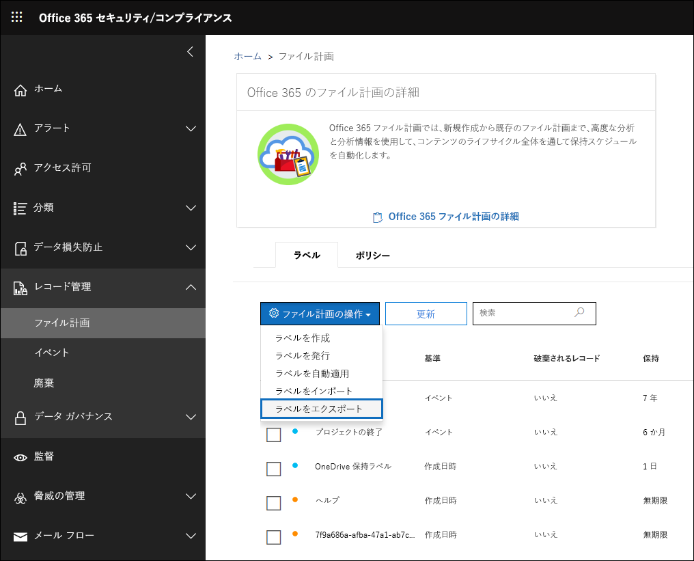
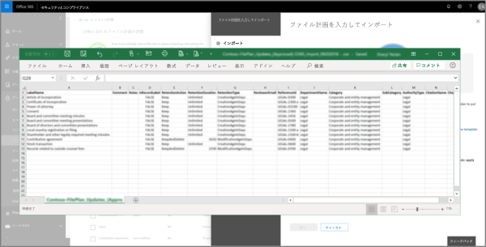
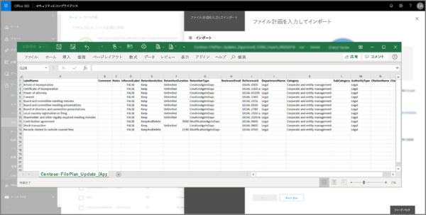
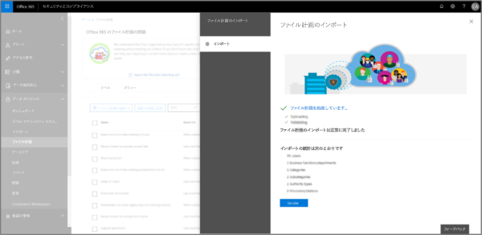
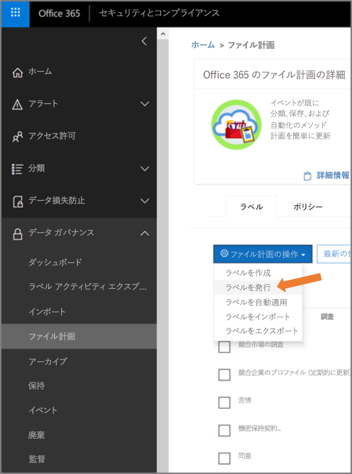

# ファイル計画マネージャーの概要

>*[セキュリティとコンプライアンスのための Microsoft 365 ライセンス ガイダンス](https://aka.ms/ComplianceSD)。*

ファイル計画マネージャーは、保持ラベルおよび保持ラベル ポリシーのための高度な管理機能を提供します。作成に始まり、コラボレーション、レコード宣言、保持、そして廃棄に至るまでのコンテンツのライフ サイクル全体におけるラベルとコンテンツのラベリングを網羅する統合的な機能を提供します。 

セキュリティおよびコンプライアンス センターのファイル計画マネージャーにアクセスするには、**[レコードの管理]** > **[ファイル計画]** に移動します。

![[ファイル計画] ページ](../media/file-plan-page.png)

## ファイル計画マネージャーへのアクセス

ファイル計画マネージャーにアクセスするには、次のいずれかの管理者役割が必要です。
    
- 保持マネージャー

- 閲覧限定保持マネージャー

## デフォルトの保持ラベルとラベルポリシー

セキュリティ＆コンプライアンスセンターに保持ラベルがない場合、左ナビゲーションで**ファイルプラン**を最初に選択すると、**デフォルトデータガバナンス公開ポリシー**というラベルポリシーが作成されます。 

このラベルポリシーには、3つの保持ラベルが含まれています。

- **運用手順**
- **企業一般**
- **契約規定**

これらの保持ラベルは、コンテンツを保持するためだけに構成され、コンテンツを削除するためには構成されていません。 このラベルポリシーは組織全体に公開され、無効にすることも削除することもできます。 

アクティビティ**作成済み保持ポリシー**および**作成済み保持ポリシーの保持設定**の監査ログを確認することで、ファイルプランマネージャを開いて初めて実行環境を構築したユーザを特定できます。

> [!NOTE]
> お客様からのフィードバックにより、デフォルトの保持ラベルと保持ラベル ラベルポリシーを作成する上記のこの機能は削除されました。 これらの保持ラベルと保持ラベル ラベルポリシーは、ファイル計画マネージャーを 2019 年 4 月 11 日より前に開いたことがある場合にのみ表示されます。

## ファイル計画の中の移動

ファイル計画マネージャーでは、すべての保持ラベルとポリシーの設定を 1 つのビューから簡単に参照できます。

ファイル計画の外で作成された保持ラベルはファイル計画上で利用可能で、また、その逆も同様であることに注意します。

ファイル計画 [**ラベル**] タブで、次の追加の情報と機能が提供されます。

### ラベル設定列

- [**分類方法**] は保持期間を起動するトリガーの種類を識別します。有効な値は次のとおりです。
    - イベント
    - 作成日時
    - 最終更新日時
    - ラベルが付けられた日時
- [**レコード**] は、ラベルが適用されときにアイテムが宣言されたレコードが宣言されたレコードになるかどうかを識別します。有効な値は次のとおりです。
    - いいえ
    - はい
    - はい (法的)
- [**保持**] は保持の種類を識別します。有効な値は次のとおりです。
    - 保持
    - 保持および削除
    - 削除
- [**廃棄**] は保持期間終了時のコンテンツの取り扱い方法を識別します。有効な値は次のとおりです。
    - null
    - アクションなし
    - 自動削除
    - 要確認 (廃棄レビューとも呼ばれる)

### 保持ラベル ファイル計画記述子列

保持ラベルの構成により多くの情報を含めることができるようになりました。 ファイル計画記述子を保持ラベルに挿入すると、ファイル計画の管理性と編成が向上します。

すぐに利用開始できるように、ファイル計画マネージャーでは次の既定値が提供されています: 役割/部門、カテゴリ、権限の種類、規定/引用。 保持ラベルを作成または編集するときに、ファイル計画記述子の値を新たに追加することができます。 保持ラベルをファイル計画にインポートするときに、ファイル計画記述子を指定することもできます。 

保持ラベルを作成または編集時のファイル計画記述子に関する手順の画面です。

ファイル計画マネージャーの [**ラベル**] タブのファイル計画記述子列の画面です。

## 分析したりオフライン レビューを実行したりするために、すべての既存の保持ラベルをエクスポートする

組織内のデータ ガバナンス関係者との定期的なコンプライアンス レビューが円滑に行えるように、ファイル計画マネージャーではすべての保持ラベルの詳細を .csv ファイルにエクスポートできます。

すべての保持ラベルをエクスポートするには: [**ファイル計画**] ページで [**ファイル計画の操作**] \> [**ラベルをエクスポート**] の順に移動します。

既存のすべての保持ラベルを含む *.csv ファイルが開きます。

## ファイル計画に保持ラベルをインポートする

ファイル計画マネージャーでは新しい保持ラベルの一括インポートおよび既存の保持ラベルの変更を行うことができます。

新しい保持ラベルのインポートおよび既存の保持ラベルの変更を行うには: 

1. [**ファイル計画**] ページで [**ファイル計画の操作**]  >  [**ラベルをインポート**] の順に移動します。

   

   

2. 空白のテンプレートをダウンロードして、新しい保持ラベルをインポートします。 または、組織の既存の保持ラベルをエクスポートするときにエクスポートされる .csv ファイルから開始することもできます。

   

3. テンプレートに入力します。 次に、ファイル計画テンプレートのプロパティと各プロパティの有効な値について説明します。 インポートの場合、各値の最大長は 64 文字です。  

   |**Property**|**種類**|**有効な値**|
   |:-----|:-----|:-----|
   |LabelName|文字列|このプロパティは、保持ラベルの名前を指定します。|
   |コメント|文字列|このプロパティを使用して、管理者の保持ラベルに関する説明を追加します。 この説明は、セキュリティおよびコンプライアンス センターでラベルを管理する管理者にのみ表示されます。|
   |メモ|文字列|このプロパティを使用して、ユーザーの保持ラベルに関する説明を追加します。 この説明は、ユーザーが Outlook、SharePoint、OneDrive などのアプリでラベルにカーソルを置いたときに表示されます。 このプロパティを空白のままにすると、ラベルの保持設定を説明する既定の説明が表示されます。 |
   |IsRecordLabel|文字列|このプロパティは、ラベルがレコード ラベルであるかどうかを指定します。 レコード ラベルでタグ付けされたアイテムは、レコードとして宣言されます。 有効な値は次のとおりです。 **TRUE**: ラベルはレコード ラベルです。 レコードとして宣言されているアイテムは削除できないことに注意してください。  **FALSE**: ラベルはレコード ラベルではありません。 これは既定の値です。|
   |RetentionAction|文字列|このプロパティは、RetentionDuration プロパティで指定された値の有効期限が切れた後に実行するアクションを指定します。 有効な値は次のとおりです。 **Delete**: RetentionDuration プロパティで指定された値よりも古いアイテムが削除されます。 **Keep**: RetentionDuration プロパティで指定された期間のアイテムを保持し、期間が終了しても何もしません。  **KeepAndDelete**: RetentionDuration プロパティで指定された期間のアイテムを保持し、期間が終了したらそれらを削除します。   |
   |RetentionDuration|文字列|プロパティは、コンテンツを保持する日数を指定します。 有効な値は次のとおりです。 **Unlimited**: アイテムは無期限に保持されます。  ***n***: 正の整数です。(例: **365**) 
   |RetentionType|文字列|プロパティは、コンテンツ作成日、イベント日、ラベルが付けられた (タグが付けされた) 日、または最終変更日のいずれから保持期間を計算するかを指定します。 有効な値は次のとおりです。 **CreationAgeInDays** **EventAgeInDays** **TaggedAgeInDays** **ModificationAgeInDays** |
   |ReviewerEmail|SmtpAddress|このプロパティが入力されている場合、保持期間が終了すると、廃棄のレビューがトリガーされます。 プロパティは、**Delete** および **KeepAndDelete** の保持期間用アクションのレビュー担当者の電子メール アドレスを指定します。 個々のユーザー、配布グループまたはセキュリティ グループのメール アドレスを含めることができます。 複数のメール アドレスをセミコロンで区切って指定できます。|
   |ReferenceId|文字列|このプロパティは、**参照 ID** ファイル計画記述子に表示される値を指定します。| 
   |DepartmentName|文字列|このプロパティは、**業務/部署**ファイル計画記述子に表示される値を指定します。|
   |カテゴリ|文字列|このプロパティは、**カテゴリ** ファイル計画記述子に表示される値を指定します。|
   |下位カテゴリ|文字列|このプロパティは、**サブカテゴリ** ファイル計画記述子に表示される値を指定します。|
   |AuthorityType|文字列|このプロパティは、**管理組織の種類** ファイル計画記述子に表示される値を指定します。|
   |CitationName|文字列|このプロパティは、**規定/引用**ファイル計画記述子に表示される引用の名前を指定します。(例: 「Sarbanes-Oxley Act or 2002」) |
   |CitationUrl|文字列|このプロパティは、**規定/引用** ファイル計画記述子に表示される URL を指定します。|
   |CitationJurisdiction|文字列|このプロパティは、**規定/引用**ファイル計画記述子に表示される管理規則または機関を指定します。(例: 「米国証券取引委員会 (SEC)」)|
   |Regulatory|文字列|空白のままにします。 現時点では、このプロパティは使用されていません。|
   |EventType|文字列|このプロパティは、ラベルに関連付けられている保持規則を指定します。 ルールを一意に識別する任意の値を使用できます。 次に例を示します。 **名前** **識別名 (DN)** **GUID**  使用可能な保持規則を確認するには、[Get-RetentionComplianceRule](https://docs.microsoft.com/powershell/module/exchange/policy-and-compliance-retention/get-retentioncompliancerule?view=exchange-ps) コマンドレットを使用します。 1 つの組織からラベルをエクスポートする場合、別の組織にラベルをインポートするときに、その組織の EventType プロパティの値を使用できないことに注意してください。 これは、EventType 値が組織に固有であるためです。 |
   |||

   保持ラベルに関する情報を含むテンプレートの例を次に示します。

   

4. ファイル計画のインポート ウィザード ページの手順 3 で、[**ファイルの参照**] をクリックして、入力済みのテンプレートをアップロードします。 

   ファイル計画マネージャーでエントリが検証され、インポートの統計情報が表示されます。

   

   検証エラーが発生した場合、ファイル計画のインポートはインポート ファイル内のすべてのエントリを引き続き検証し、インポート ファイル内でエラーを参照するラインまたは行の番号を表示し、表示されたエラー結果をコピーます。これにより、簡単にインポート ファイルに戻り、エラーを修正することができます。

5. インポートが完了したらファイル計画マネージャーに戻り、新しい保持ラベルを新規または既存の保持ポリシーと関連付けます。

   
