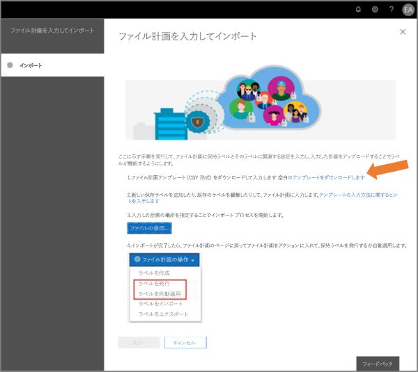

# ファイルプランを使用して保持ラベルを管理する

>*[セキュリティとコンプライアンスのための Microsoft 365 ライセンス ガイダンス](https://aka.ms/ComplianceSD)。*

Microsoft 365 コンプライアンスセンターで、保持ラベルの作成と管理は**情報ガバナンス** から出来ますが、**レコード管理** からのファイルプランには追加の管理機能があります。

- スプレッドシートから関連情報をインポートして、保持ラベルを一括作成できます。

- 分析およびオフラインでの共同作業、あるいは一括編集には、既存の保持ラベルから情報をエクスポートできます。

- 保持ラベルの詳細については、情報を見やすいように１つのビューから全ての保持ラベルの設定全体を表示しています。

- ファイルプラン記述子は、各ラベルの追加およびオプションの情報をサポートします。

ファイルプランは、コンテンツをレコードとしてマークしない場合でも、すべての保持ラベルに使用できます。

![[ファイル計画] ページ](../media/compliance-file-plan.png)

保持ラベルについて、そして使用方法の情報については、[保持ポリシーおよび保持ラベルについて詳しく見る](retention.md) をご覧ください。

## ファイル計画にアクセスしています

ファイル計画にアクセスするには、次のいずれかの管理者役割が必要です。
    
- 保持マネージャー

- 閲覧限定保持マネージャー

Microsoft 365 コンプライアンスセンターで、**ソリューション** > **レコード管理** > **ファイル計画**の順で移動します。 

**[レコード管理]** がナビゲーション ウィンドウに表示されない場合は、下にスクロールして **[すべて表示]** を選択します。

![[ファイル計画] ページ](../media/compliance-file-plan.png)

## ファイル計画を移動中

Microsoft 365 コンプライアンスセンターで、もしも既に**情報ガバナンス**から保持ラベルを作成済みの場合は、これらのラベルは自動的にファイル計画に表示されます。  

同様に、ファイル計画に保持ラベルを作成した場合、コンテンツをレコードとしてマークするようにラベルが構成されていない場合は、**情報ガバナンス**からも使用できます。

**ファイル計画** ページには、すべてのラベルの中に、状態や設定、オプションのファイル計画記述子、およびラベルのオフラインレビューを分析または有効にするエクスポートオプション、および保持ラベルを作成するインポートオプションが表示されます。 

### ラベル設定列

**名前**ラベルを除くすべての列を表示、または非表示にするには、 **列のカスタマイズ** オプションを選択します。 既定では、最初の幾つかの列にはラベルの状態とその設定に関する情報が表示されます。 

- **状態** は、ラベルポリシーにラベルが含まれているかどうか、或いは自動適用ポリシー (**アクティブ**) もしくはそうではない(**非アクティブ**).かを識別します。

- **基づき**どのように、もしくはいつ保持期間が開始するのかを識別します。 有効な値:
    - イベント
    - 作成日時
    - 最終更新日時
    - ラベルが付けられた日時

- **レコード**は、ラベルが適用されたときに、アイテムがレコードとしてマークされているかどうかを識別します。 有効な値:
    - 不要
    - はい
    - はい (法的)

- **保持期間** は、保持期間を識別します。 有効な値:
    - 日数
    - 月
    - 年数
    - 無期限
    - なし

- [**廃棄の種類**] は、保持期間終了時に何が起こるのかを識別します。 有効な値:
    - アクションなし
    - 自動削除
    - 確認が必要

### ファイル計画記述子列

ファイルプランでは、保持ラベルの一部として、より多くの情報を含めることができます。 これらのファイルプラン記述子には、ラベルを作成するのに必要なコンテンツの管理性と構成を改善するためのより多くのオプションが提供されています。

既定では、 **参照 ID**から始めると、次のいくつかの列には、保持ラベルを作成するとき、または既存のラベルを編集するときに指定できるファイルプラン記述子が表示されます。 

この作業を開始するには、幾つかの既定値が次のファイルプラン記述子にあります。 
- ビジネス機能/部署
- カテゴリ
- 権限の種類
- プロビジョニング/引用 

保持ラベルを作成または編集する場合のファイルプラン記述子の例:

ファイル計画記述子列の例の表示

## すべての保持ラベルをエクスポートして、オフラインレビューを分析または有効にする

組織内のデータ ガバナンス関係者との定期的なコンプライアンス レビューを促進するように、ファイル計画マネージャーではすべての保持ラベルの詳細を .csv ファイルにエクスポートできます。

すべての保持ラベルをエクスポートするには: [**ファイル計画**] ページで [**エクスポート**] をクリックします。

A *.csv ファイルは既存の全ての保持ラベルを開く、を含みます。 例:

## ファイル計画に保持ラベルをインポートする

ファイル計画では新しい保持ラベルの一括インポート、そして同じ方法を使い既存の保持ラベルの一括変更を行うことができます。

新しい保持ラベルのインポートおよび既存の保持ラベルの変更を行うには: 

1. **ファイル計画**ページで、[**インポート**をクリックし、**ファイル計画の記入とインポート**ページを使用します。

   

   

2. 空白のテンプレートをダウンロードして、新しい保持ラベルをインポートします。 または、組織の既存の保持ラベルをエクスポートするときにエクスポートされる .csv ファイルから開始することもできます。

   

3. プロパティと各プロパティへの有効な値を説明する次の情報を使用して、テンプレートに入力します。 インポートの場合、各値の長さは最大で 64 文字です。  

   |プロパティ|種類|有効な値|
   |:-----|:-----|:-----|
   |LabelName|文字列|このプロパティは、保持ラベルの名前を指定します。|
   |コメント|文字列|このプロパティを使用して、管理者の保持ラベルに関する説明を追加します。 この説明は、コンプライアンス センターでラベルを管理する管理者にのみ表示されます。|
   |Notes|文字列|このプロパティを使用して、ユーザーの保持ラベルに関する説明を追加します。 この説明は、ユーザーが Outlook、SharePoint、OneDrive などのアプリでラベルにカーソルを置いたときに表示されます。 このプロパティを空白のままにすると、ラベルの保持設定を説明する既定の説明が表示されます。 |
   |IsRecordLabel|文字列|このプロパティでは、ラベルがコンテンツをレコードとしてマークするかどうかを指定します。 有効な値は次のとおりです。  **TRUE**: ラベルはアイテムをレコードとしてマークし、その結果としてアイテムを削除できません。  **FALSE**: ラベルは、コンテンツをレコードとしてマークしません。 これは既定の値です。|
   |RetentionAction|文字列|このプロパティは、RetentionDuration プロパティで指定された値の有効期限が切れた後に実行するアクションを指定します。 有効な値は次のとおりです。  **Delete**: RetentionDuration プロパティで指定された値よりも古いアイテムが削除されます。 **Keep**: RetentionDuration プロパティで指定された期間のアイテムを保持し、期間が終了しても何もしません。  **KeepAndDelete**: RetentionDuration プロパティで指定された期間のアイテムを保持し、期間が終了したらそれらを削除します。   |
   |RetentionDuration|文字列|プロパティは、コンテンツを保持する日数を指定します。 有効な値は次のとおりです。  **Unlimited**: アイテムは無期限に保持されます。  ***n***: 正の整数です。(例: **365**) 
   |RetentionType|String|プロパティは、コンテンツ作成日、イベント日、ラベルが付けられた日、または最終変更日のいずれから保持期間を計算するかを指定します。 有効な値は次のとおりです。  **CreationAgeInDays** **EventAgeInDays** **TaggedAgeInDays** **ModificationAgeInDays** |
   |ReviewerEmail|SmtpAddress|このプロパティが入力されている場合、保持期間が終了すると、廃棄のレビューがトリガーされます。 プロパティは、**KeepAndDelete** の保持期間用アクションのレビュー担当者の電子メール アドレスを指定します。 個々のユーザー、配布グループまたはセキュリティ グループのメール アドレスを含めることが出来ます。 複数のメール アドレスをセミコロンで区切って指定できます。|
   |ReferenceId|String|このプロパティは、**参照 ID** ファイル計画記述子に表示される値を指定します。そしてこれは組織の固有の値として使うことが出来ます。| 
   |DepartmentName|文字列|このプロパティは、**業務/部署**ファイル計画記述子に表示される値を指定します。|
   |カテゴリ|文字列|このプロパティは、**カテゴリ** ファイル計画記述子に表示される値を指定します。|
   |下位カテゴリ|文字列|このプロパティは、**サブカテゴリ** ファイル計画記述子に表示される値を指定します。|
   |AuthorityType|文字列|このプロパティは、**管理組織の種類** ファイル計画記述子に表示される値を指定します。|
   |CitationName|String|このプロパティは、**プロビジョニング/引用** ファイル計画記述子に表示される引用の名前を指定します。 例として、「2002 年米国企業改革法」。 |
   |CitationUrl|文字列|このプロパティは、**規定/引用** ファイル計画記述子に表示される URL を指定します。|
   |CitationJurisdiction|String|このプロパティは、**プロビジョニング/引用** ファイル計画記述子に表示される管轄または機関を指定します。 例として、「米国証券取引委員会 (SEC)」。|
   |規制|文字列|空白のままにします。 現時点では、このプロパティは使用されていません。|
   |EventType|文字列|このプロパティは、ラベルに関連付けられている保持規則を指定します。 ルールを一意に識別する任意の値を使用できます。 次に例を示します。 **名前** **識別名 (DN)** **GUID**  使用可能な保持規則を確認するには、[Get-RetentionComplianceRule](https://docs.microsoft.com/powershell/module/exchange/get-retentioncompliancerule) コマンドレットを使用します。 EventTypeの値は組織に固有であるからということに注意してください。1 つの組織からラベルをエクスポートする場合、別の組織にラベルをインポートするときに、その組織の EventType プロパティの値を使用できません。|
   |||

   保持ラベルに関する情報を含むテンプレートの例を次に示します。

   

4. **ファイル計画を入力しインポートする**ページの手順 3 で、**ファイルの参照** をクリックして、入力済みのテンプレートをアップロードします。 

   ファイル計画はエントリを検証し、インポートの統計情報を表示します。

   

   検証エラーがある場合、ファイル計画のインポートはインポートファイル内のすべてのエントリの検証を続け、インポートファイル内の行と行の番号を参照し全てのエラーを表示します。 インポートファイルに戻るときに修正できるように、表示されたエラー結果をコピーします。

インポートが完了したら、新しい保持ラベルポリシーに保持ラベルを追加したり、もしくは自動適用したりできます。 **File plan**ページのから ドロップダウンで **+ Create a label**を選択、次に **ラベル発行のポリシー**、もしくは**ラベル自動適用のポリシー**の手順でこの権利を行えます。

## 次の手順

保持ラベルの作成と編集、およびそのポリシーの詳細については以下のガイダンスを参照してください。
- [アイテム保持ラベルを作成して、アプリに適用する](create-apply-retention-labels.md)
- [保持ラベルをコンテンツに自動的に適用する](apply-retention-labels-automatically.md)
