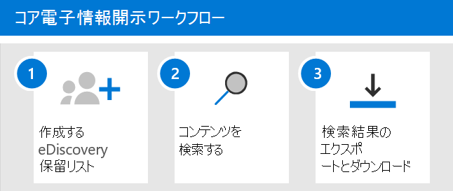

# コア電子情報開示を開始する

Microsoft 365 のコア電子情報開示ツールには、組織が Microsoft 365 および Office 365 でコンテンツを検索およびエクスポートするために使用できる基本的な電子情報開示ツールが用意されています。 また、コア電子情報開示を使用して、Exchange メールボックス、SharePoint サイト、OneDrive アカウント、Microsoft Teams などのコンテンツの場所に電子情報開示の保持を設定することもできます。 コア電子情報開示の展開には何も必要ありませんが、IT 管理者と電子情報開示マネージャーがコンテンツを検索、エクスポート、および保持するためにコア電子情報開示を使用して開始する前に、いくつかの前提条件のタスクを完了させる必要があります。

この記事では、コア電子情報開示を設定するために必要な手順について説明します。 これには、コア電子情報開示にアクセスして、コンテンツの場所に対して電子情報開示を保持するための適切なライセンスが必要になるだけでなく、お客様がサポート案件にアクセスして管理できるように、IT、法務、調査チームにアクセス許可を割り当てることも含まれます。 この記事では、ケースを使用したコンテンツの検索とエクスポートの概要についても説明します。

## 手順 1: 適切なライセンスを確認して割り当てる

コア電子情報開示のライセンスには、適切な組織のサブスクリプションとユーザーごとのライセンスが必要です。

- **組織のサブスクリプション:** Microsoft 365 コンプライアンスセンターまたは Office 365 セキュリティ & コンプライアンスセンターでコア電子情報開示にアクセスして、ホールド機能とエクスポート機能を使用するには、組織に Microsoft 365 E3 または Office 365 E3 サブスクリプションがインストールされている必要があります。

- **ユーザーごとのライセンス:** メールボックスおよびサイトに電子情報開示を保持するには、組織のサブスクリプションに応じて、次のいずれかのライセンスをユーザーに割り当てる必要があります。

  - Microsoft 365 E3 または Office 365 E3 ライセンス以降

   OR

  - Exchange Online プラン2または Exchange Online アーカイブアドオンライセンスを使用した Office 365 E1 ライセンス

  AND

  - SharePoint Online プラン2または OneDrive for Business プラン2アドオンライセンスを使用した Office 365 E1 ライセンス
  
  ライセンスを割り当てる方法については、「 [ユーザーへのライセンスの割り当て](https://docs.microsoft.com/microsoft-365/admin/manage/assign-licenses-to-users)」を参照してください。

ライセンスの詳細については、以下を参照してください。

- 「 [Microsoft 365 コンプライアンスライセンスの比較](https://docs.microsoft.com/office365/servicedescriptions/downloads/microsoft-365-compliance-licensing-comparison.xlsx)」に記載されている「Discover & 応答」ソリューションをダウンロードして参照してください。

- 「 [Security & コンプライアンスセンターサービスの説明](https://docs.microsoft.com/office365/servicedescriptions/office-365-platform-service-description/office-365-securitycompliance-center)」を参照してください。

## 手順 2: 電子情報開示のアクセス許可を割り当てる

コア電子情報開示ケースのメンバとして、コア電子情報開示ケースのメンバーとして追加するには、ユーザーに適切なアクセス許可が割り当てられている必要があります。 具体的には、Office 365 セキュリティ & コンプライアンスセンターで、電子情報開示マネージャーの役割グループのメンバーとしてユーザーを追加する必要があります。 この役割グループのメンバーは、コア電子情報開示ケースを作成および管理できます。 ユーザーは、メンバーを追加および削除したり、ユーザーに電子情報開示を保持したり、検索を作成および編集したり、コア電子情報開示ケースからコンテンツをエクスポートしたりすることができます。

電子情報開示マネージャーの役割グループにユーザーを追加するには、次の手順を実行します。

1. に移動 [https://protection.office.com/permissions](https://protection.office.com/permissions) し、Microsoft 365 または Office 365 組織の管理者アカウントの資格情報を使用してサインインします。

2. [ **権限** ] ページで、 **電子情報開示マネージャー** の役割グループを選択します。

3. [電子情報開示マネージャーのポップアップ] ページで、[**電子情報開示マネージャー** ] セクションの横にある [**編集**] をクリックします。

4. 役割グループの編集ウィザードの [ **電子情報開示マネージャーの選択** ] ページで、[ **探索マネージャーの選択**] をクリックします。

5. [ **追加** ] をクリックして、役割グループに追加するすべてのユーザーのチェックボックスをオンにします。

6. [ **追加** ] をクリックして選択したユーザーを追加し、[ **完了**] をクリックします。

7. [ **保存** ] をクリックしてユーザーを役割グループに追加し、[ **閉じる** ] をクリックして手順を完了します。

### 電子情報開示マネージャーの役割グループの詳細情報

電子情報開示マネージャーの役割グループには、2つのサブグループがあります。 これらのサブグループの違いは、スコープに基づきます。

- **電子情報開示マネージャー:** が作成またはメンバーとなっているコア電子情報開示ケースを表示および管理できます。 別の電子情報開示マネージャーが作成したケースのメンバーとして2番目の電子情報開示マネージャーを追加しなかった場合、2番目の電子情報開示マネージャーは、コンプライアンスセンターのコア電子情報開示ページでケースを表示または開くことができません。 一般に、組織内のほとんどのユーザーは電子情報開示マネージャーサブグループに追加できます。

- **電子情報開示管理者:** 電子情報開示マネージャーが実行できるすべてのケース管理タスクを実行できます。 さらに、電子情報開示管理者は、次のことができます。

  - コア電子情報開示ページに記載されているすべてのケースを表示します。
  
  - 自分自身をケースのメンバーとして追加した後、組織のすべてのケースを管理します。

  - 組織内のすべてのケースのケース データにアクセスしてエクスポートします。

  アクセス範囲が広いため、電子情報開示管理者のサブグループのメンバーになっている管理者は少数です。

電子情報開示のアクセス許可と、電子情報開示マネージャーの役割グループに割り当てられている各役割の説明については、「 [電子情報開示のアクセス許可を割り当てる](assign-ediscovery-permissions.md)」を参照してください。

## 手順 3: コア電子情報開示ケースを作成する

次の手順では、ケースを作成し、コア電子情報開示を使用して作業を開始します。 ケースを作成してメンバーを追加するには、次の手順を実行します。 ケースを作成したユーザーは、自動的にメンバーとして追加されます。

1. に移動 [https://compliance.microsoft.com](https://compliance.microsoft.com) し、適切な電子情報開示のアクセス許可が割り当てられているユーザーアカウントの資格情報を使用してサインインします。 組織の管理役割グループのメンバーは、コア電子情報開示ケースを作成することもできます。

2. Microsoft 365 コンプライアンスセンターの左側のナビゲーションウィンドウで、[ **すべて表示**] をクリックし、[ **電子情報開示 > Core**] をクリックします。

3. [ **コア電子情報開示** ] ページで、[ **ケースの作成**] をクリックします。

4. [ **新しいケース** のポップアップ] ページで、ケース名 (必須) を指定し、オプションのケース番号と説明を入力します。 ケース名は、組織内で一意である必要があります。

5. [ **保存** ] をクリックしてケースを作成します。

   新しいケースが作成され、[コア電子情報開示] ページに表示されます。 新しいケースを表示するには、[ **更新** ] をクリックする必要があります。 

## 手順 4 (省略可能): コア電子情報開示ケースにメンバーを追加する

手順3でケースを作成し、そのケースを使用するユーザーが初めての場合は、この手順を実行する必要はありません。 ケースの使用を開始して、電子情報開示の保持を作成したり、コンテンツを検索したり、検索結果をエクスポートしたりすることができます。 他のユーザー (またはロールグループ) にケースへのアクセス権を付与する場合は、この手順を実行します。

1. Microsoft 365 コンプライアンスセンターの [ **コア電子情報開示** ] ページで、メンバーを追加するケースの名前をクリックします。

2. [ **このケースの管理** ] ページの [ **メンバーの管理**] で、[ **追加** ] をクリックしてケースにメンバーを追加します。 

    また、役割グループをケースのメンバーとして追加することもできます。 [ **役割グループの管理**] で、[ **追加**] をクリックします。 メンバーになっている役割グループのみをケースに割り当てることができます。 これは、役割グループが電子情報開示ケースにメンバーを割り当てることができることを制御するためです。

3. ケースのメンバーとして追加できるユーザーまたは役割グループの一覧で、追加するユーザー (または役割グループ) の名前の横にあるチェックボックスをオンにします。 メンバーとして追加できるユーザーが多数いる場合は、[**検索**] ボックスを使用してリストで特定のユーザーを検索します。
  
4. ケースのメンバーとして追加する人物または役割グループを選択したら、[ **追加**] をクリックします。

5. [**保存**] をクリックして、ケース メンバーの新しいリストを保存します。

## コア電子情報開示ワークフローを参照する

コア電子情報開示の使用を開始するには、興味のあるユーザーに対して電子情報開示の保留リストを作成し、調査に関連するコンテンツを検索し、そのデータをエクスポートしてさらにレビューを行う簡単なワークフローを次に示します。 これらの各ステップでは、調査できる拡張コア電子情報開示機能についても取り上げます。

1. **[電子情報開示ホールドを作成](create-ediscovery-holds.md)** します。 ケースを作成した後の最初の手順は、調査対象のユーザーのコンテンツの場所に保留 ( *電子情報開示ホールド*とも呼ばれます) を置くことです。 コンテンツの場所には、Exchange メールボックス、SharePoint サイト、OneDrive アカウントに加えて、Microsoft Teams および Office 365 グループに関連付けられているメールボックスやサイトが含まれます。 この手順はオプションですが、電子情報開示保持を作成すると、調査中にそのケースに関連する可能性があるコンテンツが保持されます。 電子情報開示の保持を作成すると、特定のコンテンツの場所にあるすべてのコンテンツを保持できます。または、クエリベースの保持を作成して保留クエリに一致するコンテンツのみを保持することができます。 コンテンツの保持に加えて、電子情報開示の保持を作成するもう1つの理由として、次の手順で検索を作成して実行するときに、コンテンツの場所をすばやく検索することができます (検索する場所を選択するのではなく)。 調査を完了したら、作成した保留を解除できます。

2. **[コンテンツを検索](search-for-content-in-core-ediscovery.md)** します。 電子情報開示の保留リストを作成したら、組み込みの検索ツールを使用して、保留中のコンテンツの場所を検索します。 ケースに関連する可能性があるデータについて、他のコンテンツの場所を検索することもできます。 ケースに関連付けられている異なる検索を作成して実行できます。 キーワード、プロパティ、および条件を使用して、検索結果を返す [検索クエリを作成](keyword-queries-and-search-conditions.md) し、ケースに最も関連があると考えられるデータを検索します。 以下のことも実行できます。

   - 検索クエリを絞り込んで結果を絞り込むために役立つ検索統計を表示します。

   - 検索結果をプレビューして、関連するデータが検出されたかどうかをすばやく確認します。

   - クエリを変更して、検索を再実行します。

3. **[検索結果をエクスポートしてダウンロード](export-content-in-core-ediscovery.md)** します。 調査に関連するデータを検索して検索した後、調査チーム外のユーザーによってレビューを受けるために、Office 365 の外部でエクスポートすることができます。 データのエクスポートは、2つの手順で行います。 最初の手順として、Office 365 で検索結果をエクスポートします。 これは、Microsoft が提供する Azure ストレージの場所に検索結果をコピーすることによって実現されます。 次の手順では、電子情報開示エクスポートツールを使用して、コンテンツをローカルコンピューターにダウンロードします。 エクスポートされたデータファイルに加えて、エクスポートパッケージの格納にはエクスポートレポート、概要レポート、およびエラーレポートも含まれます。
