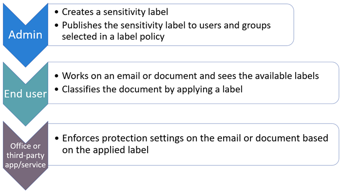

# 秘密度ラベルの使用を開始する

秘密度ラベルの概要とそれらが組織のデータを保護する方法の詳細については、「[秘密度ラベルの詳細](sensitivity-labels.md)」を参照してください。

[Azure Information Protection](https://docs.microsoft.com/azure/information-protection/what-is-information-protection) がある場合、ラベルを統合ラベル付けプラットフォームに移行する必要があるかどうか、および使用するラベル付けクライアントを決定します。
- [自分のテナントが統合されたラベル付けプラットフォームにあるかどうかを判断するにはどうすればよいですか?](https://docs.microsoft.com/azure/information-protection/faqs#how-can-i-determine-if-my-tenant-is-on-the-unified-labeling-platform)
- [Windows コンピューターに使用するラベル付けクライアントを選択する](https://docs.microsoft.com/azure/information-protection/rms-client/use-client#choose-which-labeling-client-to-use-for-windows-computers)

秘密度ラベルを使用して組織のデータを保護する準備ができたら、次の手順に従います。

1. **ラベルを作成する。** コンテンツのさまざまなレベルに対する組織の分類方法に従って、秘密度ラベルを作成して名前を付けます。 ユーザーにとって意味のある、一般的な名前または用語を使用します。 分類方法がまだ確率していない場合は、「個人用」、「パブリック」、「一般」、「社外秘」、および「極秘」などのラベル名を使って使用開始することを検討してください。 サブラベルを使用すると、類似したラベルをカテゴリ別にグループ化できます。 ラベルを作成するときは、ユーザーが適切なラベルを選択できるよう、ツールヒントのテキストを使用します。
    
    分類法を定義するためのより広範なガイダンスについては、[Service Trust Portal](https://aka.ms/DataClassificationWhitepaper) のホワイト ペーパー「データ分類と秘密度ラベルの分類」をダウンロードしてください。

2. **各ラベルの機能を定義する。** 各ラベルに関連付ける必要がある保護設定を構成します。 たとえば、秘密度の低いコンテンツ (「一般」ラベルなど) には単にヘッダーやフッターを適用し、秘密度のより高いコンテンツ (「社外秘」ラベルなど) には透かし、暗号化、および WIP を適用することができます。

3. **ラベルを発行する。** 秘密度ラベルの構成が完了したら、ラベル ポリシーを使用してラベルを公開します。 ラベルを使用する必要があるユーザーとグループおよび使用するポリシー設定を決定します。 1 つのラベルは再利用できます。一度定義したラベルは、異なるユーザーに割り当てる複数のラベル ポリシーに含めることができます。 たとえば、ラベル ポリシーをごく少数のユーザーに対して適用して、秘密度ラベルを試験運用することができます。 組織全体に対してラベルを展開する準備ができたら、ラベルの新しいラベル ポリシーを作成し、今回はすべてのユーザーを指定することができます。

秘密度ラベルを展開して適用するための基本的な流れ:

## 機密ラベルの作成と管理に必要なアクセス許可

機密ラベルを作成するコンプライアンス チームのメンバーは、Microsoft 365 コンプライアンス センター、Microsoft 365 セキュリティ センター、または Office 365 セキュリティ/コンプライアンス センターへのアクセス許可を持っている必要があります。 

既定では、テナントのグローバル管理者はこれらの管理センターへのアクセス権を所有し、コンプライアンス責任者や他のユーザーにアクセス権を付与できます (テナント管理者が持つすべての権限を付与する必要はありません)。この委任された制限付き管理者アクセス許可については、これらのいずれかの管理センターの [**アクセス許可**] ページに移動して、[**コンプライアンス データ管理者**] 役割グループ、[**コンプライアンス管理者**] 役割グループ、または [**セキュリティ管理者**] 役割グループにユーザーを追加します。

役割を使用する代わりに、新しい役割グループを作成し、**秘密度ラベル管理者**の役割または**組織の構成**の役割をこのグループに追加できます。 手順については、「[ユーザーに Office 365 セキュリティ/センター コンプライアンス センターへのアクセスを許可する](https://docs.microsoft.com/microsoft-365/security/office-365-security/grant-access-to-the-security-and-compliance-center)」を参照してください。

これらのアクセス許可は、機密ラベルとそのラベル ポリシーの作成と構成を行う場合にのみ必要です。 アプリまたはサービスでラベルを適用するためには必要はありません。

> [!NOTE]
> [**秘密度ラベル リーダー**] は、現在テナントに展開されている新しい役割で、PowerShell のラベル付けコマンドレットで最初にサポートされ、後に管理者のラベル付けセンターでサポートされます。

## 秘密度ラベルの一般的なシナリオ

秘密度ラベル付けの展開をサポートするには、次のドキュメントを使用してください。

|必要な作業...|ドキュメント|
|----------------|---------------|
|組織のデータを保護できるように、秘密度ラベルを作成して公開する|[秘密度ラベルとそのポリシーを作成して構成する](create-sensitivity-labels.md)|
|秘密度ラベルを使用してドキュメントやメールを暗号化し、そのコンテンツにアクセスできるユーザーとその使用方法を制限する |[秘密度ラベルを使用して暗号化を適用してコンテンツへのアクセスを制限する](encryption-sensitivity-labels.md)|
|SharePoint (および OneDrive) で、暗号化のラベルが付いたドキュメントのコラボレーション機能を有効にする | [SharePoint および OneDrive で Office ファイルの機密度ラベルを有効にする (パブリック プレビュー)](sensitivity-labels-sharepoint-onedrive-files.md)
|Office アプリの秘密度ラベルを管理して、コンテンツの作成時にラベルを付ける |[Office アプリで秘密度ラベルを使用する](sensitivity-labels-office-apps.md)|
|コンテンツ作成時に秘密度ラベルまたは推奨ラベルを自動的にユーザーに適用する | [機密ラベルをコンテンツに自動的に適用する](apply-sensitivity-label-automatically.md)|
|秘密度ラベルを使用して、Teams や SharePoint のコンテンツを保護する |[Microsoft Teams、Office 365 グループ、SharePoint サイトで機密ラベルを使用する (パブリック プレビュー)](sensitivity-labels-teams-groups-sites.md)|
|オンプレミスのデータ ストアに保存されているファイルを検出、ラベル付け、保護する |[ファイルを自動的に分類および保護するための Azure Information Protection スキャナーを展開する](https://docs.microsoft.com/azure/information-protection/deploy-aip-scanner)|
|クラウドのデータ ストアに保存されているファイルを検出、ラベル付け、保護する|[クラウドに保存されている規制対象および機密データを検出、分類、ラベル付け、保護する](https://docs.microsoft.com/cloud-app-security/best-practices#discover-classify-label-and-protect-regulated-and-sensitive-data-stored-in-the-cloud)|
|秘密度ラベルを使用して展開ステータスをレポートし、ラベル構成を微調整する方法を可視化する|[ラベル分析によるラベル使用状況を表示する](label-analytics.md)|

## 機密度ラベルのエンド ユーザー向けのドキュメント

最も効果的なエンド ユーザー向けのドキュメントは、選択したラベル名と構成に関するカスタマイズされたガイダンスと手順です。 ただし、基本的な手順については次のリソースを使用できます。   

- [Office 内のファイルやメールに機密ラベルを適用する](https://support.office.com/article/apply-sensitivity-labels-to-your-files-and-email-in-office-2f96e7cd-d5a4-403b-8bd7-4cc636bae0f9)
    - [Office の秘密度ラベルに関する既知の問題](https://support.office.com/en-us/article/known-issues-with-sensitivity-labels-in-office-b169d687-2bbd-4e21-a440-7da1b2743edc)

- [Office のファイルとメールに秘密度ラベルを自動的に適用、または推奨する](https://support.office.com/article/automatically-apply-or-recommend-sensitivity-labels-to-your-files-and-emails-in-office-622e0d9c-f38c-470a-bcdb-9e90b24d71a1)
    - [機密度ラベルの自動適用または推奨に関する既知の問題](https://support.office.com/article/known-issues-with-automatically-applying-or-recommending-sensitivity-labels-451698ae-311b-4d28-83aa-a839a66f6efc)

- [Azure Information Protection の統合ラベル ユーザー ガイド](https://docs.microsoft.com/azure/information-protection/rms-client/clientv2-user-guide)

