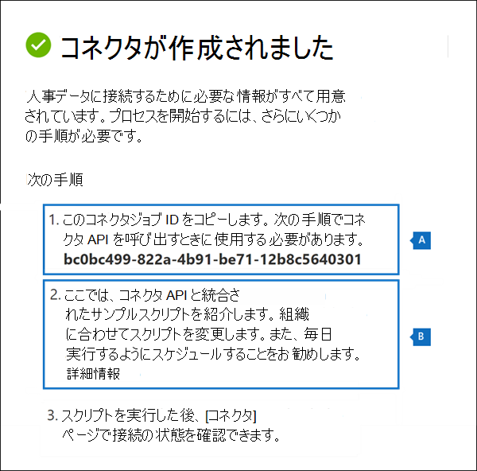

# <a name="set-up-a-connector-to-import-hr-data-in-us-government"></a>米国政府機関の人事データをインポートするためのコネクタの設定

Microsoft 365 コンプライアンスセンターでデータコネクタをセットアップし、人事 (人事) データを米国政府機関の組織にインポートすることができます。 人事関連のデータには、従業員が resignation を提出した日付と従業員の最終日の日付が含まれます。 この人事データは、Microsoft 情報保護ソリューション ( [insider リスク管理ソリューション](insider-risk-management.md)など) によって使用され、組織内の悪意のあるアクティビティやデータの盗難から組織を保護するのに役立ちます。 HR コネクタの設定では、コネクタによる認証に使用される Azure Active Directory でアプリを作成し、人事データを含む CSV マッピングファイルを作成し、コンプライアンスセンターでデータコネクタを作成して、CSV ファイル内の人事データを Microsoft クラウドに ingests するためのスクリプトを実行します (スケジュールに従って)。 その後、データコネクタは、Microsoft 365 US Government 組織にインポートされた人事データにアクセスするために、insider リスク管理ツールによって使用されます。

## <a name="before-you-begin"></a>はじめに

- 組織は、Office 365 インポートサービスが組織内のデータにアクセスできるようにするための同意を得る必要があります。 この要求に同意するには、 [このページ](https://login.microsoftonline.com/common/oauth2/authorize?client_id=570d0bec-d001-4c4e-985e-3ab17fdc3073&response_type=code&redirect_uri=https://portal.azure.com/&nonce=1234&prompt=admin_consent)に移動して、Microsoft 365 グローバル管理者の資格情報でサインインし、要求を承諾します。 手順3で HR コネクタを正常に作成するには、この手順を完了する必要があります。

- 手順3で HR コネクタを作成したユーザーに、Exchange Online のメールボックスのインポートのエクスポート役割が割り当てられている必要があります。 既定では、この役割は Exchange Online のどの役割グループにも割り当てられていません。 Exchange Online の組織の管理役割グループに、メールボックスのインポートの役割を追加することができます。 または、新しい役割グループを作成し、メールボックスインポートエクスポートの役割を割り当ててから、適切なユーザーをメンバーとして追加することもできます。 詳細については、記事「Manage role groups in Exchange Online」の「 [役割グループの作成](https://docs.microsoft.com/Exchange/permissions-exo/role-groups#create-role-groups) 」または「 [役割グループの変更](https://docs.microsoft.com/Exchange/permissions-exo/role-groups#modify-role-groups) 」のセクションを参照してください。

- 組織の HR システムから (定期的に) データを取得またはエクスポートする方法を決定し、手順2で説明されている CSV ファイルに追加する必要があります。 手順4で実行したスクリプトは、CSV ファイル内の人事データを Microsoft クラウドにアップロードします。

- 手順4で実行したサンプルスクリプトは、人事データを Microsoft クラウドにアップロードして、insider リスク管理ソリューションなどの他の Microsoft ツールが使用できるようにします。 このサンプルスクリプトは、Microsoft の標準サポートプログラムまたはサービスではサポートされていません。 このサンプルスクリプトは、あらゆる種類の保証なしに提供されています。 さらに、Microsoft は、商品性、特定目的への適合性を含む一切の黙示の保証をいたしかねます。 サンプルスクリプトおよびドキュメントの使用によって発生した、またはパフォーマンスの低下によって生じるリスク全体は、そのままになります。 サンプル スクリプトおよびドキュメントを使用したこと、または使用できなかったことに伴って生じるいかなる損害 (業務利益の損失、業務の中断、業務情報の損失、金銭上の損失、その他一切の損害) についても、Microsoft、Microsoft に帰属する作者、スクリプトの作成、製造、または納入に関与したその他のすべての人員は、いかなる場合も責めを負わないものとします。

## <a name="step-1-create-an-app-in-azure-active-directory"></a>手順 1: Azure Active Directory でアプリを作成する

最初の手順として、Azure Active Directory (Azure AD) で新しいアプリを作成して登録します。 アプリは、手順3で作成した HR コネクタに対応します。 このアプリを作成すると、Azure AD は、組織へのアクセスを試行しているときに、HR コネクタを認証できるようになります。 このアプリは、手順4で実行して人事データを Microsoft クラウドにアップロードするスクリプトを認証するためにも使用されます。 この Azure AD アプリの作成時には、必ず次の情報を保存してください。 これらの値は、後の手順で使用します。

- Azure AD アプリケーション ID ( *アプリ id* または *クライアント id* とも呼ばれる)

- Azure AD アプリケーションシークレット ( *クライアントシークレット* とも呼ばれる)

- テナント Id ( *ディレクトリ id* とも呼ばれる)

Azure AD でアプリを作成するための詳細な手順については、「 [Microsoft identity platform を使用](https://docs.microsoft.com/azure/active-directory/develop/quickstart-register-app)してアプリケーションを登録する」を参照してください。

## <a name="step-2-prepare-a-csv-file-with-your-hr-data"></a>手順 2: 人事データを含む CSV ファイルを準備する

次の手順では、組織を退職した従業員に関する情報を含む CSV ファイルを作成します。 「はじめに」のセクションで説明したように、この CSV ファイルを組織の人事システムから生成する方法を決定する必要があります。 次の例は、3つの必須パラメーター (列) を含む (メモ帳で開かれた) 完成した CSV ファイルを示しています。 Microsoft Excel で CSV ファイルを編集する方がはるかに簡単です。

```text
EmailAddress,TerminationDate,LastWorkingDate
sarad@contoso.com,2019-04-23T15:18:02.4675041+05:30,2019-04-29T15:18:02.4675041+05:30
pilarp@contoso.com,2019-04-24T09:15:49Z,2019-04-29T15:18:02.7117540
```

CSV ファイルの最初の行、つまりヘッダー行には、必要な列名が表示されます。 各列見出しに使用される名前は、ユーザーが作成します (前の例の場合、提案になります)。 ただし、手順3で HR コネクタを作成するときには、CSV ファイルで使用するのと同じ列名を指定する *必要があり* ます。 列名にスペースを含めないでください。

次の表で、CSV ファイルの各列について説明します。

| 列名 | 説明 |
|:-----|:-----|
| **EmailAddress** <br/> |退職した従業員の電子メールアドレスを指定します。|
| **終了した日付** <br/> |組織で個人の雇用が正式に終了した日付を指定します。 たとえば、従業員が組織を離れたことについての通知を受け取った日付になることがあります。 この日付は、ユーザーの最終作業日の日付と異なる場合があります。 `yyyy-mm-ddThh:mm:ss.nnnnnn+|-hh:mm` [ISO 8601 の日付と時刻の形式](https://www.iso.org/iso-8601-date-and-time-format.html)を使用して、次の日付形式を使用します。|
|**LastWorkingDate**|退職した従業員の最終作業日を指定します。 `yyyy-mm-ddThh:mm:ss.nnnnnn+|-hh:mm` [ISO 8601 の日付と時刻の形式](https://www.iso.org/iso-8601-date-and-time-format.html)を使用して、次の日付形式を使用します。|
|||

必要な人事データを使用して CSV ファイルを作成した後、手順4で実行したスクリプトと同じシステムに保存します。 CSV ファイルに常に最新の情報が含まれるように、必ず更新戦略を実装してください。 これにより、スクリプトを実行すると、最新の従業員の終了データが Microsoft クラウドにアップロードされるようになります。

## <a name="step-3-create-the-hr-connector"></a>手順 3: HR コネクタを作成する

次の手順では、Microsoft 365 コンプライアンスセンターで人事コネクタを作成します。 手順4でスクリプトを実行すると、作成した HR コネクタが、CSV ファイルの人事データを Microsoft 365 組織に取り込みます。 この手順では、コネクタの作成時に生成されたジョブ ID を必ずコピーしてください。 スクリプトを実行するときに、ジョブ ID を使用します。

1. に移動し [https://compliance.microsoft.com](https://compliance.microsoft.com) 、左側のナビゲーションで [ **データコネクタ** ] をクリックします。

2. [ **データコネクタ** ] ページの [ **HR** ] で、[ **表示** ] をクリックします。

3. [ **人事** ] ページで、[ **コネクタの追加** ] をクリックします。

4. [ **認証資格情報** ] ページで、次の操作を実行し、[ **次へ** ] をクリックします。

   1. 手順1で作成した Azure アプリケーションの Azure AD アプリケーション ID を入力するか貼り付けます。

   1. HR コネクタの名前を入力します。

5. [ **ファイルマッピング** ] ページで、適切な各ボックスに、手順2で作成した CSV ファイルの3つの列ヘッダー ( *パラメーター* とも呼ばれます) の名前を入力します。 名前の大文字と小文字は区別されません。 前述のように、これらのボックスに入力する名前は、CSV ファイルのパラメーター名と一致している必要があります。 たとえば、次のスクリーンショットは、手順2に示すサンプル CSV ファイルの例のパラメータ名を示しています。

   

6. [ **レビュー** ] ページで、設定を確認し、[ **完了** ] をクリックしてコネクタを作成します。

   コネクタが作成されたことを確認する [状態] ページが表示されます。 このページには、次の手順を完了し、人事データをアップロードするサンプルスクリプトを実行するために必要な2つの重要な事項が含まれています。

   

   1. **ジョブ ID。** このジョブ ID は、次の手順でスクリプトを実行するために必要になります。 このページからコピーするか、コネクタのポップアップページからコピーすることができます。
   
   1. **サンプルスクリプトにリンクします。** サンプルスクリプトにアクセスするには、 **次** のリンクをクリックして、GitHub サイトに移動します (リンクは新しいウィンドウを開きます)。 このウィンドウを開いたままにして、手順4でスクリプトをコピーできるようにします。 または、手順4でアクセスできるように、移動先にブックマークを作成するか、URL をコピーすることができます。 このリンクは、コネクタのフライアウトページでも使用できます。

7. **[完了]** をクリックします。

   新しいコネクタが [ **コネクタ** ] タブの一覧に表示されます。 

8. 作成した HR コネクタをクリックすると、フライアウトページが表示され、コネクタに関するプロパティやその他の情報が表示されます。

   

   まだ実行していない場合は、 **Azure アプリケーション id** と **コネクタジョブ ID** の値をコピーできます。 次の手順でスクリプトを実行するには、これらが必要になります。 また、スクリプトは、フライアウトページからダウンロードすることもできます (または、次の手順のリンクを使用してダウンロードすることもできます)。

   [ **編集** ] をクリックして、[ **ファイルマッピング** ] ページで定義した Azure アプリケーション ID または列ヘッダー名を変更することもできます。

## <a name="step-4-run-the-sample-script-to-upload-your-hr-data"></a>手順 4: サンプルスクリプトを実行して人事データをアップロードする

HR コネクタを設定する最後の手順は、Microsoft クラウドに、CSV ファイル (手順2で作成したもの) の人事データをアップロードするサンプルスクリプトを実行することです。 具体的には、スクリプトは HR コネクタにデータをアップロードします。 スクリプトを実行すると、手順3で作成した HR コネクタが人事データを Microsoft 365 組織にインポートします。これにより、他のコンプライアンスツール (Insider リスク管理ソリューションなど) からアクセスできるようになります。 スクリプトを実行した後、毎日自動的に実行されるようにタスクをスケジュールすることを検討してください。これにより、最新の従業員の終了データが Microsoft クラウドにアップロードされます。 [[スクリプトを自動的に実行するようにスケジュールする」を](#optional-step-6-schedule-the-script-to-run-automatically)参照してください。

1. 前の手順で開いたままにしたウィンドウに移動し、サンプルスクリプトを使用して GitHub サイトにアクセスします。 または、ブックマークを作成したサイトを開くか、コピーした URL を使用します。

2. [ **Raw** ] ボタンをクリックすると、スクリプトがテキストビューに表示されます。

3. サンプルスクリプトのすべての行をコピーして、テキストファイルに保存します。

4. 必要に応じて、組織のサンプルスクリプトを変更します。

5. ファイル名のサフィックスを使用して、テキストファイルを Windows PowerShell スクリプトファイルとして保存し `.ps1` ます (例:) `HRConnector.ps1` 。

6. ローカルコンピューターでコマンドプロンプトを開き、スクリプトを保存したディレクトリに移動します。

7. 次のコマンドを実行して、CSV ファイル内の人事データを Microsoft クラウドにアップロードします。例えば：

    ```powershell
    .\HRConnector.ps1 -tenantId <tenantId> -appId <appId>  -appSecret <appSecret>  -jobId <jobId>  -csvFilePath '<csvFilePath>'
    ```

   次の表では、このスクリプトで使用するパラメーターと、必要な値について説明します。 前の手順で取得した情報は、これらのパラメーターの値で使用されます。

   | パラメーター | 説明 |
   |:-----|:-----|:-----|
   |`tenantId`|手順1で取得した Microsoft 365 組織の Id。 Azure AD 管理センターの **概要** ブレードで、組織のテナント Id を取得することもできます。 これは、組織を識別するために使用されます。|
   |`appId` |手順1で Azure AD で作成したアプリの Azure AD アプリケーション Id。 これは、スクリプトが Microsoft 365 組織にアクセスしようとするときに、Azure AD によって認証に使用されます。 |
   |`appSecret`|手順1で Azure AD で作成したアプリの Azure AD アプリケーションシークレット。 これは認証にも使用されます。|
   |`jobId`|手順3で作成した HR コネクタのジョブ ID。 これは、HR コネクタを使用して、Microsoft クラウドにアップロードされる人事データを関連付けるために使用されます。|
   |`csvFilePath`|手順2で作成した CSV ファイルのファイルパス (スクリプトと同じシステムに保存されています)。 ファイルパスにスペースを含めないでください。それ以外の場合は、単一引用符を使用します。|
   |||
   
   次の例では、各パラメーターに実際の値を使用して、HR コネクタスクリプトの構文を示します。

   ```powershell
    .\HRConnector.ps1 -tenantId d5723623-11cf-4e2e-b5a5-01d1506273g9 -appId 29ee526e-f9a7-4e98-a682-67f41bfd643e -appSecret MNubVGbcQDkGCnn -jobId b8be4a7d-e338-43eb-a69e-c513cd458eba -csvFilePath 'C:\Users\contosoadmin\Desktop\Data\employee_termination_data.csv'
    ```

   アップロードが成功すると、[ **アップロードに成功しまし** た] メッセージがスクリプトに表示されます。

   > [!NOTE]
   > 実行ポリシーのために上記のコマンドの実行に問題がある場合は、実行ポリシーの設定に関するガイダンスについては、「 [実行ポリシーについ](https://docs.microsoft.com/powershell/module/microsoft.powershell.core/about/about_execution_policies) て」と「 [ExecutionPolicy](https://docs.microsoft.com/powershell/module/microsoft.powershell.security/set-executionpolicy) 」を参照してください。

## <a name="step-5-monitor-the-hr-connector"></a>手順 5: HR コネクタを監視する

HR コネクタを作成し、人事データをアップロードするスクリプトを実行した後、Microsoft 365 コンプライアンスセンターでコネクタとアップロードの状態を表示できます。 定期的にスクリプトを自動的に実行するようにスケジュールする場合は、最後にスクリプトを実行した後に現在の状態を表示することもできます。

1. [https://compliance.microsoft.com](https://compliance.microsoft.com)左側のナビゲーションに移動し、[ **データコネクタ** ] をクリックします。

2. [ **コネクタ** ] タブをクリックし、[HR] コネクタを選択して、フライアウトページを表示します。 このページには、コネクタに関するプロパティと情報が含まれています。

   

3. [ **進行状況** ] で、[ **ログのダウンロード** ] リンクをクリックして、コネクタの状態ログを開く (または保存) します。 このログには、スクリプトが実行されるたびに関する情報が含まれ、CSV ファイルのデータを Microsoft クラウドにアップロードします。 

   

   フィールドは、アップロードされ `RecordsSaved` た CSV ファイルの行数を示します。 たとえば、CSV ファイルに4つの行が含まれている場合、 `RecordsSaved` フィールドの値は、スクリプトが正常に csv ファイルのすべての行をアップロードした場合は4です。

手順4でスクリプトを実行していない場合は、スクリプトをダウンロードするためのリンクが [ **前回のインポート** ] の下に表示されます。 スクリプトをダウンロードして、手順4の手順に従って実行します。

## <a name="optional-step-6-schedule-the-script-to-run-automatically"></a>オプション手順 6: スクリプトが自動的に実行されるようにスケジュールする

組織からの最新の人事データを insider リスク管理ソリューションなどのツールが使用できるようにするには、1日1回など、定期的にスクリプトを自動的に実行するようにスケジュールすることをお勧めします。 また、この場合は、CSV ファイル内の人事データを同じスケジュール (同じではない場合) に更新して、組織を退職する従業員に関する最新情報が含まれるようにする必要があります。 目標は、HR コネクタが insider リスク管理ソリューションで利用できるようにするために、最新の人事データをアップロードすることです。

Windows でタスクスケジューラアプリを使用して、スクリプトを毎日自動的に実行することができます。

1. ローカルコンピューターで、Windows の [ **スタート** ] ボタンをクリックし、[ **タスクスケジューラ** ] を入力します。

2. **タスクスケジューラ** アプリをクリックして開きます。

3. [ **アクション** ] セクションで、[ **タスクの作成** ] をクリックします。

4. [ **全般** ] タブで、スケジュールされたタスクのわかりやすい名前を入力します。たとえば、 **HR Connector スクリプト** を使用します。 また、オプションの説明を追加することもできます。

5. [ **セキュリティオプション** ] で、次の操作を行います。

   1. ログオンしているかどうかにかかわらず、コンピューターにログオンしている場合または実行した場合にのみスクリプトを実行するかどうかを決定します。
   
   1. [ **最上位の特権で実行** する] チェックボックスがオンになっていることを確認します。

6. [ **トリガー** ] タブを選択し、[ **新規** ] をクリックして、次の操作を行います。

   1. [ **設定** ] で [ **毎日** ] オプションを選択し、スクリプトを初めて実行する日付と時刻を選択します。 このスクリプトは毎日、指定した時刻に実行されます。
   
   1. [ **詳細設定** ] で、[ **有効** ] チェックボックスがオンになっていることを確認します。
   
   1. [ **OK** ] をクリックします。

7. [ **Actions** ] タブを選択し、[ **新規** ] をクリックして、次の操作を行います。

   

   1. [ **アクション** ] ドロップダウンリストで、[ **プログラムの開始** ] が選択されていることを確認してください。

   1. [ **プログラム/スクリプト** ] ボックスで [ **参照** ] をクリックし、次の場所に移動して、ボックスにパスが表示されるように `C:\Windows\System32\WindowsPowerShell\v1.0\powershell.exe` します。

   1. [ **引数を追加する (省略可能)** ] ボックスに、手順4で実行したのと同じスクリプトコマンドを貼り付けます。 たとえば、`.\HRConnector.ps1 -tenantId "d5723623-11cf-4e2e-b5a5-01d1506273g9" -appId "c12823b7-b55a-4989-faba-02de41bb97c3" -appSecret "MNubVGbcQDkGCnn"  -jobId "e081f4f4-3831-48d6-7bb3-fcfab1581458" -csvFilePath "C:\Users\contosoadmin\Desktop\Data\employee_termination_data.csv"` のように指定します。

   1. [ **開始 (省略可能)** ] ボックスに、手順4で実行したスクリプトのフォルダーの場所を貼り付けます。 たとえば、`C:\Users\contosoadmin\Desktop\Scripts` のようにします。

   1. [ **Ok]** をクリックして、新しいアクションの設定を保存します。

8. [ **タスクの作成** ] ウィンドウで、[ **Ok** ] をクリックして、スケジュールされたタスクを保存します。 ユーザーアカウントの資格情報の入力を求められる場合があります。

   タスクスケジューラライブラリに新しいタスクが表示されます。

   

   前回スクリプトが実行された日時と、次回の実行スケジュールが表示されます。 タスクをダブルクリックすると、そのタスクを編集できます。

   また、コンプライアンスセンターの対応する HR コネクタのフライアウトページで、最後にスクリプトが実行された日時を確認することもできます。
