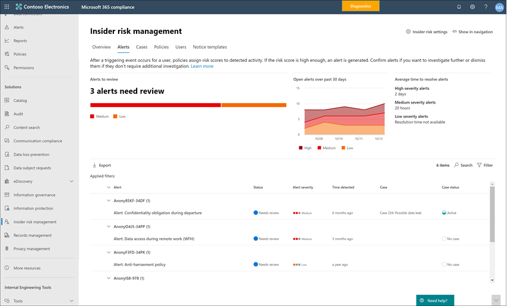
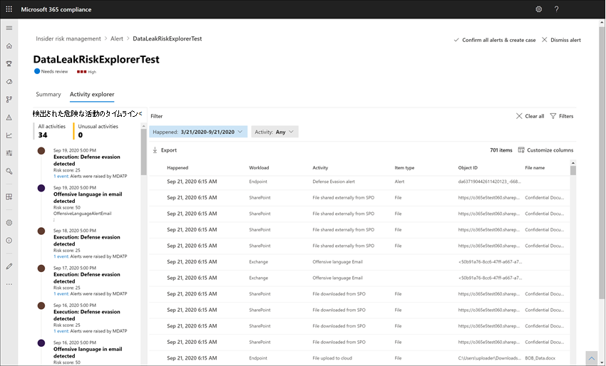
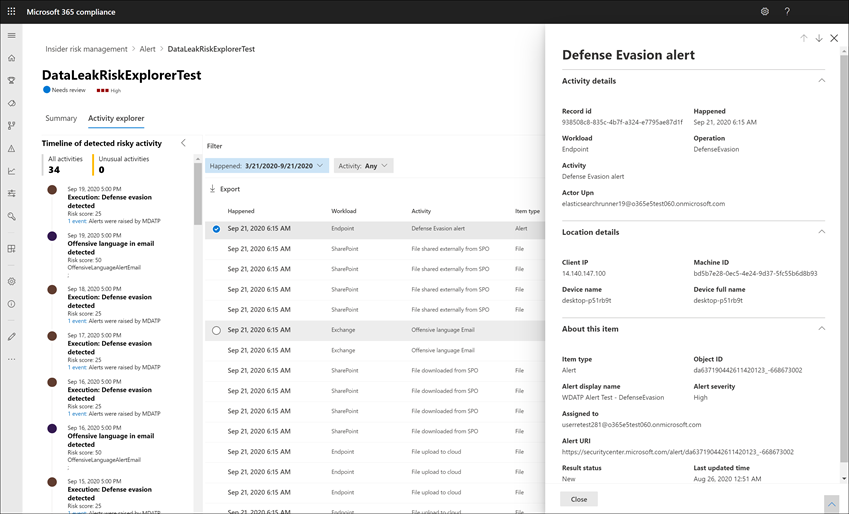

# Insider リスク管理警告Insider risk management alerts

インサイダーリスク管理警告は、インサイダーリスク管理ポリシーで定義されたリスク インジケーターによって自動的に生成されます。Insider risk management alerts are automatically generated by risk indicators defined in insider risk management policies. これらの通知で、コンプライアンスアナリストと捜査官が、現在のリスクの状態をすべて把握できるようになり、組織がトリアージでき見つかったリスクに対処できるようになります。These alerts give compliance analysts and investigators an all-up view of the current risk status and allow your organization to triage and take actions for discovered risks. 既定では、ポリシーによって、低、中、および高の重要度のアラートが生成されますが、必要に応じて [通知の音量を増減](insider-risk-management-settings.md#alert-volume) させることができます。By default, policies generate a certain amount of low, medium, and high severity alerts, but you can [increase or decrease the alert volume](insider-risk-management-settings.md#alert-volume) to suit your needs. また、ポリシーウィザードを使用して新しいポリシーを作成するときに、 [ポリシーインジケーターの警告のしきい値](insider-risk-management-settings.md#indicator-level-settings-preview) を構成することもできます。Additionally, you can configure the [alert threshold for policy indicators](insider-risk-management-settings.md#indicator-level-settings-preview) when creating a new policy with the policy wizard.

## アラート ダッシュボードAlert dashboard

Insider リスク **警告ダッシュボード** を使用すると、insider のリスクポリシーによって生成された通知を表示し、操作することができます。The insider risk **Alert dashboard** allows you to view and act on alerts generated by insider risk policies. 各レポートウィジェットは過去30日間の情報を表示します。Each report widget displays information for last 30 days.

- **確認するアラート**: アラートの重要度の内訳を含む、確認とトリアージを必要とするアラートの合計数が表示されます。**Alerts to review**: The total number of alerts needing review and triage are listed, including a breakdown by alert severity.
- **[過去30日間にわたってアラートを開く**]: 過去30日間にわたってポリシーによって作成されたアラートの合計数 (高、中、低) のアラート重大度レベルで並べ替えられます。**Open alerts over past 30 days**: The total number of alerts created by policy matches over the last 30 days, sorted by high, medium, and low alert severity levels.
- **通知の平均解決時間**: 有用な通知統計の要約:**Average time to resolve alerts**: A summary of useful alert statistics:
    - 重大度の高いアラートを解決するための平均時間。時間、日、または月単位で表示されます。Average time to resolve high severity alerts, listed in hours, days, or months.
    - 中程度の重大度のアラートを解決するための平均時間。時間、日、または月単位で表示されます。Average time to resolve medium severity alerts, listed in hours, days, or months.
    - 重大度の低いアラートを解決するための平均時間。時間、日、または月単位で表示されます。Average time to resolve low severity alerts, listed in hours, days, or months.

>[!NOTE]
>インサイダー リスク管理は、組み込みのアラート調整を使用して、リスク調査を保護および最適化し、エクスペリエンスを確認します。Insider risk management uses built-in alert throttling to help protect and optimize your risk investigation and review experience. この調整により、誤って構成されたデータ コネクタや DLP ポリシーなど、ポリシー アラートが過負荷になる可能性がある問題から保護されます。This throttling guards against issues that might result in an overload of policy alerts, such as misconfigured data connectors or DLP policies. その結果、ユーザーに対する新しいアラートの表示に遅延が生じる可能性があります。As a result, there might be a delay in displaying new alerts for a user.

## アラートの状態と重大度Alert status and severity

通知は、次のいずれかの状態にすることができます。You can triage alerts into one of the following statuses:

- **確認**済み: 警告が確認され、新規または既存のケースに割り当てられていること。**Confirmed**: An alert confirmed and assigned to a new or existing case.
- **無視**されます: トリアージプロセスの問題を無視して通知を破棄します。**Dismissed**: An alert dismissed as benign in the triage process.
- **レビューが必要**: 新しい警告は、トリアージアクションがまだ行われていない場合です。**Needs review**: A new alert where triage actions have not yet been taken.
- **解決済み**: クローズおよび解決されたケースの一部である警告。**Resolved**: An alert that is part of a closed and resolved case.

アラートリスクスコアは、いくつかのリスクアクティビティ指標から自動的に計算されます。Alert risk scores are automatically calculated from several risk activity indicators. これらの指標には、リスクアクティビティの種類、アクティビティの発生回数と頻度、ユーザーリスクアクティビティの履歴、およびアクティビティの深刻さを高める可能性があるアクティビティリスクの追加が含まれます。These indicators include the type of risk activity, the number and frequency of the activity occurrence, the history of user risk activity, and the addition of activity risks that may boost the seriousness of the activity. アラート リスク スコアは、各アラートのリスク重大度レベルをプログラムで割り当て、カスタマイズすることはできません。The alert risk score drives the programmatic assignment of a risk severity level for each alert and cannot be customized. 通知が残っていると、untriaged が引き続きアラートに計上され、リスクの重大度レベルが増加する可能性があります。If alerts remain untriaged and risk activities continue to accrue to the alert, the risk severity level can increase. リスクアナリストと調査担当者は、アラートのリスク重大度を使用して、組織のリスクポリシーおよび基準に従って、アラートをトリアージすることができます。Risk analysts and investigators can use the alert risk severity to help triage alerts in accordance with your organization's risk policies and standards.

アラートリスクの重大度レベルは次のとおりです。Alert risk severity levels are:

- **高重要度**: アラートのアクティビティとインジケーターは重大なリスクをもたらします。**High severity**: The activities and indicators for the alert pose significant risk. 関連するリスクアクティビティは、深刻かつ反復的で、corelate は、他の重要なリスク要因に強くなります。The associated risk activities are serious, repetitive, and corelate strongly to other significant risk factors.
- **中程度の重要度**: 警告のアクティビティとインジケーターは、中程度のリスクをもたらします。**Medium severity**: The activities and indicators for the alert pose a moderate risk. 関連するリスク アクティビティは、中程度で頻繁であり、他のリスク要因とある程度の相関関係があります。The associated risk activities are moderate, frequent, and have some correlation to other risk factors.
- **低重要度**: アラートのアクティビティとインジケーターは、軽微なリスクをもたらします。**Low severity**: The activities and indicators for the alert pose a minor risk. 関連するリスクアクティビティは軽微で、不定期で、他の重要なリスク要因に corelate されません。The associated risk activities are minor, more infrequent, and do not corelate to other significant risk factors.

## 通知ダッシュボードでのフィルター通知Filter alerts on the Alert dashboard

組織内のアクティブなインサイダー リスク管理ポリシーの数と種類によっては、大量のアラートを確認することが困難な場合があります。Depending on the number and type of active insider risk management policies in your organization, reviewing a large queue of alerts can be challenging. 通知フィルターを使用すると、アナリストや調査担当者が複数の属性で通知をソートするのに役立ちます。Using alert filters can help analysts and investigators sort alerts by several attributes. **通知ダッシュボード**で通知をフィルター処理するには、[**フィルター** ] コントロールを選択します。To filter alerts on the **Alerts dashboard**, select the **Filter** control. 通知は、1つまたは複数の属性によってフィルター処理できます。You can filter alerts by one or more attributes:

- **状態**: 1 つ以上の状態の値を選択して、通知の一覧をフィルター処理します。**Status**: Select one or more status values to filter the alert list. オプションは、*確認済み*、*非表示*、*レビューが必要*、*解決済み*です。The options are *Confirmed*, *Dismissed*, *Needs review*, and *Resolved*.
- **重要度**: 1 つまたは複数のアラートリスク重大度レベルを選択して、警告リストをフィルター処理します。**Severity**: Select one or more alert risk severity levels to filter the alert list. オプションは、*高*、*中*、*低*です。The options are *High*, *Medium*, and *Low*.
- [**検出時刻**]: 通知が作成された開始日と終了日を選択します。**Time detected**: Select the start and end dates for when the alert was created.
- **Policy**: 選択したポリシーによって生成されたアラートをフィルター処理する1つまたは複数のポリシーを選択します。**Policy**: Select one or more policies to filter the alerts generated by the selected policies.

## 通知ダッシュボードの検索通知Search alerts on the Alert dashboard

特定の単語でアラート名を検索するには、**検索**コントロールを選び、検索する単語を入力します。To search the alert name for a specific word, select the **Search** control and type the word to search. 検索結果には、検索で定義された単語を含むポリシー アラートが表示されます。The search results display any policy alert containing the word defined in the search.

## 通知の優先順位付けTriage alerts

Insider のリスクの警告をトリアージするには、次の手順を実行します。To triage an insider risk alert, complete the following steps:

1. [Microsoft 365 コンプライアンスセンター](https://compliance.microsoft.com)で、[ **Insider リスク管理**] に移動し、[**通知**] タブを選択します。In the [Microsoft 365 compliance center](https://compliance.microsoft.com), go to **Insider risk management** and select the **Alerts** tab.
2. **アラートダッシュボード**で、トリアージするアラートを選択します。On the **Alerts dashboard**, select the alert you want to triage.
3. [ **通知の詳細] ウィンドウ**では、次のタブを確認して、アラートの優先順位を決定できます。On the **Alerts detail pane**, you can review the following tabs and triage the alert:
    - **概要**: このタブには、通知に関する一般的な情報が含まれており、警告を確認して新しいケースを作成したり、通知を破棄したりできます。**Summary**: This tab contains general information about the alert and allows you to confirm the alert and create a new case or allows you to dismiss the alert. これには、アラートの現在の状態と、アラートのリスク重大度レベルが [ *高*]、[ *中*]、または [ *低*] として表示されます。It includes the current status for the alert and the alert risk severity level, listed as *High*, *Medium*, or *Low*. 通知がトリアージされていない場合は、重大度レベルを時間の経過と共に増減させることができます。The severity level may increase or decrease over time if the alert is not triaged.
        - 動作: アクティビティに関連付けられている違反の種類を含む、アクティビティ評価期間中に**発生**した上位3つのリスクアクティビティとポリシー一致が表示されます。**What happened**: Displays the top three risk activities and policy matches during the activity evaluation period, including the type of violation associated with the activity.
        - **ユーザーの詳細**: 通知に割り当てられているユーザーに関する一般的な情報を表示します。**User details**: Displays general information about the user assigned to the alert. 匿名化が有効になっている場合、ユーザー名、電子メールアドレス、エイリアス、および組織フィールドは匿名化になります。If anonymization is enabled, the username, email address, alias, and organization fields are anonymized.
        - **通知の詳細**: 通知が生成されてからの時間の長さが含まれ、アラートを生成したポリシーが一覧表示され、その警告から生成されたケースが一覧表示されます。**Alert details**: Includes the length of time since the alert was generated, the policies that generated the alert are listed, and the case generated from the alert is listed. 新しい通知の場合、 **ケース** フィールドには None が表示されます。For new alerts, the **Case** field displays None.
        - **検出されたコンテンツ**: 警告のリスクアクティビティに関連付けられているコンテンツと、主な領域別にアクティビティイベントを要約します。**Content detected**: Includes content associated with the risk activities for the alert and summarizes activity events by key areas. [アクティビティ] リンクを選択すると、アクティビティエクスプローラーが開き、アクティビティに関する追加の詳細が表示されます。Selecting an activity link opens the Activity explorer and displays additional details about the activity.
    - **ユーザーアクティビティ**: このタブには、通知に関連付けられたユーザーのアクティビティ履歴が表示されます。**User activity**: This tab displays the activity history for the user associated with the alert. この履歴には、この通知のポリシーに割り当てられたテンプレートで定義されているリスク指標に関連するその他のアラートとアクティビティが含まれています。This history includes other alerts and activities related to risk indicators defined in the template assigned to the policy for this alert. この履歴により、リスクアナリストと調査担当は、トリアージプロセスの一環として、従業員の過去のリスクのある動作を考慮できます。This history allows risk analysts and investigators to factor in any past risky behavior for the employee as part of the triage process.
    - **アクション**: 各通知に対して次のアクションを実行できます。**Actions**: The following actions are available for each alert:
        - **[展開**されたビューを開く]: **アクティビティエクスプローラー** ダッシュボードが開きます。**Open expanded view**: Opens the **Activity explorer** dashboard.
        - **確認と作成ケース**: このアクションを使用して、ユーザーに関連付けられているすべての警告の新しいケースを確認して作成します。**Confirm and create case**: Use this action to confirm and create a new case for all the alerts associated with a user. このアクションにより、アラートの状態が [ *確認*済みに自動的に変更されます。This action automatically changes the alert status to *Confirmed*.
        - **警告を無視**する: このアクションを使用して、通知を終了します。**Dismiss alert**: Use this action to dismiss the alert. この操作により、アラートの状態が [ *解決済み*に変更されます。This action changes the alert status to *Resolved*.

## アクティビティエクスプローラー (プレビュー)Activity explorer (preview)

>[!NOTE]
>アクティビティエクスプローラーは、組織でこの機能が使用可能になった後、イベントをトリガーするユーザーのアラート管理領域で利用できます。Activity explorer is available in the alert management area for users with triggering events after this feature is available in your organization.

アクティビティエクスプローラーでは、アラートに関する詳細な情報を提供する包括的な分析ツールを使用して、リスク調査担当とアナリストを統合します。The Activity explorer provides risk investigators and analysts with a comprehensive analytic tool that provides detailed information about alerts. アクティビティエクスプローラーを使用すると、レビューアーは、検出された危険なアクティビティのタイムラインをすばやく確認し、通知に関連するすべてのリスクアクティビティを識別してフィルター処理できます。With the Activity explorer, reviewers can quickly review a timeline of detected risky activity and identify and filter all risk activities associated with alerts. アクティビティエクスプローラーで通知にフィルターを適用するには、[フィルター] コントロールを選択します。To filter alerts on the Activity explorer, select the Filter control. アラートの詳細ウィンドウに一覧表示されている1つまたは複数の属性によって、通知をフィルター処理できます。You can filter alerts by one or more attributes listed in the details pane for the alert. また、アクティビティエクスプローラーは、調査担当者やアナリストがダッシュボードに焦点を当てることができるようにするための、カスタマイズ可能な列をサポートしています。Activity explorer also supports customizable columns to help investigators and analysts focus the dashboard on the information most important to them.

**アクティビティエクスプローラー**を使用するには、次の手順を実行します。To use the **Activity explorer**, complete the following steps:

1. Microsoft 365 コンプライアンスセンターで、[ **Insider リスク管理** ] に移動し、[ **通知** ] タブを選択します。In the Microsoft 365 compliance center, go to **Insider risk management** and select the **Alerts** tab.
2. **アラートダッシュボード**で、トリアージするアラートを選択します。On the **Alerts dashboard**, select the alert you want to triage.
3. [ **通知の詳細] ウィンドウ**で、[ **拡張ビューを開く**] を選択します。On the **Alerts detail pane**, select **Open expanded view**.
4. 選択した通知のページで、[ **アクティビティエクスプローラー** ] タブを選択します。On the page for the selected alert, select the **Activity explorer** tab.

アクティビティエクスプローラーでアクティビティをレビューする場合、調査担当およびアナリストは特定のアクティビティを選択し、[アクティビティの詳細] ウィンドウを開くことができます。When reviewing activities in the Activity explorer, investigators and analysts can select a specific activity and open the activity details pane. このウィンドウには、調査担当とアナリストが警告のトリアージプロセス中に使用できるアクティビティに関する詳細情報が表示されます。The pane displays detailed information about the activity that investigators and analysts can use during the alert triage process. 詳細情報は、アラートのコンテキストを提供し、アラートをトリガーしたリスクアクティビティの全範囲を特定するのに役立ちます。The detailed information may provide context for the alert and assist with identifying the full scope of the risk activity that triggered the alert.

## 警告のケースを作成するCreate a case for an alert

アラートのレビューとトリアージが行われると、リスクアクティビティをさらに詳しく調査するための新しいケースを作成できます。As alert is reviewed and triaged, you can create a new case to further investigate the risk activity. 警告のケースを作成するには、次の手順を実行します。To create a case for an alert, follow these steps:

1. [Microsoft 365 コンプライアンスセンター](https://compliance.microsoft.com)で、[ **Insider リスク管理**] に移動し、[**通知**] タブを選択します。In the [Microsoft 365 compliance center](https://compliance.microsoft.com), go to **Insider risk management** and select the **Alerts** tab.
2. **通知ダッシュボード**で、確認して新しいケースを作成する通知を選択します。On the **Alerts dashboard**, select the alert you want to confirm and create a new case for.
3. [**通知の詳細] ウィンドウ**で、[**アクション**の  >  **確認] & create case**] を選択します。On the **Alerts details pane**, select **Actions** > **Confirm alerts & create case**.
4. [ **通知の確認と insider のリスクケースの作成** ] ダイアログで、ケースの名前を入力し、投稿者として追加するユーザーを選択し、必要に応じてコメントを追加します。On the **Confirm alert and create insider risk case** dialog, enter a name for the case, select users to add as contributors, and add comments as applicable. コメントは、ケースメモとして自動的に追加されます。Comments are automatically added to the case as a case note.
5. [ **ケースの作成** ] を選択して新しいケースを作成するか、[ **キャンセル** ] を選択して、ケースを作成せずにダイアログを閉じます。Select **Create case** to create a new case or select **Cancel** to close the dialog without creating a case.

ケースが作成されると、調査担当およびアナリストは、ケースを管理して行動することができます。After the case is created, investigators and analysts can manage and act on the case. 詳細については、「 [Insider リスク管理ケース](insider-risk-management-cases.md) 」を参照してください。See the [Insider risk management case](insider-risk-management-cases.md) article for more details.
