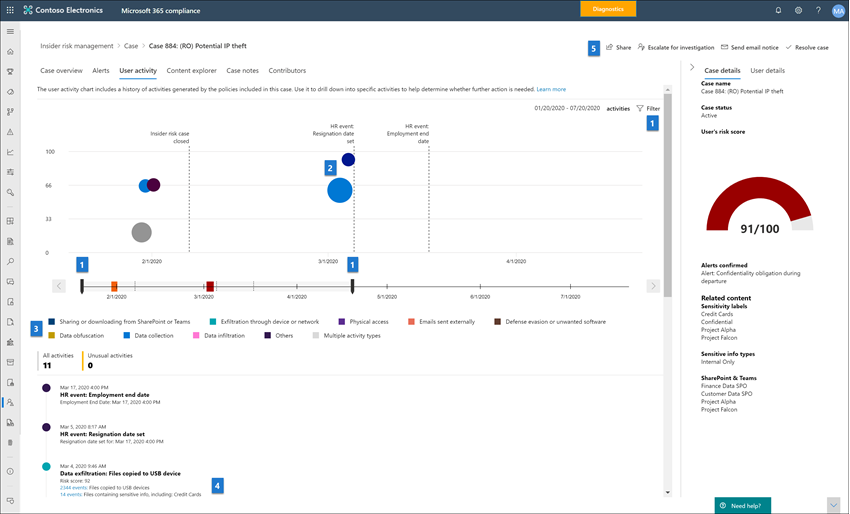

# Insider リスク管理ケース

ケースは insider リスク管理の核心であり、ポリシーで定義されたリスク指標によって生成された問題を深く調査して対処することができます。 ケースは、ユーザーのコンプライアンス関連の問題に対処する必要がある場合に、警告から手動で作成されます。 各ケースは1人のユーザーを対象としており、ユーザーに対する複数の通知を既存のケースまたは新しいケースに追加できます。 

ケースの詳細を調査した後、次の操作を行うことができます。

- ユーザーに通知を送信する
- 害のないケースを解決する
- ServiceNow インスタンスまたは電子メールの受信者とケースを共有する
- 高度な電子情報開示の調査のためのケースのエスカレーション

## ケースダッシュボード

Insider リスク管理 **ケースダッシュボード** では、ケースを表示して操作することができます。 ダッシュボードの各レポートウィジェットには、過去30日間の情報が表示されます。

- **アクティブなケース**: 調査中のアクティブなケースの合計数。
- **過去30日間のケース**: 作成されたケースの合計数は、 *アクティブな* 状態と *クローズ* 状態で並べ替えられています。
- **Statistics**: 時間、日、または月単位で表示されているアクティブなケースの平均時間。

ケースキューは、次の case 属性の現在の状態に加えて、組織のすべてのアクティブなケースとクローズされたケースを一覧表示します。

- **ケース名**: 警告が確認され、ケースが作成されるときに定義される、ケースの名前。  
- **状態**: サポート案件の状態 ( *アクティブ* か *クローズ*)。
- **User**: ケースのユーザー。 ユーザー名の匿名化が有効になっている場合は、匿名化の情報が表示されます。
- **開い**ている時間のケース: ケースが開かれてから経過した時間。
- **Total policy alerts**: ケースに含まれるポリシー一致の数。 新しいアラートがケースに追加されると、この数は増える可能性があります。
- **最終更新**日: ケースの状態に追加のケースメモまたは変更があったために経過した時間。
- **最終更新者**: ケースを最後に更新した insider リスク管理アナリストまたは調査担当者の名前。

**検索**コントロールを使用して、ケース名を特定のテキストで検索し、ケースフィルターを使用して、次の属性でケースを並べ替えます。

- 状態
- ケースが起きてからの時間、開始日、終了日
- 最終更新、開始日、終了日

## フィルターケース

組織内のアクティブな insider リスク管理ポリシーの数と種類によっては、大規模なケースの大きなキューを確認するのは困難な場合があります。 ケースフィルターを使用すると、アナリストや調査担当者が複数の属性で並べ替えを行う際に役立ちます。 **ケースダッシュボード**で通知をフィルター処理するには、[**フィルター** ] コントロールを選択します。 ケースは、1つ以上の属性によってフィルター処理できます。

- **状態**: 1 つ以上の状態の値を選択して、ケースの一覧をフィルター処理します。 オプションは *アクティブ* で *閉じら*れています。
- [開いている**時間**]: ケースが開かれたときの開始日と終了日を選択します。
- **最終更新**日時: ケースが更新された開始日と終了日を選択します。

## ケースを調査する

適切な是正措置を講じるには、insider リスク管理通知の詳細な調査が重要です。 Insider リスク管理ケースは、ユーザーのリスクアクティビティの履歴や警告の詳細を深く掘り下げ、リスクにさらされる内容とメッセージを調査するための中央管理ツールです。 リスクアナリストや調査担当者も、レビューのフィードバックとメモを集中管理し、ケース解決を処理するケースを使用します。

ケースを選択すると、ケース管理ツールが開き、分析担当者と調査担当者がケースの詳細を調査します。

### ケースの概要

「**ケースの概要**」タブには、ケースのアラートアクティビティとリスクレベルの履歴が集計されています。 

- [ **通知** ] ウィジェットには、そのケースに一致するポリシーが表示されます。これには、アラートの状態、アラートのリスク重大度、およびアラートが検出された日時が含まれます。 
- **リスクレベル履歴**のグラフには、過去30日間のユーザーリスクレベルが表示されます。 この折れ線グラフにより、分析担当者や調査担当者は、時間の経過に伴うユーザーリスクの全体的な傾向をすばやく確認できます。 
- **リスクアクティビティコンテンツ** ウィジェットは、ケースに追加されたアラートに含まれるデータとコンテンツのタイプをまとめています。 このウィジェットにより、ケースのリスクにさらされているデータとコンテンツの概観を把握できます。

ケースの **詳細** ウィンドウは、すべてのケースの管理タブで利用でき、リスクアナリストと調査担当のケースの詳細が要約されています。 次の領域が含まれています。

- **ケース名**: 自動生成されたケースシーケンス番号、および最初の確認通知が一致するポリシーテンプレートに関連付けられているリスクの名前が付いたケースの名前。 
- **ケースの状態**: サポートされているケースの現在の状態 ( *アクティブ* か *終了*)。
- **ユーザーのリスクスコア**: ケースに対するユーザーの現在の計算リスクレベル。 このスコアは24時間ごとに計算され、ユーザーに関連付けられたすべてのアクティブなアラートの警告リスクスコアを使用します。
- **通知確認**: ケースに対して確認されたユーザーの警告のリスト。
- **関連コンテンツ**: コンテンツのソースと種類によって並べ替えられたコンテンツのリスト。 たとえば、SharePoint Online の ケースアラートコンテンツ の場合、ケースのアラートのリスクアクティビティに関連したフォルダーまたはファイル名のリストが表示されることがあります。

### アラート

[ **通知** ] タブには、ケースに含まれている現在の通知が要約されます。 新しい警告は既存のケースに追加され、割り当てられたときに **警告** キューに追加される場合があります。 次の警告属性がキューに一覧表示されます。

- 状態
- 重要度
- 検出された時間

[ **警告の詳細** ] ページを表示するには、キューから通知を選択します。

検索コントロールを使用して、特定のテキストのアラート名を検索し、アラートフィルターを使用して、次の属性によってケースを並べ替えます。

- 状態
- 重要度
- 検出された時間、開始日、終了日

フィルターコントロールを使用して、次のようないくつかの属性で通知をフィルター処理します。

- **状態**: 1 つ以上の状態の値を選択して、通知の一覧をフィルター処理します。 オプションは、*確認済み*、*非表示*、*レビューが必要*、*解決済み*です。
- **重要度**: 1 つまたは複数のアラートリスク重大度レベルを選択して、警告リストをフィルター処理します。 オプションは、*高*、*中*、*低*です。
- [**検出時刻**]: 通知が作成された開始日と終了日を選択します。
- **Policy**: 選択したポリシーによって生成されたアラートをフィルター処理する1つまたは複数のポリシーを選択します。

### ユーザー アクティビティ

[**ユーザーアクティビティ**] タブは、内部リスク分析とケースの調査を対象にした、最も強力なインサイダーリスク管理ツールの1つです。 このタブは、すべての通知の過去のタイムライン、すべての警告の詳細、ユーザーの現在のリスクスコア、ケースにおけるリスクを含めるための効果的なアクションを実行する制御など、ケースのクイックレビューを有効にするように構成されています。

1. **日付と時刻のフィルター**: 既定では、ケースで確認された通知の過去6か月間は、[ユーザーアクティビティ] グラフに表示されます。 グラフビューのフィルターは、グラフウィンドウの両端にあるスライダーコントロール、またはグラフフィルターコントロールで特定の開始日と終了日を定義することで簡単に実行できます。
2. **リスクアラートのアクティビティと詳細**: リスクアクティビティは、[ユーザーアクティビティ] グラフに色付きのバブルとして視覚的に表示されます。 バブルはさまざまなカテゴリのリスクに対して作成され、バブルサイズはカテゴリのリスクアクティビティの数に比例します。 バブルを選択して、各リスクアクティビティの詳細を表示します。 詳細は次のとおりです。
    - リスクアクティビティの**日付**。
    - **リスクアクティビティカテゴリ**。 たとえば、組織または*SharePoint Online からダウンロード*された*添付ファイルを含む電子メール (s) が*含まれます。
    - アラートの**リスクスコア**。 このスコアは、アラートリスクの重大度レベルを表すスコアの数値です。
    - アラートに関連付けられているイベント数。 リスクアクティビティに関連した各ファイルまたはメールへのリンクも表示されます。
3. **リスクアクティビティの凡例**: ユーザーアクティビティグラフの下部に、色分けされた凡例が表示され、各アラートのリスクカテゴリをすばやく判断できます。
4. **リスクアクティビティ chronology**: 対応する通知のバブルで利用可能なすべての詳細を含む、ケースに関連付けられているすべてのリスクアラートの完全な chronology が一覧表示されます。
5. ケース**アクション**: ケースを解決するためのオプションは、ケースアクションツールバーにあります。 ケースを解決したり、ユーザーに電子メール通知を送信したり、データまたはユーザー調査のケースをエスカレートしたりすることができます。

### コンテンツエクスプローラー

[ **コンテンツエクスプローラー** ] タブでは、リスクの通知に関連付けられている個々のファイルおよび電子メールメッセージのすべてのコピーをリスク分析者と調査担当者が確認できます。 たとえば、ユーザーが SharePoint Online から数百のファイルをダウンロードするときに通知が作成され、アクティビティによってポリシーアラートがトリガーされると、その通知に関するすべてのダウンロードファイルが取得され、元のストレージソースから insider リスク管理ケースにコピーされます。

コンテンツエクスプローラーは、基本的で高度な検索とフィルター処理機能を備えた強力なツールです。 コンテンツエクスプローラーの使用の詳細については、「 [Insider リスク管理コンテンツエクスプローラー](insider-risk-management-content-explorer.md)」を参照してください。

### ケースメモ

ケースのケース **メモ** タブでは、リスクアナリストと調査担当者が、そのケースの作業に関するコメント、フィードバック、および洞察を共有しています。 メモは、ケースに永続的に追加されます。メモを保存した後に、編集または削除することはできません。 アラートからケースが作成されると、「**アラートの確認とインサイダーリスクケースの作成**」ダイアログに入力されたコメントが、ケースメモとして自動的に追加されます。

ケースノートダッシュボードには、メモを作成したユーザーによってメモが表示され、ノートが保存されてから経過した時間が表示されます。 特定のキーワードのケースメモテキストフィールドを検索するには、ケースダッシュボードの [ **検索** ] ボタンを使用して、特定のキーワードを入力します。

ケースにメモを追加するには、次のようにします。

1. [Microsoft 365 コンプライアンスセンター](https://compliance.microsoft.com)で、[ **Insider リスク管理**] に移動し、[**ケース**] タブを選択します。
2. ケースを選択し、[ **ケースメモ** ] タブを選択します。
3. [ **ケースメモの追加**] を選択します。
4. [ **ケースメモの追加** ] ダイアログで、ケースのメモを入力します。 メモをケースに追加するには [ **保存** ] を選択するか、メモを保存せずに **[閉じる] を選択します** 。

### 共同作成者

ケースの [**共同作成者**] タブでは、リスク分析担当者や調査担当者が、ケースに別のレビュー担当者を追加することができます。 既定では、 **Insider リスク管理アナリスト** と **insider リスク管理** の各調査担当者の役割が割り当てられているすべてのユーザーが、アクティブなケースとクローズしたケースの共同作成者として一覧表示されます。

調査の機密性と完全性を維持するために、インサイダーリスク管理のすべてのケースは、適切なアクセス制御を使用して管理しなければなりません。 ケースへのアクセス制御を維持するために、ユーザーには次の2種類のいずれかのアクセス方法が割り当てられます。

- **永続的なアクセス**: 通知からケースを作成するときに、 **Insider リスク管理アナリスト** と **insider リスク管理** の各調査担当者の役割を持つユーザーに永続的アクセスが自動的に付与されます。 恒久的なアクセスは、ケースが存続している間、ケースへのフルコントロールが許可し、他のケース共同作成者を追加することができます。
- **一時アクセス**: ユーザーには、そのケースに永続的なアクセス権を持つ投稿者のみがアクセス権を付与します。 通常、このアクセスレベルは、ケースにメモを追加する必要があるユーザーに付与されます。 一時的なアクセス権を持つ共同作成者には、以下を除いたすべてのケース管理を制御することができます。
    - アラートの確認または消去する権限
    - ケースの共同作成者を編集する権限
    - コンテンツエクスプローラーでファイルとメッセージを表示する権限

ケースに共同作成者を追加するには、次のようにします。

1. [Microsoft 365 コンプライアンスセンター](https://compliance.microsoft.com)で、[ **Insider リスク管理**] に移動し、[**ケース**] タブを選択します。
2. ケースを選択し、[ **投稿** 者] タブを選択します。
3. [ **投稿者の追加**] を選択します。
4. [ **共同作成者の追加** ] ダイアログで、追加するユーザーの名前の入力を開始し、[推奨されるユーザー] ボックスの一覧からユーザーを選択します。 このリストは、テナントのサブスクリプションの Azure Active Directory から生成されます。
5. [ **投稿者の追加** ] ダイアログで、投稿者のアクセスレベルを選択します。 [ **永続的** ] または [ **一時的**] を選択できます。
6. [ **追加** ] を選択して、ユーザーを共同作成者として追加するか、[ **キャンセル** ] を選択してユーザーを共同作成者として追加せずにダイアログを閉じます。

## ケースへの対処

リスクアナリストと捜査官は、ケースの重要度、ユーザーのリスク履歴、組織のリスクガイドラインに応じて、複数の方法のいずれかで、ケースに対してアクションを実行できます。 状況によっては、ユーザーまたはデータ調査にケースをエスカレートして、組織の他の領域と共同作業を行ったり、より深いリスクアクティビティを把握したりする必要があります。 エンドツーエンドの解決管理を支援するために、Insider リスク管理は、他の Microsoft 365 コンプライアンスソリューションと緊密に統合されています。

### 電子メール通知の送信

ほとんどの場合、内部的なリスクのアラートを作成するユーザー操作は、不注意または過失になります。 電子メールを使用して通知をユーザーに送信することは、ケースのレビューとアクションを文書化するための効果的な方法、および企業ポリシーのユーザーに通知するための方法、またはそれらをリフレッシャートレーニングにするための方法です。 通知は、insider リスク管理インフラストラクチャ用に [作成した通知テンプレート](insider-risk-management-notices.md) から生成されます。

ユーザーに電子メール通知を送信しても、そのケースは*クローズ*として解決***されない***ことに注意する必要があります。 場合によっては、新しいケースを開かずに、追加のリスクアクティビティを検索するためにユーザーに通知を送信した後で、ケースを開いたままにしておくこともできます。 通知が送信された後にケースを解決する場合は、通知を送信した後の手順として、「**ケース解決済**」を選択しなければなりません。

ケースに割り当てられたユーザーに通知を送信するには、次のようにします。

1. [Microsoft 365 コンプライアンスセンター](https://compliance.microsoft.com)で、[ **Insider リスク管理**] に移動し、[**ケース**] タブを選択します。
2. ケースを選択してから、ケースアクションツールバーの [ **電子メール通知の送信** ] ボタンを選択します。
3. [ **電子メール通知の送信** ] ダイアログで、[通知 **テンプレートの選択** ] ドロップダウンコントロールを選択して、通知の通知テンプレートを選択します。 この選択範囲は、通知の他のフィールドに事前に入力されています。
4. [通知] フィールドを確認し、必要に応じて更新します。 ここで入力した値は、テンプレートの値より優先されます。
5. [ **送信** ] を選択してユーザーに通知を送信するか、[ **キャンセル** ] を選択して、通知をユーザーに送信せずにダイアログを閉じます。 送信されたすべての通知は、ケース **メモ** ダッシュボードのケースメモキューに追加されます。

### 調査のためにエスカレートする

ユーザーのリスクアクティビティに対して追加の法的レビューが必要になる状況で、ユーザー調査のケースをエスカレートします。 このエスカレーションにより、Microsoft 365 組織の新しい Advanced eDiscovery ケースが開きます。 Advanced eDiscovery は、組織の内部および外部の法的調査に対応するコンテンツを保持、収集、確認、分析、エクスポートするためのエンド ツー エンドのワークフローを提供します。 また、訴訟チームが法的情報保留通知ワークフロー全体を管理して、ケースに関係するカストディアンとコミュニケーションを取ることができます。 インサイダーリスク管理ケースから作成された Advanced eDiscovery ケースのカストディアンとしてレビュー担当者を割り当てると、訴訟チームは適切な措置を講じ、コンテンツの保持を管理することができます。 Advanced eDiscovery の詳細については、「[Advanced eDiscovery in Microsoft 365の概要](overview-ediscovery-20.md)」を参照してください。

ケースをユーザー調査にエスカレートするには、次のようにします。

1. [Microsoft 365 コンプライアンスセンター](https://compliance.microsoft.com)で、[ **Insider リスク管理**] に移動し、[**ケース**] タブを選択します。
2. ケースを選択し、[ケースアクション] ツールバーの [ **調査対象のエスカレート** ] ボタンを選択します。
3. [ **調査のためのエスカレーション** ] ダイアログで、新しいユーザー調査の名前を入力します。 必要に応じて、ケースに関するメモを入力し、[ **エスカレート**] を選択します。
5. [ **確認** ] を選択してユーザーの調査ケースを作成するか、[ **キャンセル** ] を選択して、新しいユーザー調査ケースを作成せずにダイアログを閉じます。

Insider リスク管理ケースが新しいユーザー調査ケースにエスカレートされた後、Microsoft 365 コンプライアンスセンターの**電子情報開示**の  >  **高度な**領域で新しいケースを確認できます。

### ケースを共有する

Insider リスク管理ケースを共有すると、組織内の他のコンプライアンス関係者との共同作業やレビューを容易に行うことができます。 ケース管理領域から、外部関係者とのリンクを insider リスク管理ケースにすばやく共有できます。 リンクから insider リスク管理ケースにアクセスするには、関係者が insider リスク管理役割グループに含まれている必要があります。

次の共有オプションを使用できます。 

- **ServiceNow**: microsoft 365 組織の Microsoft 365 ServiceNow コネクタを構成した後、ケースへのリンクを簡単に共有したり、インシデントを開いたり、ServiceNow 組織の変更を要求したりすることができます。 Servicenow と大文字と小文字を**Share**共有するには、[  >  case action から**ServiceNow**を共有する] を選択します。 ServiceNow と insider のリスク管理の統合には、以下のケースの情報とアクションが含まれています。
    - [**タスク名**]: 新しい ServiceNow タスクの名前。
    - **タスクの説明**: 新しい ServiceNow タスクの説明。 この編集可能な説明フィールドには、insider リスク管理ケースへのリンクが自動的に含まれます。
    - **タスクの種類**: 新しい ServiceNow タスクのタスクの種類。 *インシデント* または *変更要求*のいずれかです。
    - **Priority**: 新しい ServiceNow タスクの優先*度を示し*ます。これは、*計画*、*低*、中、*高*、または*重要*です。
    - **期限**: ServiceNow タスクを完了するために要求された日付。

- **電子メール**: 電子メールで insider リスク管理ケースへのリンクを共有します。 この共有オプションを使用して、ローカルに設定された電子メールクライアントを選択できます。 ケースリンクを電子メールと共有するに**Share**は、  >  ケースアクションツールバーから [**メール**を共有] を選択します。
- **リンクのコピー**: insider リスク管理ケースへのリンクをクリップボードにコピーします。 ケースのリンクをクリップボードにコピーするに**Share**は、[  >  ケースアクション] ツールバーの [**コピーリンク**の共有] を選択します。

### ケースを解決する

リスクアナリストと調査担当者がレビューと調査を完了した後、ケースを解決して、現在のケースに含まれているすべての警告に対処できます。 ケースを解決すると、解決方法の分類が追加され、ケースの状態が *Closed*に変更されます。また、解決策の処理の理由が、ケース **メモ** ダッシュボードのケースメモキューに自動的に追加されます。 ケースは次のいずれかの方法で解決されます。

- **無害**: ポリシーに一致するアラートが低リスク、非深刻、または誤検知として評価される場合の分類。
- [**確認ポリシー違反**]: ポリシーがアラートに一致する場合の分類は、危険、重大、または悪意のある目的として評価されます。

ケースを解決するには、次のようにします。

1. [Microsoft 365 コンプライアンスセンター](https://compliance.microsoft.com)で、[ **Insider リスク管理**] に移動し、[**ケース**] タブを選択します。
2. ケースを選択してから、ケースアクションのツールバーの [ **ケースの解決** ] ボタンを選択します。
3. [ **ケースの解決** ] ダイアログで、[ **解決** 方法] ドロップダウンコントロールを選択して、ケースの解決分類を選択します。 オプションには、 **無害** または確認された **ポリシー違反**があります。
4. [ **ケースの解決** ] ダイアログで、[実行された **アクション** ] テキストフィールドに解決の分類の理由を入力します。
5. [ **解決** ] を選択してケースを終了するか、[ **キャンセル** ] を選択してケースを解決せずにダイアログを閉じます。
