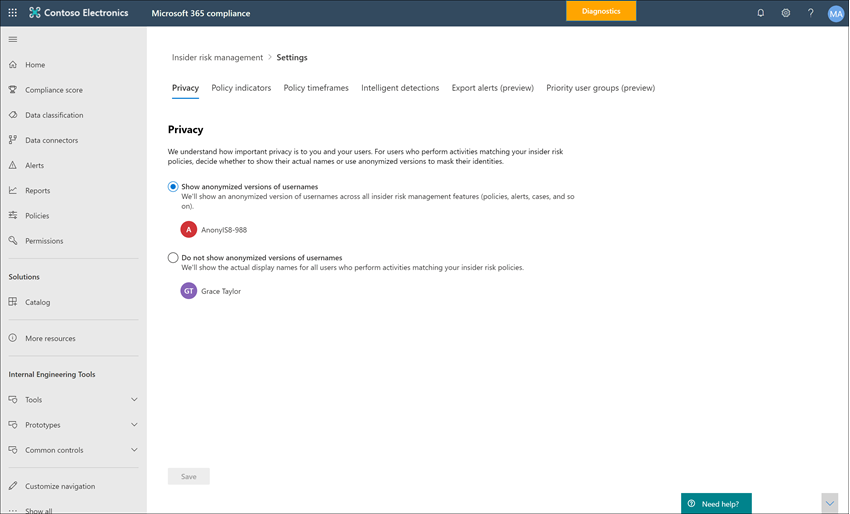
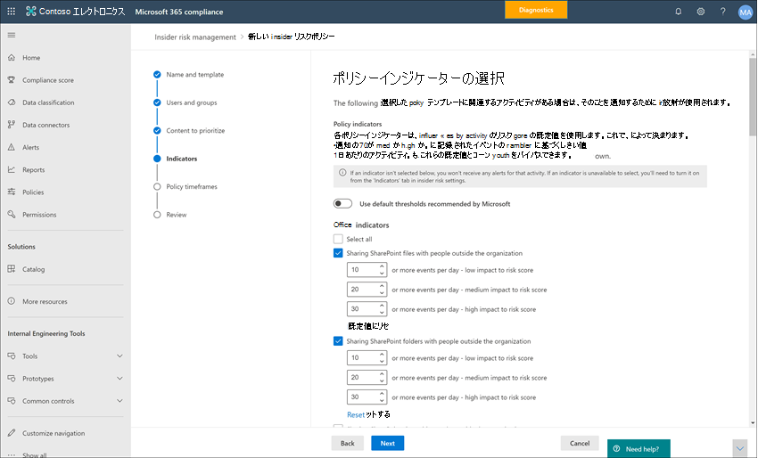

# Insider リスク管理設定の概要

Insider リスク管理設定は、ポリシーの作成時に選択したテンプレートに関係なく、すべての内部のリスク管理ポリシーに適用されます。 設定は、すべてのインサイダー リスクの管理タブの 1 番上にある**Insider リスク設定** コントロールを使用して構成します。 これらの設定は、次の領域のポリシーコンポーネントを制御します。

- プライバシー
- インジケーター
- ポリシータイムライン
- インテリジェントな検出
- 通知のエクスポート (プレビュー)
- 優先ユーザーグループ (プレビュー)
- 優先度の物理アセット (プレビュー)
- Power オートメーションフロー (プレビュー)
- Microsoft Teams (プレビュー)

開始して insider リスク管理ポリシーを作成する前に、これらの設定を理解し、組織のコンプライアンスニーズに応じた [レベルの設定] を選択することが重要です。

## プライバシー

ポリシー照合のあるユーザーのプライバシーの保護は重要であり、インサイダー リスクのアラートに関するデータ調査および分析レビューにおける客観性の促進に役立ちます。 Insider のリスクポリシーが一致するユーザーに対しては、次のいずれかの設定を選択できます。

- **Show 匿名化 versions of usernames**: ユーザーの名前は、管理者、データ捜査担当者、およびレビューアーがポリシー通知に関連付けられているユーザーを確認できないように匿名化ます。 たとえば、ユーザーの「Grace Taylor」は、インサイダー リスク管理環境のすべての領域で「AnonIS8-988」のようなランダムな仮名で表示されます。 この設定を選択すると、現在と過去のポリシー照合のあるすべてのユーザーが匿名化され、すべてのポリシーに適用されます。 このオプションが選択されている場合は、insider のリスクの警告とケースの詳細に関するユーザープロファイル情報は利用できません。 ただし、ユーザー名は、既存のポリシーに新しいユーザーを追加するとき、または新しいポリシーにユーザーを割り当てるときに表示されます。 この設定を無効にした場合は、現在のポリシーまたは過去のポリシーが一致するすべてのユーザーに対してユーザー名が表示されます。
- **ユーザー名の匿名化バージョンを表示しません**: ユーザー名は、通知とケースについて、現在および過去のすべてのポリシーの一致に対して表示されます。 ユーザープロファイル情報 (名前、タイトル、エイリアス、組織または部署) は、すべての insider リスク管理の通知とケースに対して表示されます。

## インジケーター

Insider リスクポリシーテンプレートは、検出して調査するリスクアクティビティの種類を定義します。 各ポリシーテンプレートは、特定のトリガーおよびリスクアクティビティに対応する特定の指標に基づいています。 すべてのインジケーターは既定で無効になっており、insider リスク管理ポリシーを構成する前に、1つ以上のポリシーインジケーターを選択する必要があります。

通知は、必要なしきい値を満たすポリシーインジケーターに関連するアクティビティをユーザーが実行するときにポリシーによってトリガーされます。 Insider リスク管理では、次の2種類の指標を使用します。

- **イベントのトリガー**: ユーザーが insider リスク管理ポリシーに対してアクティブであるかどうかを判断するイベント。 ユーザーが insider リスク管理ポリシーに追加された場合、トリガーイベントは発生しません。ユーザーアクティビティはポリシーによって評価されません。 たとえば、ユーザー A が、ユーザーポリシーテンプレートを *出発してデータの盗用によっ* て作成されたポリシーに追加され、Policy と MICROSOFT 365 HR コネクタが適切に構成されているとします。 ユーザー A に HR コネクタによって報告された終了日まで、ユーザー A のアクティビティは、この insider リスク管理ポリシーによってリスクに対して評価されません。 トリガーイベントのもう1つの例は、*データリーク*ポリシーを使用する場合に、ユーザーが*高い*重要度の DLP ポリシー警告を持っている場合です。
- **ポリシーのインジケーター**: 内部にあるユーザーのリスクスコアを決定するために使用される insider リスク管理ポリシーに含まれるインジケーター。 これらのポリシーインジケーターは、ユーザーのトリガイベントが発生した後にのみアクティブ化されます。 ポリシーインジケーターの例としては、ユーザーがデータを個人のクラウドストレージサービスまたはポータブルストレージデバイスにコピーした場合や、ユーザーが権限のない外部関係者と内部ファイルやフォルダーを共有している場合があります。

ポリシーインジケーターは、次の領域に分かれています。 Insider リスクポリシーを作成するときに、インジケーターレベルごとにインジケーターイベント制限をアクティブ化してカスタマイズするための指標を選択できます。

- **Office インジケーター**: これらには、SharePoint サイト、チーム、および電子メールメッセージングのポリシーインジケーターが含まれています。
- **デバイスインジケーター**: これには、ネットワークやデバイスを使用してファイルを共有するなどのアクティビティのポリシー指標が含まれます。 インジケーターには、Microsoft Office ファイルに関連するアクティビティが含まれます。CSV ファイル、および。PDF ファイル。 **デバイスインジケーター**を選択すると、Windows 10 ビルド1809以上のデバイスに対してのみアクティビティが処理されます。 Insider のリスクと統合するためのデバイスの構成の詳細については、「 [エンドポイント DLP の](endpoint-dlp-getting-started.md)概要」を参照してください。
- **セキュリティポリシー違反インジケーター**: 許可されていない、または悪意のあるソフトウェアのインストールやセキュリティ制御のバイパスに関連する MICROSOFT Defender ATP のインジケーターが含まれます。 Insider リスク管理で通知を受信するには、アクティブな Microsoft Defender ATP ライセンスと insider のリスク統合が有効になっている必要があります。 Microsoft Defender ATP for insider リスク管理統合の構成の詳細については、「 [Microsoft DEFENDER atp の高度な機能を構成する](https://docs.microsoft.com/windows/security/threat-protection/microsoft-defender-atp/advanced-features\#share-endpoint-alerts-with-microsoft-compliance-center)」を参照してください。
- **リスクスコアブースター**: これには、異常なアクティビティや過去のポリシー違反のリスクスコアが発生することが含まれます。 リスクスコアブースターを有効にすると、リスクスコアが増加し、これらの種類のアクティビティに対する警告が発生する可能性が高くなります。 リスクスコアブースターは、上の1つ以上のインジケーターが選択されている場合にのみ選択できます。

場合によっては、組織内の内部者のリスクポリシーに適用される insider リスクポリシーの指標を制限する必要があります。 特定の領域についてポリシーインジケーターを無効にするには、すべての insider リスクポリシーからそれらを無効にします。 Insider リスクポリシーテンプレートについては、イベントのトリガーを変更できません。

すべての insider リスクポリシーで有効になっている insider リスクポリシーインジケーターを定義するには、[ **insider リスク設定**]  >  **インジケーター**に移動して、1つまたは複数のポリシーインジケーターを選択します。 [インジケーター設定] ページで選択されているインジケーターは、ポリシーウィザードで insider のリスクポリシーを作成または編集するときに個別に構成することはできません。

>[!NOTE]
>新たに手動で追加したユーザーが **ユーザーダッシュボード**に表示されるまで数時間かかる場合があります。 これらのユーザーの過去90日間のアクティビティは、表示に最大24時間かかる場合があります。 手動で追加されたユーザーのアクティビティを表示するには、ユーザー **ダッシュボード** でユーザーを選択し、詳細ウィンドウの [ **ユーザーアクティビティ** ] タブを開きます。

### インジケーターレベルの設定 (プレビュー)

ポリシーウィザードでポリシーを作成するときに、insider のリスクの通知のリスクスコアに対して毎日のリスクイベントの数がどのように影響するかを構成できます。 これらのインジケーター設定を使用すると、組織内のリスクイベントの発生回数が、これらのイベントについてリスクスコアにどのように影響するか、それに関連するアラートの重要度に影響するかを制御することができます。 必要に応じて、有効になっているすべての指標に対して、Microsoft が推奨する既定のイベントのしきい値レベルを維持することを選択することもできます。

たとえば、新しい insider リスクポリシー設定で SharePoint インジケーターを有効にし、新しい insider リスク *データリーク* ポリシーのインジケーターを構成するときに、sharepoint イベントのカスタムしきい値を設定するとします。 Insider リスクポリシーウィザードでは、これらのイベントに関連付けられた通知のリスクスコアを反映するために、各 SharePoint インジケーターに対して3つの異なる日イベントレベルを構成します。

最初の daily イベントレベルでは、イベントのリスクスコアに対する影響を小さくするために、1日あたりのしきい値を *10* 以上に設定し、1日あたりのイベント数が *20* 個を *超えると、* イベントのリスクスコアに対する影響が少なくなります。 これらの設定は、次のように効果的です。

- イベントの発生後に実行される 1-9 SharePoint イベントがある場合、リスクスコアは最小限の影響を受け、アラートを生成する傾向があります。
- トリガイベントの後に実行される10-19 の SharePoint イベントがある場合、リスクスコアは本質的に低く、アラートの重大度レベルは低いレベルになる傾向があります。
- トリガーの後に実行される SharePoint イベントが20-29 ある場合、リスクスコアは本質的に高く、アラートの重大度レベルは中レベルになる傾向があります。
- トリガー後に実行される SharePoint イベントが30個以上ある場合、リスクスコアは本質的に高く、アラートの重大度レベルは高いレベルになります。

## ポリシー期間

ポリシー期間を使用すると、インサイダー リスク管理ポリシー テンプレートのイベントおよびアクティビティに基づいて、ポリシー照合の後にトリガーされる過去および将来の確認期間を定義できます。 選択するポリシーテンプレートに応じて、次のポリシー期間を使用できます。

- **アクティブ化ウィンドウ**: すべてのポリシーテンプレートについて、 *アクティブ化ウィンドウ* は、トリガーされたイベントの **後** にウィンドウがアクティブになる日数を指定します。 このウィンドウは、ポリシーに割り当てられたすべてのユーザーに対して発生したイベントが発生した後、1 ~ 30 日間アクティブになります。 たとえば、内部者のリスク管理ポリシーを構成し、 *ライセンス認証ウィンドウ* を30日に設定したとします。 ポリシーを構成してから数か月が経過し、そのポリシーに含まれているいずれかのユーザーに対してトリガー イベントが発生します。 トリガーイベントは、アクティブ *化ウィンドウ* をアクティブにし、そのユーザーのポリシーが、トリガーイベントが発生してから30日後にアクティブになります。
- [**過去のアクティビティの検出**]: すべてのポリシーテンプレートで使用できます。過去のアクティビティの*検出*は、トリガーされたイベントの**前に**ウィンドウがアクティブになる日数です。 このウィンドウでは、ポリシーに割り当てられたすべてのユーザーに対してトリガーイベントが発生するまで0から180日がアクティブになります。 たとえば、insider リスク管理ポリシーを構成して、 *過去のアクティビティ検出* を90日に設定したとします。 ポリシーを構成してから数か月が経過し、そのポリシーに含まれているいずれかのユーザーに対してトリガー イベントが発生します。 トリガーイベントによって、 *過去のアクティビティ検出* がアクティブになり、そのユーザーの履歴アクティビティは、トリガーイベントの前に90日間、このポリシーによって収集されます。

## インテリジェントな検出

インテリジェントな検出設定により、危険なアクティビティの検出が通知に対してどのように処理されるかを絞り込むことができます。 特定の状況では、無視するファイルの種類を定義しなければならない場合があります。または、ファイルの検出レベルを強制して、通知の最小のバーを定義することができます。 不快な言葉ポリシーを使用している場合は、報告されるポリシー照合をコントロールするために、検出感度を増減しなければならないことがあります。 これらの設定を使用して、アラートボリューム全体、ファイルの種類の除外、ファイルボリュームの制限、不快感を持つ言語検出の感度を制御します。

### 異常検出

異常検出には、ファイルの種類の除外やファイルの量の制限設定が含まれます。

- **ファイルの種類の除外**: すべての insider リスク管理ポリシー照合から特定のファイルの種類を除外するには、ファイルの種類の拡張子をコンマで区切って入力します。 たとえば、特定の種類の音楽ファイルをポリシー照合から除外するには、*ファイルの種類の除外* フィールドで **aac、mp3、wav、wma **と入力します。 これらの拡張子が付いたファイルは、すべてのインサイダー リスク管理ポリシーで無視されます。
- **ファイルボリュームカットオフ制限**: アクティビティアラートが insider リスクポリシーで報告される前に最小ファイルレベルを定義するには、ファイルの数を入力します。 たとえば、ユーザーが10個のファイルをダウンロードしたときに insider のリスクの警告を発生させたくない場合は、「10」と入力します (ポリシーでこのアクティビティが異常であると考えられた場合も同様)。

### 不快な言葉の検出

>[!IMPORTANT]
>2020年10月16日以降、このテンプレートを使用してポリシーを作成することはできなくなります。 このテンプレートを使用するアクティブなポリシーは、2021年1月に完全に削除されるまで機能します。 多くの誤検知が発生しているため、このテンプレートをサポートする攻撃的な言語の組み込み分類子を廃止しています。 不快な言葉のリスクの問題に対処するには、Microsoft 365 [通信コンプライアンス](communication-compliance.md) ポリシーを使用することをお勧めします。 組み込み分類子の詳細については、「 [trainable 分類子の](classifier-get-started-with.md)概要」を参照してください。

メールテンプレートで *不快な言語* を使用中のポリシーについて、不快な言葉の分類子の感度を調整するには、以下のいずれかの設定を選択します。

- **Low**: 不快感のある言語と心理を検出するのに最も幅広い範囲を持つ、最も低い感度レベル。 不快な言語の照合に対する誤検知の確率が上がります。
- **中**: 検出不快な言語と心理のバランスの範囲で、中間レベルの秘密度レベル。 不快な言語の照合に対する誤検知の確率は平均値となります。
- **高**: 不快感のある言語と心理を検出するのに狭い範囲の、最高の感度レベル。 不快な言語の照合に対する誤検知の確率が低くなります。

### 警告ボリューム

Insider リスクポリシーによって検出されたユーザーアクティビティには特定のリスクスコアが割り当てられ、それによってアラートの重要度 (低、中、高) が決定されます。 既定では、特定の量の低、中、高重要度の通知が生成されますが、必要に応じて音量を増減させることができます。 すべての insider リスク管理ポリシーの通知の音量を調整するには、次のいずれかの設定を選択します。

- **通知の数が少なく**なります。重要度の高いアラートすべてが表示され、中程度の重要度のアラートが減り、重要度の低いものはありません。 この設定レベルは、一部の真陽性を見逃してしまう可能性があることを意味します。
- [**既定のボリューム**]: 重要度の高い通知すべてと、バランスの取れた低優先度通知の量が表示されます。
- **その他のアラート**: 中および高重要度のアラートと、ほとんどの低優先通知が表示されます。 この設定レベルでは、さらに誤検知が発生する場合があります。

### Microsoft Defender Advanced Threat Protection (プレビュー)

[Microsoft Defender Advanced Threat Protection](https://docs.microsoft.com/windows/security/threat-protection/microsoft-defender-atp/microsoft-defender-advanced-threat-protection) (ATP) は、エンタープライズネットワークが、高度な脅威を防止、検出、調査、および対応するために設計された、エンタープライズエンドポイントセキュリティプラットフォームです。 組織内のセキュリティ違反をより適切に把握するために、insider リスク管理セキュリティ違反ポリシーテンプレートから作成されたポリシーで使用されているアクティビティの Microsoft Defender ATP 通知をインポートしてフィルター処理することができます。

関心のあるシグナルの種類に応じて、Microsoft Defender ATP のアラートトリアージの状態に基づいて、通知を insider リスク管理にインポートすることを選択できます。 次の1つ以上の警告トリアージの状態を、インポートするグローバル設定で定義できます。

- 不明
- 新規
- 処理中
- Resolved

Microsoft Defender ATP からの通知は毎日インポートされます。 選択したトリアージの状態によっては、Microsoft Defender ATP でトリアージの状態が変更されたときに、同じアラートに対して複数のユーザーアクティビティが表示されることがあります。

たとえば、[ *新規*]、[ *進行*中]、この設定に対して [ *解決済み* ] を選択すると、Microsoft Defender ATP アラートが生成され、状態が " *新規*" の場合に、そのユーザーの初期通知アクティビティが insider のリスクにインポートされます。 Microsoft Defender ATP の優先度設定の状態が *[進行*中] に変わると、このアラートに対する2番目のアクティビティが、ユーザーに対して insider のリスクにインポートされます。 Microsoft Defender ATP の最終優先度設定の状態が [ *解決済み* ] に設定されている場合、この通知の3番目のアクティビティが insider のリスクでユーザーにインポートされます。 この機能により、調査担当者は Microsoft Defender ATP alerts の進行状況を追跡し、調査に必要な可視性レベルを選択することができます。

>[!IMPORTANT]
>セキュリティ違反の警告をインポートするには、組織内に Microsoft Defender ATP を構成し、Defender セキュリティセンターで insider リスク管理統合のための Microsoft Defender ATP を有効にする必要があります。 Microsoft Defender ATP for insider リスク管理統合の構成の詳細については、「 [Microsoft DEFENDER atp の高度な機能を構成する](https://docs.microsoft.com/windows/security/threat-protection/microsoft-defender-atp/advanced-features\#share-endpoint-alerts-with-microsoft-compliance-center)」を参照してください。

### ドメイン (プレビュー)

ドメイン設定は、特定のドメインに対する通信のリスクレベルを定義するのに役立ちます。 これらの通信には、ファイルの共有、電子メールメッセージ、またはコンテンツのダウンロードが含まれます。 これらの設定でドメインを指定することで、これらのドメインで実行されるアクティビティのリスクスコアリングを増減させることができます。 たとえば、許可されたドメインとして contoso.com と sales.wingtiptoys.com を指定するには、[ **許可さ** れたドメイン] フィールドに「contoso.com sales.wingtiptoys.com」と入力します。

次の各ドメイン設定について、最大500のドメインを入力できます。

- **許可され** ていないドメイン:許可されていないドメインを指定すると、これらのドメインで実行されるアクティビティのリスクスコアは *高く* なります。
- **許可されるドメイン:** [設定] で許可されたドメインを指定すると、これらのドメインで実行されるアクティビティのリスクスコアは *低く* なり、内部組織のアクティビティの処理方法と同様に処理されます。 たとえば、これらのドメインへの電子メールアクティビティは、内部電子メールアクティビティの分析方法と同様に分析されます。
- **サードパーティのドメイン:** サードパーティのドメインは、組織のビジネス目的で使用されるドメインで、機密コンテンツはこれらの場所に格納されます。 サードパーティのドメインを指定すると、これらのドメインで危険な動作に関する警告を受け取ることができます。

## 通知のエクスポート (プレビュー)

Insider リスク管理アラート情報は、 [Office 365 Management ACTIVITY API スキーマ](https://docs.microsoft.com/office/office-365-management-api/office-365-management-activity-api-schema#security-and-compliance-alerts-schema)を使用して、セキュリティ情報およびイベント管理 (SIEM) サービスにエクスポートできます。 Office 365 Management Activity Api を使用すると、組織が insider のリスク情報を管理または集約する際に使用できる他のアプリケーションに通知情報をエクスポートすることができます。

Api を使用して、内部のリスクの警告情報を確認するには、次のようにします。

1. **Insider リスク管理**設定のエクスポートで Office 365 Management Activity API サポートを有効に  >  **Settings**  >  **Export**します。 既定では、この設定は Microsoft 365 組織に対して無効になっています。
2. *SecurityComplianceAlerts*で共通の Office 365 監査アクティビティをフィルター処理します。
3. *InsiderRiskManagement*カテゴリで*SecurityComplianceAlerts*をフィルター処理します。

通知情報には、セキュリティおよびコンプライアンス警告スキーマと Office 365 Management Activity API 共通スキーマからの情報が含まれています。

次のフィールドと値は、セキュリティ & コンプライアンス警告スキーマに関する insider リスク管理警告用にエクスポートされます。

| **Alert パラメーター** | **説明** |
|:------------------|:----------------|
| AlertType | 通知の種類は *カスタム*です。  |
| AlertId | 通知の GUID。 Insider リスク管理警告は変更可能です。 アラート状態が変化すると、同じ AlertID を持つ新しいログが生成されます。 この AlertID を使用して、アラートの更新を関連付けることができます。 |
| カテゴリ | 通知のカテゴリは *InsiderRiskManagement*です。 このカテゴリは、他のセキュリティ & コンプライアンス通知と区別するために使用できます。 |
| コメント | 通知の既定のコメント。 値は *新しい通知* (通知が作成されたときに記録されます) と *アラートの更新* (警告の更新が発生した場合に記録されます)。 AlertID を使用して、アラートの更新を関連付けます。 |
| データ | 通知のデータには、ユーザーがポリシーにトリガーされたときに、一意のユーザー ID、ユーザープリンシパル名、日付と時刻 (UTC) が含まれます。 |
| 名前 | 通知を生成した insider リスク管理ポリシーのポリシー名。 |
| PolicyId | 通知をトリガーした insider リスク管理ポリシーの GUID。 |
| 重要度 | アラートの重要度。 値は *高*、 *中*、または *低*です。 |
| ソース | 通知のソース。 値は、 *Office 365 セキュリティ & コンプライアンス*です。 |
| 状態 | 通知の状態。 値は *アクティブ* (insider のリスクでの*レビューが必要* )、 *調査* (insider のリスク*で確認)* 、 *解決* (insider のリスクで*解決* )、 *無視* (insider のリスクでは*無視* ) です。 |
| バージョン | セキュリティおよびコンプライアンス警告スキーマのバージョン。 |

次のフィールドと値は、 [Office 365 Management ACTIVITY API 共通スキーマ](https://docs.microsoft.com/office/office-365-management-api/office-365-management-activity-api-schema#common-schema)の insider リスク管理通知用にエクスポートされます。

- UserId
- ID
- RecordType
- CreationTime
- 操作
- OrganizationId
- UserType
- UserKey

## 優先ユーザーグループ (プレビュー)

組織内のユーザーは、その位置、機密情報へのアクセスレベル、またはリスク履歴に応じて、さまざまなレベルのリスクを持つ場合があります。 これらのユーザーのアクティビティの調査と採点の優先順位を設定すると、組織にとってより多くの影響を受ける可能性がある潜在的なリスクについての警告を得ることができます。 Insider リスク管理の優先順位ユーザーグループでは、より綿密な調査を必要とする組織内のユーザーと、より機密性の高いリスクスコアを定義できます。 優先度ユーザーグループによる *セキュリティポリシー違反* と、優先度ユーザーポリシーテンプレートに *よるデータリーク* に加えて、優先度ユーザーグループに追加されたユーザーには、より深刻度が高い insider のリスクアラートと警告が発生する可能性が高くなります。

たとえば、機密情報にアクセスできる非常に機密性の高いプロジェクトのデータリークから保護する必要があります。 このプロジェクトで作業する組織内のユーザーに対して、*機密プロジェクト**ユーザー*の優先順位ユーザーグループを作成することを選択します。 ポリシーウィザードおよび [ *優先度ユーザーによるデータリーク* ] ポリシーテンプレートを使用して、新しいポリシーを作成し、 *Confidential プロジェクトユーザー* 優先度ユーザーグループをポリシーに割り当てます。 *機密プロジェクトユーザー*の優先順位ユーザーグループのメンバーのためにポリシーによって調査されたアクティビティは、これらのユーザーによってリスクとアクティビティの影響を受けやすくなり、より重大度レベルのアラートが生成される可能性が高くなります。

### 優先度ユーザーグループを作成する

新しい優先度のユーザーグループを作成するには、Microsoft 365 コンプライアンスセンターで **Insider リスク管理** ソリューションの設定コントロールを使用します。 優先度ユーザーグループを作成するには、 *Insider リスク管理* または *Insider リスク管理管理者* 役割グループのメンバーである必要があります。

優先度ユーザーグループを作成するには、次の手順を実行します。

1. [Microsoft 365 コンプライアンスセンター](https://compliance.microsoft.com)で、[ **insider リスク管理**] に移動し、[ **insider リスク設定**] を選択します。
2. [ **優先度ユーザーグループ** ] タブを選択します。
3. [ **優先度ユーザーグループ** ] タブで、[ **優先ユーザーグループの作成** ] を選択してグループ作成ウィザードを開始します。
4. [ **グループの定義** ] ページで、以下のフィールドに入力します。
    - [**名前 (必須)**]: 優先度ユーザーグループのフレンドリ名を入力します。 ウィザードを完了した後で、優先度ユーザーグループの名前を変更することはできません。
    - **説明 (省略可能)**: 優先度ユーザーグループの説明を入力します。
5. [ **次** へ] を選択して続行します。
6. [ **メンバーの選択** ] ページで、[検索する **メンバーの選択** ] を選択し、グループに含めるメールが有効なユーザーアカウントを選択するか、または [ **すべて選択** ] を選択して、組織内のすべてのユーザーをグループに追加します。 グループにユーザーを追加せずに、[ **追加** ] を選択して続行するか、 **[キャンセル** ] をクリックして閉じます。
7. [ **次** へ] を選択して続行します。
8. [ **レビュー** ] ページで、優先度ユーザーグループに対して選択した設定を確認します。 グループの値を変更する場合は [ **編集** ] を選択し、優先度ユーザーグループを作成してアクティブ化する場合は [ **Submit** ] を選択します。
9. [確認] ページで、[ **完了** ] を選択してウィザードを終了します。

### 優先度ユーザーグループを更新する

既存の優先度ユーザーグループを更新するには、Microsoft 365 コンプライアンスセンターで **Insider リスク管理** ソリューションの設定コントロールを使用します。 優先度ユーザーグループを更新するには、 *Insider リスク管理* または *Insider リスク管理管理者* 役割グループのメンバーである必要があります。

優先度ユーザーグループを編集するには、次の手順を実行します。

1. [Microsoft 365 コンプライアンスセンター](https://compliance.microsoft.com)で、[ **insider リスク管理**] に移動し、[ **insider リスク設定**] を選択します。
2. [ **優先度ユーザーグループ** ] タブを選択します。
3. 編集する優先度のユーザーグループを選択し、[ **グループの編集**] を選択します。
4. [ **グループの定義** ] ページで、必要に応じて [説明] フィールドを更新します。 優先度ユーザーグループの名前を更新することはできません。 [ **次** へ] を選択して続行します。
5. [ **メンバーの選択** ] ページで、[ **メンバーの選択** ] コントロールを使用して新しいメンバーをグループに追加します。 グループからユーザーを削除するには、削除するユーザーの横にある [X] を選択します。 [ **次** へ] を選択して続行します。
6. [ **確認** ] ページで、優先度ユーザーグループに対して選択した更新設定を確認します。 グループの値を変更する場合は [ **編集** ] を選択し、優先度ユーザーグループを更新する場合は [ **送信** ] を選択します。
7. [確認] ページで、[ **完了** ] を選択してウィザードを終了します。

### 優先度ユーザーグループを削除する

既存の優先度ユーザーグループを削除するには、Microsoft 365 コンプライアンスセンターで **Insider リスク管理** ソリューションの設定コントロールを使用します。 優先度ユーザーグループを削除するには、 *Insider リスク管理* または *Insider リスク管理管理者* 役割グループのメンバーである必要があります。

>[!IMPORTANT]
>優先度ユーザーグループを削除すると、割り当てられているアクティブなポリシーから削除されます。 アクティブなポリシーに割り当てられている優先度のユーザーグループを削除すると、そのポリシーにはスコープ外のユーザーは含まれず、事実上アイドル状態となり、通知は作成されません。

優先度ユーザーグループを削除するには、次の手順を実行します。

1. [Microsoft 365 コンプライアンスセンター](https://compliance.microsoft.com)で、[ **insider リスク管理**] に移動し、[ **insider リスク設定**] を選択します。
2. [ **優先度ユーザーグループ** ] タブを選択します。
3. 編集する優先度のユーザーグループを選択し、[ダッシュボード] メニューから [ **削除** ] を選択します。
4. [ **削除** ] ダイアログで、優先度ユーザーグループを削除する場合は [ **はい** ] を選択し、ダッシュボードに戻る場合は [ **キャンセル** ] を選択します。

## 優先度の物理アセット (プレビュー)

優先度の物理的資産へのアクセスを識別し、アクセスアクティビティをユーザーイベントに関連付けることは、コンプライアンスインフラストラクチャの重要なコンポーネントです。 これらの物理資産は、会社の建物、データセンター、サーバールームなど、組織内の優先度の場所を表します。 Insider のリスクアクティビティは、通常の時間に働くユーザーに関連付けられることがあります。このような機密またはセキュリティで保護された領域にアクセスしようとすると、正当なニーズを伴わずに高レベルの領域へのアクセスを要求できます。

優先度の物理的資産が有効になっており、 [物理バッジデータコネクタ](import-physical-badging-data.md) が構成されている場合、insider リスク管理は物理的な制御からの信号と、他のユーザーのリスクアクティビティを持つアクセスシステムを統合します。 物理アクセスシステム間の動作のパターンを調べ、これらのアクティビティと他の insider リスクイベントを関連付けることで、insider リスク管理はコンプライアンス調査担当者やアナリストが通知に対してより多くの情報を得ることができます。 優先度の物理的資産へのアクセスは、重要度の低い資産へのアクセスとは別のものであり、洞察で識別されます。

たとえば、組織には、正常に動作し、機密性の高いプロジェクト領域への物理的なアクセスを監視して承認するユーザー用のバッジいるシステムがあります。 機密プロジェクトに対して複数のユーザーが作業し、プロジェクトが完了すると、これらのユーザーが組織の他の領域に戻ることになります。 機密プロジェクトの完了に近づくにつれて、プロジェクトの作業が機密で、プロジェクトの領域へのアクセスが厳重に管理されるようにする必要があります。

Microsoft 365 の物理バッジデータコネクタを有効にして、物理バッジシステムからアクセス情報をインポートし、insider リスク管理で優先度の物理アセットを指定することを選択しています。 バッジの [リスク管理] で識別されたその他のリスクアクティビティに、バッジの情報をインポートし、物理アクセス情報を関連付けます。プロジェクトのユーザーの1人が通常の勤務時間後にプロジェクトオフィスにアクセスしており、通常の作業領域から個人のクラウドストレージサービスに大量のデータをエクスポートしていることがわかります。 オンラインアクティビティに関連付けられているこの物理アクセスアクティビティは、データの盗難やコンプライアンス調査担当者およびアナリストが、このユーザーの状況によって適切なアクションを実行できることを示している可能性があります。

### 優先度の物理的なアセットを構成する

優先度の物理的資産を構成するには、物理バッジコネクタを構成し、Microsoft 365 コンプライアンスセンターで **Insider リスク管理** ソリューションの設定コントロールを使用します。 優先度の物理的資産を構成するには、 *Insider リスク管理* または *Insider リスク管理管理者役割グループ*のメンバーである必要があります。

優先度の物理アセットを構成するには、次の手順を実行します。

1. 「 [Insider のリスク](insider-risk-management-configure.md) 管理の概要」の記事では、insider リスク管理の構成手順に従います。 手順3で、物理バッジコネクタを構成してください。

    >[!IMPORTANT]
    >Insider リスク管理ポリシーを使用して、ユーザーの出発および終了に関連するシグナルデータを物理コントロールおよびアクセスプラットフォームからのイベントデータで使用および関連付けます。また、Microsoft 365 HR コネクタも構成する必要があります。 Microsoft 365 HR コネクタを有効にせずに物理バッジを有効にした場合、insider のリスク管理ポリシーでは、組織内のユーザーの物理的なアクセスアクティビティに関するイベントのみが処理されます。

2. [Microsoft 365 コンプライアンスセンター](https://compliance.microsoft.com)で、[ **insider リスク管理**] に移動し、[ **insider リスク設定**  >  **優先度の物理資産**] を選択します。
3. [ **優先度の物理的資産** ] ページで、物理バッジコネクタによってインポートされたアセットイベントを監視する物理アセット id を手動で追加するか、a をインポートできます。物理バッジでインポートされたすべての物理アセット id の CSV ファイル。物理アセット id を手動で追加するには、[ **優先度を追加**する] を選択して、物理アセット id を入力し、[ **追加**] を選択します。 追加の物理アセット Id を入力し、[ **優先度物理アセットの追加** ] を選択して、入力したすべてのアセットを保存します。
    b) からの物理アセット Id のリストを追加します。CSV ファイルを選び、[ **優先度を持つ物理アセットのインポート**] を選択します。 [ファイルエクスプローラー] ダイアログボックスで、を選択します。CSV ファイルをインポートし、[ **開く**] を選択します。 からの物理アセット Id。CSV ファイルがリストに追加されます。
4. [設定] の [ **ポリシーの指標** ] タブに移動します。
5. [ **ポリシーインジケーター** ] ページで、[ **物理アクセスインジケーター** ] セクションに移動して、[ **機密性の高い資産へのアクセスが終了した後の物理アクセス**] のチェックボックスをオンにします。
6. [ **保存** ] を選択して、構成と終了を行います。

### 優先度の物理的な資産を削除する

既存の優先度の物理資産を削除するには、Microsoft 365 コンプライアンスセンターで Insider リスク管理ソリューションの設定コントロールを使用します。 優先度の物理的資産を削除するには、Insider リスク管理または Insider リスク管理管理者役割グループのメンバーである必要があります。

>[!IMPORTANT]
>優先度の物理的なアセットを削除すると、それまでに含まれていたアクティブなポリシーによる検査から削除されます。 優先度の物理資産に関連付けられた活動によって生成された通知は削除されません。

優先度が物理的な資産を削除するには、次の手順を実行します。

1. [Microsoft 365 コンプライアンスセンター](https://compliance.microsoft.com)で、[ **insider リスク管理**] に移動し、[ **insider リスク設定**  >  **優先度の物理資産**] を選択します。
2. [ **優先度の物理的資産** ] ページで、削除するアセットを選択します。
3. [アクション] メニューの [ **削除** ] を選択して、アセットを削除します。

## Power オートメーションフロー (プレビュー)

[Microsoft Power オートメーション](https://docs.microsoft.com/power-automate/getting-started) は、アプリケーションとサービス間のアクションを自動化するワークフローサービスです。 テンプレートからのフローを使用するか、手動で作成することによって、これらのアプリケーションやサービスに関連する一般的なタスクを自動化することができます。 Insider リスク管理のための Power オートメーションフローを有効にすると、ケースやユーザーにとって重要なタスクを自動化することができます。 ユーザー、警告、およびケースの情報を取得し、この情報を関係者や他のアプリケーションと共有し、ケースメモへの投稿など、insider のリスク管理の操作を自動化するように、電源自動化フローを構成することができます。 電源自動化フローは、ポリシーの範囲内のケースおよびユーザーに適用されます。

Insider リスク管理を含む Microsoft 365 サブスクリプションを使用しているお客様には、追加のパワー自動化ライセンスは必要ありません。これを使用して、推奨される insider リスク管理パワー自動化のテンプレートを使用します。 これらのテンプレートをカスタマイズして、組織をサポートし、コア insider リスク管理シナリオをカバーすることができます。 これらのテンプレートでプレミアムパワー自動化機能を使用することを選択した場合、Microsoft 365 コンプライアンスコネクタを使用してカスタムテンプレートを作成するか、Microsoft 365 の他のコンプライアンス領域に対して Power オートメーションテンプレートを使用する場合は、追加のパワー自動化ライセンスが必要になることがあります。

次の電力自動化テンプレートは、insider リスク管理のユーザーおよびケースに対するプロセスの自動化をサポートするためにお客様に提供されます。

- **ユーザーが insider リスクポリシーに追加されたときに通知**する: このテンプレートは、内部ポリシー、プライバシー、または規制要件を持つ組織向けで、ユーザーが insider リスク管理ポリシーの対象となる場合にユーザーに通知する必要があります。 このフローが [ユーザー] ページのユーザーに対して構成され、選択されると、ユーザーとその管理者には、ユーザーが insider リスク管理ポリシーに追加されるときに電子メールメッセージが送信されます。 このテンプレートでは、SharePoint サイトでホストされている SharePoint リストを更新して、日付/時刻やメッセージ受信者などの通知メッセージの詳細を追跡することもできます。 このテンプレートを使用した電力自動化フローは、 **ユーザーダッシュボード**で利用できます。
- **人事またはビジネスからの情報を要求する内部リスクケースのユーザーに関する情報を要求**します。ケースに対してアクションを実行すると、insider のリスクアナリストや調査担当者が、ケースのアクティビティのコンテキストを理解するために人事やその他の関係者と相談する必要がある場合があります。 このフローが構成されていて、ケースに対して選択されている場合、アナリストと調査担当者は、このフローに対して構成された HR およびビジネス関係者に電子メールメッセージを送信します。 各受信者には、事前に構成された、またはカスタマイズ可能な応答オプションを持つメッセージが送信されます。 受信者が応答オプションを選択すると、応答がケースメモとして記録され、受信者と日付/時刻情報が含まれます。 このテンプレートを使用した電力自動化フローは、 **ケースダッシュボード**で利用できます。
- **ユーザーが insider リスクの警告を持っている場合に、マネージャーに通知**する: ユーザーが insider リスク管理警告を持っている場合は、管理者に即座の通知が必要になることがあります。 このフローを構成して選択すると、ケースユーザーの上司は、すべてのケースの通知に関する以下の情報を含む電子メールメッセージを送信します。 
    - 通知の適用可能なポリシー
    - 通知の日付/時刻
    - 通知の重大度レベル

    フローは、メッセージが送信されたケースメモを自動的に更新し、フローがアクティブ化されています。 このテンプレートを使用した電力自動化フローは、 **ケースダッシュボード**で利用できます。

- **[予定表のアラームを追加する] insider のリスクケースをフォローアップする**: このテンプレートを使用すると、リスク調査担当者とアナリストは、Office 365 Outlook 予定表に訴訟に関する予定表のアラームを追加することができます。 このフローによって、ユーザーがケースを処理して通知をトリアージするときに、insider リスク管理ワークフローを終了または停止する必要がなくなります。 このフローを構成して選択すると、フローを実行しているユーザーに対して Office 365 Outlook 予定表にアラームが追加されます。 このテンプレートを使用した電力自動化フローは、 **ケースダッシュボード**で利用できます。

### Insider リスク管理テンプレートからの電力自動化フローを作成する

推奨される insider リスク管理テンプレートから電力自動化フローを作成するには、Microsoft 365 コンプライアンスセンターの [設定] コントロール、または、**ケース**または**ユーザーのダッシュボード**で直接作業するときに、**自動**管理の [**パワー自動化フローの管理**] オプションを使用します。 **Insider risk management**

[設定] 領域で電力自動化フローを作成するには、 *Insider リスク管理* または *Insider リスク管理管理者* 役割グループのメンバーである必要があります。 [ **電力自動化フローの管理** ] オプションを使用して電力自動化フローを作成するには、少なくとも1つの insider リスク管理役割グループのメンバーである必要があります。

次の手順を実行して、推奨される insider リスク管理テンプレートから電力自動化フローを作成します。

1. [Microsoft 365 コンプライアンスセンター](https://compliance.microsoft.com/)で、[ **insider リスク管理**] に移動し、[ **insider のリスク設定**] [  >  **Power 自動フロー**] を選択します。 また、[**ケース**] または [**ユーザー] ダッシュボード**ページからアクセスするには、[**オートメーション**での  >  **パワー自動化フローの管理**] を選択します。
2. [ **Power 自動フロー** ] ページで、ページの [ **Insider リスク管理テンプレート** ] セクションから推奨されるテンプレートを選択します。
3. フローには、フローに必要な埋め込み接続が一覧表示され、接続状態が利用可能な場合には注意してください。 必要に応じて、表示されていない接続をすべて更新します。 [ **続行**] を選択します。
4. 既定では、推奨されるフローは、そのフローに割り当てられたタスクを完了するために必要な insider リスク管理と Microsoft 365 サービスデータフィールドで事前に構成されています。 必要に応じて、 **[詳細オプションの表示]** コントロールを使用し、フローコンポーネントに使用できるプロパティを構成して、フローコンポーネントをカスタマイズします。
5. 必要に応じて、[ **新しい手順** ] ボタンを選択することにより、追加の手順をフローに追加します。 ほとんどの場合、これは推奨される既定のテンプレートには必要ありません。
6. [ **下書きを保存** ] を選択してさらに構成するためのフローを保存するか、[ **保存** ] を選択してフローの構成を完了します。
7. [ **閉じる** ] を選択して、[ **電力の自動化フロー** ] ページに戻ります。 新しいテンプレートは、 **[マイフロー** ] タブのフローとして一覧表示され、フローを作成しているユーザーに対して insider リスク管理ケースを操作するときに、 **自動ドロップダウン** コントロールから自動的に利用可能になります。

>[!IMPORTANT]
>組織内の他のユーザーがフローにアクセスする必要がある場合は、フローを共有する必要があります。

### Insider リスク管理用のカスタム電源自動化フローを作成する

組織の一部のプロセスとワークフローは、推奨される insider リスク管理フローテンプレートの範囲外にある場合があります。また、insider リスク管理領域用にカスタム電源自動化フローを作成する必要がある場合があります。 電力自動化フローは柔軟で、広範なカスタマイズをサポートしていますが、insider のリスク管理機能と統合するために必要な手順があります。

次の手順を実行して、insider リスク管理用のカスタムの Power オートメーションテンプレートを作成します。

1. **パワー自動化フローライセンスを確認**する: insider リスク管理トリガーを使用するカスタマイズされた電力自動化フローを作成するには、power オートメーションライセンスが必要です。 推奨される insider リスク管理フローテンプレートは、追加のライセンスを必要とせず、insider リスク管理ライセンスの一部として含まれています。
2. **自動フローを作成**する: insider リスク管理イベントによってトリガーされた後に1つまたは複数のタスクを実行するフローを作成します。 自動フローの作成方法の詳細については、「 [Power create でフローを作成](https://docs.microsoft.com/power-automate/get-started-logic-flow)する」を参照してください。
3. **Microsoft 365 コンプライアンスコネクタを選択**します。 microsoft 365 コンプライアンスコネクタを検索して選択します。 このコネクタは、insider リスク管理のトリガーとアクションを有効にします。 コネクタの詳細については、「 [コネクタリファレンスの概要](https://docs.microsoft.com/connectors/connector-reference/) 」を参照してください。
4. **フローに対して insider リスク管理トリガーを選択**する: insider リスク管理には、カスタム電源自動化フローに使用できる2つのトリガーがあります。
    - **選択されている insider リスク管理ケースの場合**: このトリガーを使用したフローは、[insider リスク管理ケース] ダッシュボードページから選択できます。
    - **選択した insider リスク管理ユーザーの場合**: このトリガーを使用したフローは、insider リスク管理ユーザーダッシュボードページから選択できます。
5. フローに対して insider リスク管理アクションを選択する: insider リスク管理のいくつかのアクションから選択して、カスタムフローに含めることができます。
    - Insider リスク管理警告の取得
    - Insider リスク管理ケースの取得
    - Insider リスク管理ユーザーを取得する
    - ケースに関する insider リスク管理通知を取得する
    - Insider リスク管理ケースメモを追加する

### Power 自動フローの共有

既定では、ユーザーによって作成された電力自動化フローは、そのユーザーに対してのみ使用できます。 他の insider リスク管理ユーザーがフローにアクセスして使用できるようにするには、フローがフロー作成者によって共有されている必要があります。 フローを共有するには、Microsoft 365 コンプライアンス**センターの [** 設定] コントロールを使用します。または、**ケース**または**ユーザーのダッシュボード**ページで直接作業している場合は、自動管理の [**パワー自動化フローの管理**] オプションを使用します。 フローを共有すると、共有されているすべてのユーザーは、**ケース**と**ユーザーダッシュボード**の [**オートメーション**コントロール] ドロップダウンでフローにアクセスできるようになります。

[設定] 領域で電源自動化フローを共有するには、 *Insider リスク管理* または *Insider リスク管理管理者* 役割グループのメンバーである必要があります。 電源自動化フローを [ **電源自動化フローの管理** ] オプションと共有するには、少なくとも1つの insider リスク管理役割グループのメンバーである必要があります。

電力自動化フローを共有するには、次の手順を実行します。

1. [Microsoft 365 コンプライアンスセンター](htttps://compliance.microsoft.com)で、[ **insider リスク管理**] に移動し、[ **insider のリスク設定**] [  >  **Power 自動フロー**] を選択します。 また、[**ケース**] または [**ユーザー] ダッシュボード**ページからアクセスするには、[**オートメーション**での  >  **パワー自動化フローの管理**] を選択します。
2. [ **Power オートメーションフロー** ] ページで、[ **My** flow] または [ **Team** flow] タブを選択します。
3. 共有するフローを選択し、[フローオプション] メニューから [ **共有** ] を選択します。
4. [フローの共有] ページで、フローの所有者として追加するユーザーまたはグループの名前を入力します。
5. [ **使用さ** れた接続] ダイアログで、[ **OK]** を選択して、追加されたユーザーまたはグループがフローへのフルアクセス権を持っていることを確認します。

### Power 自動フローを編集する

フローを編集するには、Microsoft 365 コンプライアンスセンターの [設定] コントロールを使用します。または、**ケース**または**ユーザーのダッシュボード**で直接作業している場合は、**自動**管理の [**パワー自動化フローの管理**] オプションを使用します。 **Insider risk management**

[設定] 領域で Power 自動フローを編集するには、 *Insider リスク管理* または *Insider リスク管理管理者* 役割グループのメンバーである必要があります。 [ **電力自動化フローの管理** ] オプションを使用して電力自動化フローを編集するには、少なくとも1つの insider リスク管理役割グループのメンバーである必要があります。

電力自動化フローを編集するには、次の手順を実行します。

1. [Microsoft 365 コンプライアンスセンター](htttps://compliance.microsoft.com)で、[ **insider リスク管理**] に移動し、[ **insider のリスク設定**] [  >  **Power 自動フロー**] を選択します。 また、[**ケース**] または [**ユーザー] ダッシュボード**ページからアクセスするには、[**オートメーション**での  >  **パワー自動化フローの管理**] を選択します。
2. [ **パワー自動化フロー** ] ページで、編集するフローを選択し、フロー制御メニューから [ **編集** ] を選択します。
3. フローコンポーネント**ellipsis**  >  **Settings**の設定または**省略記号**の削除を変更して  >  **Delete**フローコンポーネントを削除するには、省略記号の設定を選択します。
4. [ **保存** ] を選択し、[ **閉じる** ] を選択してフローの編集を完了します。

### Power 自動フローを削除する

フローを削除するには、Microsoft 365 コンプライアンスセンターの [設定] コントロールを**使用します**。または、**ケース**または**ユーザーのダッシュボード**で直接作業している場合は、**自動**管理の [**パワー自動化フローの管理**] オプションを使用します。 フローが削除されると、すべてのユーザーのオプションとして削除されます。

[設定] 領域で Power 自動フローを削除するには、 *Insider リスク管理* または *Insider リスク管理管理者* 役割グループのメンバーである必要があります。 [ **電力自動化フローの管理** ] オプションを使用して電力の自動化フローを削除するには、少なくとも1つの insider リスク管理役割グループのメンバーである必要があります。

電力自動化フローを削除するには、次の手順を実行します。

1. [Microsoft 365 コンプライアンスセンター](htttps://compliance.microsoft.com)で、[ **insider リスク管理**] に移動し、[ **insider のリスク設定**] [  >  **Power 自動フロー**] を選択します。 また、[**ケース**] または [**ユーザー] ダッシュボード**ページからアクセスするには、[**オートメーション**での  >  **パワー自動化フローの管理**] を選択します。
2. [ **パワー自動化フロー** ] ページで、削除するフローを選択して、フロー制御メニューから [ **削除** ] を選択します。
3. [削除の確認] ダイアログで、[ **削除** ] を選択してフローを削除するか、[ **キャンセル** ] を選択して削除アクションを終了します。

## Microsoft Teams (プレビュー)

コンプライアンスアナリストおよび調査担当者は、Microsoft Teams を使用して内部者のリスク管理ケースのコラボレーションを容易に行うことができます。 これらのユーザーは、Microsoft Teams の他の関係者と連携して、次のことを行うことができます。

- プライベート Teams チャネルでのケースの反応活動を調整して確認する
- 個別のケースに関連するファイルと証拠を安全に共有および保存する
- アナリストと調査担当者による応答アクティビティを追跡および確認する

Microsoft Teams を insider リスク管理に対して有効にした後は、通知を確認し、ケースを作成するたびに、専用の Microsoft Teams チームが作成されます。 既定では、チームには、insider リスク *管理*、 *Insider リスク管理アナリスト*、および *insider リスク管理* 調査担当者の役割グループ (最大100の初期ユーザー) のすべてのメンバーが自動的に追加されます。 追加の組織の投稿者は、作成後、必要に応じてチームに追加することができます。 Microsoft Teams を有効にする前に作成した既存のケースでは、必要に応じて、サポート案件で作業するときに新しい Microsoft Teams チームを作成することもできます。  Insider リスク管理で関連するケースを解決した後、チームは自動的にアーカイブされます (非表示および読み取り専用に移動)。

Microsoft Teams でのチームとチャネルの使用方法の詳細については、「 [Microsoft teams でのチームとチャネルの概要](https://docs.microsoft.com/MicrosoftTeams/teams-channels-overview)」を参照してください。

サポートされているケースに対して Microsoft Teams サポートを有効にすることは、短時間で簡単に構成できます。 Microsoft Teams で insider リスク管理を有効にするには、次の手順を実行します。

1. [Microsoft 365 コンプライアンスセンター](htttps://compliance.microsoft.com)で、[ **insider リスク管理**  >  **insider のリスク設定**] に移動します。
2. [ **Microsoft Teams** ] タブを選択します。
3. Insider リスク管理のための Microsoft Teams 統合を有効にします。
4. [ **保存** ] を選択して、構成と終了を行います。

### 既存のケースに対して Microsoft Teams チームを作成する

既存のケースがあった後に、Microsoft Teams のサポートを内部のリスク管理に対して有効にする場合は、必要に応じて、ケースごとに手動でチームを作成する必要があります。 Microsoft Teams のサポートを insider リスク管理設定で有効にした後、新しいケースでは新しい Microsoft Teams チームが自動的に作成されます。

ユーザーは、組織内で Microsoft 365 グループを作成して、ケースから Microsoft Teams チームを作成するためのアクセス許可を持っている必要があります。 Microsoft 365 グループのアクセス許可の管理の詳細については、「 [microsoft 365 グループを作成できるユーザーを管理](https://docs.microsoft.com/microsoft-365/solutions/manage-creation-of-groups)する」を参照してください。

ケースのチームを作成するには、既存のケースで直接作業するときに、Create Microsoft Team control を使用します。 新しいチームを作成するには、次の手順を実行します。

1. [Microsoft 365 コンプライアンスセンター](htttps://compliance.microsoft.com)で、[ **Insider リスク管理**  >  **ケース**] に移動し、既存のケースを選択します。
2. [ケースのアクション] メニューで、[Microsoft teams の **作成**] を選択します。
3. [ **チーム名** ] フィールドに、新しい Microsoft Teams チームの名前を入力します。
4. [ **Create Microsoft** teams] を選択してから [ **閉じる**] を選択します。

Insider リスク管理役割グループに割り当てられているユーザーの数によっては、すべての調査担当者とアナリストがケースに対して Microsoft Teams チームに追加されるまで15分かかる場合があります。
