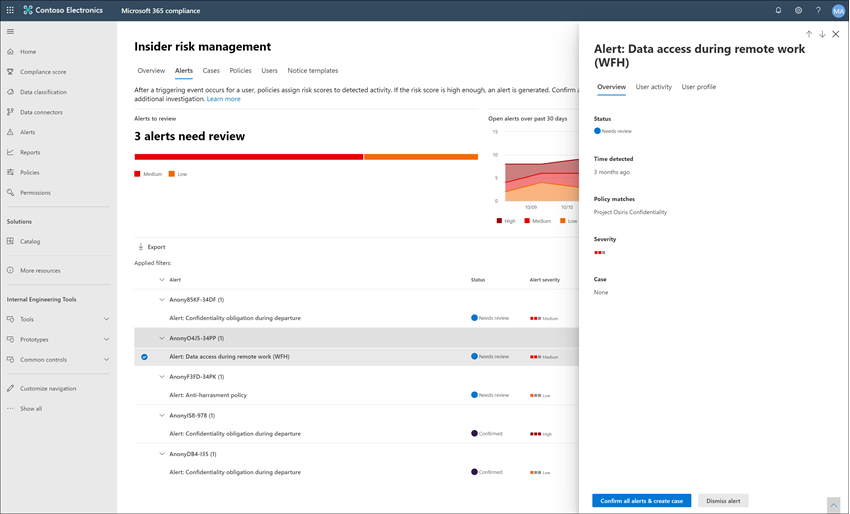

# Microsoft 365 での Insider リスク管理

Insider リスク管理は、組織内の悪意のある偶発的な活動を検出、調査、および行動できるようにすることによって、内部的なリスクを最小限に抑えるために役立つ Microsoft 365 のコンプライアンスソリューションです。 Insider のリスクポリシーにより、組織内で識別して検出するリスクの種類を定義できます。これには、ケースの操作やケースの拡大を含む、必要に応じた Microsoft Advanced eDiscovery へのエスカレーションが含まれます。 組織内のリスクアナリストは、ユーザーが組織のコンプライアンス標準に準拠していることを確認するために、適切なアクションを迅速に実行できます。

以下のビデオを参照して、組織の価値、文化、ユーザーの操作を優先する際に、組織がリスクを回避、検出、および格納する方法をどのように支援できるかについて説明します。
 
 
>[!VIDEO https://www.microsoft.com/videoplayer/embed/RE4j9CN]

## モダンリスクの問題点

組織内のリスクを管理して最小化するには、まずモダンワークプレースで見つかったリスクの種類を理解します。 一部のリスクは、直接管理外の外部イベントや要因によって影響を受けます。 その他のリスクは、組織内のイベントと、最小化および回避できるユーザーアクティビティによって実行されます。 例としては、組織内のユーザーによる不正な動作、不適切である、権限のない、非倫理的な動作、操作のリスクなどがあります。 これらの動作には、ユーザーからの広範な内部リスクが含まれています。

- 機密データとデータの流出のリーク
- 機密違反
- 知的所有権侵害
- 詐欺
- インサイダー取引
- 規制遵守違反

モダンワークプレースのユーザーは、さまざまなプラットフォームとサービス間でデータを作成、管理、共有することができます。 ほとんどの場合、組織には、ユーザーのプライバシー基準を満たす一方で、組織全体のリスクを特定して軽減するためのリソースとツールが制限されています。

Insider リスク管理では、完全なサービスとサードパーティの指標を使用して、リスクアクティビティを迅速に特定、トリアージ、および行動するための支援を提供しています。 Microsoft 365 および Microsoft Graph のログを使用することで、insider リスク管理では、リスク指標を識別する特定のポリシーを定義できます。 これらのポリシーを使用すると、危険なアクティビティを特定し、これらのリスクを軽減することができます。

Insider リスク管理は、次の原則を中心にしています。

- **透過性**: ユーザーのプライバシーと組織のリスクのバランスを設計し、プライバシーに関するアーキテクチャを使用します。
- **構成可能**なポリシー: 業界、地域、およびビジネスグループに基づく構成可能なポリシー。
- **統合**: Microsoft 365 コンプライアンスソリューション全体にわたる統合ワークフロー。
- **操作可能**: ユーザー通知、データ調査、ユーザー調査を有効にするための洞察を提供します。

## ワークフロー

Insider リスク管理ワークフローは、組織内の内部リスクを特定し、調査し、アクションを実行するのに役立つ情報を示します。 フォーカスポリシーテンプレートを使用して、Microsoft 365 サービスと警告およびケース管理ツールのアクティビティを包括的に通知することで、実用的な洞察を使用して、リスクの高い動作をすばやく識別し、操作することができます。

内部リスクアクティビティと Microsoft 365 のインサイダーリスク管理でのコンプライアンスの問題を特定、解決するには、次のワークフローを使用します。

### Policies

[内部のリスク管理ポリシー](insider-risk-management-policies.md) は、定義済みのテンプレートを使用して作成され、組織内で調査されるトリガーイベントとリスクインジケーターを定義するポリシー条件を使用して作成されます。 これらの条件には、通知に対してリスクインジケーターを使用する方法、ポリシーに含めるユーザー、優先度を指定するサービス、および監視期間を含めることが含まれます。

次の [ポリシーテンプレート] から選択して、insider リスク管理をすばやく開始することができます。

- [ユーザーが出発したデータの盗難](insider-risk-management-policies.md#data-theft-by-departing-users)
- [一般的なデータリーク](insider-risk-management-policies.md#general-data-leaks)
- [優先度の高いユーザーによるデータリーク (プレビュー)](insider-risk-management-policies.md#data-leaks-by-priority-users-preview)
- [不満のあるユーザーがデータをリークする (プレビュー)](insider-risk-management-policies.md#data-leaks-by-disgruntled-users-preview)
- [一般的なセキュリティポリシー違反 (プレビュー)](insider-risk-management-policies.md#general-security-policy-violations-preview)
- [ユーザーが出発するセキュリティポリシー違反 (プレビュー)](insider-risk-management-policies.md#security-policy-violations-by-departing-users-preview)
- [セキュリティポリシー違反 (優先度ユーザー別) (プレビュー)](insider-risk-management-policies.md#security-policy-violations-by-priority-users-preview)
- [不満のあるユーザーによるセキュリティポリシー違反 (プレビュー)](insider-risk-management-policies.md#security-policy-violations-by-disgruntled-users-preview)
- [メールの不快な言葉](insider-risk-management-policies.md#offensive-language-in-email)

### アラート

通知は、ポリシー条件に一致し、 [通知ダッシュボード](insider-risk-management-alerts.md)に表示されるリスクインジケーターによって自動的に生成されます。 このダッシュボードにより、確認が必要なすべてのアラート、時間の経過とともにアラートを開くこと、組織のアラート統計をすばやく表示できます。 既存の通知と、アクションを必要とする新しい通知の状態をすばやく識別できるように、すべてのポリシー通知が次の情報と共に表示されます。

- 状態
- 重要度
- 検出された時間
- ケース
- ケースの状態

### 度

調査を必要とする新しいユーザーアクティビティは、 *必要なレビュー* 状態を割り当てられた通知を自動的に生成します。 レビューアーは、これらのアラートをすばやく識別し、評価し、トリアージすることができます。

新しいケースを開いて、既存のケースに警告を割り当てるか、警告を無視すれば警告を解決できます。 アラートフィルターを使用すると、状態、重大度、検出された時間でアラートをすばやく簡単に識別できます。 トリアージプロセスの一環として、レビューアーは、ポリシーによって識別されたアクティビティの通知の詳細を表示したり、ポリシー一致に関連付けられたユーザーアクティビティを表示したり、アラートの重大度を確認したり、ユーザープロファイル情報を確認したりできます。

### 調査

このような場合には、アクティビティの詳細と、ポリシーの一致状況に関する詳細なレビューと調査が必要になるアラートに対して、[ケース](insider-risk-management-cases.md)が作成されます。 **ケースダッシュボード**には、すべてのアクティブなケース、長期間にわたるオープンケース、組織のケース統計がすべて表示されます。 レビュー担当者は、状態、ケースが開かれた日付、およびケースが最後に更新された日付によって、ケースをすばやくフィルター処理できます。

ケースダッシュボードでケースを選択すると、調査とレビューのためにケースが開きます。 この手順は、insider リスク管理ワークフローの心臓部です。 この領域には、リスクアクティビティ、ポリシー条件、アラートの詳細、およびユーザーの詳細がレビューアーの統合ビューに合成されます。 この分野の主な調査ツールは、次のとおりです。

- **ユーザーアクティビティ**: ユーザーアクティビティは、アクティブなグラフに自動的に表示されます。これにより、アクティビティは、現在または過去のリスクのアクティビティについて、時間とリスクレベルでプロットされます。 レビューアーは、ユーザーのリスク履歴全体をすばやくフィルター処理して表示したり、詳細について特定のアクティビティにドリルインしたりすることができます。
- **コンテンツエクスプローラー**: 通知アクティビティに関連付けられているすべてのデータファイルと電子メールメッセージは自動的にキャプチャされ、コンテンツエクスプローラーに表示されます。 レビューアーは、データソース、ファイルの種類、タグ、会話、およびその他の多くの属性によってファイルとメッセージをフィルター処理し、表示することができます。
- **ケースメモ**: レビューアーは、ケースメモセクションのケースに関するメモを提供できます。 このリストは、中央ビューのすべてのメモを統合し、レビュー担当者と提出日情報を含めます。

### アクション

ケースを調査した後、レビューアーは迅速に行動を取ることができ、組織内の他のリスク関係者と共同作業を行うことができます。 ユーザーが誤って、または誤ってポリシー条件を違反した場合、組織に合わせてカスタマイズできる通知テンプレートからユーザーに簡単な通知通知を送信できます。 これらの通知は簡単な通知として機能する場合もあれば、将来の危険な行動を防ぐためにトレーニングやガイダンスをリフレッシャーにしたい場合があります。 詳細については、「 [Insider リスク管理の通知テンプレート](insider-risk-management-notices.md)」を参照してください。

より深刻な状況では、内部のリスク管理ケース情報を組織内の他のレビュー担当者またはサービスと共有しなければならない場合があります。 Insider リスク管理は、エンドツーエンドのリスク解決に役立つ、他の Microsoft 365 コンプライアンスソリューションと緊密に統合されています。

- **高度な電子情報開示**: 調査のケースを拡大することで、Microsoft 365 の高度な電子情報開示へのケースのデータの転送と管理を行うことができます。 Advanced eDiscovery は、組織の内部および外部の調査に対応するコンテンツを保持、収集、確認、分析、エクスポートするためのエンド ツー エンドのワークフローを提供します。 これにより、法務チームは訴訟ホールド通知ワークフロー全体を管理できます。 Advanced eDiscovery の詳細については、「[Advanced eDiscovery in Microsoft 365の概要](overview-ediscovery-20.md)」を参照してください。
- **Servicenow (プレビュー)**: servicenow は、組織がエンタープライズ運用のデジタルワークフローを管理するのに役立つ、一般的なクラウドコンピューティングプラットフォームです。 Insider リスク管理は、ServiceNow サービスとのケース通知の共有をサポートしており、個々の insider のリスクケースに関連するインシデントおよび変更要求を作成することができます。 ServiceNow を使用したアラート情報の共有の詳細については、「ServiceNow を使用して [ケースを共有](insider-risk-management-cases.md#share-the-case)する」を参照してください。
- **Office 365 Management api の統合 (プレビュー)**: Insider リスク管理は、Office 365 管理 api を使用して、通知情報をセキュリティ情報およびイベント管理 (SIEM) サービスにエクスポートすることをサポートしています。 プラットフォームのアラート情報へのアクセスを許可する組織のリスクプロセスに最適な場合は、リスクアクティビティをより柔軟に行動できるようになります。 Office 365 管理 Api を使用した通知情報のエクスポートの詳細については、「 [Export alerts](insider-risk-management-settings.md#export-alerts-preview)」を参照してください。

## シナリオ

Insider リスク管理は、次の一般的なシナリオにおいて、組織内の内部リスクを軽減するための活動を検出、調査、および実行するのに役立ちます。

### ユーザーが出発したデータの盗難

ユーザーが自発的に、または解雇の結果として組織を離れる場合、多くの場合、会社、顧客、ユーザーデータが危険にさらされているという正当な懸念があります。 ユーザーは、プロジェクトデータが所有者ではないことや、会社のデータを個人の利益にして会社のポリシーや法律基準に違反していると考えることが innocently かもしれません。 ユーザーポリシーテンプレートに [よってデータが盗ま](insider-risk-management-policies.md#policy-templates) れたことを使用する Insider リスク管理ポリシーは、通常、この種の盗難に関連するアクティビティを自動的に検出します。 このポリシーを使用すると、ユーザーを出発して、適切な調査操作を行うことができるようになるため、データの盗難に関連する不審なアクティビティに関する警告を自動的に受信できます。 このポリシーテンプレートでは、組織用の [Microsoft 365 HR connector](import-hr-data.md) を構成する必要があります。

### 機密情報または機密情報の意図的または意図しないリーク

ほとんどの場合、ユーザーは機密情報または機密情報を適切に処理できるようにします。 しかし、ユーザーによっては、組織外で間違いや情報が誤って共有されたり、情報保護ポリシーに違反したりすることがあります。 その他の状況では、ユーザーが意図的にリークしたり機密情報を悪意のある情報と共有し、潜在的な個人の利益を得ることがあります。 次のデータリークポリシーテンプレートを使用して作成された Insider リスク管理ポリシーは、機密情報または機密情報の共有に通常関連付けられているアクティビティを自動的に検出します。

- [一般的なデータリーク](insider-risk-management-policies.md#general-data-leaks)
- [優先度の高いユーザーによるデータリーク (プレビュー)](insider-risk-management-policies.md#data-leaks-by-priority-users-preview)
- [不満のあるユーザーがデータをリークする (プレビュー)](insider-risk-management-policies.md#data-leaks-by-disgruntled-users-preview)

### 企業ポリシーに違反する不快な動作

ユーザー間の通信は、多くの場合、企業ポリシーに対する偶発的または悪意による違反の原因となります。 これらの違反には、ユーザー間の不快な言葉、脅威、嫌がらせを含めることができます。 この種類のアクティビティは、悪意のある作業環境に貢献し、ユーザーと大規模な組織の両方に対して法的な処置を行うことができます。 Insider リスク管理では、これらのリスクを最小限に抑えるために、新しい組み込みの Microsoft 365 分類子と、 [電子メールポリシーテンプレートの不快な言語](insider-risk-management-policies.md#offensive-language-in-email) を使用します。 このポリシーテンプレートを使用すると、組織内のこの種の動作を自動的に検出して警告するポリシーをすばやく構成し、有効にすることができます。

## 意図的または意図しないセキュリティポリシー違反 (プレビュー)

通常、ユーザーはモダンワークプレースでデバイスを管理するときに、非常に高いレベルの制御があります。 これには、業務の遂行に必要なアプリケーションをインストールまたはアンインストールするためのアクセス許可や、デバイスのセキュリティ機能を一時的に無効にする機能が含まれる場合があります。 このアクティビティが不注意、偶発的、または悪意のあるものであるかどうかにかかわらず、この操作によって組織のリスクが生じ、最小化を識別して実行することが重要になります。 これらのリスクのあるセキュリティアクティビティを識別するために、次の insider リスク管理セキュリティポリシー違反テンプレートは、セキュリティリスク指標をスコアし、Microsoft Defender Advanced Threat Protection (ATP) の警告を使用してセキュリティ関連のアクティビティを把握します。

- [一般的なセキュリティポリシー違反 (プレビュー)](insider-risk-management-policies.md#general-security-policy-violations-preview)
- [ユーザーが出発するセキュリティポリシー違反 (プレビュー)](insider-risk-management-policies.md#security-policy-violations-by-departing-users-preview)
- [セキュリティポリシー違反 (優先度ユーザー別) (プレビュー)](insider-risk-management-policies.md#security-policy-violations-by-priority-users-preview)
- [不満のあるユーザーによるセキュリティポリシー違反 (プレビュー)](insider-risk-management-policies.md#security-policy-violations-by-disgruntled-users-preview)

## 位置、アクセスレベル、またはリスク履歴に基づくユーザーのポリシー (プレビュー)

組織内のユーザーは、その位置、機密情報へのアクセスレベル、またはリスク履歴に応じて、さまざまなレベルのリスクを持つ場合があります。 これには、組織の経営幹部チーム、広範なデータおよびネットワークアクセス権限を持つ IT 管理者、またはリスクの高いアクティビティの過去の履歴を持つユーザーが含まれることがあります。 このような状況では、調査とクイックアクションに関する情報を表示するには、詳細な調査とより積極的なリスクの採点が重要です。 この種のユーザーの危険なアクティビティを特定するには、次のポリシーテンプレートを使用して、優先順位のユーザーグループを作成し、ポリシーを作成します。

- [セキュリティポリシー違反 (優先度ユーザー別) (プレビュー)](insider-risk-management-policies.md#security-policy-violations-by-priority-users-preview)
- [優先度の高いユーザーによるデータリーク (プレビュー)](insider-risk-management-policies.md#data-leaks-by-priority-users-preview)

## 不満のあるユーザーによるアクションと動作 (プレビュー)

雇用応力イベントは、insider のリスクに関連するいくつかの方法でユーザーの行動に影響を与える可能性があります。 これらの stressors は、パフォーマンスのレビュー、位置の降格、または業績評価計画のためにユーザーが配置されている可能性があります。 ほとんどのユーザーは、これらのイベントに対して故意に応答しませんが、これらの操作を行うと、一部のユーザーが通常の状況で通常は考慮しないアクションを実行する可能性があります。 これらの種類の危険なアクティビティを識別するために、次の insider リスク管理ポリシーテンプレートは、Microsoft 365 HR コネクタを使用し、雇用 stressor イベント付近に発生する可能性のある動作に関するスコアリングリスクインジケーターを開始します。

- [不満のあるユーザーがデータをリークする (プレビュー)](insider-risk-management-policies.md#data-leaks-by-disgruntled-users-preview)
- [不満のあるユーザーによるセキュリティポリシー違反 (プレビュー)](insider-risk-management-policies.md#security-policy-violations-by-disgruntled-users-preview)

## 始める準備はいいですか。

- 組織で insider リスク管理ポリシーを有効にするための準備方法については、「 [Plan for insider リスク管理](insider-risk-management-plan.md) 」を参照してください。
- Insider リスクポリシーのグローバル設定を構成するには、「 [insider リスク管理の設定の概要](insider-risk-management-settings.md) 」を参照してください。
- 前提条件を構成し、ポリシーを作成し、通知の受信を開始するには、「 [insider リスク管理の概要](insider-risk-management-configure.md) 」を参照してください。
