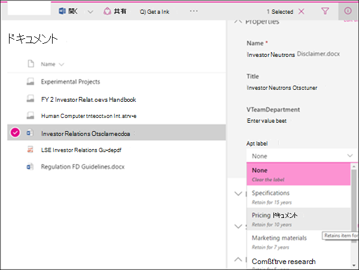

# 保持ラベルの詳細

>*[セキュリティとコンプライアンスのための Microsoft 365 ライセンス ガイダンス](https://aka.ms/ComplianceSD)。*

おそらく、組織全体では、業界の規制や社内のポリシーを遵守するためにさまざまアクションを実行する必要のある、多様な種類のコンテンツがあります。たとえば、次のようなものがあります。
  
- 最小限の期間、**保持する**必要のある税フォーム。 
    
- 一定の期間に到達した場合、**完全に削除する**必要があるプレス資料。 
    
- **保持**と**完全な削除**の両方が必要な競合他社のリサーチ。 
    
- 編集も削除もできないように、**レコードとしてマーク**する必要のある就労ビザ。 
    
これらのすべてのケースにおいて、保持ラベルは適切なコンテンツで適切な操作を実行するために役立ちます。保持ラベルを使用すると、ガバナンス用に組織全体のデータを分類し、その分類に基づいて保持ルールを強制できます。
  
保持ラベルを使用すると、次のことができます。
  
- Outlook on the web、Outlook 2010 以降、OneDrive、SharePoint、Microsoft 365 グループのコンテンツに、**組織内のユーザーが保持ラベルを手動で適用**できるようにします。多くの場合、コンテンツの種類を最も良く理解しているのはそれを扱っているユーザーです。そこでユーザーにコンテンツを分類し、適切なポリシーを適用してもらいます。 
    
- コンテンツに次のものが含まれている場合など、特定の条件に一致するときには、**保持ラベルをコンテンツに自動的に適用**できます。 
    
    - 特定の種類の機密情報。
    
    - 作成したクエリに一致する特定のキーワード。
    
    - トレーニング可能な分類子のパターン マッチ。
    
  保持ラベルを自動的にコンテンツに適用する機能が重要である理由は次のとおりです。
    
     - ユーザーのトレーニングは、一部の分類方法についてのみ必要。
    
     - ユーザーへの依存は、一部のコンテンツを正しく分類するためにのみ必要。
    
   - ユーザーはデータ ガバナンス ポリシーについて把握する必要がなくなり、仕事に集中できる。

- SharePoint の**ドキュメント ライブラリ、フォルダー、またはドキュメント セットに既定の保持ラベルを適用**することにより、この場所に保存するすべてのドキュメントに既定の保持ラベルが継承されるようになります。

さらに、保持ラベルは、Microsoft 365 アプリとサービス全体でのメールとドキュメントの[レコード管理](records-management.md)をサポートします。 保持ラベルを使用して、コンテンツをレコードとして分類できます。 この操作を行うと、ラベルを変更または削除することはできません。また、コンテンツを編集または削除することはできません。 

テナントでサポートされる保持ラベルの数に制限はありません。 ただし、10,000 はテナントでサポートされるポリシーの最大数であり、これらには、ラベルを適用するポリシー (保持ラベル ポリシーと自動適用アイテム保持ポリシー) とアイテム保持ポリシーが含まれます。

## 保持ラベル ポリシーでの保持ラベルのしくみ

組織内のユーザーが保持ラベルを使用できるようにして、コンテンツを分類できるようにするプロセスは 2 段階です。 

1. 保持ラベルを作成する

2. 保持ラベル ポリシーを使用して保持ラベルを発行する
  

  
保持ラベルは依存しない、再利用可能な文書パーツで、1 つ以上の保持ラベル ポリシーに含まれています。 保持ラベル ポリシーの主な目的は、保持ラベルのセットをグループ化して、ラベルを表示する場所を特定することです。
  

  
1. 保持ラベルを発行すると、保持ラベルは保持ラベル ポリシーに含まれるようになります。 保持ラベル名は変更することができないため、作成後に編集することはできません。

2. 1 つの保持ラベルは、複数の保持ラベル ポリシーに含めることができます。

3. また、1 つの場所は、複数の保持ラベル ポリシーに含めることができます。
    
3. 保持ラベル ポリシーは保持ラベルを発行する場所を指定します。
    
## 一度に 1 つの保持ラベルのみ

メールやドキュメントなどのコンテンツに一度に割り当てられる保持ラベルは 1 つのみです。これを知っておくことが重要です。
  
- エンド ユーザーが手動で割り当てた保持ラベルの場合、ユーザーは割り当てられている保持ラベルを削除または変更できます。
    
- コンテンツに自動適用ラベルが割り当てられている場合は、自動適用ラベルをエンド ユーザーが手動で割り当てた保持ラベルに置き換えることができます。
    
- コンテンツにエンド ユーザーが手動で割り当てた保持ラベルがある場合は、自動適用ラベルと手動で割り当てられた保持ラベルを置き換えることはできません。
    
- 自動適用ラベルを割り当てるルールが複数あり、コンテンツが複数のルールの条件を満たしている場合、最も古いルールの保持ラベルが割り当てられます。
    
保持ラベルが別の保持ラベルではなくどのように適用されるかを理解するには、ラベルを明示的に割り当てることと、ラベルを暗黙的に割り当てることの違いを理解することが役立ちます。

- 手動で割り当てられたラベルは明示的に割り当てられます
- 自動的に適用されるラベルは暗黙的に割り当てられます

明示的に割り当てられた保持ラベルは、暗黙的に割り当てられた保持ラベルよりも優先されます。 詳細については、このページの「[保持の原則または優先順位](#the-principles-of-retention-or-what-takes-precedence)」のセクションを参照してください。

## 保持ラベルのポリシーと場所

保持ラベルの内容に応じて、多様な種類の保持ラベルをさまざまな場所に発行できます。
  
|**保持ラベルの種類**|**ラベル ポリシーの適用先**|
|:-----|:-----|
|エンド ユーザーに発行されたラベル    |Exchange、SharePoint、OneDrive、Microsoft 365 グループ    |
|機密情報の種類に基づいて自動適用されたラベル    |Exchange (すべてのメールボックスのみ)、SharePoint、OneDrive    |
|クエリに基づいて自動適用されたラベル    |Exchange、SharePoint、OneDrive、Microsoft 365 グループ    |
   
Exchange の自動適用保持ラベル (クエリと機密情報の両方の種類) は、新しく送信されたメッセージ (送信中のデータ) のみに適用され、現在メールボックスにあるすべてのアイテム (保存中のデータ) には適用されません。 また、機密情報の種類の自動適用保持ラベルはすべてのメールボックスのみに適用でき、特定のメールボックスを選択することはできません。
  
Exchange パブリック フォルダー、Skype、および Teams チャネルのメッセージとチャットは、保持ラベルをサポートしていません。

## 保持ラベルによる強制保持のしくみ

保持ラベルは、保持ポリシーと同じ保持操作 (保持してから削除する、保持のみ、または削除のみ) を実施できます。 保持ラベルを使用して、さまざまな保持設定の特定のファイルを識別する高度なファイル プランを実装できます。 保持の仕組みに関する詳細情報は、「[アイテム保持ポリシーの詳細](retention-policies.md)」をご覧ください。

さらに、保持ラベルには 2 つの保持オプションがあります。これらのオプションは保持ラベルでのみ使用でき、アイテム保持ポリシーでは使用できません。保持ラベルを使用すると、次のことができます。
  
- 保持期間の終了時に処理の確認をトリガーすることができます。SharePoint および OneDrive のドキュメントは削除する前に、確認する必要があるからです。 詳細については、「[廃棄確認](disposition.md#disposition-reviews)」を参照してください。
    
- コンテンツの作成日または最終変更日時ではなく、コンテンツがラベル付けされた時点から保持期間を開始できます。 このオプションは、SharePoint サイトおよび OneDrive アカウントのコンテンツにのみ適用されます。 Exchange メールの場合、オプションのどれを選んだかを問わず、保持期間は常にメッセージが送受信された日付に基づきます。
    

もう 1 つの重要な違いは、SharePoint のファイルに保持ポリシーではなく保持ラベルを適用し、ラベルがコンテンツを保持するように構成されている場合、保持期間が適用されている間はユーザーがファイルを削除できないことです。 OneDrive のファイルとメールに同じラベルが適用されている場合、ラベルがコンテンツをレコードとしてマークしない限り、ユーザーはコンテンツを削除できます。

## 発行済みラベルをエンド ユーザー向けに表示できる場所

保持ラベルがエンド ユーザーによってコンテンツに割り当てられる場合、保持ラベルは次の場所に発行できます。
  
- Outlook および Outlook on the web
    
- OneDrive
    
- SharePoint
    
- Microsoft 365 グループ (Outlook on the web のグループ サイトとグループ メールボックスの両方)
    
次のセクションでは、さまざまなアプリで組織内のユーザーに対してラベルがどのように表示されるかを説明します。
  

### Outlook

Outlook デスクトップ クライアントでアイテムにラベルを付けるには、アイテムを選択します。 リボンの **[ホーム]** タブで、**[ポリシーの割り当て]** をクリックし、保持ラベルを選択します。 
  
![[ポリシーの割り当て] ボタン](../media/30684dea-dd73-4e4a-9185-8e29f403b6ca.png)
  
アイテムを右クリックし、コンテキスト メニューの **[ポリシーの割り当て]** をクリックし、保持ラベルを選択することもできます。 

保持ラベルを適用すると、アイテムの上部でその保持ラベルとラベルで行える操作が表示されます。 保持期間が関連付けられている保持ラベルがメールに含まれている場合は、メールの有効期間を一目で確認できます。
  
保持ラベルはフォルダーに適用することもできます。その場合は次のようになります。
  
- フォルダー内のすべてのアイテムは、同じ保持ラベルを自動的に取得します。ただし、明示的に保持ラベルが適用されたアイテムは**除きます**。 明示的にラベルが付いたアイテムは、既存の保持ラベルを保持します。 詳細については、下記の[保持の原則または優先順位](#the-principles-of-retention-or-what-takes-precedence)を参照してください。 
    
- フォルダーの既定の保持ラベルを変更または削除すると、保持ラベルが明示的に割り当てられているアイテムを**除き**、フォルダー内にあるすべてのアイテムの保持ラベルも変更または削除されます。 
    
- 既定の保持ラベルを持つアイテムをあるフォルダーから異なる既定の保持ラベルを持つ別のフォルダーに移動すると、そのアイテムには新しい既定の保持ラベルが設定されます。
    
- 既定の保持ラベルを持つアイテムをあるフォルダーから既定の保持ラベルがない別のフォルダーに移動すると、以前の既定の保持ラベルが削除されます。

### Outlook on the web

Outlook on the web でアイテムにラベルを付けるには、アイテム \>**[ポリシーの割り当て]**\> の順に右クリックして、保持ラベルを選択します。 
  
![Outlook on the web の [ポリシーの割り当て] メニュー](../media/146a23cf-e478-4595-b2e8-f707fc4e6ea3.png)
  
保持ラベルが適用されると、アイテムの上部にその保持ラベルとラベルが実行するアクションが表示されます。メールが分類され、保持期間が関連付けられている場合、メールの有効期限が一目でわかります。
  

  
Outlook on the web と同様に、保持ラベルはフォルダーに適用することもできます。 

### OneDrive と SharePoint

OneDrive または SharePoint でドキュメント (OneNote ファイルを含む) にラベルを付けるには、右上隅のアイテム \> を選択し、[**詳細ウィンドウを開く**]  \> [**保持ラベルを適用**] \> の順に移動し保持ラベルを選択します。 
  
フォルダーまたはドキュメントのセットに保持ラベルを適用することもできます。また、[ドキュメント ライブラリに対して既定の保持ラベル](#applying-a-default-retention-label-to-all-content-in-a-sharepoint-library-folder-or-document-set)を設定できます。
  

  
アイテムに保持ラベルが適用されると、そのアイテムの選択時に、詳細ウィンドウにラベルを表示できます。
  

  
OneDrive ではなく SharePoint の場合、[**ラベル**] 列または [**レコードとして登録されているアイテム**] 列を含むライブラリのビューを作成できます。 このビューでは、すべてのアイテムに割り当てられている保持ラベルと、レコードであるアイテムを一目で確認できます。 ただし、[**レコードとして登録されているアイテム**] 列でビューをフィルター処理することはできません。 列を追加する方法については、「[リストまたはライブラリの列の表示/非表示を切り替える](https://support.microsoft.com/ja-JP/office/show-or-hide-columns-in-a-list-or-library-b820db0d-9e3e-4ff9-8b8b-0b2dbefa87e2)」をご覧ください。

### Microsoft 365 グループ

保持ラベルを Microsoft 365 グループ ([以前の Office 365 グループ](https://techcommunity.microsoft.com/t5/microsoft-365-blog/office-365-groups-will-become-microsoft-365-groups/ba-p/1303601)) に発行すると、保持ラベルはグループ サイトと Outlook on the web のグループ メールボックスの両方に表示されます。 保持ラベルをコンテンツに適用する操作は、メールやドキュメントの操作と似ています。

Microsoft 365 グループのコンテンツを保持するには、**Office 365 グループ**の場所を使用する必要があります。 Microsoft 365 グループには Exchange メールボックスがありますが、Exchange の場所全体が含まれるアイテム保持ポリシーには、Microsoft 365 グループのメールボックスのコンテンツは含まれません。

また、Exchange の場所を使用して特定のグループ メールボックスを含めたり除外したりすることはできません。 最初は Exchange の場所でグループ メールボックスを選択できますが、アイテム保持ポリシーを保存しようとすると、Exchange の場所では "RemoteGroupMailbox" を選択できないことを示すエラーを受け取ります。
  
まず、アプリやその他のサービスで使用する秘密度ラベルを作成し、構成します。 たとえば、ユーザーに表示して Office アプリから適用するラベルです。 

次に、構成するラベルとポリシー設定を含む 1 つ以上のラベル ポリシーを作成します。 このラベル ポリシーで、選択したユーザーと場所のラベルと設定を発行します。

## 条件に基づいた保持ラベルの自動適用

保持ラベルの最も強力な機能の 1 つは、特定の条件に一致したコンテンツに自動的にラベルを適用することです。 この場合、組織内のユーザーが保持ラベルを適用する必要はありません。 Microsoft 365 が行います。
  

  
自動適用アイテム保持ラベルが強力な機能である理由は次のとおりです。
  
- ユーザーのトレーニングは、一部の分類方法についてのみ必要。
    
- ユーザーへの依存は、一部のコンテンツを正しく分類するためにのみ必要。
    
- ユーザーはデータ ガバナンス ポリシーについて把握する必要がなくなるので、仕事に集中できる。
    
コンテンツに次の内容が含まれている場合は、保持ラベルを自動的にコンテンツに適用するように選択できます。
  
- [特定の種類の機密情報](create-retention-labels.md#auto-apply-labels-to-content-with-specific-types-of-sensitive-information)
    
- [作成したクエリに一致する特定のキーワード](create-retention-labels.md#auto-apply-labels-to-content-with-keywords-or-searchable-properties)

- [トレーニング可能な分類子の一致](create-retention-labels.md#auto-apply-labels-to-content-by-using-trainable-classifiers)
    
![自動適用ラベルの [条件選択] ページ](../media/classifier-pre-trained-apply-label-match-trainable-classifier.png)

> [!TIP]
> SharePont の管理プロパティを使用して保持ラベルを自動適用し、イベント ドリブンの保持を実装する詳細なシナリオについては、「[保持ラベルを使用して SharePoint ドキュメントのライフサイクルを管理する](auto-apply-retention-labels-scenario.md)」を参照してください。

## SharePoint ライブラリ、フォルダー、またはドキュメント セット内のすべてのコンテンツへの既定の保持ラベルの適用

個々のドキュメントにユーザーが保持ラベルを適用できるようにするだけでなく、既定の保持ラベルを SharePoint ライブラリ、フォルダー、またはドキュメント セットに適用して、その場所にあるすべてのドキュメントに既定の保持ラベルを設定することもできます。
  
ドキュメント ライブラリの場合、この操作はドキュメント ライブラリの **[ライブラリの設定]** ページで行います。 既定の保持ラベルを選択すると、ライブラリにある既存のアイテムにも適用するか選択できます。 
  
たとえば、マーケティング資料用のタグがあり、特定のドキュメント ライブラリにその種類のコンテンツだけが含まれていることがわかっている場合は、[マーケティング資料] タグをそのライブラリ内にあるすべてのドキュメントの既定に設定できます。
  

  
ライブラリ、フォルダー、またはドキュメント セット内にある既存のアイテムに既定の保持ラベルを適用すると、次のようになります。
  
- ただし、明示的に保持ラベルが適用されているアイテム (レコードなど) を**除き**、ライブラリ、フォルダー、またはドキュメント セット内のすべてのアイテムには自動的に同じ保持ラベルが付けられます。 明示的にラベルが付いたアイテムは、既存のラベルを保持します。 詳細については、下記の[保持の原則または優先順位](#the-principles-of-retention-or-what-takes-precedence)を参照してください。
    
- ライブラリ、フォルダー、またはドキュメント セットの既定の保持ラベルを変更または削除すると、明示的な保持ラベルを持つアイテム (レコードなど) を**除き**、ライブラリ、フォルダー、またはドキュメント セット内にあるすべてのアイテムの保持ラベルも変更または削除されます。
    
- 既定の保持ラベルを持つアイテムをあるサイト コレクション、ライブラリ、フォルダー、またはドキュメント セットから別のサイト コレクション、ライブラリ、フォルダー、または異なるラベルを持つドキュメント セットに移動すると、新しい場所に別の既定の保持ラベルが設定されていても、アイテムは既存の既定の保持ラベルを維持します。 アイテムの移動前にラベルが付いていない場合は、新しい場所の既定の保持ラベルが付けられます。

**レコード:** ライブラリ、フォルダー、またはドキュメント セットに既定のレコード ラベルを適用すると、それらの場所内のすべての項目にレコード ラベルが適用されます。 新しいアイテムをレコード ラベルが付けられている場所に移動すると、そのアイテムにはレコード ラベルが付けられます。 ただし、既定の保持ラベルを、コンテンツをレコードとして宣言しないラベルに変更した場合、このアクションによりレコード ラベルが個々のアイテムから削除されることはありません。これらのアイテムでは、レコード ラベルが保持されます。 レコード アイテムの保持ラベルを明示的に削除または変更できるのは、サイト コレクションの管理者のみです。

コンテンツをレコードとして宣言する保持ラベルの詳細については、「[レコードの詳細](records.md)」を参照してください。

## ルールを使用したメールへの保持ラベルの適用

Outlook では、保持ラベルまたはアイテム保持ポリシーを適用するためのルールを作成できます。
  
たとえば、特定の配布グループとの間で送受信されるすべてのメッセージに対して特定の保持ラベルを適用するルールを作成できます。
  
ルールを作成するには、アイテム \>**[ルール]**\>**[ルールの作成]**\>**[高度なオプション]**\>**[ルール ウィザード]**\>**[アイテム保持ポリシーの適用]** の順に右クリックします。
  

  
## アクションを適用しないコンテンツの分類

保持ラベルを作成するときに、保持機能や他のアクションを有効にせずに、コンテンツを分類することができます。 この場合、テキスト ラベルとして保持ラベルを使用するだけで、他のアクションを適用する必要はありません。
  
たとえば、アクションを適用せずに「後で確認」という名前の保持ラベルを作成して、機密情報の種類を持つコンテンツまたはクエリの対象となるコンテンツにその保持ラベルを自動的に適用することができます。
  

  
## レコード管理用の保持ラベルの使用
    
保持ラベルを使用して、コンテンツをレコードとして宣言できます。 これにより、1 つの一貫したレコード管理戦略を Microsoft 365 全体に実装できます。 詳細については、「[レコードの詳細](records.md)」を参照してください。
  
## DLP ポリシーでの条件としての保持ラベルの使用

保持ラベルはコンテンツに対して保持アクションを強制できます。また、保持ラベルをデータ損失防止 (DLP) ポリシーで条件として使用できます。DLP ポリシーは特定のラベルを含むコンテンツに対して、アクセスを制限するなどの他のアクションを強制できます。 
  
詳細については、「[DLP ポリシーにおける条件としての保持ラベルの使用](data-loss-prevention-policies.md#using-a-retention-label-as-a-condition-in-a-dlp-policy)」を参照してください。
  

## 保持の原則、すなわち優先順位について

コンテンツには複数のアイテム保持ポリシーが適用され、各ポリシーに異なるアクション (保持または削除、あるいはその両方) と保持期間が設定されている場合が多くあります。どれが優先されるのでしょうか? 概ね、あるポリシーで保持されているコンテンツを別のポリシーで完全に削除することはできないので、ご安心ください。
  

  
保持アクションが設定されたさまざまなラベルがコンテンツにどのように適用されているかを理解するには、次の保持の原則に注意してください。
  
1. **保持の削除が優先されます。** あるアイテム保持ポリシーで 3 年後に Exchange メールを削除するように設定され、別のアイテム保持ポリシーでは Exchange メールを 5 年間保持してから削除するように設定されているとします。この場合、3 年を経過したコンテンツはすべて削除され、ユーザーには表示されなくなりますが、コンテンツは完全に削除される 5 年を経過するまで、回復可能なアイテム フォルダーに保持されます。 
    
2. **最長の保持期間が優先されます。** コンテンツを保持する複数のポリシーの対象となるコンテンツは、最長の保持期間が終了するまで保持されます。 
    
3. **明示的な包含は暗黙的な包含に優先します。** これは次を意味します。 
    
    1. Exchange メールや OneDrive ドキュメントなど、ユーザーが保持設定の保持ラベルを手動でアイテムに割り当てた場合、サイトまたはメールボックス レベルで割り当てたポリシーや、ドキュメント ライブラリで割り当てた既定の保持ラベルよりも、手動で割り当てたラベルが優先されます。 たとえば、明示的な保持ラベルでは 10 年間保持し、サイトに割り当てたアイテム保持ポリシーでは 5 年間のみ保持する場合、明示的な保持ラベルが優先されます。 自動適用の保持ラベルは、Microsoft 365 によって自動的に適用されるため、明示的ではなく、暗黙的とされます。
    
    2. アイテム保持ポリシーに特定のユーザーのメールボックスまたは OneDrive のアカウントなどの特定の場所が含まれている場合、そのポリシーは、すべてのユーザーのメールボックスまたは OneDrive のアカウントに適用されるが、そのユーザーのメールボックスを特に含まない別の保持ポリシーよりも優先されます。
    
4. **最短の削除期間が優先されます。** 同様に、コンテンツを削除する複数のポリシー (保持なし) の対象となるコンテンツは、最短保持期間の終了時に削除されます。 
    
保持の原則は上位から下位のタイブレーク フローとして機能することを理解します。すべてのポリシーまたはラベルによって適用された複数のルールがあるレベルで同じ場合、フローは次の下位レベルに移動し、ルールが適用される優先順位を決定します。
  
最後に、アイテム保持ポリシーや保持ラベルは、電子情報開示のために保持しているコンテンツを完全に削除することはできません。 保持対象からリリースされると、コンテンツは再び上記で説明したクリーンアップ処理の対象になります。

### トレーニング可能な分類子による自動ラベル付けの優先順位

トレーニング可能な分類子用に構成されているすべての保持ラベルに対しては、評価が同時に行われます。 アイテムが複数のトレーニング可能な分類子によって検出された場合、次の基準に基づいて、適用する保持ラベルを決定します。

1. 保持のみまたは保持してから削除するように構成された保持ラベルは、削除のみに構成された保持ラベルよりも優先されます。

2. 保持のみまたは保持してから削除するように構成されている保持ラベルの場合、最長の保持期間で構成されている保持ラベルが優先されます。

3. 削除のみに構成されている保持ラベルの場合、最短期間で構成されている保持ラベルが優先されます。

4. ラベルのアクションと期間が同じだけでは、優先されるラベルが決定されません。

## 保持ラベルの監視

保持ラベルを発行または自動適用した後、意図したとおりにラベルがコンテンツに適用されていることを確認する必要があります。 保持ラベルを監視するには:
  
- **ラベル アクティビティのエクスプローラー**。 エクスプローラー (次の画像の例) では、過去 30 日間の SharePoint および OneDrive のすべてのコンテンツの保持ラベル アクティビティをすばやく検索して表示することができます。 詳細については、「[View label activity for documents](view-label-activity-for-documents.md)」 (ドキュメントのラベル アクティビティを表示する) を参照してください。

- **[ラベル分析]** ページ。 Microsoft 365 コンプライアンス センターと Microsoft 365 セキュリティ センターでは、上位の保持ラベルとその適用対象を簡単に表示できます。 特定の保持ラベルを持つすべてのコンテンツを表示することもできます。 詳細については、「[ラベル分析でラベルの使用状況を表示する](label-analytics.md)」を参照してください。
    
- **データ ガバナンスのレポート**。 このレポートでは、過去 90 日間の Exchange、SharePoint および OneDrive のすべてのコンテンツの保持ラベル トレンドとアクティビティをすばやく表示することができます。 詳細については、「[データ ガバナンスのレポートを表示する](view-the-data-governance-reports.md)」を参照してください。
    

## コンテンツ検索を使用した特定の保持ラベルが適用されたすべてのコンテンツの検索

ユーザーまたは自動適用によって保持ラベルがコンテンツに割り当てられた後、コンテンツ検索を使用して、特定の保持ラベルで分類されているすべてのコンテンツを検索することができます。
  
コンテンツの検索を作成するとき、**コンプライアンス タグ**条件を選択し、完全な保持ラベル名を入力するか、ラベル名の一部を入力してワイルドカードを使用します。 詳細については、「[コンテンツ検索のキーワード クエリと検索条件](keyword-queries-and-search-conditions.md)」を参照してください。
  
![[コンプライアンス タグ] 条件](../media/82d6af16-59f8-462f-babb-c894b2917018.png)
  
## 古い機能の代わりとしての保持ラベルの使用

組織全体や、Exchange、SharePoint、OneDrive、Microsoft 365 グループなどの Microsoft 365 全体のコンテンツに保持ラベルを簡単に提供できます。 Microsoft 365 内のコンテンツを保持、または削除、または Microsoft 365 内のレコードを管理する必要がある場合、保持ラベルの使用をお勧めします。
  
Microsoft 365 内のコンテンツを保持または削除、または Microsoft 365 内のレコードを管理するために以前使用されていた別の機能がいくつかあります。 これらの機能は引き続き保持ラベルと並行して機能します。 保持ラベルの実装が以前の機能とは異なるインスタンスがありますが、保持ラベルが進化したことで、Microsoft 365 全体でのレコード管理が今後、改善される予定です。 そのため、データ ガバナンスの場合、次の古い機能の代わりに保持ラベルを使用することをお勧めします。
  
### Exchange Online

- [メッセージング レコード管理 (MRM)](https://go.microsoft.com/fwlink/?linkid=846126) とも呼ばれる、[保持タグおよびアイテム保持ポリシー](https://go.microsoft.com/fwlink/?linkid=846125) (削除のみ) 
    
### SharePoint および OneDrive

- [インプレース レコード管理の構成](https://support.office.com/article/7707a878-780c-4be6-9cb0-9718ecde050a) (保持) 
    
- [レコード センターの概要](https://support.office.com/article/bae6ca5a-7b19-40e0-b433-e3613a747c2c) (保持) 
    
- [情報管理ポリシー](intro-to-info-mgmt-policies.md) (削除のみ) 
    

