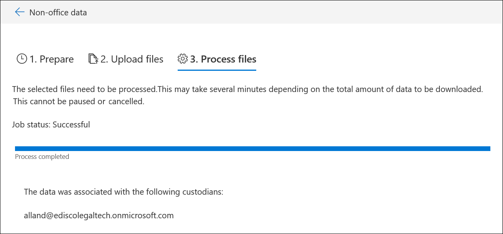

# Microsoft 以外の365データを証拠に読み込むLoad non-Microsoft 365 data into evidence

データ調査で分析する必要があるすべてのドキュメントが Microsoft 365 にあるわけではありません。Not all documents that you may need to analyze in a data investigation will be located in Microsoft 365. Microsoft 以外の365コンテンツインポート機能を使用すると、Microsoft 365 に存在しないドキュメントをデータ調査で分析できるように、証拠としてアップロードすることができます。With the Non-Microsoft 365 content import feature you can upload documents that don't live in Microsoft 365 into evidence so they can be analyzed in a data investigation.

## Office 以外の365コンテンツをアップロードするための要件Requirements to upload non-Office 365 content

この手順の説明に従って Microsoft 以外の365機能をアップロードするには、次の条件を持っている必要があります。Using the upload Non-Microsoft 365 feature as described in this procedure requires that you have:

- Microsoft 365 または Office 365 E5 サブスクリプション。A Microsoft 365 or Office 365 E5 subscription.

- Microsoft 以外の365のコンテンツをアップロードする対象となるすべてのユーザーには、適切な E5 または E5 アドオンライセンスが必要です。All people of interest whose non-Microsoft 365 content will be uploaded must have the appropriate E5 or E5 add-on license.

- 既存の電子情報開示ケース。An existing eDiscovery case.

- 収集されたすべてのファイルは、保管担当者ごとにフォルダーが1つ存在し、フォルダーの名前がこの形式*alias@domainname*であるフォルダーにアップロードされます。All the files for uploading gathered into folders where there is one folder per custodian and the folders' name is in this format *alias@domainname*. *Alias@domainname*は、ユーザーのエイリアスおよびドメインである必要があります。The *alias@domainname* must be user's alias and domain. すべての*alias@domainname*フォルダーをルートフォルダーに収集できます。You can collect all the *alias@domainname* folders into a root folder. ルートフォルダーに含めることができるのは*alias@domainname*フォルダーのみで、ルートフォルダーには圧縮されていないファイルは存在しない必要があります。The root folder can only contain the *alias@domainname* folders, there must be no loose files in the root folder.

- 電子情報開示の管理者または電子情報開示管理者のいずれかであるアカウントで、Microsoft 以外の365のコンテンツフォルダー構造にアクセスできるコンピューターにインストールされている。An account that is either an eDiscovery Manager or eDiscovery Administrator Microsoft Azure Storage Tools installed on a computer that has access to the non-Microsoft 365 content folder structure.

- AzCopy をインストールします。これは、 [AzCopy を使用して作業を開始](https://docs.microsoft.com/azure/storage/common/storage-use-azcopy)することで実現できます。Install AzCopy, which you can do from [Get started with AzCopy](https://docs.microsoft.com/azure/storage/common/storage-use-azcopy).

## Microsoft 以外の365コンテンツをデータ調査にアップロードするUpload non-Microsoft 365 content in to a data investigation

1. **データ調査**を開いて、Microsoft 以外の365データがアップロードされることを調査します。Open **Data Investigations** and go to the investigation that the non-Microsoft 365 data will be uploaded to.  [**エビデンス**] タブをクリックし、データを読み込む証拠セットを選択します。Click the **Evidence** tab, then select the evidence set you wish to load the data to.  証拠セットをまだ作成していない場合は、ここで作成できます。If you have not already created an evidence set, you can do so now.  最後に、[**証明の管理**] をクリックし、[データ] セクションで [アップロード] を**表示**します。Finally, click **Manage evidence** then **View uploads** in the data section

2. [**ファイルのアップロード**] ボタンをクリックして、Microsoft 以外の365データインポートウィザードを起動します。Click the **Upload files** button to start the Non-Microsoft 365 data import wizard.

3. ウィザードの最初の手順では、ファイルをアップロードするために、セキュリティで保護された Azure blob を準備するだけです。The first step in the wizard simply prepares a secure Azure blob for the files to be uploaded.  準備が完了したら、[**次へ: ファイルのアップロード**] ボタンをクリックします。After the preparation is complete, click the **Next: Upload files** button.

 
4. [**ファイルのアップロード**] ステップで、**ファイルの場所へのパス**を指定します。この場合、インポートする予定の Microsoft 以外の365データが配置されます。In the **Upload files** step, specify the **Path to location of files**, this is where the Non-Microsoft 365 data you plan on importing is located.  正しい場所を設定することにより、AzCopy コマンドが正しく更新されます。Setting the correct location ensures the AzCopy command is properly updated.

> [!NOTE]
> AzCopy をまだインストールしていない場合は、ここから実行できます。https://docs.microsoft.com/azure/storage/common/storage-use-azcopyIf you have not already installed AzCopy, you can do this from here: https://docs.microsoft.com/azure/storage/common/storage-use-azcopy

5. [**クリップボードにコピー** ] リンクをクリックして、定義済みのコマンドをコピーします。Copy the predefined command by clicking the **Copy to clipboard** link. Windows コマンドプロンプトを起動し、コマンドを貼り付けて、enter キーを押します。Start a windows command prompt, paste the command and press enter.  ファイルは、次の手順のために secure Azure blob ストレージにアップロードされます。The files will be uploaded to the secure Azure blob storage for the next step.

6. 最後に、[セキュリティ & コンプライアンスに戻し、[**次へ: ファイルの処理**] ボタンをクリックします。Finally, return back to the Security & Compliance and click the **Next: Process files** button.  これにより、アップロードされたファイルの処理、テキストの抽出、およびインデックス作成が開始されます。This initiates processing, text extraction, and indexing of the uploaded files.  処理の進行状況を追跡するには、[**ジョブ**] タブを使用します。 完了すると、新しいファイルが証拠セットで利用できるようになります。You can track the progress of processing here or in the **Jobs** tab.  Once completed, the new files are available in the evidence set.  処理が完了したら、ウィザードを閉じることができます。After processing is complete, you can dismiss the wizard.

