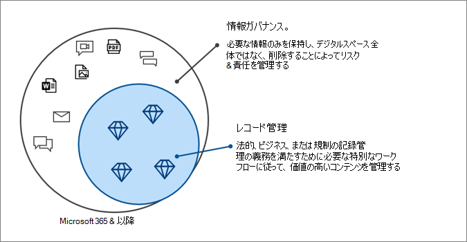

# Microsoft 365 の microsoft Information ガバナンスMicrosoft Information Governance in Microsoft 365

>*[セキュリティとコンプライアンスのための Microsoft 365 ライセンス ガイダンス](https://aka.ms/ComplianceSD)。**[Microsoft 365 licensing guidance for security & compliance](https://aka.ms/ComplianceSD).*

コンプライアンスまたは規制の要件に合わせてデータを管理するには、Microsoft Information ガバナンス (場合によっては MIG に短縮されることもあります) 機能を使用します。Use Microsoft Information Governance (sometimes abbreviated to MIG) capabilities to govern your data for compliance or regulatory requirements.

データを保護することをお勧めします。Looking to protect your data? Microsoft [365 の Microsoft Information Protection を](protect-information.md)参照してください。See [Microsoft Information Protection in Microsoft 365](protect-information.md).

## 情報ガバナンスInformation governance

必要な情報を保持して、不要なものを削除するには、次のようにします。To keep what you need and delete what you don't:
 
|機能Capability|どのような問題が解決されますか。What problems does it solve?|はじめにGet started|
|:------|:------------|:--------------------|:-----------------------------|
|[アイテム保持ポリシーと保持ラベルRetention policies and retention labels](retention.md)| メール、ドキュメント、インスタントメッセージなどのポリシー管理と削除ワークフローを使用してコンテンツを保持または削除するRetain or delete content with policy management and a deletion workflow for email, documents, instant messages, and more   シナリオ例: [アイテム保持ラベルを自動的にコンテンツに適用する](apply-retention-labels-automatically.md)Example scenario: [Apply a retention label to content automatically](apply-retention-labels-automatically.md) | [アイテム保持ポリシーおよび保持ラベルの使用を開始するGet started with retention policies and retention labels](get-started-with-retention.md)|
|[サービスのインポートImport service](importing-pst-files-to-office-365.md)| Exchange Online メールボックスへの PST ファイルの一括インポート、コンプライアンスまたは規制の要件を満たすために電子メールメッセージを保持および検索するBulk-import PST files to Exchange Online mailboxes to retain and search email messages for compliance or regulatory requirements | [ネットワーク アップロードを使用して、組織の PST ファイルを Microsoft 365 にインポートするUse network upload to import your organization's PST files to Microsoft 365](use-network-upload-to-import-pst-files.md)|
|[サード パーティのデータをアーカイブするArchive third-party data](archiving-third-party-data.md)| ソーシャルメディアプラットフォーム、インスタントメッセージングプラットフォーム、およびドキュメントコラボレーションプラットフォームから、コンプライアンスソリューションをサードパーティのデータにインポート、アーカイブ、および適用します。Import, archive, and apply compliance solutions to third-party data from social media platforms, instant messaging platforms, and document collaboration platforms| [サードパーティコネクタThird-party connectors](archiving-third-party-data.md#third-party-data-connectors)|
|[非アクティブなメールボックスInactive mailboxes](inactive-mailboxes-in-office-365.md)| 従業員が組織を離れた後にメールボックスの内容を保持するRetain mailbox content after employees leave the organization | [非アクティブなメールボックスを作成および管理するCreate and manage inactive mailboxes](create-and-manage-inactive-mailboxes.md)|

## レコード管理Records management

法律、ビジネス、または規制の義務に関する価値の高いコンテンツを管理するには、次のようにします。To manage high-value content for legal, business, or regulatory obligations:

|機能Capability|どのような問題が解決されますか。What problems does it solve?|はじめにGet started|
|:------|:------------|---------------------|:----------------------------|
|[レコード管理Records management](records-management.md)| 保存スケジュールと要件を含む電子メールおよびドキュメント用の単一のソリューション。レコード宣言、保持、および廃棄によるコンテンツの完全なライフサイクルをサポートするファイルプランA single solution for email and documents that incorporates retention schedules and requirements into a file plan that supports the full lifecycle of your content with records declaration, retention, and disposition   シナリオ例: [レコードの廃棄](disposition.md#disposition-of-records)Example scenario: [Disposition of records](disposition.md#disposition-of-records)|[レコード管理の使用を開始するGet started with records management](get-started-with-records-management.md) |

