# Microsoft コンプライアンス マネージャー (クラシック)

> [!NOTE]
> このドキュメントでは、この製品の以前のバージョンついて説明します。 ユーザーは、*このバージョンのコンプライアンス マネージャーを使用しないことを強くお勧めします*。 **コンプライアンス ネージャーの現在のプレビュー バージョンを使用している場合は、[コンプライアンス マネージャー (プレビュー) のドキュメント](working-with-compliance-manager.md)を参照してください。**

 *コンプライアンス マネージャーは、21Vianet が運用している Office 365、Office 365 Germany、Office 365 U.S. Government Community High (GCC High)、Office 365 Department of Defense では使用できません。*
  
コンプライアンス マネージャーは、当社の [Microsoft Service Trust Portal](https://docs.microsoft.com/microsoft-365/compliance/get-started-with-service-trust-portal) に記載されているワークフローベースのリスク評価ツールです。コンプライアンス マネージャーを使用すると、Microsoft Office 365、Microsoft Dynamics 365、Microsoft Azure などの Microsoft プロフェッショナル サービスや Microsoft クラウド サービスに関連する組織の規制遵守活動の追跡、割り当て、検証を行うことができます。 

コンプライアンス マネージャーには、次のような機能があります。
  
- ISO 27001、ISO 27018、NIST などの各種の標準に対する、サード パーティからの Microsoft クラウド サービスのさまざまな監査の一環として、マイクロソフトが監査担当者および規制機関に提供する詳細情報と、マイクロソフトが HIPAA や EU の一般データ保護規制 (GDPR) などの規制遵守のために内部で編集する情報を組み合わせます。内部で編集する情報には、組織が標準と規制に遵守しているかどうかについてのユーザーの自己評価も含めます。
    
- コンプライアンスと評価に関連するアクティビティの割り当て、追跡、記録をできるようにします。チーム間の障壁が少なくなり、組織のコンプライアンスの目標を達成しやすくなります。
    
- コンプライアンス スコアを使用することができます。組織の進行状況を追跡し、監査コントロールに優先順位を付けることができ、組織が危険にさらされにくくなります。
    
- コンプライアンス アクティビティに関連する証拠と他の成果物のアップロードおよび管理を行うためのリポジトリがセキュリティで保護されます。
    
- マイクロソフトと組織が実施するコンプライアンス アクティビティに関する豊富な詳細レポートを Microsoft Excel 形式で作成します。それらのレポートは、監査担当者、規制機関、その他のコンプライアンス関係者に提供することができます。

コンプライアンス マネージャーの簡単なデモについては、こちらの「[コンプライアンス マネージャー](https://www.youtube.com/watch?v=r1vs8NdSXKQ)」ビデオをご覧ください。

    
> [!IMPORTANT]
> Compliance Manager is a dashboard that provides a summary of your data protection and compliance stature and recommendations to improve data protection and compliance. The Customer Actions provided in Compliance Manager are recommendations; it is up to each organization to evaluate the effectiveness of these recommendations in their respective regulatory environment prior to implementation. Recommendations found in Compliance Manager should not be interpreted as a guarantee of compliance.

    
## コンプライアンス マネージャーとは?

Compliance Manager is a workflow-based risk assessment tool designed to help you manage regulatory compliance within the shared responsibility model of the cloud. Compliance Manager provides you with a dashboard view of standards and regulations and assessments that contain Microsoft's control implementation details and test results and customer control implementation guidance and tracking for your organization to enter. Compliance Manager provides certification assessment control definitions, guidance on implementation and testing of controls, risk-weighted scoring of controls, role-based access management, and an in-place control action assignment workflow to track control implementation, testing status and evidence management. Compliance Manager optimizes compliance workload by enabling customers to logically group assessments together and apply assessment control testing to identical or related controls, reducing the duplication of effort that might otherwise be required to satisfy identical control requirements across different certifications.

## コンプライアンス マネージャーでの Assessment

The core component of Compliance Manager is called an *Assessment*. An Assessment is an assessment of a Microsoft service against a certification standard or data protection regulation (such as ISO 27001:2013, and the GDPR). Assessments help you to discern your organization's data protection and compliance posture against the selected industry standard for the selected Microsoft cloud service. Assessments are completed by the implementation of the controls that map to the certification standard being assessed. 
  
Assessment の構造は、マイクロソフトとお客様の組織の間で共有される責任に基づいています。クラウド内のセキュリティとコンプライアンス リスクを評価し、コンプライアンス標準、データ保護標準、規制、また法律によって指定されたデータ保護のセーフガードを実装する仕組みになっています。
  
Assessment は、以下の複数のコンポーネントで構成されています。
  
- **In-Scope Services** - 各評価は Microsoft サービスの特定のセットに適用されます。評価が適用されるサービスは [In-Scope Services] セクションに記載されています。 
    
- **Microsoft-Managed Controls** - For each cloud service, Microsoft implements and manages a set of  *controls*  as part of Microsoft's compliance with various standards and regulations. These controls are organized into  *control families*  that align with the structure from the corresponding certification or regulation that the Assessment is aligned to. For each Microsoft-managed control, Compliance Manager provides details about how Microsoft implemented the control, along with how and when that implementation was tested and validated by an independent third-party auditor. 
    
    ここでは、Office 365 と GDPR の Assessment からの **[セキュリティ]** コントロール ファミリーにおける 3 つのマイクロソフト管理のコントロールの例を紹介します。 

    
  
  a. Specifies the following information from the certification or regulation that maps to the Microsoft-managed control.

  - **コントロール ID** - コントロールのマップ先の証明書または規制のセクションまたは記事番号。
    
  - **タイトル** - 対応する証明書または規制のタイトル。
    
  - **記事 ID** - このフィールドは GDPR 評価の場合にのみ含まれ、対応する GDPR 記事番号の指定に使用します。
    
  - **説明** - 選択したマイクロソフト管理のコントロールにマップされる標準または規制の本文。

  b. The Compliance Score for the control, which indicates the level of risk (due to non-compliance or control failure) associated with each Microsoft-managed control. See [Understanding the Compliance Score](#understanding-the-compliance-score) for more information. Note that Compliance Scores are rated from 1 to 10 and are color-coded. Yellow indicates low risk controls, orange indicates medium-risk controls, and red indicated high-risk controls. 
    
  c. Information about the implementation status of a control, the date the control was tested, who performed the test, and the test result.
    
  d. For each control, you can click **More** to see additional information, including details about Microsoft's implementation of the control and details about how the control was tested and validated by an independent third-party auditor. 
    
- **Customer-Managed Controls** - This is the collection of controls that are managed by your organization. Your organization is responsible for implementing these controls as part of your compliance process for a given standard or regulation. Customer-managed controls are also organized into control families for the corresponding certification or regulation. Use the customer-managed controls to implement the recommended actions suggested by Microsoft as part of your compliance activities. Your organization can use the prescriptive guidance and recommended Customer Actions in each customer-managed control to manage the implementation and assessment process for that control.
    
    Customer-managed controls in Assessments also have built-in workflow management functionality that you can use to manage and track your organization's progress towards completing the Assessment. For example, a Compliance Officer in your organization can assign an Action Item to an IT admin who has the responsibility and necessary permissions to perform the actions that are recommended for the control. When that work is complete, the IT admin can upload evidence of their implementation tasks (for example, screenshots of configuration or policy settings) and then assign the Action Item back to the Compliance Officer to evaluate the collected evidence, test the implementation of the control, and record the implementation date and test results in Compliance Manager. For more information, see the [Managing the assessment process](#managing-the-assessment-process) section in the article. 
  
## アクセス許可とロールベースのアクセス制御

コンプライアンス マネージャーでは、役割に基づくアクセス許可モデルが使用されています。 コンプライアンス マネージャーにはユーザー ロールが割り当てられているユーザーのみがアクセスでき、各ユーザーに許可される操作は役割の種類によって制限されます。
  
なお、既定の**ゲスト アクセス** ロールはなくなりました。 コンプライアン スマネージャーにアクセスして操作するには、各ユーザーは役割を割り当てられている必要があります。
  
The following table describes each Compliance Manager permission and what it allows the user do. The table also indicates the role that each permission is assigned to.
  
||**コンプライアンス マネージャー リーダー**|**コンプライアンス マネージャー投稿者**|**コンプライアンス マネージャー評価者**|**コンプライアンス マネージャー管理者**|**ポータル管理者**|
|:-----|:-----|:-----|:-----|:-----|:-----|
|**データの読み取り** - ユーザーはデータを読み取ることができますが、編集はできません。    |             |             |             |             |            |
|**データの編集** - ユーザーは [テスト結果] および [テスト日] フィールドを除くすべてのフィールドを編集できます。    ||            |             |             |             |
|**テスト結果の編集** - ユーザーは [テスト結果] および [テスト日] フィールドを編集できます。    ||  |             |             |             |
|**評価の管理** - ユーザーは、Assessment の作成、アーカイブ、削除ができます。    |||  |             |             |
|**Manage users** - Users can add other users in their organization to the Reader, Contributor, Assessor, and Administrator roles. Only those users with the Global Administrator role in your organization can add or remove users from the Portal Admin role.    ||||  |             |
   
## コンプライアンス スコアについて

コンプライアンス マネージャーのダッシュボードでは、Office 365 の評価の合計スコアがタイルの右上隅に表示されます。 これは、評価のコンプライアンス スコアの総計で、今までに実装済およびテスト済みとマークされた各コントロール評価で獲得したポイントの累計です。 評価を追加する際に、コンプライアンス スコアが既にある程度完了していることがわかります。これは、Microsoft により実装され、独立したサード パーティによりテストされた Microsoft 管理のコントロールのポイントが既に適用されているためです。
  
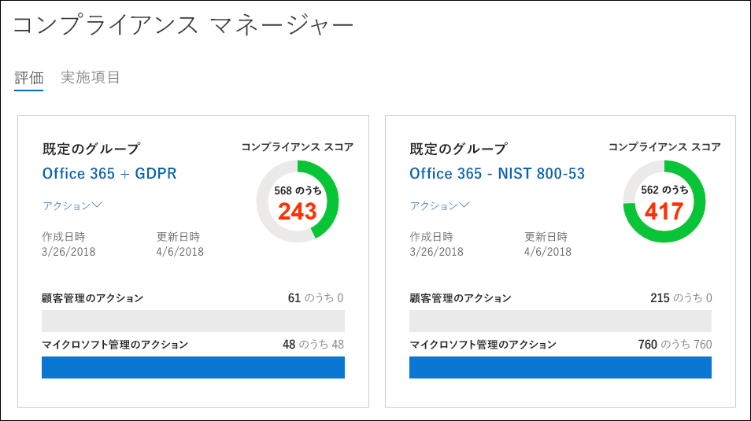
  
残りのポイントは、正常な顧客コントロール評価、および顧客管理のコントロールの実装とテストから取得されます。それぞれのポイントには特定の値があり、その値はコンプライアンス スコア全体に計上されます。 
  
各評価にはリスクベースのコンプライアンス スコアが表示されます。このスコアは、評価の各コントロール (Microsoft 管理のコントロールと顧客管理のコントロールを含む) に関連するリスクのレベル (コンプライアンス違反またはコントロールの失敗によるリスク) を評価するために役立ちます。 各顧客管理のコントロールには、獲得可能ポイント数 (*重大度ランキングと呼ばれます) が 1 から 10 のスケールで割り当てられます。ここでは、コントロールが失敗した場合、より高いリスク要因に関連するコントロールには、より多くのポイントが付与され、リスクの低いコントロールは少ないポイントが付与されます。 
  
たとえば、以下のユーザー アクセスの管理評価コントロールは、リスクの重大度ランキングが非常に高く、10 の値が割り当てられています。
  

  
 対照的に、以下のバックアップ評価コントロールは、リスクの重大度ランキングが低く、3 の値が割り当てられています。 
  
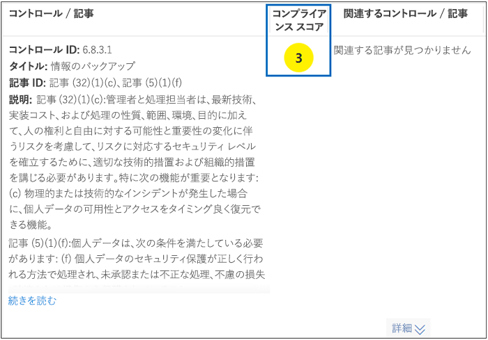
  
The Compliance Manager assigns a default severity ranking to each control. Risk rankings are calculated based on the following criteria:
  
- コントロールがインシデントの発生を阻止するのか (最も高いランク)、発生したインシデントを検出するか、あるいはインシデントの影響を修正するか (最も低いランク)。 重大度ランキングでは、脅威防止の必須のコントロールには、最も高いポイント数が割り当てられます。(必須か任意かに関わらず) 検出または修正のコントロールには最も低いポイント数が割り当てられます。
    
- (実装後) これらのコントロールが必須で、ユーザーがバイパスできない (たとえば、ユーザーがパスワードをリセットし、パスワードの長さと文字の要件を満たす必要があるなど)、それとも任意でユーザーがバイパスできるか (たとえば、ユーザーがコンピューターから離れるときに画面をロックすることを求める業務ルールなど)。
    
- Controls related to risks to data confidentiality, integrity, and availability, whether these risks come from internal or external threats, and whether the threat is malicious or accidental. For example, controls that would help prevent an external attacker from breaching that network and gaining access to personally identifiable information would be assigned more points than a control related to preventing an employee from accidentally mis-configuring a network router setting that results in a network outage).
    
- 各コントロールの契約、規制、公約などの法的および外的要因に関連するリスク。
    
The displayed Compliance Score values for the control are applied  *in their entirety*  to the Total Compliance Score on a pass/fail basis--either the control is implemented and passes the subsequent assessment test or it does not; there is no partial credit for a partial implementation. Only when the control has its **Implementation Status** set to **Implemented** or **Alternative Implementation** and the **Test Result** is set to **Passed** are the assigned points added to the Total Compliance Score. 
  
最も重要な点は、コンプライアンス スコアを使用すると、コントロールに関連する障害が発生した場合にリスクがより高くなる可能性があるコントロールがわかるので、実装に際して重点を置くコントロールの優先順位を付けやすくなることです。 リスクベースの優先順位付けだけでなく、評価コントロールが他のコントロール (同じ評価内または同じ評価グループの別の評価内のいずれか) に関連する場合、1 つのコントロールを正常に完了すると、コントロールのテスト結果が同期して、作業が大幅に削減される可能性があります。
  
たとえば、次の図の Office 365 - GDPR Assessment では 46% が評価済みです。111 個のコントロール評価のうち 51 個が完了しており、コンプライアンス スコアの合計は、取得可能な 600 のうちの 289 になります。
  

  
評価内で、GDPR コントロール 7.5.5 は他の 5 つのコントロール (7.4.1、7.4.3、7.4.4、7.4.8、および 7.4.9) に関連しており、それぞれが中から高のリスク ランク スコアである 6 または 8 が設定されています)。 評価のフィルターを使用して、これらのコントロールのすべてを選択し、評価ビューに表示したため、次の図でいずれも評価されていないことがわかります。 
  
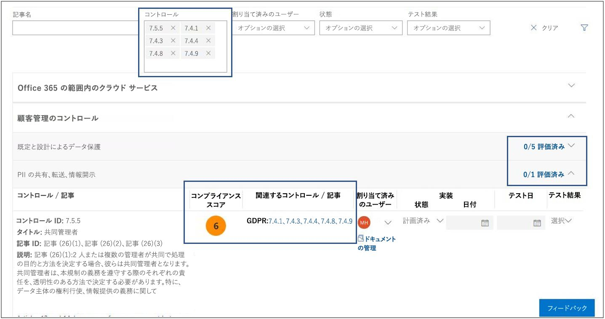 As those 6 controls are related, the completion of any one them will result in a synchronization of those test results across the related controls within this assessment (just as it will for any related controls in an assessment that is in the same assessment grouping). Upon completion of the implementation and testing of GDPR control 7.5.5, the control detail area refreshes to show that all 6 controls have been assessed, with a corresponding increase in the number of assessed controls to 57 and 51% assessed, and a change in total Compliance Score of +40. 
  
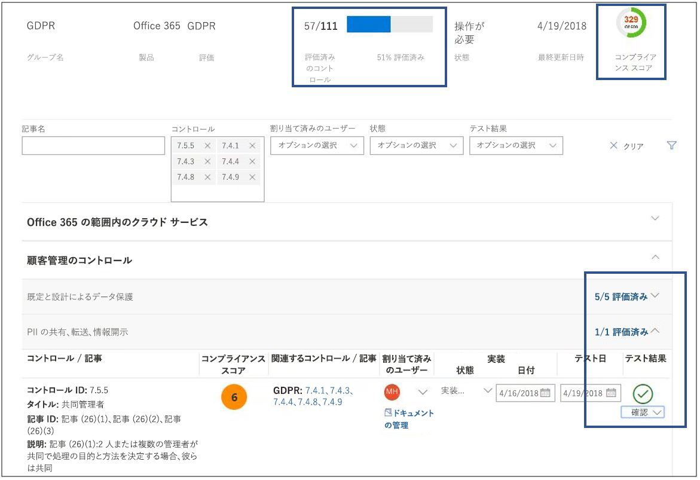
  
関連する他のコントロールに影響を与える方法で、関連するコントロールの実装状態を変更しようとすると、この更新の確認ダイアログ ボックスが表示されます。
  
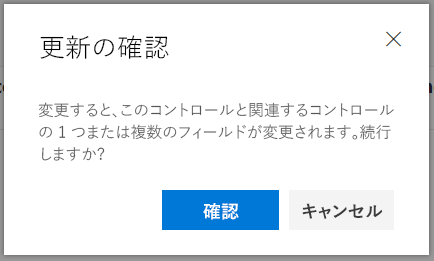
  
> [!NOTE]
> Currently, only Assessments for Office 365 cloud services include a Compliance Score. Assessments for Azure and Dynamics show an assessment status. 

## コンプライアンス スコアの手法

コンプライアンス スコア (Microsoft Secure Score など) は、他の動作ベースのスコア システムと似ています。組織は、データ保護、プライバシー、セキュリティに関連するアクティビティを実行することで、組織のコンプライアンス スコアを上げることができます。
  
> [!NOTE]
> The Compliance Score does not express an absolute measure of organizational compliance with any particular standard or regulation. It expresses the extent to which you have adopted controls which can reduce the risks to personal data and individual privacy. No service can guarantee that you are compliant with a standard or regulation, and the Compliance Score should not be interpreted as a guarantee in any way. 
  
Assessments in Compliance Manager are based on the shared responsibility model for cloud computing. In the shared responsibility model, Microsoft and each customer share responsibility for the protection of the customer's data when that data is stored in our cloud.
  
以下の Office 365 GDPR の評価に示すように、Microsoft と顧客はそれぞれ、評価されている標準または規制の要件を満たすように設計されるさまざまなアクションを実行する責任があります。 さまざまな標準と規制に必要なアクションを合理化および把握するために、 コンプライアンス マネージャーでは、すべての標準と規制はコントロール フレームワークと同様に処理されます。 そのため、各評価について Microsoft および顧客によって実行されるアクションには、さまざまなコントロールの実装と検証が含まれます。
  

  
一般的なアクションの基本ワークフローは次のとおりです。
  
1. The Compliance, Risk, Privacy, and/or Data Protection Officer of an organization assigns the task to someone in the organization to implement a control. That person could be:

    - ビジネス ポリシーの所有者
    
    - IT 担当者
    
    - 組織内の別の個人ユーザーで、タスク実行の責任者
    
2. That individual performs the tasks necessary to implement the control, uploads evidence of implementation into Compliance Manager, and marks the control(s) tied to the Action as implemented. Once these tasks are completed, they assign the Action to an Assessor for validation. Assessors can be:
    
    - 組織内のコントロールを検証する内部評価者
    
    - コンプライアンスの検査、検証、証明を行う外部評価者 (Microsoft クラウド サービスを監査する、独立したサード パーティの組織など)
    
3. 評価者は、コントロールの検証と証拠の精査を行い、評価済みとしてコントロールと評価の結果を記録します (例: 合格)。
    
Assessment に関連付けられたコントロールをすべて評価すると、Assessment は完了したものと見なされます。
  
Every Assessment in Compliance Manager comes pre-loaded with information that provides details about the Actions taken by Microsoft to satisfy the requirements of the controls for which Microsoft is responsible. This information includes details about how Microsoft has implemented each control and how and when Microsoft's implementation was assessed and verified by a third-party auditor. For this reason, the Microsoft Managed Controls for each Assessment are marked as Assessed, and the Compliance Score for the Assessment reflects this.
  
Each Assessment includes a total Compliance Score based on the shared responsibility model. Microsoft's implementation and testing of controls for Office 365 contributes a portion of the total possible points associated with a GDPR assessment. As the customer implements and tests each of the customer Actions, the Compliance Score for the Assessment will increase by the value assigned to the control. 
  
 ### リスクベースのスコアリングの手法
  
Compliance Manager uses a risk-based scoring methodology with a scale from 1-10 that assigns a higher value to controls that represent a higher risk in the event the control fails or is non-compliant. The scoring system used by Compliance Score is based on several key factors, such as:
  
- コントロールの本質
    
- 脅威の種類に基づくコントロールのリスク レベル
    
- コントロールの外的要因
    
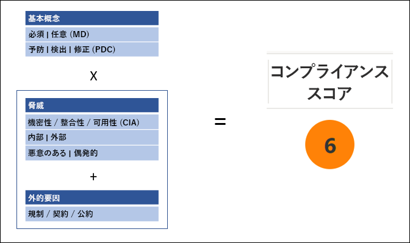
  
 ### コントロールの本質
  
コントロールの本質は、コントロールが必須か任意のどちらであるか、および予防、検出、または修正のいずれであるかに基づきます。
  
 ### 必須または任意
  
 *Mandatory controls*  are controls that cannot be bypassed either intentionally or accidentally. An example of a common mandatory control is a centrally-managed password policy that sets requirements for password length, complexity, and expiration. Users must comply with these requirements in order to access the system. 
  
 *Discretionary controls*  rely upon users to understand policy and act accordingly. For example, a policy requiring users to lock their computer when they leave it is a discretionary control because it relies on the user. 
  
 ### 予防、検出、または修正
  
 *Preventative controls*  are those that prevent specific risks. For example, protecting information at rest using encryption is a preventative control against attacks, breaches, etc. Separation of duties is a preventative control to manage conflict of interest and to guard against fraud. 
  
 *Detective controls*  are those that actively monitor systems to identify irregular conditions or behaviors that represent risk or that can be used to detect intrusions or determine if a breach has occurred. System access auditing and privileged administrative actions auditing are types of detective monitoring controls; regulatory compliance audits are a type of detective control used to find process issues. 
  
 *Corrective controls*  are those that try to keep the adverse effects of a security incident to a minimum, take corrective action to reduce the immediate effect, and reverse the damage, if possible. Privacy incident response is a corrective control to limit damage and restore systems to an operational state after a breach. 
  
これらの要因を使用して各コントロールを評価することで、コントロールの本質を判断します。そして、コントロールの本質に、その本質が表すリスクに相当する値を割り当てます。
  
 **脅威**
  
| | | |
|:-----|:-----|:-----|
||**必須**   |**任意**   |
|**予防**   |高リスク    |中程度のリスク    |
|**検出**   |中程度のリスク    |低リスク    |
|**修正**   |中程度のリスク    |低リスク    |
   
脅威は、データの CIA (機密性、整合性、可用性) トライアドと呼ばれる、基本的でかつ広く受け入れられているセキュリティ標準に対してリスクを引き起こすものを意味します。
  
- 機密性は、信頼でき、承認された関係者のみが情報の閲覧と確認ができることを意味します。
    
- 整合性は、情報が承認されていない関係者によって変更または破棄されていないこと意味します。
    
- 可用性は、高いレベルのサービスの品質で情報にアクセスする用意ができていることを意味します。
    
A failure of any of these characteristics is considered a compromise of the system as a whole. Threats can come from both internal and external sources, and an actor's intent can be accidental or malicious. These factors are estimated in a threat matrix that assigns threat levels of either High, Moderate, or Low to each combination of scenarios.

| |**内部** | |**外部** | | | |
|:-----|:-----|:-----|:-----|:-----|:-----|:-----|
||*悪意* |*偶発的* |*悪意* |*偶発的* |||
|**機密性** |(高、中、低)    |(高、中、低)    |(高、中、低)    |(高、中、低)|
|**整合性** |(高、中、低)    |(高、中、低)    |(高、中、低)    |(高、中、低)|
|**可用性** |(高、中、低)    |(高、中、低)    |(高、中、低)    |(高、中、低)|
   
 **外的要因**
  
|**契約**|**規制**|**公約**|
|:-----|:-----|:-----|
|(高、中、低)    |(高、中、低)    |(高、中、低)    |
   
適用される規制、契約、公約などの外的要因は、データを保護してデータ違反を防ぐように設計されたコントロールに影響を及ぼす場合があります。そのため、これらの要因のそれぞれに、高、中、低のリスク値が割り当てられます。
  
CIA/脅威および法的/外的要因で示された、可能性のある 15 個のリスク シナリオでの高、中、低のリスク値の予想発生回数は、リスクの重み付けのために結合されます。リスクの重み付けでは、指定された値におけるリスクの可能性と発生数が重要視されます。リスクの重み付けの検討は、コントロールの重大度ランキングを計算するときに行います。
  
コントロールの重大度ランキングに基づいて、コントロールにコンプライアンス スコアの値として 1 (低) から 10 (高) の数値が割り当てられ、次のリスクのカテゴリに分類されます。
  
|**リスク レベル**|**コントロール値**|
|:-----|:-----|
|低    |1-3    |
|中    |6    |
|高    |8    |
|重大    |10    |
   
最も高いコンプライアンス スコアの値で評価コントロールの優先度を設定することで、組織は最もリスクの高い項目に集中できるようになります。コントロールの評価を完了するごとに、組織は、評価に対するコンプライアンス スコアの合計にさらにポイントが追加された形で、比例的に高い値のフィードバックを受け取ります。
  
### スコアリングの手法の要約
  
The Compliance Score is a core component of the way that Compliance Manager helps organizations understand and manage their compliance. The Compliance Score for an assessment is an expression of the company's compliance with a given standard or regulation as a number, where the higher the score (up to the maximum number of points allocated for the Assessment), the better the company's compliance posture. Understanding the compliance scoring methodology in which assessment controls are assigned risk severity values between 1- 10 (low to high), and how completed control assessments add to the total compliance score is crucial to organizations for prioritizing their actions.

## Assessment のグループ化

新しい Assessment を作成すると、グループを作成して Assessment を割り当てるか、既存のグループに Assessment を割り当てるかの選択が求められます。 グループを使用すると、Assessment を論理的に整理し、同じまたは関連する顧客管理のコントロールを持つ Assessment 間で共通の情報やワークフロー タスクを共有できます。
  
For example, you could group Assessments by year or teams, departments, or agencies within your organization or group them by year. Here are some examples of groups and the Assessments they might contain.
  
- GDPR Assessment - 2018
    
  - Office 365 + GDPR
    
  - Azure + GDPR
    
  - Dynamics + GDPR
    
- Azure Assessment - 2018
    
  - Azure + GDPR
    
  - Azure + ISO 27001:2013
    
  - Azure + ISO 27018:2014
    
- データ セキュリティとプライバシー Assessment
    
  - Office 365 + ISO 27001:2013
    
  - Office 365 + ISO 27018:2014
    
  - Azure + ISO 27001:2013
    
  - Azure + ISO 27018:2014
    
> [!TIP]
> 組織のグループ化の戦略を決めてから、新しい評価を追加することをお勧めします。 
  
Assessment のグループ化の要件は以下のとおりです。
  
- グループ名 (* グループ ID とも呼ばれます) は組織内で一意にする必要があります。 
    
- Groups can contain Assessments for the same certification/regulation, but each group can only contain one Assessment for a specific cloud service/certification pair. For example, a group can't contain two Assessments for Office 365 and GDPR. Similarly, a group can contain multiple Assessments for the same cloud service as long as the corresponding certification/regulation for each one is different.
    
評価グループに評価を追加すると、そのグループを変更することはできません。 評価グループの名前は変更できます。これにより、そのグループに関連付けられているすべての評価の評価グループ名が変更されます。 評価と新しい評価グループを作成し、既存の評価から情報をコピーできます。これにより、その評価の複製が別の評価グループに効率よく作成されます。 評価をアーカイブすると、評価と評価グループの関係が壊れます。 他の関連する評価に対する更新プログラムは、アーカイブされた評価に反映されなくなります。
  
前述のように、グループを使用することの重要な利点の 1 つは、同じグループ内の 2 つの異なる Assessment が同じ顧客管理のコントロールを共有しているので (つまり、各コントロールで顧客アクションが同じになるので)、1 つの Assessments のコントロールに関する実装の詳細、テスト情報、および状態のすべてが、同じグループに含まれる他の Assessment の同じコントロールに同期されます。 言い換えると、Assessment が同じコントロールを共有し、それらの Assessment が同じグループにある場合、コントロールの評価プロセスを 1 つの Assessment で管理するだけで済みます。 そのコントロールの結果は、自動的に他の Assessment に同期されます。 たとえば、ISO 27001 と ISO 27018 のいずれにも、パスワード ポリシーに関連するコントロールがあります。 ある Assessment でコントロールのテスト状態が "合格" に設定された場合、両方の評価が同じ Assessment グループに含まれている限り、そのコントロールは他の Assessment で更新されます ("合格" とマークされます)。
  
この例として、Office 365 - GDPR 評価内のコントロール 6.10.1.2 と Office 365 - NIST 800-53 評価内のコントロール SC-13 の 2 つの関連する評価コントロールについて考えてみます。それぞれがパブリック ネットワークでデータの暗号化を処理する必要があります。 これらは、2 つの異なる評価内の関連する評価コントロールで、両方とも既定のグループ内にあります。 これら 2 つの Assessment が表示された次のコンプライアンス マネージャー ダッシュボードで示されるように、初めは、どちらの評価でも顧客コントロール評価が完了していません。
  

  
**[Office 365 - GDPR]** 評価をクリックして、フィルター コントロールを使用し、GDPR コントロール 6.10.1.2 を表示します。関連コントロールとして、NIST 800-53 コントロール SC-13 が表示されていることが確認できます。
  
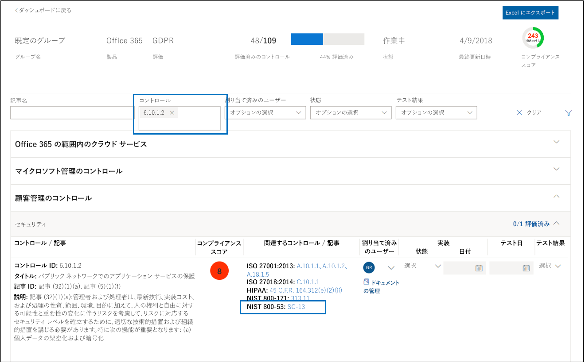
  
 ここでは、GDPR コントロール 6.10.1.2 の実装とテストが完了していることを示しています。 
  
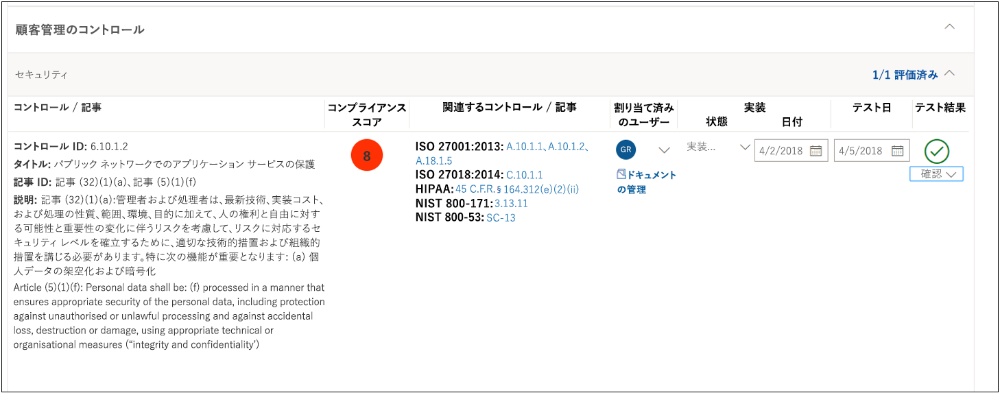
  
グループ化された評価内の関連コントロールに移動すると、NIST 800-53 SC-13 も同じ日時で完了済みとして記録されていることが確認できます。その他の実装やテストの作業は必要ありません。
  

  
ダッシュボードに戻ると、各評価で 1 つのコントロール評価が完了しており、各評価のコンプライアンス スコアの合計が 8 (その共有コントロールのコンプライアンス スコア値) 増えていることが確認できます。
  

## 管理機能

テナント管理者アカウントでのみ使用できる特定の管理機能があり、グローバル管理者としてログインした場合にのみ表示されます。
  
> [!NOTE]
> The Access to Restricted Documents permission in the drop-down list will allow administrators to give users access to restricted documents that Microsoft shares on the Service Trust Portal. The Restricted Documents feature isn't available, but is coming soon. 
  
### コンプライアンス マネージャーのロールをユーザーに割り当てる

Each Compliance Manager role has slightly different permissions. You can view the permissions assigned to each role, see which users are in which roles, and add or remove users from that role through the Service Trust Portal by selecting the **Admin** menu item, and then choosing **Settings**. 
  
![STP 管理者メニュー - [設定] を選択済み](../media/65a82b1b-d462-452f-988b-7e4263bd638e.png)
  
コンプライアンス マネージャーのロールにユーザーを追加したり、ロールからユーザーを削除したりするには、次の操作を行います。
  
1. [https://servicetrust.microsoft.com](https://servicetrust.microsoft.com) に移動します。
    
2. Azure Active Directory 全体管理者アカウントでサインインします。
    
3. Service Trust Portal のトップ メニュー バーで、**[管理]** を選択してから、**[設定]** を選択します。 
    
4. **[ロールの選択]** ドロップダウン リストで、管理するロールをクリックします。 
    
5. 各ロールに追加されたユーザーは、**[ロールの選択]** ページに一覧表示されます。 
    
6. To add users to this role, click **Add**. In the **Add Users** dialog, click the user field. You can scroll through the list of available users or begin typing the user name to filter the list based on your search term. Click the user to add that account to the **Add Users** list to be provisioned with that role. If you would like to add multiple users concurrently, begin typing a user name to filter the list, and then click the user to add to the list. Click **Save** to provision the selected role to these users. 
    
    
  
7. このロールからユーザーを削除するには、ユーザーを選択し、**[削除]** をクリックします。 
    
    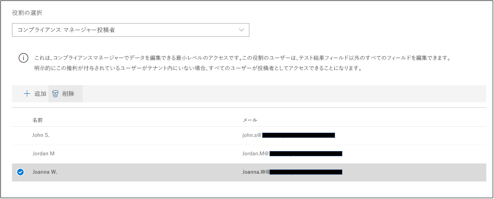
 
## ユーザー プライバシーの設定

Certain regulations require that an organization must be able to delete user history data. To enable this, Compliance Manager provides the **User Privacy Settings** functions, that allow administrators to: 
  
- [ユーザーの検索](#search-for-a-user)

- [アカウント データ履歴のレポートのエクスポート](#export-a-report-of-account-data-history)

- [実施項目の再割り当て](#reassign-action-items)

- [ユーザー データの履歴の削除](#delete-user-data-history)
    

  
### ユーザーの検索

ユーザー アカウントを検索するには、次のようにします。
  
1. エイリアス (@ 記号の左側の情報) を入力し、右側のドメイン サフィックス リストをクリックすることでドメイン名を選択し、ユーザー メール アドレスを入力します。 これが複数の登録されたドメインを含むテナントの場合、メール アドレスのドメイン名サフィックスを確認すると、これが正しいことを確認できます。
    
2. ユーザー名を正しく入力したら、**[検索]** をクリックします。 
    
3. If the user account is not found, the error message 'User not found' will be displayed on the page. Check the user's email address information, make corrections as necessary and click **Search** to try again. 
    
4. ユーザー アカウントが見つかった場合、ボタンのテキストは **[検索]** から **[クリア]** に変更されます。これは、返されたユーザー アカウントは以下に示される追加機能の操作のコンテキストであり、この追加機能を実行すると、このユーザー アカウントに適用されることを示します。 
    
5. 検索結果をクリアして別のユーザーを検索するには、**[クリア]** ボタンをクリックします。 
    
### アカウント データ履歴のレポートのエクスポート

ユーザー アカウントが識別されたら、このアカウントにリンクされている依存関係のレポートの生成が必要な場合があります。 この情報によって、オープンのアクション アイテムを割り当てたり、前にアップロードされたエビデンスへのアクセス権を確保したりできます。 
  
 レポートを生成してエクスポートするには:
  
1. **[エクスポート]** をクリックして、現在、返されたユーザー アカウントに割り当てられているコンプライアンス マネージャーのアクション アイテムのレポート、およびそのユーザーによってアップロードされたドキュメントのリストを生成してダウンロードします。 割り当てられたアクションやアップロードされたドキュメントがない場合、"このユーザーのデータがありません" というエラー メッセージが表示されます。 
    
2. レポートはアクティブなブラウザー ウィンドウのバックグラウンドでダウンロードされます。ダウンロードのポップアップが表示されない場合は、ブラウザーのダウンロード履歴を確認する必要があります。
    
3. ドキュメントを開いてレポート データを確認します。
    
> [!NOTE]
> This is not a historical report that retains and displays state changes to action item assignment history. The generated report is a snapshot of the control action items assigned at the time that the report is run (date and time stamp written into the report). For instance, any subsequent reassignment of action items will result in different snapshot report data if this report is generated again for the same user. 
  
### 実施項目の再割り当て

This function enables an organization to remove any active or outstanding dependencies on the user account by reassigning all action item ownership (which includes both active and completed action items) from the returned user account to a new user selected below. This action does not change document upload history for the returned user account. 
  
 他のユーザーに実施項目を再割り当てするには、次のようにします。
  
1. 参照する入力ボックスをクリックして、返されたユーザーの実施項目を割り当てる必要がある、組織内の別のユーザーを選択します。
    
2. **[置換]** を選択して、コントロールの実施項目すべてを、返されたユーザーから新しく選択したユーザーに再割り当てします。 
    
3. 確認ダイアログ ボックスには次のように表示されます: “これによりすべてのコントロール アクションが現在のユーザーから選択したユーザーに再度割り当てられます。 この操作は元に戻せません。 続行してよろしいですか?"
    
4. 続行するには **[OK]** をクリックします。続行しない場合は **[キャンセル]** をクリックします。 
    
> [!NOTE]
> All action items (both active and completed) will be assigned to the newly selected user. However, this action does not affect the document upload history; any documents uploaded by the previously assigned user will still show the date/time and name of the previously assigned user. 
  
Changing the document upload history to remove the previously assigned user will have to be done as a manual process. In that case, the administrator will need to:
  
1. 以前にダウンロードしたエクスポート レポートを開きます。
  
2. 目的のコントロールの実施項目を特定し、そこに移動します。
  
3. **[ドキュメントの管理]** をクリックして、そのコントロールの証拠のリポジトリに移動します。 
  
4. ドキュメントをダウンロードします。
  
5. 証拠のリポジトリでドキュメントを削除します。
  
6. Re-upload the document. The document will now have a new upload date, time and Uploaded By username. 
  
### ユーザー データの履歴の削除

This sets control action items to 'unassigned' for all action items assigned to the returned user. This also sets uploaded by value to 'user removed' for any documents uploaded by the returned user
  
 ユーザー アカウントの実施項目とドキュメントのアップロード履歴を削除するには、次のようにします。
  
1. **[削除]** をクリックします。 

    A confirmation dialog will be displayed, stating "This will remove all control action item assignments and the document upload history for the selected user. This action cannot be undone. Are you sure you want to continue?"
    
3. 続行するには **[OK]** をクリックします。続行しない場合は **[キャンセル]** をクリックします。 
  
## コンプライアンス マネージャーの使用

コンプライアンス マネージャーには、コンプライアンスと、評価に関連するアクティビティの割り当て、追跡、記録ができるツールが用意されています。チーム間の障壁が少なくなり、組織のコンプライアンスの目標が達成しやすくなります。
  

## コンプライアンス マネージャーへのアクセス

You access Compliance Manager from the Service Trust Portal. Anyone with a Microsoft account or Azure Active Directory organizational account can access Compliance Manager.
  

  
1. [https://servicetrust.microsoft.com](https://servicetrust.microsoft.com/) に移動します。
    
2. Azure Active Directory (Azure AD) ユーザー アカウントでサインインします。
    
3. Service Trust Portal で、**[コンプライアンス マネージャー]** をクリックします。 
    
4. When the Non-Disclosure Agreement is displayed, read it, and then click **Agree** to continue. You'll only have to do this once, and then the Compliance Manager dashboard is displayed. 

    作業を開始するために、既定で以下の Assessment を追加してあります。
    
    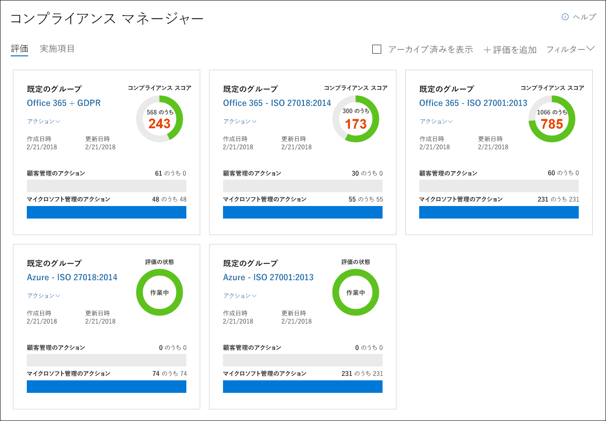
    
5. コンプライアンス マネージャーのショート ツアーを開始するには、![コンプライアンス マネージャーの [ヘルプ] アイコン](../media/c1b3092f-6ac7-43ab-b1c4-63a54598450c.png) **[ヘルプ]** をクリックします。 
  
## 実施項目の表示

コンプライアンス マネージャーには、割り当てられているすべてのコントロール評価アクション アイテムが表示される便利なビューが用意されているため、迅速かつ簡単にアクション アイテムを実行できます。 すべてのアクション アイテムを表示したり、特定の証明書に対応するアクション アイテムを選択したりすることができます。これを実行するには、その評価に関連するタブをクリックします。 たとえば、次の図では [GDPR] タブが選択されており、その GDPR 評価に関連するコントロールが表示されています。
  
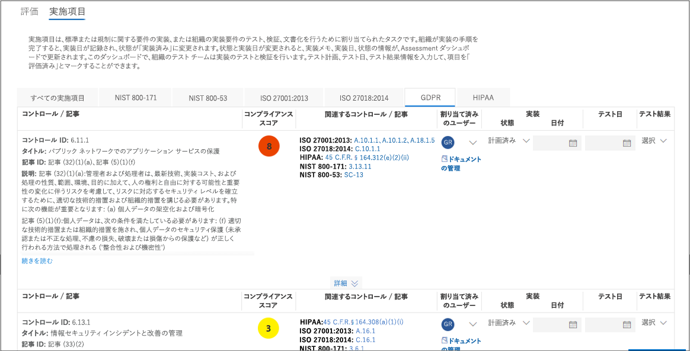
  
実施項目を表示するには、次のようにします。
  
1. コンプライアンス マネージャーのダッシュ ボードに移動します。
    
2. **[実施項目]** リンクをクリックすると、ページが更新され、自分に割り当てられている実施項目が表示されます。 
    
    By default, all action items are shown. If you have action items across multiple certifications, the names of the certifications will be listed in tabs across the top of the assessment control. To see the action items for a specific certification, click that tab.

## Assessment の追加

コンプライアンス マネージャーに Assessment を追加するには、次のようにします。
  
1. コンプライアンス マネージャーのダッシュボードで、![[追加] アイコン](../media/ITPro-EAC-AddIcon.gif) **[Assessment の追加]** をクリックします。 
    
2. In the **Add an Assessment** window, you can create a new group to add the Assessment to or you can add it to an existing group (the built-in group is named "Initial Group".) Depending on the option you choose, either type the name of a new group or select an existing group from the drop-down list. For more information, see [Grouping Assessments](#grouping-assessments).
    
    グループを作成する場合、既存のグループの情報を新しい Assessment にコピーすることもできます。 つまり、コピー元のグループの Assessment の [実装の詳細] フィールドと [テスト計画と管理の反応] フィールドに追加されたすべての情報が、新しい Assessment の同じ (または関連する) 顧客管理のコントロールにコピーされます。 既存のグループに新しい Assessment を追加する場合、そのグループの Assessment の共通する情報が新しい Assessment にコピーされます。 詳細については、「[既存の Assessment から情報をコピーする](#copying-information-from-existing-assessments)」を参照してください。
    
3. **[次へ]** をクリックし、以下のことを行います。
    
    a.  Microsoft クラウド サービスを選択して、**[製品の選択]** ドロップダウン リストからコンプライアンスを評価します。 
    
    b.  **[証明書の選択]** ドロップダウン リストから、選択したクラウド サービスを評価する証明書を選択します。 
    
4. **[ダッシュボードに追加]** をクリックして、Assessment を作成します。評価は、既存のタイル一覧の最後に新しいタイルとしてコンプライアンス マネージャーのダッシュボードに追加されます。 
    
    コンプライアンス マネージャーのダッシュボードの**Assessment タイル**には、評価グループ、評価の名前 (サービス名と選択した証明書の組み合わせとして自動的に作成されます)、作成日と最終変更日、コンプライアンス スコアの合計 (実装およびテストして合格した割り当て済みコントロールのリスク値すべての合計)、評価されたコントロールの数を示す進捗状況インジケーター (下部) が表示されます。 
    
5. Assessment 名をクリックして開き、Assessment の詳細を表示します。
    
6. **[アクション]** メニューをクリックして、割り当て済みの実施項目の表示、評価グループの名前の変更、評価レポートのエクスポート、または評価のアーカイブを行います。 
    
    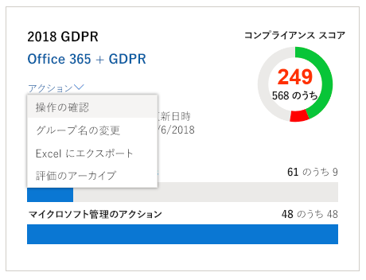

## 既存の Assessment から情報をコピーする

前述のように、評価グループを作成する場合、既存のグループの Assessment から新しいグループの新しい Assessment に情報をコピーできます。 そのため、完了した評価とテストの作業を、新しい Assessment の同じ顧客管理のコントロールに適用できます。 たとえば、組織内のすべての GDPR に関連する Assessment グループがある場合、グループに新しい Assessment を追加するときに、既存の評価作業から共通の情報をコピーできます。
  
お客様から新しい Assessment に次の情報をコピーすることができます。
  
- Assessment Users. An Assessment user is a user who the control is assigned to.
    
- 状態、テスト日、テスト結果。
    
- 実装の詳細とテスト計画の情報。
    
同様に、同じ Assessment グループ内の共有顧客管理のコントロールの情報も同期されます。 また、同じ Assessment 内の関連する顧客管理のコントロールの情報も同期されます。

## Assessment の表示

1. 表示したい評価に対応する Assessment タイルを見つけて、評価名をクリックして開くと、その Assessment に関連付けられたマイクロソフト管理のコントロールと顧客管理のコントロールが、Assessment の範囲内のクラウド サービスの一覧と共に表示されます。 以下は、Office 365 と GDPR の Assessment の例です。
    
    
  
1. このセクションには、Assessment グループの名前、製品、Assessment 名、評価コントロールの数など、Assessment の要約情報が表示されます。
    
2. This section shows the Assessment Filter controls. For a more detailed explanation of how to use the Assessment Filter controls see the [Managing the assessment process](#managing-the-assessment-process) section. 
    
3. このセクションには、評価の範囲内のそれぞれのクラウド サービスが表示されます。
    
4. このセクションには、マイクロソフト管理のコントロールが含まれます。 関連するコントロールは、コントロール ファミリー別にまとめられています。 コントロール ファミリーをクリックして展開すると、個々のコントロールが表示されます。
    
5. このセクションには、顧客管理のコントロールが含まれます。これもコントロール ファミリー別にまとめられています。 コントロール ファミリーをクリックして展開すると、個々のコントロールが表示されます。
    
6. コントロール ファミリーのコントロールの合計数と、評価されているコントロールの数が表示されます。 コンプライアンス マネージャーの重要な機能は、顧客管理のコントロールの評価の組織の進捗状況を追跡することです。 詳細については、「[コンプライアンス スコアの概要](#understanding-the-compliance-score)」を参照してください。 

## 評価プロセスの管理

最初の Assessment の作成者は Assessment ユーザーのみです。 顧客管理の各コントロールについて、組織内のユーザーにアクション アイテムを割り当て、そのユーザーを推奨される顧客アクションの実行およびエビデンスの収集とアップロードが可能な Assessment ユーザーにできます。 アクション アイテムを割り当てると、推奨される顧客アクションとアクション アイテムの優先度などの詳細を含むメールをそのユーザーに送信するよう選択できます。 メール通知には、**[アクション アイテム]** ダッシュボードへのリンクが含まれます。このダッシュボードでは、そのユーザーに割り当てられているすべてのアクション アイテムが一覧表示されます。 
  
ここでは、コンプライアンス マネージャーのワークフロー機能を使用して実行できるタスクを一覧表示しています。
  
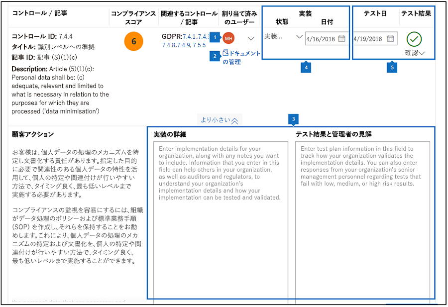
  
1. **フィルター オプションを使用して特定の評価コントロールを見つける** - コンプライアンス マネージャーには、**フィルター オプション**が用意されています。これにより、評価コントロールを表示するための詳細な選択基準に基づいて、コンプライアンス作業の特定分野を正確に見極めることができます。 
    
    **[フィルター オプション]** コントロールの表示または非表示を切り替えるには、ページの右側にあるじょうごアイコンをクリックします。 これらのコントロールを使用すると、フィルター条件を指定できるため、条件を満たす評価コントロールだけが下部に表示されます。 
  
    - **条項** - 条項名をフィルター処理し、その条項に関連付けられている評価のコントロールを返します。 たとえば、"条項 (5)" と入力すると、名前にその文字列が含まれる条項の選択リストが返されます (条項 (5)(1)(a)、条項 (5)(1)(b)、条項 (5)(1)(c) など)。条項 (5)(1)(c) を選択すると、条項 (5)(1)(c) に関連付けられているコントロールが返されます。 これは、OR 演算子を複数の値と共に使用する複数選択フィールドです。たとえば、条項 (5)(1)(a) を選択してから、条項 (5)(1)(c) を追加すると、条項 (5)(1)(a) または条項 (5)(1)(c) に関連付けられているコントロールが返されます。 
    
      
  
    - **コントロール** - フィルターに一致する名前を持つコントロールの一覧を返します。たとえば、7.3 と入力すると、7.3.1、7.3.4、7.3.5 などの項目の選択リストが返されます。これは、OR 演算子を複数の値と共に使用する複数選択フィールドです。たとえば、7.3.1 を選択してから、7.3.4 を追加すると、7.3.1 または 7.3.4 に関連付けられているコントロールが、フィルターによって返されます。 
    
      
  
    - **割り当て済みのユーザー** - 選択したユーザーに割り当てられているコントロールの一覧を返します。 
    
    - **状態** - 選択した状態のコントロールの一覧を返します。 
    
    - **テスト結果** - 選択したテスト結果を持つコントロールの一覧を返します。 
    
    As you apply filter conditions, the view of applicable controls will change to correspond to your filter conditions. Expand the control family sections to show the control details below. 
    
    
  
2. If after selecting the desired filters no results are shown, that means there are no controls that correspond to the specified filter conditions. For instance, if you select a particular **Assigned User** and then choose a **Control** name that does correspond to the control assigned to that user, no assessments will be shown in the page below. 
    
3. **Assign an Action Item to a user** - You can assign an Action Item to a person to implement the requirements of a certification/regulation, or to test, verify, and document your organization's implementation requirements. When you assign an Action Item, you can choose to send an email to the person that contains details including the recommended Customer Actions and the Action Item priority. You can also unassign or reassign an Action Item to a different person. 
    
4. **ドキュメントの管理** - 顧客管理のコントロールには、タスクの実装、タスクのテストおよび検証に関連するドキュメントを管理する場所もあります。 コンプライアンス マネージャーでデータを編集する権限を持つすべてのユーザーは、**[ドキュメントの管理]** をクリックすることでドキュメントをアップロードできます。 ドキュメントのアップロード後、**[ドキュメントの管理]** をクリックしてファイルを表示およびダウンロードできます。 
    
5. **実装およびテスト詳細の入力** - すべての顧客管理のコントロールには編集可能なフィールドがあります。ユーザーはそのフィールドに実装の詳細を入力して、証明書や規則の要件を満たすために組織が行った手順を文書化したり、組織がどのように要件を満たしているかを検証したりできます。
    
6. **Set Status** - Set the Status for each item as part of the assessment process. Available status values are **Implemented**, **Alternative Implementation**, **Planned**, and **Not in Scope**. 
    
7. **テスト日とテスト結果の入力** - コンプライアンス マネージャー評価者ロールのユーザーは、適切なテストが実施されたことを検証し、実装の詳細、テスト計画、テスト結果、およびアップロードされたエビデンスをレビューし、[テスト日] および [テスト結果] を設定します。 使用可能なテスト結果の値は、**[成功]**、**[失敗 - リスク低]**、**[失敗 - リスク中]**、および **[失敗 - リスク高]** です。 

## アクション アイテムの管理

組織内で評価プロセスに関与しているユーザーは、コンプライアンス マネージャーを使用して、使用するすべての Assessment からユーザー管理のコントロールをレビューできます。 ユーザーがコンプライアンス マネージャーにサインインし、**[アクション アイテム]** ダッシュボードを開くと、割り当てられているアクション アイテムのリストが表示されます。 ユーザーに割り当てられているコンプライアンス マネージャー ロールによっては、実装またはテストの詳細の入力、ステータスの更新、アクション アイテムの割り当てを行うことができます。 
  
As certification controls are generally implemented by one person and tested by another, the control action item can be initially assigned to one person for implementation, and once that is complete, that person can reassign the control action item to the next person for control testing and uploading of evidence. This assignment/reassignment of control actions can be performed by any users who have a Compliance Manager role with sufficient permissions, allowing for central management of control assignments, or decentralized routing of control action items, from implementer to tester as appropriate.
  
実施項目を割り当てるには、次のようにします。
  
1. コンプライアンス マネージャーのダッシュボードで、操作する評価の評価タイルを見つけて、評価名をクリックし、評価の詳細ページに移動します。
    
2. **[フィルター]** をクリックし、フィルター コントロールを使用して、割り当てる特定の評価コントロールを検索します。または、 
    
3. 顧客管理のコントロールのセクションまで下にスクロールして、コントロール ファミリーを展開し、割り当てる評価が見つかるまで、評価コントロールのリストをスクロールします。
    
4. **[割り当て済みのユーザー]** の列で、**[割り当て]** をクリックします。 
    
5. In the Assign Action Item dialog box, click the **Assign To** field to populate the list of users to whom the action can be assigned. You can scroll through the list to find the target user or start typing in the field to search for the username. 
    
6. この実施項目を割り当てるユーザーをクリックします。
    
7. ユーザーにメール通知を送信する場合は、**[メール通知を送信する]** チェック ボックスがオンになっていることを確認します。 
    
8. そのユーザーに表示するメモの内容を入力し、**[割り当て]** をクリックします。 
 
    割り当てられたユーザーは、実施項目の割り当てに関する通知と、前の操作で入力したメモを受け取ります。
    
The notes that are associated with the action item are persisted in the notes section, available for the next time the action item is assigned. These notes are not read-only, can be edited, replaced or removed by the person assigning the action item.

## Assessment から情報をエクスポートする

Assessment を Excel ファイルにエクスポートできます。これは、組織内のコンプライアンス関係者がレビューでき、監査人や規制機関に提供できます。 この評価レポートは、レポートを作成した日時における評価のスナップショットです。これには、その評価のマイクロソフト管理のコントロールと顧客管理のコントロールの両方の詳細 (コントロールの実装状態、コントロールのテスト日、テストの結果など)、およびアップロードされたエビデンスのドキュメントへのリンクが含まれています。 評価をアーカイブする前に、評価レポートをエクスポートすることをお勧めします。アーカイブされた評価にはアップロードされたドキュメントへのリンクが保持されていないためです。
  
Assessment レポートをエクスポートするには、次のようにします。
  
- コンプライアンス マネージャーのダッシュボードで、エクスポートする評価のタイルの **[操作]** リンクをクリックし、**[Excel にエクスポート]** を選択します。

  または
    
- Assessment の詳細ページを表示している場合は、**[Excel にエクスポート]** ボタンをクリックします。ボタンは、評価のコンプライアンス スコアの上のページの右上隅にあります。
    
The assessment report will be downloaded in your browser session. If you don't see a popup informing you of this, you may wish to check your browser's downloads folder.

## Assessment のアーカイブ

When you have completed an Assessment and no longer need it for compliance purposes, you can archive it. When an Assessment is archived, it is removed from Assessments dashboard.
  
> [!NOTE]
> When an Assessment is Archived, it cannot be 'unarchived' or restored to a read-write in progress state. Please note that Archived Assessments do not retain their links to uploaded evidence documents, so it is highly recommended that you perform an Export of the Assessment before archiving it, as the exported assessment report will contain links to the evidence documents, enabling you to continue to access them. 
  
評価のアーカイブを行うには、次のようにします。
  
1. アーカイブしたい評価のダッシュボード タイルで、**[操作]** をクリックします。 
    
2. **[Assessment のアーカイブ]** を選択します。 
 
    **[Assessment のアーカイブ]** ダイアログ ボックスが表示され、評価をアーカイブするかどうかの確認を求められます。
    
4. 続行してアーカイブする場合は **[アーカイブ]** をクリックし、アーカイブしない場合は **[キャンセル]** をクリックします。 
    
アーカイブした Assessment を表示するには、次のようにします。
  
1. コンプライアンス マネージャーのダッシュボードで、**[アーカイブ済みを表示]** チェック ボックスをオンにします。 
    
    アーカイブされた評価は、**アーカイブした評価**というタイトルが付いたバーの下の残りのアクティブな評価の下にある新しいセクションに表示されます。
    
3. 表示する評価の名前をクリックします。
    
アーカイブした評価を表示しても、通常は編集できるコントロール (実装、テスト結果) はアクティブにならず、**[管理対象ドキュメント]** ボタンもありません。

## 検索を使用する

  
Click the magnifying glass in the upper right-hand corner of the page by to expand the Search input field, enter your search terms and press Enter. The Search control will appear, with the search term in the search pane input field, and search results will appear beneath.
  
By default, Search returns Document results, and you can use the Filter By dropdown lists to refine the list of documents displayed, to add or remove search results from view. You can use multiple filter attributes at the same time to narrow the returned documents to specific cloud services, categories of compliance or security practices, regions of the world, or industries. Click the document name link to download the document.
  

  
コンプライアンス マネージャー評価コントロールの検索結果を表示するには、[コンプライアンス マネージャー] リンクをクリックします。 表示された検索結果には、評価作成日、評価グループ名、該当するクラウド サービス、コントロールがマイクロソフト管理コントロールなのかそれとも顧客管理コントロールなのか、などが表示されます。
  

  
> [!NOTE]
> Service Trust Portal のレポートとドキュメントは、公開後少なくとも 12 か月間、またはドキュメントの新しいバージョンが使用可能になるまで、ダウンロードできます。 
 
## ローカライズのサポート

Service Trust Portal enables you to view the page content in different languages. To change the page language, simply click on the globe icon in the lower left corner of the page and select the language of your choice. 
  
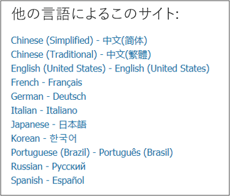

## 顧客管理のコントロールの変更ログ

コンプライアンス マネージャーは定期更新されるよう設計されており、規制に関する要件の変更内容、および当社のクラウド サービスの変更内容が常に反映されます。 これらの更新プログラムには、顧客管理のコントロールに対する変更が含まれています。 追加または変更されているコンテンツの詳細や、変更が既存の Assessment に及ぼす影響に関するガイダンスなど、そのような変更が及ぼす影響を理解するのに役立つ変更ログが用意されています。 通常、変更には次の 2 種類があります。
  
- A **Major** change is a significant change to a Customer Action, such as the addition or removal of a control or specific numbered steps, or a change in the guidance around responsibilities, recommendations, or evidence. For Major changes, we recommend that you re-evaluate your implementation and/or assessment of the affected control.
    
- A **Minor** change is an insignificant change to a Customer Actions, such as fixing a typo or formatting issues, or updating or correcting hyperlinks. Minor changes generally do not require the control to be re-evaluated; however, we do recommend that you review the updated Customer Action.
  
### 顧客管理のコントロール - 2018 年 7 月の変更ログ

|**コントロール ID**|**Assessment**|**変更の種類**|**変更の説明**|**お客様への推奨アクション**|
|:-----|:-----|:-----|:-----|:-----|:-----|:-----|:-----|:-----|
|45 C.F.R. § 164.308(a)(7)(ii)(A)  |Office 365: HIPAA|メジャー|Office 365 の HIPAA Assessment に HITECH コントロールが追加されました。 |追加されたコントロールと推奨される顧客アクションを確認してください  |
|45 C.F.R.  164.312(a)(6)(ii)|Office 365: HIPAA|メジャー|Office 365 の HIPAA Assessment に HITECH コントロールが追加されました。|追加されたコントロールと推奨される顧客アクションを確認してください |
45 C.F.R. § 164.312(c)(1)| Office 365: HIPAA|メジャー| Office 365 の HIPAA Assessment に HITECH コントロールが追加されました。 |追加されたコントロールと推奨される顧客アクションを確認してください  |
45 C.F.R.  § 164.316(b)(2)(iii)| Office 365: HIPAA|メジャー|Office 365 の HIPAA Assessment に HITECH コントロールが追加されました。|追加されたコントロールと推奨される顧客アクションを確認してください |
|

### 顧客管理のコントロール - 2018 年 4 月の変更ログ

|**GDPR**|**HIPAA**|**ISO 27001**|**ISO 27018**|**NIST 800-53**|**NIST 800-171**|**変更の種類**|**変更の説明**|**お客様への推奨アクション**|
|:-----|:-----|:-----|:-----|:-----|:-----|:-----|:-----|:-----|
|6.13.2    |||C.16.1.1    |||メジャー    |以前の番号は 6.12.1.1 です。    推奨事項に詳細を追加しました。    |コントロールの再評価: 顧客アクションの更新されたガイダンスを確認し、コントロールの実装と評価の推奨される手順を実行します。    |
||||||3.1.6    |メジャー    |監査の有効化と監査ログの検索を含むガイダンスに手順を追加しました。    |顧客アクションの更新された推奨事項を確認してください。    |
|6.8.2    |||A.10.2    |||メジャー    |以前の番号は 6.7.2.9 です。    追加の推奨事項、および実施項目をガイダンスに追記して更新しました。    |コントロールの再評価: 顧客アクションの更新されたガイダンスを確認し、コントロールの実装と評価の推奨される手順を実行します。    |
|6.6.4    |45 C.F.R. § 164.312(a)(2)(i)              45 C.F.R. § 164.312(d)    |A.9.4.2    ||IA-2    |3.5.1    |メジャー    |以前の番号は 6.5.2.3 です。    追加の推奨事項、および実施項目をガイダンスに追記して更新しました。    |コントロールの再評価: 顧客アクションの更新されたガイダンスを確認し、コントロールの実装と評価の推奨される手順を実行します。    |
|6.13.1    |45 C.F.R. § 164.308(a)(1)(i)    |A.16.1    |C.16.1    |IR-4(a)    |3.6.1    |メジャー    |以前の番号は 6.12.1 です。    追加の推奨事項、および実施項目をガイダンスに追記して更新しました。    |コントロールの再評価: 顧客アクションの更新されたガイダンスを確認し、コントロールの実装と評価の推奨される手順を実行します。    |
|6.7    ||||||メジャー    |以前の番号は 6.6.1.1 です。    追加の推奨事項、および実施項目をガイダンスに追記して更新しました。    |コントロールの再評価: 顧客アクションの更新されたガイダンスを確認し、コントロールの実装と評価の推奨される手順を実行します。    |
|6.6.5    |||A.10.8    |IA-3    |3.5.2    |メジャー    |以前の番号は 6.5.4.2 です。    追加の推奨事項、および実施項目をガイダンスに追記して更新しました。    |コントロールの再評価: 顧客アクションの更新されたガイダンスを確認し、コントロールの実装と評価の推奨される手順を実行します。    |
|6.15.1    ||||||メジャー    |以前の番号は 6.14.1.3 です。    追加の推奨事項、および実施項目をガイダンスに追記して更新しました。    |コントロールの再評価: 顧客アクションの更新されたガイダンスを確認し、コントロールの実装と評価の推奨される手順を実行します。    |
|||||AC-2(h)(2)    ||マイナー    |[監査の有効化] ブレードへのリンクを追加しました。    |必要な操作はありません。    |
|||||AC-2(7)(b)    ||マイナー    |[監査の有効化] ブレードへのリンクを追加しました。    |必要な操作はありません。    |
|||||AC-2(h)(1)    ||マイナー    |[監査の有効化] ブレードへのリンクを追加しました。    |必要な操作はありません。    |
||45 C.F.R. § 164.308(a)(5)(ii)(C)    |||AC-2(g)    ||マイナー    |[監査の有効化] ブレードへのリンクを追加しました。    |必要な操作はありません。    |
|||||AC-2(12)    ||マイナー    |[監査の有効化] ブレードへのリンクを追加しました。    |必要な操作はありません。    |
||45 C.F.R. § 164.312(b)    |A.12.4.3    ||AU-2(d)    ||マイナー    |[監査の有効化] ブレードへのリンクを追加しました。    |必要な操作はありません。    |
|||||AC-2(4)    ||マイナー    |[監査の有効化] ブレードへのリンクを追加しました。    |必要な操作はありません。    |
||||||3.1.7    |マイナー    |[監査の有効化] ブレードへのリンクを追加しました。    |必要な操作はありません。    |
|||A.16.1.7    |C.12.4.2, Part 2    |||マイナー    |[監査の有効化] ブレードへのリンクを追加しました。    |必要な操作はありません。    |
|||||AC-2(h)(3)    ||マイナー    |[監査の有効化] ブレードへのリンクを追加しました。    |必要な操作はありません。    |
|||A.12.4.2    ||||マイナー    |[監査の有効化] ブレードへのリンクを追加しました。    |必要な操作はありません。    |
|||A.7.2.8    ||||マイナー    |コンテンツ検索のブレードと DSR ポータルへのリンクを追加しました。    |必要な操作はありません。    |
||45 C.F.R. § 164.308(a)(3)(ii)(C)    |||||マイナー    |[監査の有効化] ブレードへのリンクと、Office 365 の管理者の役割のサポート トピックへのリンクを追加しました。    |必要な操作はありません。    |
|5.2.1    ||||||マイナー    |以前の番号は 5.2.2 です。    ガイダンス内のお客様の責任範囲を明確にしました。    |顧客アクションの更新された推奨事項を確認してください。    |
|6.11.1    |45 C.F.R. § 164.312(e)(2)(ii)    |A.10.1.1          A.10.1.2          A.18.1.5    |C.10.1.1    |SC-13    |3.13.11    |マイナー    |以前の番号は 6.10.1.2 です。    入力ミスを修正しました。    |必要な操作はありません。    |
|7.5.1    ||||||マイナー    |以前の番号は A.7.4.1 です。    入力ミスを修正しました。    |必要な操作はありません。    |
|||A.8.2.3    |||3.1.3    |マイナー    |不要な文を削除しました。    |必要な操作はありません。    |
||45 C.F.R. § 164.308(a)(4)(i)    |A.6.1.2    ||AC-5(a)    |3.1.2          3.1.4    |マイナー    |追加の推奨事項、および実施項目をガイダンスに追記して更新しました。    |顧客アクションの更新された推奨事項を確認してください。    |
||45 C.F.R. § 164.308(a)(7)(ii)(E)    |||RA-2(a)    ||マイナー    |FWLink を使用するために、インポート サービスのヘルプ トピックを更新しました。    |必要な操作はありません。    |
|

### GDPR Assessment コントロール ID 変更の参照情報 - 2018 年 2 月の変更ログ 

|**以前のコントロール ID (2017 年 11 月プレビュー)**|**新しいコントロール ID (2018 年 2 月 GA リリース)**|
|:-----|:-----|
|5.2.2    |5.2.1    |
|5.2.3    |5.2.2    |
|5.2.4    |5.2.3    |
|6.1.1.1    |6.2    |
|6.10.1.2    |6.11.1    |
|6.10.2.5    |6.11.2    |
|6.11.1.2    |6.12    |
|6.12.1    |6.13.1    |
|6.12.1.1    |6.13.2    |
|6.12.1.5    |6.13.3    |
|6.14.1.3    |6.15.1    |
|6.14.2.1    |6.15.2    |
|6.14.2.3    |6.15.3    |
|6.2.1.1    |6.3    |
|6.3.2.2    |6.4    |
|6.4.3.1    |6.5.2    |
|6.4.3.2    |6.8.1    |
|6.4.3.3    |6.5.3    |
|6.5.2    |6.6.1    |
|6.5.2.1    |6.6.2    |
|6.5.2.2    |6.6.3    |
|6.5.2.3    |6.6.4    |
|6.5.4.2    |6.6.5    |
|6.6.1.1    |6.7      |
|6.7.2.7    |6.8.1    |
|6.7.2.9    |6.8.2    |
|6.8.1.4    |6.9.1    |
|6.8.4.1    |6.9.3    |
|6.8.4.2    |6.9.4    |
|6.9.2.1    |6.10.1   |
|6.9.2.3    |6.10.2   |
|A.7.1.1    |7.2.1    |
|A.7.1.2    |7.2.2    |
|A.7.1.3    |7.2.3    |
|A.7.1.4    |7.2.4    |
|A.7.1.5    |7.2.5    |
|A.7.1.6    |7.2.6    |
|A.7.1.7    |7.2.7    |
|A.7.2.1    |7.3.1    |
|A.7.2.10   |7.3.9    |
|A.7.2.11   |7.3.10   |
|A.7.2.2    |7.3.2    |
|A.7.2.3    |7.3.3    |
|A.7.2.4    |7.3.4    |
|A.7.2.5    |7.3.5    |
|A.7.2.6    |7.3.6    |
|A.7.2.7    |7.3.7    |
|A.7.2.8    |7.3.8    |
|A.7.3.1    |7.4.1    |
|A.7.3.10   |7.4.10   |
|A.7.3.2    |7.4.2    |
|A.7.3.3    |7.4.3    |
|A.7.3.4    |7.4.4    |
|A.7.3.5    |7.4.5    |
|A.7.3.6    |7.4.6    |
|A.7.3.7    |7.4.7    |
|A.7.3.8    |7.4.8    |
|A.7.3.9    |7.4.9    |
|A.7.4.1    |7.5.1    |
|A.7.4.2    |7.5.2    |
|A.7.4.3    |7.5.3    |
|A.7.4.4    |7.5.4    |
|A.7.4.5    |7.5.5    |
|B.8.1.1    |8.2.1    |
|B.8.1.2    |8.2.2    |
|B.8.1.3    |8.2.3    |
|B.8.1.4    |8.2.4    |
|B.8.1.5    |8.2.5    |
|B.8.1.6    |8.2.6    |
|B.8.2.1    |8.3.1    |
|B.8.3.1    |8.4.1    |
|B.8.3.2    |8.4.2    |
|B.8.3.3    |8.4.3    |
|B.8.4.1    |8.5.1    |
|B.8.4.2    |8.5.2    |
|B.8.4.3    |8.5.4    |
|B.8.4.4    |8.5.5    |
|B.8.4.5    |8.5.3    |
|B.8.4.6    |8.5.6    |
|B.8.4.7    |8.5.7    |
|B.8.4.8    |8.5.8    |
|
   
## 関連項目

- [コンプライアンス マネージャーの対話型ガイド](https://content.cloudguides.com/guides/Compliance%20Manager)

- [コンプライアンス マネージャーの一般提供の発表](https://techcommunity.microsoft.com/t5/Security-Privacy-and-Compliance/Announcing-Compliance-Manager-general-availability/ba-p/161922)

- [Microsoft 365 は GDPR 対応を進めるために情報保護戦略を提供](https://blogs.office.com/2018/02/22/microsoft-365-provides-an-information-protection-strategy-to-help-with-the-gdpr)
