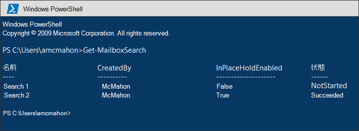
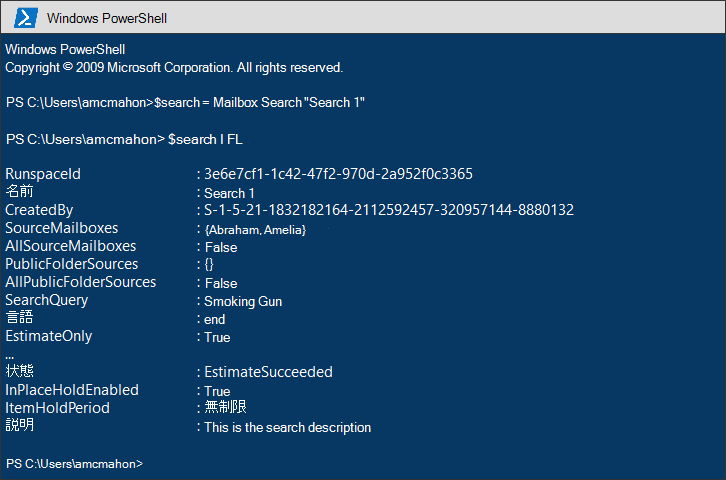
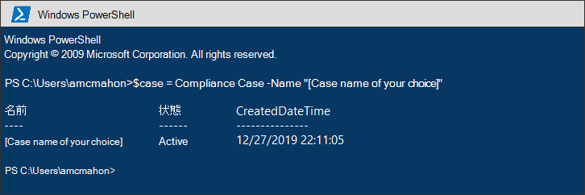
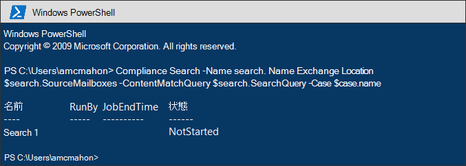

# <a name="migrate-legacy-ediscovery-searches-and-holds-to-the-microsoft-365-compliance-center"></a>従来の電子情報開示検索と保持を Microsoft 365 コンプライアンス センターに移行する

Microsoft 365 コンプライアンスセンターでは、次のような電子情報開示の使用に関して向上した方法が提供されています。これには、コンテンツを整理するケースなど、電子情報開示ワークフローに特化された、コンテンツと分析をレビューするためのデータを確認するための設定を確認することができます。

お客様が新機能と強化された機能を活用できるように、この記事では、インプレース電子情報開示の検索と保持を Exchange 管理センターから Microsoft 365 コンプライアンスセンターに移行する方法についての基本的なガイダンスを提供します。

> [!NOTE]
> さまざまなシナリオがあるため、この記事では、Microsoft 365 コンプライアンスセンターのコア電子情報開示ケースに移行するための一般的なガイダンスについて説明します。 電子情報開示ケースの使用は常に必須ではありませんが、組織内の電子情報開示ケースにアクセスできるユーザーを制御するためのアクセス許可を割り当てることによって、セキュリティの追加の層が追加されます。

## <a name="before-you-begin"></a>始める前に

- この記事で説明されている PowerShell コマンドを実行するには、セキュリティ & コンプライアンスセンターの電子情報開示マネージャーの役割グループのメンバーである必要があります。 また、Exchange 管理センターの "Discovery Management/検出の管理" 役割グループのメンバーである必要もあります。

- この記事では、電子情報開示の保持を作成する方法についてのガイダンスを提供します。 保留ポリシーは、非同期プロセスによってメールボックスに適用されます。 電子情報開示の保持を作成する場合は、CaseHoldPolicy と New-caseholdrule の両方を作成する必要があります。そうしないと、ホールドは作成されず、コンテンツの場所は保持されません。

## <a name="step-1-connect-to-exchange-online-powershell-and-security--compliance-center-powershell"></a>手順 1: Exchange Online PowerShell および Security & コンプライアンスセンター PowerShell に接続する

最初の手順は、Exchange Online PowerShell およびセキュリティ & コンプライアンスセンター PowerShell に接続することです。 次のスクリプトをコピーして、PowerShell ウィンドウに貼り付け、それを実行できます。 接続する組織の資格情報の入力を求められます。 

```powershell
$UserCredential = Get-Credential
$sccSession = New-PSSession -ConfigurationName Microsoft.Exchange -ConnectionUri https://ps.compliance.protection.outlook.com/powershell-liveid -Credential $UserCredential -Authentication Basic -AllowRedirection
Import-PSSession $sccSession -DisableNameChecking
$exoSession = New-PSSession -ConfigurationName Microsoft.Exchange -ConnectionUri https://ps.outlook.com/powershell-liveid/ -Credential $UserCredential -Authentication Basic -AllowRedirection
Import-PSSession $exoSession -AllowClobber -DisableNameChecking
```

この PowerShell セッションでは、次の手順でコマンドを実行する必要があります。

## <a name="step-2-get-a-list-of-in-place-ediscovery-searches-by-using-get-mailboxsearch"></a>手順 2: Get-mailboxsearch を使用してインプレース電子情報開示検索のリストを取得する

認証が済んだ**ら、get-mailboxsearch**コマンドレットを実行することによって、インプレース電子情報開示検索のリストを取得することができます。 次のコマンドをコピーして PowerShell に貼り付けて、そのコマンドを実行します。 検索の一覧には、その名前とインプレースホールドの状態が表示されます。

```powershell
Get-MailboxSearch
```

コマンドレットの出力は次のようになります。



## <a name="step-3-get-information-about-the-in-place-ediscovery-searches-and-in-place-holds-you-want-to-migrate"></a>手順 3: 移行するインプレース電子情報開示検索とインプレース保持についての情報を取得する

この場合も、 **get-mailboxsearch**コマンドレットを使用しますが、今回は検索のプロパティを取得します。 後で使用するために、これらのプロパティを変数に格納できます。 次の例では、 **get-mailboxsearch**コマンドレットの結果を変数に格納し、その検索のプロパティを表示します。

```powershell
$search = Get-MailboxSearch -Identity "Search 1"
```

```powershell
$search | FL
```

これら2つのコマンドの出力は次のようになります。



> [!NOTE]
> この例では、インプレース保持の期間は不定 (*ItemHoldPeriod: 無制限*) です。 これは一般的に、電子情報開示と法的調査のシナリオで使用されます。 保持期間が不定の値と異なる場合は、保持のシナリオでコンテンツを保持するために保持が使用されているため、理由が考えられます。 [New-retentioncompliancepolicy](https://docs.microsoft.com/powershell/module/exchange/policy-and-compliance-retention/new-retentioncompliancepolicy)および[get-retentioncompliancerule](https://docs.microsoft.com/powershell/module/exchange/policy-and-compliance-retention/new-retentioncompliancerule)を使用して、コンテンツを保持するために、セキュリティ & コンプライアンスセンターの PowerShell で電子情報開示のコマンドレットを使用するのではなく、コンテンツを保持することをお勧めします。 これらのコマンドレットを使用した結果は、 **CaseHoldPolicy**および**new-caseholdrule**の使用に似ていますが、保持期間と保持の操作 (保持期間が経過した後にコンテンツを削除するなど) を指定することができます。 また、保持コマンドレットを使用しても、保存機能を電子情報開示ケースに関連付けする必要はありません。

## <a name="step-4-create-a-case-in-the-microsoft-365-compliance-center"></a>手順 4: Microsoft 365 コンプライアンスセンターでケースを作成する

電子情報開示の保持を作成するには、保留リストをと関連付ける電子情報開示ケースを作成する必要があります。 次の例では、選択した名前を使用して電子情報開示ケースを作成します。 新しい case のプロパティは、後で使用するために変数に格納します。 これらのプロパティは、ケースを作成`$case | FL`した後にコマンドを実行すると表示できます。

```powershell
$case = New-ComplianceCase -Name "[Case name of your choice]"
```


## <a name="step-5-create-the-ediscovery-hold"></a>手順 5: 電子情報開示の保持を作成する

ケースを作成したら、ホールドを作成し、前の手順で作成したケースに関連付けることができます。 ケース保持ポリシーとケース保持ルールの両方を作成する必要があることを覚えておくことが重要です。 ケース保持ポリシーを作成した後にケース保持ルールが作成されなかった場合、電子情報開示ホールドは作成されず、コンテンツは保持されません。

移行する電子情報開示保持を再作成するには、次のコマンドを実行します。 これらの例では、移行する手順3のインプレースホールドからのプロパティを使用します。 最初のコマンドは、新しいケース保持ポリシーを作成し、プロパティを変数に保存します。 2番目のコマンドは、対応するケース保持ルールを作成します。

```powershell
$policy = New-CaseHoldPolicy -Name $search.Name -Case $case.Identity -ExchangeLocation $search.SourceMailboxes
```

```powershell
New-CaseHoldRule -Name $search.Name -Policy $policy.Identity
```


## <a name="step-6-verify-the-ediscovery-hold"></a>手順 6: 電子情報開示の保留を確認する

保持の作成に問題がないことを確認するには、保持配布の状態が [成功] であることを確認することをお勧めします。 Distribution とは、前の手順の*Exchangelocation*パラメーターで指定されたすべてのコンテンツの場所に保留が適用されたことを意味します。 これを行うには、 **CaseHoldPolicy**コマンドレットを実行します。 前の手順で作成した *$policy*変数に保存されたプロパティが自動的に更新されないため、コマンドレットを再実行して、配布が成功したことを確認する必要があります。 ケース保持ポリシーを正常に分散させるには、5 ~ 24 時間かかることがあります。

次のコマンドを実行して、電子情報開示の保持が正常に配布されたことを確認します。

```powershell
Get-CaseHoldPolicy -Identity $policy.Identity | Select name, DistributionStatus
```

[失敗の*状態*を正常に**完了**しました "プロパティの値は、コンテンツの場所に保持が正常に配置されたことを示します。 配布がまだ完了していない場合は、[**保留中**] の値が表示されます。


## <a name="step-7-create-the-search"></a>手順 7: 検索を作成する

最後の手順では、手順3で識別した検索を再作成し、ケースに関連付けます。 検索を作成した後は、 **new-compliancesearch**コマンドレットを使用して実行するか、後で実行することができます。

```powershell
New-ComplianceSearch -Name $search.Name -ExchangeLocation $search.SourceMailboxes -ContentMatchQuery $search.SearchQuery -Case $case.name
```



## <a name="step-8-verify-the-case-hold-and-search-in-the-microsoft-365-compliance-center"></a>手順 8: Microsoft 365 コンプライアンスセンターでケース、ホールド、検索を確認する

すべてが正しく設定されていることを確認するには、Microsoft 365 コンプライアンス[https://compliance.microsoft.com](https://compliance.microsoft.com)センターに移動し、[**電子情報開示 > コア**] をクリックします。


手順3で作成したケースは、**コアの電子情報開示**ページに記載されています。 ケースを開き、[**保留**] タブの一覧にある手順4で作成したホールドを確認します。ホールドをクリックすると、保留リストが適用されているメールボックスの数や配布の状態など、詳細が表示されます。


手順7で作成した検索は、電子情報開示ケースの [**検索**] タブの一覧に表示されます。


インプレース電子情報開示検索を移行しても、電子情報開示ケースに関連付けられていない場合は、Microsoft 365 コンプライアンスセンターの [コンテンツ検索] ページにリストされます。

## <a name="more-information"></a>詳細情報

- Exchange 管理センターでのインプレース電子情報開示 & 保持の詳細については、以下を参照してください。
  
  - [インプレース電子情報開示 (eDiscovery)](https://docs.microsoft.com/exchange/security-and-compliance/in-place-ediscovery/in-place-ediscovery)

  - [インプレース保持と訴訟ホールド](https://docs.microsoft.com/exchange/security-and-compliance/in-place-and-litigation-holds)

- この記事で使用されている PowerShell コマンドレットの詳細については、以下を参照してください。

  - [Get-mailboxsearch](https://docs.microsoft.com/powershell/module/exchange/policy-and-compliance-content-search/get-mailboxsearch)
  
  - [Get-compliancecase](https://docs.microsoft.com/powershell/module/exchange/policy-and-compliance-ediscovery/new-compliancecase)

  - [CaseHoldPolicy](https://docs.microsoft.com/powershell/module/exchange/policy-and-compliance-ediscovery/new-caseholdpolicy)
  
  - [New-caseholdrule](https://docs.microsoft.com/powershell/module/exchange/policy-and-compliance-ediscovery/new-caseholdrule)

  - [CaseHoldPolicy](https://docs.microsoft.com/powershell/module/exchange/policy-and-compliance-ediscovery/get-caseholdpolicy)
  
  - [New-ComplianceSearch](https://docs.microsoft.com/powershell/module/exchange/policy-and-compliance-content-search/new-compliancesearch)

  - [Start-ComplianceSearch](https://docs.microsoft.com/powershell/module/exchange/policy-and-compliance-content-search/start-compliancesearch)

- Microsoft 365 コンプライアンスセンターの詳細については、「 [microsoft 365 コンプライアンスセンターの概要](microsoft-365-compliance-center.md)」を参照してください。
