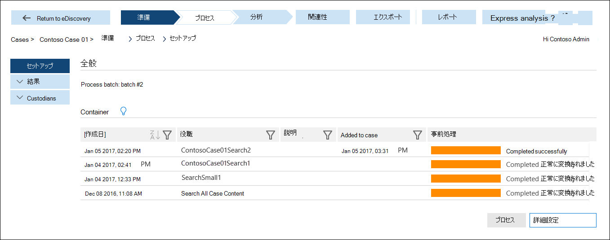

# 高度な電子情報開示用のデータを準備する (クラシック)

このトピックでは、高度な電子情報開示 (クラシック) のケースにコンテンツ検索の結果を読み込む方法について説明します。 
  
> [!IMPORTANT]
> 新しいバージョンの Advanced eDiscovery に投資し続ける中で、Advanced eDiscovery (*Advanced eDiscovery (クラッシック)* または *Advanced eDiscovery v1.0* とも呼ばれる) のサポート終了を発表しました。 まだ Advanced eDiscovery v1.0 を使用している場合は、できるだけ早く [Advanced eDiscovery v2.0](overview-ediscovery-20.md) (*Microsoft 365 では Advanced eDiscovery ソリューション*とも呼ばれる) に移行してください。 Advanced eDiscovery 2.0 には Advanced eDiscovery v1.0 の同様の機能が搭載されていますが、保管担当者管理、通信管理、レビュー セットなど、多くの新機能も搭載されています。 Advanced eDiscovery v1.0 のサポート終了の詳細については、「[従来版の電子情報開示ツールのサポート終了](legacy-ediscovery-retirement.md#advanced-ediscovery-v10)」を参照してください。  
  
## 手順 1: 高度な電子情報開示のためのデータを準備する

上級電子情報開示を使用してデータを分析するには、Microsoft 365 セキュリティ &amp; コンプライアンスセンター (microsoft 365 セキュリティコンプライアンスセンターの**コンテンツ検索**ページにリストされて &amp; います) または電子情報開示ケースに関連付けられた検索 (セキュリティコンプライアンスセンターの [**電子情報開示**] ページに一覧表示) で実行するコンテンツ検索の結果を使用でき &amp; ます。 
  
高度な電子情報開示で分析のために検索結果を準備する詳細な手順については、「 [Advanced ediscovery の検索結果を準備](prepare-search-results-for-advanced-ediscovery.md)する」を参照してください。
  
> [!NOTE]
> Microsoft 365 の外部にデータがあり、それを Microsoft 365 にインポートして、高度な電子情報開示で準備および分析できるようにする場合は、「 [microsoft 365 への PST ファイルのインポート](https://docs.microsoft.com/microsoft-365/compliance/importing-pst-files-to-office-365)と[サードパーティデータのアーカイブ](https://go.microsoft.com/fwlink/p/?linkid=716918)の概要」を参照してください。 
  
## 手順 2: 高度な電子情報開示のケースに検索結果データを読み込む

分析のためにセキュリティコンプライアンスセンターで検索結果を準備した後、 &amp; 次の手順では、高度な電子情報開示のケースに検索結果を読み込みます。 詳細については、「 [Process module を実行する](run-the-process-module-in-advanced-ediscovery.md)」を参照してください。
  
1. [https://protection.office.com](https://protection.office.com) に移動します。
    
2. 職場または学校のアカウントを使用してサインインします。
    
3. セキュリティ&amp;コンプライアンス センターで、**[検索&amp;調査]** \> **[電子情報開示]** の順にクリックし、組織内のケースの一覧を表示します。 
    
4. 高度な電子情報開示でにデータを読み込むケースの横にある [**開く**] をクリックします。 
    
5. ケースの **[ホーム]** ページで、**[Advanced eDiscovery]** をクリックします。 
    
    ![[高度な電子情報開示に切り替え] をクリックして、高度な電子情報開示でケースを開きます。](../media/8e34ba23-62e3-4e68-a530-b6ece39b54be.png)
  
    **[高度な電子情報開示**の進行状況バーへの接続] が表示されます。 上級電子情報開示に接続されている場合は、ケースのセットアップページにコンテナーの一覧が表示されます。 
    
    
  
     これらのコンテナーは、手順1でアドバンスト eDiscovery で分析するために準備した検索結果を表します。 セキュリティ/コンプライアンスセンターでは、コンテナーの名前がコンテンツ検索と同じ名前になっていることに注意して &amp; ください。 リスト内のコンテナーは、準備したものです。 上級電子情報開示のために別のユーザーが検索結果を準備している場合、対応するコンテナーはリストに含まれません。 
    
6. 高度な電子情報開示のケースに、コンテナーからの検索結果データを読み込むには、コンテナーを選択し、[**処理**] をクリックします。
    
&amp;上級電子情報開示のケースにセキュリティコンプライアンスセンターからの検索結果が追加された後、次の手順では、[Advanced ediscovery] のツールを使用して、ケースに関連するデータを分析し、選別します。 
  
## 関連項目

[Advanced eDiscovery (クラシック)](office-365-advanced-ediscovery.md)
  
[ユーザーおよびケースをセットアップする](set-up-users-and-cases-in-advanced-ediscovery.md)
  
[ケース データの分析](analyze-case-data-with-advanced-ediscovery.md)
  
[関連性の設定の管理](manage-relevance-setup-in-advanced-ediscovery.md)
  
[関連度モジュールの使用](use-relevance-in-advanced-ediscovery.md)
  
[ケース データのエクスポート](export-case-data-in-advanced-ediscovery.md)

