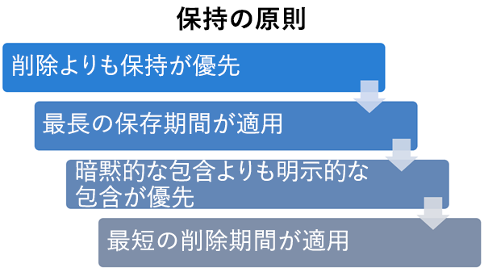

# アイテム保持ポリシーの詳細

>*[セキュリティとコンプライアンスのための Microsoft 365 ライセンス ガイダンス](https://aka.ms/ComplianceSD)。*

ほとんどの組織では、電子メール、ドキュメント、インスタント メッセージなどのデータの量と複雑さが日々増しています。次の必要性から、これらの情報を効果的に管理することが重要です。
  
- **最小限の期間コンテンツを保持することを要求する業界の規制や内部ポリシーを積極的に遵守する**: たとえば、米国企業改革法により、特定の種類のコンテンツを 7 年間保持することが求められる場合があります。 
    
- **訴訟やセキュリティ違反が発生した場合にリスクを軽減する**: このために、保持する必要がなくなった古いコンテンツは完全に削除します。 
    
- **組織内での効率的な知識の共有と迅速な対応に役立てる**: このために、ユーザーは現時点で関連性のあるコンテンツのみを対象に作業するようにします。 
    
アイテム保持ポリシーは、これらすべての目標の達成に役立ちます。一般に、コンテンツの管理に求められる操作は次の 2 つです。
  
- **コンテンツの保持**: 保持期間が満了するまではコンテンツの完全な削除ができないようにします。 
    
- **コンテンツの削除**: 保持期間の満了時点でコンテンツを完全に削除します。 
    
アイテム保持ポリシーにより、次のことが可能になります。
  
- コンテンツを保持するか、コンテンツを削除するか、またはその両方を行う (コンテンツを保持した後に削除する) かを事前に決定する。
    
- 組織全体または特定の場所またはユーザーに単一のポリシーを適用します。
    
- キーワードまたは[種類の機密情報](what-the-sensitive-information-types-look-for.md)を含むコンテンツなど、すべてのコンテンツまたは特定の条件を満たすコンテンツにポリシーを適用します。
    
コンテンツがアイテム保持ポリシーの対象になったときに、ユーザーは何も変更されていないかのようにコンテンツの編集と操作を続行できます。コンテンツは元の場所に保持されます。ただし、アイテム保持ポリシーの対象となるコンテンツを他のユーザーが編集または削除した場合、元のコンテンツのコピーは安全な場所に保存され、そのコンテンツのアイテム保持ポリシーが有効である間は保持されます。詳細については、このページの「[アイテム保持ポリシーは所定の場所にあるコンテンツに対してどのように作用するか](#how-a-retention-policy-works-with-content-in-place)」セクションをご覧ください。
  
さらに、一部の組織は、米国証券取引委員会 (SEC) 規則 17a-4 などの規制に準拠する必要があります。 この規制では、アイテム保持ポリシーを有効にした後、無効にしたり制限を緩和したりすることはできません。 この要件を満たすために、[**保持ロック**] を使用できます。 アイテム保持ポリシーがロックされた後、管理者を含め誰もアイテム保持ポリシーをオフにしたり、制限を緩和したりすることはできなくなります。 詳細については、このページの「[[保持ロック] を使用して規制要件に準拠する](#use-preservation-lock-to-comply-with-regulatory-requirements)」セクションを参照してください。

## アイテム保持ポリシーは所定の場所にあるコンテンツに対してどのように作用するか

サイトやメールボックスなどの場所をアイテム保持ポリシーに含めると、コンテンツは元の場所に引き続き保持されます。 このため、ユーザーは何事もなかったかのように、ドキュメントやメールで作業を続けることができます。 ただし、アイテム保持ポリシーを含むコンテンツを編集したり削除したりした場合、ポリシーを適用したときの状態でコンテンツのコピーが保持されます。
  
- SharePoint および OneDrive サイトの場合: コピーは、**アイテム保管**ライブラリに保持されます。 アイテム保管ライブラリは、サイトのストレージ クォータを消費することに注意してください。

- メールおよびパブリック フォルダーの場合: コピーは**回復可能なアイテム** フォルダーに保持されます。 

- Teams コンテンツの場合: コピーは Exchange の**回復可能なアイテム** フォルダーに保持されます。

- Microsoft 365 グループ ([以前の Office 365 グループ](https://techcommunity.microsoft.com/t5/microsoft-365-blog/office-365-groups-will-become-microsoft-365-groups/ba-p/1303601)) の場合: 
    - グループ メールボックスは、Exchange の**回復可能なアイテム** フォルダーに保持されます。
    - サイトのコンテンツはすべて、**アイテム保管**ライブラリに保持されます。

> [!NOTE]
> アイテム保管ライブラリは、サイトのストレージ クォータから除外されていないストレージを消費します。 SharePoint および Microsoft 365 グループのアイテム保持ポリシーを使用する場合は、ストレージを増やす必要がある場合があります。
> 
これらの安全な場所や保持されたコンテンツは、ほとんどのユーザーに表示されることはありません。 アイテム保持ポリシーがあれば、ユーザーはユーザーのコンテンツがそのポリシーの対象であるということを知る必要さえありません。

アイテム保持ポリシーがさまざまなワークロードでどのように機能するかの詳細については、次の記事を参照してください。

- [SharePoint と OneDrive のアイテム保持ポリシーの詳細](retention-policies-sharepoint.md)
- [Microsoft Teams のアイテム保持ポリシーの詳細](retention-policies-teams.md)
- [Exchange のアイテム保持ポリシーの詳細](retention-policies-exchange.md)

## 保持の原則、すなわち優先順位について

コンテンツにいくつかのアイテム保持ポリシーが適用されると、各ポリシーでアクション (保持、削除、または保持してから削除) や保持期間が異なることがよくあります。 優先順位 最上位のレベルでは、1 つのアイテム保持ポリシーで保持されているコンテンツが、別のアイテム保持ポリシーで完全に削除されることはないので、ご安心ください。
  

  
さまざまなアイテム保持ポリシーが、どのようにコンテンツに適用されるかを理解するために、次に示す保持の原則を覚えておいてください。
  
1. **削除よりも保持が優先されます。** 3 年後に Exchange メールを削除するように構成されているアイテム保持ポリシーがあり、加えて 5 年間 Exchange メールを保持してから削除するように構成されている別のアイテム保持ポリシーもあるとします。 作成後 3 年に達するコンテンツはすべて削除され、ユーザーのビューから非表示になりますが、コンテンツが完全に削除される 5 年に達するまで、[回復可能なアイテム] フォルダーに保持されます。 
    
2. **最長の保持期間が優先されます。** コンテンツがコンテンツを保持する複数のアイテム保持ポリシーの対象である場合、最長の保持期間が終了するまで保持されます。 
    
3. **明示的に含める方が、暗黙的に含めるよりも優先されます。** これは、次のことを意味します。 
    
    1. Exchange メールや OneDrive ドキュメントなど、ユーザーが保持設定の保持ラベルを手動でアイテムに割り当てた場合、サイトまたはメールボックス レベルで割り当てたアイテム保持ポリシーや、ドキュメント ライブラリで割り当てた既定の保持ラベルよりも、手動で割り当てたラベルが優先されます。 たとえば、明示的な保持ラベルでは 10 年間コンテンツを保持するように構成され、サイトに割り当てたアイテム保持ポリシーでは 5 年間のみコンテンツを保持するように構成された場合、明示的な保持ラベルが優先されます。 自動適用の保持ラベルは、Microsoft 365 によって自動的に適用されるため、明示的ではなく、暗黙的とされます。
    
    2. アイテム保持ポリシーに特定のユーザーのメールボックスまたは OneDrive のアカウントなどの特定の場所が含まれている場合、そのアイテム保持ポリシーは、すべてのユーザーのメールボックスまたは OneDrive のアカウントに適用されるが、そのユーザーのメールボックスを特に含まない別の保持ポリシーよりも優先されます。
    
4. **最短の削除期間が優先されます。** 同様に、コンテンツに複数のアイテム保持ポリシーが適用され、保持期間なしでコンテンツが削除される場合、そのコンテンツは最短保持期間の終了時に削除されます。 
    
保持の原則は上位から下位のタイブレーク フローとして機能することを理解します。すべてのアイテム保持ポリシーまたは保持ラベルによって適用された複数のルールがあるレベルで同じ場合、フローは次の下位レベルに移動し、ルールが適用される優先順位を決定します。
  
最後に、アイテム保持ポリシーや保持ラベルは、電子情報開示のために保持しているコンテンツを完全に削除することはできません。 保持対象からリリースされると、コンテンツは再び上記で説明したクリーンアップ処理の対象になります。

## [保持ロック] を使用して規制要件に準拠する

一部の組織は、米国証券取引委員会 (SEC) 規則 17a-4 など、規制機関によって定義された規則に準拠する必要があります。その場合、アイテム保持ポリシーをオンにした後、それをオフにしたり、制限を緩和したりすることはできないという要求があります。 

保持ロックは、アイテム保持ポリシーをロックし、誰も (管理者を含む) がポリシーをオフにしたり制限を緩和したりできないようにするため、組織がこのような規制要件を満たすことができるようにします。
  
保持ポリシーがロックされている場合:

- 誰もそれをオフにすることはできません
- 場所は追加できますが、削除できません 
- ポリシーの対象となるコンテンツは、保持期間中は変更または削除できません
- 保持期間を延長することはできますが、短縮することはできません

要約すると、ロックされたアイテム保持ポリシーを増やしたり延長したりすることは可能ですが、減らしたり、オフにしたりすることはできません。
  
> [!IMPORTANT]
> アイテム保持ポリシーをロックする前に、影響を理解し、組織がコンプライアンス要件を満たす必要があるかどうかを確認することが重要です。

## アイテム保持ポリシーを解除する

アイテム保持ポリシーに保持ロックがない場合、アイテム保持ポリシーをいつでもオフにしたり削除したりできます。 

この操作を行うと、[アイテム保管ライブラリ] で保持されている SharePoint や OneDrive のコンテンツは、すぐには完全に削除されません。 代わりに、不注意によるデータの損失を防ぐために、30 日間の猶予期間があります。そのポリシーのコンテンツの有効期限は、[アイテム保管ライブラリ] には表示されず、必要に応じてコンテンツを復元できます。 また、猶予期間中はこのコンテンツを手動で削除することはできません。

猶予期間中にアイテム保持ポリシーをもう一度有効にすることができます。そのポリシーのコンテンツは削除されません。

この SharePoint と OneDrive の 30 日の猶予期間は、Exchange の 30 日の保留期間に対応しています。 詳しくは、[メールボックスの管理についての詳細](identify-a-hold-on-an-exchange-online-mailbox.md#managing-mailboxes-on-delay-hold) をご覧ください。。

## 古いの機能の代わりにアイテム保持ポリシーを使用する

1 つのアイテム保持ポリシーは、組織全体や、Exchange Online、SharePoint Online、OneDrive、Microsoft 365 グループなどの Microsoft 365 全体の場所に簡単に適用できます。 Microsoft 365 内の任意の場所でコンテンツを保持または削除する必要がある場合は、アイテム保持ポリシーを使用し、オプションでこれに[保持ラベル](labels.md)を追加することをお勧めします。
  
以前に他の構成を使用して Microsoft 365 のコンテンツを保持または削除したことがある場合、それらはアイテム保持ポリシーと保持ラベルと並行して機能し続けます。 ただし、今後はアイテム保持ポリシーと保持ラベルを使用することをお勧めします。 それらは、Microsoft 365 全体でコンテンツの保持と削除の両方を集中管理する単一のメカニズムを提供します。

使用した可能性がある古い機能:
  
**Exchange Online の古い機能:**

- [Office 365 のセキュリティ センター/コンプライアンス センターでの電子情報開示のケースの管理](https://docs.microsoft.com/microsoft-365/compliance/get-started-core-ediscovery) (電子情報開示の保留リスト) 
    
- [インプレース ホールドと訴訟ホールド](https://go.microsoft.com/fwlink/?linkid=846124) (電子情報開示の保留リスト) 

- [Exchange Online メールボックスに適用されている保留の種類を特定する方法](identify-a-hold-on-an-exchange-online-mailbox.md)
    
- [メッセージング レコード管理 (MRM)](https://go.microsoft.com/fwlink/?linkid=846126) とも呼ばれる、[保持タグおよびアイテム保持ポリシー](https://go.microsoft.com/fwlink/?linkid=846125) (削除のみ)
    
**SharePoint と OneDrive の古い機能:**

- [Office 365 のセキュリティ センター/コンプライアンス センターでの電子情報開示のケースの管理](https://docs.microsoft.com/microsoft-365/compliance/get-started-core-ediscovery) (電子情報開示の保留リスト) 
    
- [電子情報開示センターでのコンテンツのケースへの追加とソースの保留リストへの配置](https://docs.microsoft.com/SharePoint/governance/add-content-to-a-case-and-place-sources-on-hold-in-the-ediscovery-center) (電子情報開示の保留リスト) 
    
- [ドキュメント削除ポリシーの概要](https://support.office.com/article/Create-a-document-deletion-policy-in-SharePoint-Server-2016-4fe26e19-4849-4eb9-a044-840ab47458ff) (削除のみ)
    
- [インプレース レコード管理の構成](https://support.office.com/article/7707a878-780c-4be6-9cb0-9718ecde050a) (保持のみ) 
    
- [サイトのクローズと削除のポリシーを使用する](https://support.microsoft.com/ja-JP/office/use-policies-for-site-closure-and-deletion-a8280d82-27fd-48c5-9adf-8a5431208ba5) (削除のみ) 
    
- [情報管理ポリシー](intro-to-info-mgmt-policies.md) (削除のみ)
     
以前に情報ガバナンスを目的として電子情報開示の保留のいずれかを使用したことがある場合は、予防的なコンプライアンスのために、代わりにアイテム保持ポリシーを使用します。 電子情報開示は、保留リストのみに使用します。
  
### アイテム保持ポリシーと SharePoint コンテンツ タイプ ポリシーまたは情報管理ポリシー

コンテンツ タイプ ポリシーまたは情報管理ポリシーの SharePoint サイトを構成して、リストまたはライブラリのコンテンツを保持している場合は、前者のポリシーは無視され、保持ポリシーが有効になります。 
  
### 保持ポリシーはアイテム保持ポリシーに変換される

保持ポリシーを使用してメールボックス、SharePoint または OneDrive サイト、またはパブリック フォルダーにデータを保持している場合: そのポリシーはアイテム保持ポリシーに自動的に変換されます。ポリシーがコンテンツを削除することはありません。 構成済みの保持ポリシーと同じ結果を得るために、ユーザーが変更する必要はありません。

構成された保持ポリシーは、[**ポリシー**] ページ ([Microsoft 365 コンプライアンス センター](https://compliance.microsoft.com/)内)、または [**保持**] ページ ([**情報ガバナンス**] 下、[セキュリティ &amp;コンプライアンス センター](https://protection.office.com/)内) にあります。 保持ポリシーを編集して保持期間を変更することはできますが、それ以外の変更 (場所の追加や削除など) はできません。 

## 関連情報

- [保持ラベルの詳細情報](labels.md)
- [SharePoint Online の制限](https://docs.microsoft.com/office365/servicedescriptions/sharepoint-online-service-description/sharepoint-online-limits)
- [Microsoft Teams の制限事項と仕様](https://docs.microsoft.com/microsoftteams/limits-specifications-teams) 
- [SEC Rule 17a-4 に準拠する ](use-exchange-online-to-comply-with-sec-rule-17a-4.md)

## 次の手順

アイテム保持ポリシーを作成する準備ができている場合は、「[アイテム保持ポリシーを作成して構成する](create-retention-policies.md)」を参照してください。

