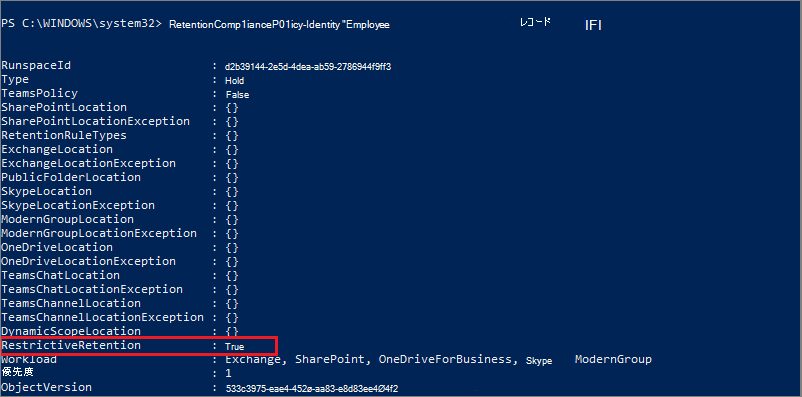

# <a name="use-preservation-lock-to-restrict-changes-to-retention-policies-and-retention-label-policies"></a><span data-ttu-id="de521-103">保管ロックを使用して、アイテム保持ポリシーと保持ラベル ポリシーへの変更を制限する</span><span class="sxs-lookup"><span data-stu-id="de521-103">Use Preservation Lock to restrict changes to retention policies and retention label policies</span></span>

><span data-ttu-id="de521-104">*[セキュリティとコンプライアンスのための Microsoft 365 ライセンス ガイダンス](https://aka.ms/ComplianceSD)。*</span><span class="sxs-lookup"><span data-stu-id="de521-104">*[Microsoft 365 licensing guidance for security & compliance](https://aka.ms/ComplianceSD).*</span></span>

<span data-ttu-id="de521-105">保管ロックは、アイテム保持ポリシーまたは保持ラベル ポリシーをロックして、グローバル管理者を含む誰もがポリシーをオフにしたり、ポリシーを削除したり、制限を緩和したりできないようにします。</span><span class="sxs-lookup"><span data-stu-id="de521-105">Preservation Lock locks a retention policy or retention label policy so that no one—including a global admin—can turn off the policy, delete the policy, or make it less restrictive.</span></span> <span data-ttu-id="de521-106">この構成は、規制要件のために必要になる場合があります。また、不正な管理者からの保護に役立ちます。</span><span class="sxs-lookup"><span data-stu-id="de521-106">This configuration might be needed for regulatory requirements and can help safeguard against rogue administrators.</span></span>

<span data-ttu-id="de521-107">保持に関するポリシーがロックされている場合:</span><span class="sxs-lookup"><span data-stu-id="de521-107">When a policy for retention is locked:</span></span>

- <span data-ttu-id="de521-108">だれもオフにすることはできません。</span><span class="sxs-lookup"><span data-stu-id="de521-108">No one can turn it off</span></span>
- <span data-ttu-id="de521-109">場所は追加できますが、削除できません</span><span class="sxs-lookup"><span data-stu-id="de521-109">Locations can be added but not removed</span></span>
- <span data-ttu-id="de521-110">保持期間を延長することはできますが、減らすことはできません</span><span class="sxs-lookup"><span data-stu-id="de521-110">You can extend a retention period but not decrease it</span></span>

<span data-ttu-id="de521-111">つまり、ロックされたアイテム保持ポリシーを増やしたり延長したりすることは可能ですが、減らしたり、オフにしたりすることはできません。</span><span class="sxs-lookup"><span data-stu-id="de521-111">In summary, a locked policy can be increased or extended, but it can't be reduced or turned off.</span></span>
  
> [!IMPORTANT]
> <span data-ttu-id="de521-112">アイテム保持ポリシーまたは保持ラベル ポリシーをロックする前に、その影響を理解し、それが組織に必要であるかどうかを確認することが非常に重要です。</span><span class="sxs-lookup"><span data-stu-id="de521-112">Before you lock a retention policy or retention label policy, it's critical that you understand the impact and confirm whether it's required for your organization.</span></span> <span data-ttu-id="de521-113">たとえば、規制要件を満たす必要がある場合があります。</span><span class="sxs-lookup"><span data-stu-id="de521-113">For example, it might be needed to meet regulatory requirements.</span></span> <span data-ttu-id="de521-114">保管ロックを適用すると、管理者はこれらのポリシーを無効にすることも削除することもできなくなります。</span><span class="sxs-lookup"><span data-stu-id="de521-114">Administrators won't be able to disable or delete these policies after the preservation lock is applied.</span></span>

<span data-ttu-id="de521-115">[発行](create-apply-retention-labels.md)または[自動適用](apply-retention-labels-automatically.md)する[アイテム保持ポリシー](create-retention-policies.md)、または保持ラベル ポリシーを作成した後、保管ロックを構成します。</span><span class="sxs-lookup"><span data-stu-id="de521-115">Configure Preservation Lock after you've created a [retention policy](create-retention-policies.md), or a retention label policy that you [publish](create-apply-retention-labels.md) or [auto-apply](apply-retention-labels-automatically.md).</span></span> 

## <a name="how-to-lock-a-retention-policy-or-retention-label-policy"></a><span data-ttu-id="de521-116">アイテム保持ポリシーまたは保持ラベル ポリシーをロックする方法</span><span class="sxs-lookup"><span data-stu-id="de521-116">How to lock a retention policy or retention label policy</span></span>

<span data-ttu-id="de521-117">保管ロックを使用する必要がある場合は、PowerShell を使用する必要があります。</span><span class="sxs-lookup"><span data-stu-id="de521-117">You must use PowerShell if you need to use Preservation Lock.</span></span> <span data-ttu-id="de521-118">管理者は、保管ロックが適用された後に保持に関するポリシーを無効にしたり、削除したりすることができないため、この機能の有効化は、偶発的な構成を予防するものとして UI で使用することはできません。</span><span class="sxs-lookup"><span data-stu-id="de521-118">Because administrators can't disable or delete a policy for retention after this lock is applied, enabling this feature is not available in the UI to safeguard against accidental configuration.</span></span>

<span data-ttu-id="de521-119">すべての保持に関するポリシーおよびそのいかなる構成も、保管ロックをサポートします。</span><span class="sxs-lookup"><span data-stu-id="de521-119">All policies for retention and with any configuration support Preservation Lock.</span></span>

1. <span data-ttu-id="de521-120">[セキュリティ/コンプライアンス センター PowerShell に接続します](https://docs.microsoft.com/powershell/exchange/connect-to-scc-powershell)。</span><span class="sxs-lookup"><span data-stu-id="de521-120">[Connect to Security & Compliance Center PowerShell](https://docs.microsoft.com/powershell/exchange/connect-to-scc-powershell).</span></span>

2. <span data-ttu-id="de521-121">[Get-RetentionCompliancePolicy](https://docs.microsoft.com/powershell/module/exchange/get-retentioncompliancepolicy) を実行してロックするポリシーの名前を検索します。</span><span class="sxs-lookup"><span data-stu-id="de521-121">Find the name of the policy that you want to lock by running [Get-RetentionCompliancePolicy](https://docs.microsoft.com/powershell/module/exchange/get-retentioncompliancepolicy).</span></span> <span data-ttu-id="de521-122">例:</span><span class="sxs-lookup"><span data-stu-id="de521-122">For example:</span></span>
    
   

3. <span data-ttu-id="de521-124">ポリシーに保管ロックを設定するには、ポリシーの名前を指定して [Set-RetentionCompliancePolicy](https://docs.microsoft.com/powershell/module/exchange/set-retentioncompliancepolicy) コマンドレットを実行し、 *RestrictiveRetention* パラメーターを true に設定します。</span><span class="sxs-lookup"><span data-stu-id="de521-124">To place a Preservation Lock on your policy, run the [Set-RetentionCompliancePolicy](https://docs.microsoft.com/powershell/module/exchange/set-retentioncompliancepolicy) cmdlet with the name of the policy, and the *RestrictiveRetention* parameter set to true:</span></span>
    
    ```powershell
    Set-RetentionCompliancePolicy -Identity "<Name of Policy>" –RestrictiveRetention $true
    ```
    
    <span data-ttu-id="de521-125">例:</span><span class="sxs-lookup"><span data-stu-id="de521-125">For example:</span></span>
    
    
    
     <span data-ttu-id="de521-127">メッセージが表示されたら、この構成に含まれる制限事項を読んで確認し、 **Y** を選びます。</span><span class="sxs-lookup"><span data-stu-id="de521-127">When prompted, read and acknowledge the restrictions that come with this configuration by entering **Y** :</span></span>
    
   

<span data-ttu-id="de521-129">アイテム保持ポリシーに保管ロックが設定されました。</span><span class="sxs-lookup"><span data-stu-id="de521-129">A Preservation Lock is now placed on the policy.</span></span> <span data-ttu-id="de521-130">確認するには、`Get-RetentionCompliancePolicy` をもう一度実行しますが、ポリシーの名前を指定してポリシー パラメーターを表示します。</span><span class="sxs-lookup"><span data-stu-id="de521-130">To confirm, run `Get-RetentionCompliancePolicy` again, but specify the policy name and display the policy parameters:</span></span>

```powershell
Get-RetentionCompliancePolicy -Identity "<Name of Policy>" |Fl
```

<span data-ttu-id="de521-131">**RestrictiveRetention** が **True** に設定されていることを確認する必要があります。</span><span class="sxs-lookup"><span data-stu-id="de521-131">You should see **RestrictiveRetention** is set to **True**.</span></span> <span data-ttu-id="de521-132">例:</span><span class="sxs-lookup"><span data-stu-id="de521-132">For example:</span></span>



## <a name="see-also"></a><span data-ttu-id="de521-134">関連項目</span><span class="sxs-lookup"><span data-stu-id="de521-134">See also</span></span>

[<span data-ttu-id="de521-135">情報ガバナンスおよびレコード管理の規制要件を満たすために役立つリソース</span><span class="sxs-lookup"><span data-stu-id="de521-135">Resources to help you meet regulatory requirements for information governance and records management</span></span>](retention-regulatory-requirements.md)
