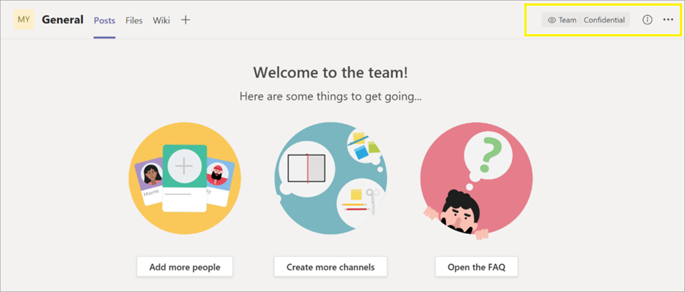

# <a name="use-sensitivity-labels-to-protect-content-in-microsoft-teams-microsoft-365-groups-and-sharepoint-sites-public-preview"></a>秘密度ラベルを使用して、Microsoft Teams、Microsoft 365 グループ、SharePoint サイトのコンテンツを保護する (パブリック プレビュー)

>*[セキュリティとコンプライアンスのための Microsoft 365 ライセンス ガイダンス](https://aka.ms/ComplianceSD)。*

[Microsoft 365 コンプライアンス センター](https://protection.office.com/)で秘密度ラベルを作成する場合、次のコンテナーへと適用できるようになりました: Microsoft Teams サイト、Microsoft 365 グループ ([以前の Office 365 グループ](https://techcommunity.microsoft.com/t5/microsoft-365-blog/office-365-groups-will-become-microsoft-365-groups/ba-p/1303601))、SharePoint サイト。 これらのコンテナーのコンテンツを保護するには、次のラベル設定を使用します。

- Microsoft 365 グループに接続されているチーム サイトのプライバシー (パブリックまたはプライベート)
- 外部ユーザーのアクセス
- 非管理対象デバイスからのアクセス 

サポートされているコンテナーにこのラベルを適用すると、構成済みオプションが、接続されたサイトまたはグループに自動的に適用されます。 

ただし、これらのコンテナーのコンテンツは、ラベル名、視覚的なマーキング、暗号化などの設定のラベルを継承しません。 ユーザーが SharePoint サイトまたはチーム サイトでドキュメントにラベルを付けられるようにするには、[SharePoint および OneDrive で Office ファイルの秘密度ラベルを有効にします](sensitivity-labels-sharepoint-onedrive-files.md)。

## <a name="about-the-public-preview-for-microsoft-teams-microsoft-365-groups-and-sharepoint-sites"></a>Microsoft Teams、Microsoft 365 グループ、および SharePoint サイトのパブリック プレビューについて

Microsoft Teams、Microsoft 365 グループ、SharePoint サイト向けの秘密度ラベルはプレビュー中であり、最終リリース前に変更される可能性があります。 このパブリック プレビューは、Office 365 コンテンツ配信ネットワーク (CDN) では機能しません。

このプレビューを有効にして新しい設定の機密ラベルを構成する前に、ユーザーはアプリで機密ラベルを表示および適用できます。 たとえば、Word から: 


このプレビューを有効にして構成すると、ユーザーは追加で秘密度ラベルを表示し、Microsoft Teams、Microsoft 365 グループ、および SharePoint サイトに適用することができます。 たとえば、SharePoint から新しいチーム サイトを作成する場合:


## <a name="enable-this-preview-and-synchronize-labels"></a>このプレビューを有効にしてラベルを同期する

1. この機能は Azure AD 機能を使用するため、Azure AD のドキュメント [Azure Active Directory で Microsoft 365 グループに秘密度ラベルを割り当てる (プレビュー)](https://docs.microsoft.com/azure/active-directory/users-groups-roles/groups-assign-sensitivity-labels) の指示に従ってプレビューを有効にします。

2. では、[Office 365 セキュリティ/コンプライアンス センター PowerShell](/powershell/exchange/office-365-scc/connect-to-scc-powershell/connect-to-scc-powershell) に接続します。 
    
    たとえば、管理者として実行している PowerShell セッションで、グローバル管理者アカウントでサインインします。
    
    ```powershell
    Set-ExecutionPolicy RemoteSigned
    $UserCredential = Get-Credential
    $Session = New-PSSession -ConfigurationName Microsoft.Exchange -ConnectionUri https://ps.compliance.protection.outlook.com/powershell-liveid/ -Credential $UserCredential -Authentication Basic -AllowRedirection
    Import-PSSession $Session -DisableNameChecking
    ```

3. 秘密度ラベルを Microsoft 365 グループで使用できるように、次のコマンドを実行して秘密度ラベルを Azure AD に同期させます。
    
    ```powershell
    Execute-AzureAdLabelSync
    ```

## <a name="how-to-configure-site-and-group-settings-when-you-create-or-edit-sensitivity-labels"></a>機密ラベルを作成または編集する際に、サイトおよびグループの設定を構成する方法

これで、サイトおよびグループで使用する機密ラベルを作成または編集する準備が整いました。 プレビューを有効にすると、秘密度のラベル付けウィザードで新しいページが表示されます: **サイトとグループの設定**

機密ラベルの作成または編集に関するヘルプが必要な場合は、「[機密ラベルを作成して構成する](create-sensitivity-labels.md#create-and-configure-sensitivity-labels)」の手順を参照してください。

この新しい [**サイトとグループの設定**] ページで、設定を構成します。

- **Office 365 グループに接続されたチーム サイトのプライバシー**: このラベルが適用されているチーム サイトまたはグループに組織内の誰もがアクセスできるようにする場合は、既定の [**公開 - 組織内のすべてのユーザーがサイトにアクセスできます**] に設定します。
    
    組織内の承認されたメンバーのみにアクセスを制限する場合は、[**プライベート**] を選択します。
    
    秘密度ラベルを使用してコンテナー内のコンテンツを保護し、ユーザーが自分でプライバシー設定を構成できるようにする場合は、[**なし - ユーザーがサイトにアクセスできるユーザーを選択できるようにします**] を選択します。
    
    このラベルをコンテナーに適用すると、[**パブリック**] または [**プライベート**] の設定によってプライバシー設定が設定およびロックされます。 選択した設定は、チームまたはグループに構成されている可能性がある以前のプライバシー設定を置き換え、プライバシー値をロックします。これにより、コンテナーから最初に秘密度ラベルを削除することによってのみ、変更できるようになります。 秘密度ラベルを削除しても、ラベルからのプライバシー設定は維持され、ユーザーは再びラベルを変更することができます。

- **外部ユーザー アクセス**: グループの所有者が[ゲストをグループに追加](/office365/admin/create-groups/manage-guest-access-in-groups)できるかどうかを制御します。

- **非管理対象デバイス**: [非管理対象デバイス](/sharepoint/control-access-from-unmanaged-devices)の場合、フル アクセスを許可するか、Web のみのアクセスを許可するか、またはアクセスを完全にブロックします。 

![[サイトとグループの設定] タブ](../media/edit-sensitivity-label-site-group2.png)

> [!IMPORTANT]
> チーム、グループ、またはサイトにラベルを適用すると、それらのサイトとグループの設定のみが有効になります。 暗号化やコンテンツ マーキングなどのその他のラベル設定は、チーム、グループ、またはサイト内のコンテンツに適用されません。
> 
> テナントへの段階的なロールアウト: ユーザーがチーム、グループ、サイトを作成するときに選択できるのは、サイトの設定およびグループの設定のラベルのみです。 ラベルにサイトとグループの設定が有効になっていないときに、ラベルをコンテナーに適用する場合は、ラベル名のみがコンテナーに適用されます。

秘密度ラベルがまだ公開されていない場合は、[秘密度ラベル ポリシーに追加](create-sensitivity-labels.md#publish-sensitivity-labels-by-creating-a-label-policy)して公開します。 このラベルを含む秘密度ラベル ポリシーが割り当てられているユーザーには、サイトとグループ用にそのラベルを選択できます。

このラベルをコンテナーに適用する場合、ラベル ポリシーからは、ポリシー設定 **[既定でドキュメントとメールにこのラベルを適用する]** のみが適用されます。 必須のラベル付け、ユーザーの妥当性の要求、カスタム ヘルプ ページへのリンクなど、他のポリシー設定は適用されません。

## <a name="sensitivity-label-management"></a>機密ラベルの管理

> [!WARNING]
> Microsoft Teams、Microsoft 365 グループ、および SharePoint サイトに使用する秘密度ラベルを作成、変更、および削除するには、ラベル ポリシーをユーザーに発行する際に慎重な調整が必要です。 

以下のガイダンスを使用して、すべてのユーザーに影響を与える可能性のあるサイトおよびグループの作成エラーを回避します。

**ラベルの作成と発行:**

機密ラベルを作成して公開した後、チーム、グループ、およびサイトでユーザーがラベルを表示できるようになるまでに最大 24 時間かかる場合があります。 以下の手順を使用して、テナント内のすべてのユーザーにラベルを発行します:

1. 機密ラベルを作成し、テナント内の少数のユーザー アカウントに対してのみ発行します。

2. 24 時間待ちます。

3. この 24 時間の待ち時間の後、手順 1 で指定したユーザー アカウントのいずれかを使用して、手順 1 で作成したラベルを持つチーム、Microsoft 365 グループ、または SharePoint サイトを作成します。

4. 手順 3 の作成操作中にエラーが発生しなかった場合、テナント内のすべてのユーザーにラベルを発行します。 エラーがある場合には、[Microsoft サポート](https://docs.microsoft.com/office365/admin/contact-support-for-business-products)へお問い合わせください。

**発行済みラベルの変更および削除:**

サイトとグループの設定を有効にして秘密度ラベルの変更または削除を行い、そのラベルが 1 つ以上のラベル ポリシーに含まれている場合、すべてのチーム、グループ、サイトの作成に失敗してしまう可能性があります。 この状況を回避するには、以下のガイダンスを使用してください。

1. ラベルを含むすべてのラベル ポリシーから、機密ラベルを削除します。

2. 48 時間待ちます。

3. 48 時間待ってからチーム、グループ、またはサイトを作成し、ラベルが表示されなくなったことを確認してください。

4. 機密ラベルが表示されていない場合は、ラベルを安全に変更または削除できます。 ラベルがまだ表示されている場合には、[Microsoft サポート](https://docs.microsoft.com/office365/admin/contact-support-for-business-products)にお問い合わせください。

## <a name="assign-sensitivity-labels-to-microsoft-365-groups"></a>Microsoft 365 グループに秘密度ラベルを割り当てる

これで、1 つまたは複数の秘密度ラベルを Microsoft 365 グループに適用する準備ができました。 手順については、Azure AD のドキュメントに戻ります。

- 「[Assign a label to a new group in Azure portal (Azure ポータルの新しいグループにラベルを割り当てる)](https://docs.microsoft.com/azure/active-directory/users-groups-roles/groups-assign-sensitivity-labels#assign-a-label-to-a-new-group-in-azure-portal)」

-  [Assign a label to an existing group in Azure portal (Azure ポータルの既存のグループにラベルを割り当てる)](https://docs.microsoft.com/azure/active-directory/users-groups-roles/groups-assign-sensitivity-labels#assign-a-label-to-an-existing-group-in-azure-portal)

-  「[Remove a label from an existing group in Azure portal (Azure ポータルの既存のグループからラベルを削除する)](https://docs.microsoft.com/azure/active-directory/users-groups-roles/groups-assign-sensitivity-labels#remove-a-label-from-an-existing-group-in-azure-portal).」

## <a name="apply-a-sensitivity-label-to-a-new-team"></a>新しいチームに機密ラベルを適用する

ユーザーは、Microsoft Teams で新しいチームを作成する際に機密ラベルを選択できます。 **[秘密度]** ドロップダウンからラベルを選択すると、プライバシー設定によってラベル構成が変更される場合があります。 ラベルに対し選択した外部ユーザーのアクセス設定に応じて、ユーザーは組織外のユーザーをチームに追加することができたり、できなかったりします。

[Teams の機密ラベルの詳細について](https://docs.microsoft.com/microsoftteams/sensitivity-labels)


チームを作成すると、すべてのチャネルの右上隅に機密ラベルが表示されます。



このサービスは、Microsoft 365 グループおよび接続された SharePoint チーム サイトに対して同じ秘密度ラベルを自動的に適用します。

## <a name="apply-a-sensitivity-label-to-a-new-group-in-outlook-on-the-web"></a>Outlook on the web の新しいグループに機密ラベルを適用する

Outlook on the web では、新しいグループを作成するときに、公開されたラベルの [**機密**] オプションを選択または変更できます。

![グループを作成し、[機密] 下でオプションを選択する](../media/sensitivity-label-new-group.png)

## <a name="apply-a-sensitivity-label-to-a-new-site"></a>新しいサイトに機密ラベルを適用する

管理者およびエンド ユーザーは、[最新のチーム サイトやコミュニケーション サイトを作成する](/sharepoint/create-site-collection)際に秘密度ラベルを選択し、以下のような**詳細設定**を行うことができます。

![サイトを作成し、[秘密度] 下でオプションを選択する](../media/sensitivity-label-new-communication-site.png)

ドロップダウン ボックスには選択したラベル名が表示され、ヘルプ アイコンにはすべてのラベル名とヒントが表示されます。これにより、ユーザーは適用するラベルを正しく選ぶことができます。

ラベルが適用され、ユーザーがサイトを参照すると、ラベルの名前および適用されているポリシーが表示されます。 たとえば、以下のサイトでは、**秘密**のラベル付けがされており、プライバシー設定は**プライベート**になっています。


## <a name="view-sensitivity-labels-in-the-sharepoint-admin-center"></a>SharePoint 管理センターで機密ラベルを表示する

適用された機密ラベルを表示するには、新しい SharePoint 管理センターの [**アクティブなサイト**] ページを使用します。 最初に、[**機密**] 列を追加する必要がある場合があります。

![[アクティブなサイト] ページの [機密] 列](../media/manage-site-sensitivity-labels.png)

[新しい SharePoint 管理センターでのサイト管理の詳細をご覧ください](/sharepoint/manage-sites-in-new-admin-center)。

## <a name="change-site-and-group-settings-for-a-label"></a>ラベル向けのサイトとグループの設定を変更する

ラベルのサイトとグループの設定を変更するたびに、チーム、サイト、グループが新しい設定を使用できるように、次の PowerShell コマンドを実行する必要があります。 ベスト プラクティスとして、機密ラベルを複数のチーム、グループ、またはサイトに適用した後に、ラベルのサイトとグループの設定を変更しないようにします。

1. まず、[Office 365 セキュリティ/コンプライアンス センター PowerShell へ接続します](/powershell/exchange/office-365-scc/connect-to-scc-powershell/connect-to-scc-powershell)。 
    
    たとえば、管理者として実行している PowerShell セッションで、グローバル管理者アカウントでサインインします。
    
    ```powershell
    Set-ExecutionPolicy RemoteSigned
    $UserCredential = Get-Credential
    $Session = New-PSSession -ConfigurationName Microsoft.Exchange -ConnectionUri https://ps.compliance.protection.outlook.com/powershell-liveid/ -Credential $UserCredential -Authentication Basic -AllowRedirection
    Import-PSSession $Session -DisableNameChecking
    ```

2. [Get-Label](https://docs.microsoft.com/powershell/module/exchange/policy-and-compliance/get-label?view=exchange-ps) コマンドレットを使用して、機密ラベルおよびその GUID のリストを取得します。
    
    ```powershell
    Get-Label |ft Name, Guid
    ```

3. 変更を行ったラベルの GUID をメモします。

4. 次に、[Exchange Online PowerShell に接続](https://docs.microsoft.com/powershell/exchange/exchange-online/connect-to-exchange-online-powershell/connect-to-exchange-online-powershell?view=exchange-ps)します。
    
    次に例を示します。
    
    ```powershell
    $UserCredential = Get-Credential
    $Session = New-PSSession -ConfigurationName Microsoft.Exchange -ConnectionUri https://outlook.office365.com/powershell-liveid/ -Credential $UserCredential -Authentication Basic -AllowRedirection
    Import-PSSession $Session
    ```
    
5. [Get-UnifiedGroup](https://docs.microsoft.com/powershell/module/exchange/users-and-groups/get-unifiedgroup?view=exchange-ps) コマンドレットを実行します。GUID 例の "e48058ea-98e8-4940-8db0-ba1310fd955e" の代わりにラベルの GUID を指定します。 
    
    ```powershell
    $Groups= Get-UnifiedGroup | Where {$_.SensitivityLabel  -eq "e48058ea-98e8-4940-8db0-ba1310fd955e"}
    ```

6. 各グループについて、GUID 例の "e48058ea-98e8-4940-8db0-ba1310fd955e" の代わりにラベルの GUID を指定して機密ラベルを再適用します。
    
    ```powershell
    foreach ($g in $groups)
    {Set-UnifiedGroup -Identity $g.Identity -SensitivityLabelId "e48058ea-98e8-4940-8db0-ba1310fd955e"}
    ```

## <a name="support-for-the-sensitivity-labels"></a>機密ラベルのサポート

次のアプリとサービスで、サイトとグループの設定用に構成した機密ラベルを使用できます。

- SharePoint Online
- Teams
- Outlook on the web
- SharePoint 管理センター
- Azure AD 管理センター

サイトおよびグループの設定用に構成した機密ラベルを現在使用できない他のアプリとサービスには、次のものがあります。

- Outlook for the Mac
- Outlook モバイル
- Outlook デスクトップ for Windows
- Forms
- Dynamics 365
- Yammer
- Stream
- Planner
- Project
- PowerBI
- Teams 管理センター
- Microsoft 365 管理センター
- Exchange 管理センター


## <a name="classic-azure-ad-group-classification"></a>従来の Azure AD グループの分類

このプレビューを有効にすると、Microsoft 365 は新しい Microsoft 365 のグループおよび SharePoint サイト向けに古い分類をサポートしなくなります。 ただし、既存のグループおよびサイトには、機密ラベルを使用するように変換しない限り、古い分類値が引き続き表示されます。

SharePoint の古いグループ分類を使用した場合の例として、「[SharePoint の "モダン" サイトの分類」](https://docs.microsoft.com/sharepoint/dev/solution-guidance/modern-experience-site-classification)を参照してください。

これらの分類は、Azure AD PowerShell または PnP コア ライブラリを使用し、`ClassificationList` 設定に値を定義することによって構成されています。 テナントに分類値が定義されている場合は、[AzureADPreview PowerShell モジュール](https://www.powershellgallery.com/packages/AzureADPreview)から次のコマンドを実行すると、それらが表示されます。

```powershell
   ($setting["ClassificationList"])
```

古い分類を機密ラベルに変換するには、次のいずれかの操作を行います。

- 既存のラベルを使用: 既に公開されている既存の機密ラベルを編集して、サイトおよびグループに必要なラベル設定を指定します。

- 新しいラベルの作成: 既存の分類と同じ名前を持つ新しい機密ラベルを作成および公開して、サイトおよびグループに必要なラベル設定を指定します。

その後で以下の手順に従います。 

1. PowerShell を使用し、既存の Microsoft 365 グループおよび SharePoint サイトに名前のマッピングを使用して秘密度ラベルを適用します。 手順については、次のセクションを参照してください。

2. 既存のグループおよびサイトから古い分類を削除します。

機密ラベルをまだサポートしていないアプリやサービスでユーザーが新しいグループを作成できないようにすることはできませんが、定期的な PowerShell スクリプトを実行して、ユーザーが古い分類で作成した新しいグループを探し、機密ラベルを使用するようにそれらを変換することができます。 

#### <a name="use-powershell-to-convert-classifications-for-microsoft-365-groups-to-sensitivity-labels"></a>PowerShell を使用して Microsoft 365 グループの分類を秘密度ラベルに変換する

1. まず、[Office 365 セキュリティ/コンプライアンス センター PowerShell へ接続します](/powershell/exchange/office-365-scc/connect-to-scc-powershell/connect-to-scc-powershell)。 
    
    たとえば、管理者として実行している PowerShell セッションで、グローバル管理者アカウントでサインインします。
    
    ```powershell
    Set-ExecutionPolicy RemoteSigned
    $UserCredential = Get-Credential
    $Session = New-PSSession -ConfigurationName Microsoft.Exchange -ConnectionUri https://ps.compliance.protection.outlook.com/powershell-liveid/ -Credential $UserCredential -Authentication Basic -AllowRedirection
    Import-PSSession $Session -DisableNameChecking
    ```

2. [Get-Label](https://docs.microsoft.com/powershell/module/exchange/policy-and-compliance/get-label?view=exchange-ps) コマンドレットを使用して、機密ラベルおよびその GUID のリストを取得します。
    
    ```powershell
    Get-Label |ft Name, Guid
    ```

3. Microsoft 365 グループに適用する秘密度ラベルの GUID をメモします。

4. 次に、[Exchange Online PowerShell に接続](https://docs.microsoft.com/powershell/exchange/exchange-online/connect-to-exchange-online-powershell/connect-to-exchange-online-powershell?view=exchange-ps)します。
    
    例:
    
    ```powershell
    $UserCredential = Get-Credential
    $Session = New-PSSession -ConfigurationName Microsoft.Exchange -ConnectionUri https://outlook.office365.com/powershell-liveid/ -Credential $UserCredential -Authentication Basic -AllowRedirection
    Import-PSSession $Session
    ```

5. 次のコマンドを例として使用して、現在 "一般" の分類を持つグループのリストを取得します。

   ```PowerShell
   $Groups= Get-UnifiedGroup | Where {$_.classification -eq "General"}
   ```

6. グループごとに、新しい機密ラベル GUID を追加します。 以下に例を示します。

    ```PowerShell
    foreach ($g in $groups)
    {Set-UnifiedGroup -Identity $g.Identity -SensitivityLabelId "457fa763-7c59-461c-b402-ad1ac6b703cc"}
    ```

7. 残りのグループ分類について、手順 5 と 6 を繰り返します。

## <a name="auditing-sensitivity-label-activities"></a>機密ラベル アクティビティの監査

誰かが機密ラベルで保護されているサイトにドキュメントをアップロードし、そのドキュメントの機密ラベルが、サイトに適用されている機密ラベルよりも[優先度が高く](sensitivity-labels.md#label-priority-order-matters)なっている場合、このアクションはブロックされません。 たとえば、「**一般**」ラベルを SharePoint サイトに適用し、誰かがこのサイトに「**社外秘**」というラベルの付けられたドキュメントをアップロードしたとします。 優先度の高い機密ラベルは、優先順位の低いコンテンツよりも機密性の高いコンテンツを識別するため、この状況はセキュリティ上の懸念になる可能性があります。

アクションはブロックされていませんが、監査され、ドキュメントをアップロードした人とサイト管理者にメールが自動的に生成されます。 結果として、ユーザーと管理者の両方が、この不適切なラベルの優先順位を設定し、必要に書類を特定することができます。 たとえば、アップロードされたドキュメントをサイトから削除または移動します。 

ドキュメントの機密ラベルが、サイトに適用されている機密ラベルよりも優先度が低い場合、セキュリティ上の懸念にはなりません。 たとえば、「**一般**」というラベルの付いたドキュメントが、「**社外秘**」というラベルの付いたサイトにアップロードされている場合です。 このシナリオでは、監査イベントとメールが生成されません。

このイベントの監査ログを検索するには、[**ファイルとページのアクティビティ**] カテゴリから [**検出されたドキュメントの機密度の不一致**] を探します。 

自動生成されたメールには、サブジェクト **の互換性がない秘密度ラベルが検出されました**とメールメッセージは、アップロードされたドキュメントとサイトへのリンクとのラベルの不一致を説明します。 ユーザーが感度ラベルを変更できるようにするドキュメントリンクも含まれています。 現在、これらの自動メールは無効にすることも、カスタマイズすることができません。

サイトまたはグループに対して、または、ある人が機密ラベルを追加または削除する場合、これらのアクティビティも監査されますが、メールは自動的に生成されません。 

これらの監査イベントはすべて、[秘密ラベルのアクティビティ](search-the-audit-log-in-security-and-compliance.md#sensitivity-label-activities) カテゴリに記載されています。 監査ログを検索する手順については、「[セキュリティ/コンプライアンス センターで監査ログを検索する](search-the-audit-log-in-security-and-compliance.md)」を参照してください。

## <a name="troubleshoot-sensitivity-label-deployment"></a>機密ラベルの展開のトラブルシューティング

Microsoft Teams、Microsoft 365 グループ、および SharePoint サイトの秘密度ラベルに問題がありますか ? 以下を確認してください。

### <a name="labels-not-visible-after-publishing"></a>発行後にラベルが表示されない
これらの設定を有効にした後、あるいは秘密度ラベルの名前やヒントを変更した後に、サイトまたは Microsoft 365 グループを作成する際に問題が発生した場合には、ラベルの変更を保存してから数時間待ち、その後チームまたはグループの作成をもう一度試してみてください。 詳細については、「[秘密度ラベルを作成または変更した後にロールアウトをスケジュールする](sensitivity-labels-sharepoint-onedrive-files.md#schedule-roll-out-after-you-create-or-change-a-sensitivity-label)」を参照してください。

それでも SharePoint Online から新しい秘密度ラベルを表示できない場合には、[Microsoft サポート](https://docs.microsoft.com/office365/admin/contact-support-for-business-products)へお問い合わせください。

### <a name="team-group-or-sharepoint-site-creation-errors"></a>チーム、グループ、または SharePoint サイトの作成エラー
パブリック プレビューで作成エラーが発生した場合、「[PowerShell で秘密度ラベルのサポートを有効にする](https://docs.microsoft.com/azure/active-directory/users-groups-roles/groups-assign-sensitivity-labels#enable-sensitivity-label-support-in-powershell)」と同じ手順で、Microsoft Teams、Microsoft 365 グループ、SharePoint サイトの秘密度ラベルをオフにすることができます。 ただし、プレビューを無効にするには、手順 5 で `$setting["EnableMIPLabels"] = "False"` を使用して機能を無効にします。

## <a name="additional-resources"></a>その他のリソース

[Microsoft Teams、O365 グループおよび SharePoint Online サイトでの秘密度ラベルの使用](https://techcommunity.microsoft.com/t5/security-privacy-and-compliance/using-sensitivity-labels-with-microsoft-teams-o365-groups-and/ba-p/1221885#M1380)については、ウェビナーのレコーディングと回答をご覧ください。

