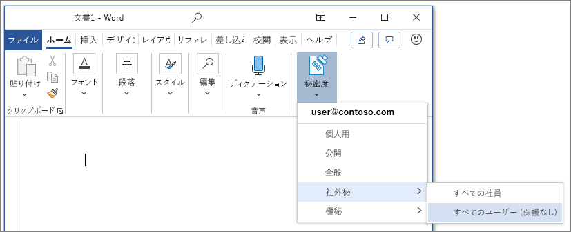

# 秘密度ラベルの詳細

>*[セキュリティとコンプライアンスのための Microsoft 365 ライセンス ガイダンス](https://aka.ms/ComplianceSD)。*

組織の従業員は、業務を行うために組織内外の関係者と共同作業を行います。このためコンテンツはファイアウォールの内側だけでなく、さまざまなデバイス、アプリ、サービスを越えて存在することになります。この場合、組織のビジネス ポリシーとコンプライアンス ポリシーを満たす安全な方法でコンテンツを保護することが必要です。

Microsoft 情報保護フレームワークの秘密度ラベルを使用すると、組織のデータを分類して保護し、ユーザーの生産性とコラボレーション機能を損なわないようにします。

リボンの [**ホーム**] タブから、Excel で利用可能な秘密度ラベルを表示する例。 この例では、適用されたラベルがステータス バーに表示されます。

秘密度ラベルは、グローバル (パブリック) クラウドのテナントでのみサポートされています。 現在、秘密度ラベルは、[国別クラウド](https://docs.microsoft.com/azure/active-directory/develop/authentication-national-cloud)などの他のクラウドのテナントではサポートされていません。

> [!NOTE]
> 秘密度ラベルは、米国政府機関向けコミュニティ (GCC) の組織ではまだ使用できません。

機密ラベルを適用するには、ユーザーは職場または学校のアカウントを使用して Office にサインインする必要があります。

機密ラベルは、次の目的に使用できます。
  
- **ラベルが付けられたコンテンツに、暗号化や透かしなどの保護設定を強制適用します。** たとえば、ユーザーはドキュメントや電子メールに「社外秘」ラベルを適用できます。そのラベルによって、コンテンツを暗号化して「社外秘」の透かしを適用できます。

- **さまざまなプラットフォームやデバイスで Office アプリのコンテンツを保護する。** サポートされているアプリの一覧については、「[Use sensitivity labels in Office apps (Office アプリの秘密度ラベルを使用する)](sensitivity-labels-office-apps.md)」を参照してください。

- Microsoft Cloud App Security を使用して**サード パーティ製アプリおよびサービスのコンテンツを保護する**。 Cloud App Security を使用すると、サード パーティ製アプリおよびサービス (SalesForce、Box、Dropbox など) のコンテンツを検出、分類、ラベル適用、および保護できます (サード パーティ製のアプリやサービスが機密ラベルを認識しない場合やサポートしない場合でも可能です)。

- **秘密度ラベルの適用をサード パーティ製アプリやサービスに拡大する。** Microsoft Information Protection SDK を使用すると、秘密度ラベルの読み取りと保護設定の適用をサード パーティ製アプリで行えるようになります。

- **保護設定を何も使わずにコンテンツを分類する。** 使用し、共有しているコンテンツを永続化、ローミングする（ステッカーなどの）コンテンツに分類をただ割り当てることもできます。 この分類を使用して使用状況レポートを作成し、機密性の高いコンテンツのアクティビティ データを確認できます。 この情報に基づいて常に選択し、後で保護設定を適用できます。

Microsoft 365 の秘密度ラベルを使用することにより、これらすべてのケースにおいて適切なコンテンツで適切な措置をとることができます。 秘密度ラベルを使用すると、組織全体でデータを分類し、その分類に基づいて保護設定を適用できます。

## 機密ラベルとは

ドキュメントやメールに割り当てる秘密度ラベルは、次のような特性のコンテンツに適用されるスタンプのような役目を果たします。

- **カスタマイズ可能。** さまざまな機密レベルのコンテンツに対応する組織内での分類項目 (「個人」、「公開」、「一般」、「社外秘」、「極秘」など) を作成できます。

- **クリア テキスト:**  ラベルはコンテンツのメタデータにクリア テキストとして保存されるため、サードパーティのアプリやサービスはラベルを読み取り、必要に応じてそれぞれの保護アクションを適用することができます。

- **永続性。** 秘密度ラベルをコンテンツに適用すると、ラベルは、そのメールまたはドキュメントのメタデータ内に格納されます。 これは、ラベルが保護設定を含むコンテンツとともにローミングすることを意味します。このデータは、ポリシーの適用と強制実行の基礎となります。

Office アプリでは、秘密度ラベルはメールやドキュメントのタグのようにユーザーに表示されます。

コンテンツの各アイテムには、1 つの機密ラベルを適用できます。ただし、1 つのアイテムに 1 つの機密ラベルと 1 つの[保持ラベル](retention.md#retention-labels)の両方を適用できます。

> [!div class="mx-imgBorder"]
> 

## 機密ラベルでできること

メールやドキュメントに秘密度ラベルが適用されると、そのラベルで構成済みの保護設定がコンテンツに適用されます。秘密度ラベルを使用すると、次のことができます。

- 電子メールのみ、または電子メールとドキュメントの両方の**暗号化**。 どのユーザーまたはグループがどのアクションを実行する権限を持つかを選択でき、権限を持つ期間も選択できます。 たとえば、他の組織の特定のグループのユーザーに対して、コンテンツにラベルが付けられてから 7 日間のみコンテンツを確認する権限を付与することができます。 または、管理者が割り当てるアクセス許可の代わりに、ユーザーがラベルを適用する際に、コンテンツへのアクセス許可の割り当てをユーザーが行えるようにもできます。 
    
    秘密度ラベルを作成または編集する場合の**暗号化**設定の詳細については、 「[秘密度ラベルの暗号化を使用してコンテンツへのアクセスを制限する](encryption-sensitivity-labels.md)」を参照 してください。

- ラベルが適用されているメールやドキュメントに対して透かし、ヘッダー、またはフッターを追加することで、Office アプリを使用するときに**コンテンツにマークを付ける**。 透かしはドキュメントには適用できますが、メールには適用できません。 ヘッダーと透かしの例:
    
    
    
    コンテンツ マーキングがいつ適用されるかを確認する必要がありますか？ 「[Office アプリがコンテンツ マーキングと暗号化を適用した場合](sensitivity-labels-office-apps.md#when-office-apps-apply-content-marking-and-encryption)」を参照してください。
    
    文字数の長さ: 透かしで使用できる文字数は、255 文字に制限されています。 Excel を除き、ヘッダーとフッターの文字数は 1,024 文字までに制限されています。 Excel では、ヘッダーとフッターの合計が 255 文字に制限されています。ただし、この制限には、書式設定コードなど、表示されない文字も含まれます。 この制限に達すると、入力した文字列が Excel で表示されなくなります。

- [Microsoft Teams、Microsoft 365 グループ、SharePoint サイトで秘密度ラベルを使用する](sensitivity-labels-teams-groups-sites.md)機能を有効にすると、**サイトやグループなどのコンテナー内のコンテンツを保護します**。
    
    [**サイトとグループの設定**] の構成オプションは、この機能を有効にするまで表示されません。 このラベル構成によってドキュメントは自動的にラベルが付けされるのではなく、ラベル設定はドキュメントが格納されているコンテナへのアクセスを制御することによってコンテンツを保護します。 これらの設定には、プライバシー レベル、Microsoft 365 グループ所有者がゲストをグループに追加できるかどうか、およびアンマネージド デバイスに付与されるアクセス レベルが含まれます。

- **Office アプリでラベルを自動的に適用するか、ラベルを推奨します。** ラベルを付ける機密情報のタイプを選択できます。ラベルは自動的に適用されることも、推奨するラベルを適用するようにユーザーに求めることもできます。 ラベルを推奨すると、選択したテキストがプロンプトに表示されます。 次に例を示します。
    
    
    
    秘密度ラベルを作成または編集する場合の **Office アプリの自動ラベル付け**の詳細については、 「[秘密度ラベルをコンテンツに自動的に適用する](apply-sensitivity-label-automatically.md)」を参照してください。

### ラベルの優先度 (順序の問題)

秘密度ラベルを管理センターで作成すると、そのラベルは [**ラベル**] ページの [**秘密度**] タブにあるリストに表示されます。 このリストでは、ラベルの順序が重要になります。その理由は、この順序がラベルの優先度を反映しているためです。 最も厳密な機密ラベル (「極秘」など) はリストの**下側**に表示されるようにして、最も厳密でない機密ラベル (「公開」など) はリストの**上側**に表示されるようにします。

各ドキュメントまたはメールに適用できる秘密度ラベルは 1 つだけです。 ラベルの分類を低く変更する場合の正当性を示すようユーザーに要求するオプションを選択する場合は、より低い分類はこの一覧の順序によって特定されます。 ただし、このオプションはサブラベルには適用されません。

サブラベルの順序は、[自動ラベル付け](apply-sensitivity-label-automatically.md)で使用されます。 ラベルが自動的に適用されるように構成した場合、またはラベルが推奨されるように構成した場合、複数のラベルにまたがる複数の一致が検出される可能性があります。 適用または推奨されるラベルの特定にはラベルの順序が使用されます。最後尾の秘密度ラベルが選択されます。該当する場合は、最後尾のサブラベルが選択されます。

### サブラベル (ラベルのグループ化)

サブラベルを使用すると、Office アプリのヘッダーでユーザーに表示される親ラベルの下に 1 つ以上のラベルをグループ化できます。 たとえば、「社外秘」について、組織では、その分類の特定の種類ごとに複数の異なるラベルを使用できます。 この例で、親ラベル「社外秘」は、保護設定のない単なるテキスト ラベルであり、サブラベルが存在するためコンテンツに適用できません。 その代わりに、ユーザーが「社外秘」を選択してからサブラベルを表示して、コンテンツに適用するサブラベルを選択できます。

サブラベルは、論理グループ内のユーザーにラベルを提示する簡単な方法です。 サブラベルは、親ラベルから設定を継承することはありません。 サブラベルをユーザーに発行すると、そのユーザーはそのサブラベルをコンテンツに適用することはできますが、親ラベルのみを適用することはできません。

既定のラベルとして親ラベルを選択したり、親ラベルが自動的に適用 (または推奨) されるように構成したりしないでください。 その場合、親ラベルをコンテンツに適用できなくなる可能性があります。

サブラベルの表示方法の例:

### 機密ラベルの編集または削除

管理センターで秘密度ラベルを削除してもラベルがコンテンツから自動的に削除されることはなく、そのラベルが適用されているコンテンツでは保護設定の適用が継続されます。

秘密度ラベルを編集した場合は、コンテンツには適用されていたラベルのバージョンが適用されます。

## ラベル ポリシーでできること

独自の秘密度ラベルを作成した場合、それらの秘密度ラベルを発行し、組織内のユーザーとサービスが使用できるようにする必要があります。 そうすることで、秘密度ラベルをドキュメントやメールに適用できるようになります。 Exchange メールボックスなどの場所に発行される保持ラベルと異なり、秘密度ラベルはユーザーまたはグループに発行されます。 発行された秘密度ラベルは、発行を受けたユーザーとグループの Office アプリに表示されるようになります。

ラベル ポリシーを使用すると、次のことができます。

- **ラベルを表示させるユーザーとグループを選択する。** Azure AD の特定のユーザーまたは電子メールが有効なセキュリティ グループ、配布グループ、または Microsoft 365 グループ ([動的メンバーシップ](https://docs.microsoft.com/azure/active-directory/users-groups-roles/groups-create-rule)を使用できる) にラベルを発行することができます。

- ラベル ポリシーに含まれているユーザーとグループが作成したすべての新しいドキュメントと電子メールに**既定のラベルを適用する**。 このオプションは、[Microsoft Teams、Microsoft 365 グループ、SharePoint サイトの秘密度ラベルを有効にしている場合](sensitivity-labels-teams-groups-sites.md)、コンテナーにも適用されます。 既定のラベルがドキュメントまたはメールに適切でない場合、ユーザーはいつでも変更できます。 
    
    既定ラベル使用して、すべてのコンテンツに適用する保護設定の基本レベルを設定することを検討してください。 ただし、ユーザーのとレーニングや他の制御を実施しない場合、この設定は不正確なラベル付けにつながる可能性もあります。 通常、ドキュメントの既定のラベルとして暗号化を適用するラベルを選択することはお勧めできません。 たとえば、多くの組織は、暗号化をサポートするアプリを所有していないか、認証可能なアカウントを使用していない可能性がある外部ユーザーとドキュメントを送信して共有する必要があります。 このシナリオの詳細については、「[Sharing encrypted documents with external users (外部ユーザーと暗号化されたドキュメントを共有する)](sensitivity-labels-office-apps.md#sharing-encrypted-documents-with-external-users)」を参照してください。

- **ラベル変更の正当な理由を要求する。** ユーザーがラベルを削除しようとした場合、またはラベルを低い順序番号のラベルに置き換えようとした場合は、ユーザーにこの操作の実行についての正当な理由を要求することができます。 たとえば、ユーザーは「社外秘」というラベルの付いたドキュメント (順序番号 3) を開き、そのラベルを「公開」というラベル (順序番号 1) に置き換えます。 現在、正当な理由は、管理者がレビューするための[ラベル分析](label-analytics.md)に送信されません。 ただし、[Azure Information Protection の統合ラベル付けクライアント](https://docs.microsoft.com/azure/information-protection/rms-client/aip-clientv2)は、この情報を [Azure Information Protection の分析](https://docs.microsoft.com/azure/information-protection/reports-aip)に送信します。

    

- **メールとドキュメントにラベルを適用することをユーザーに義務付ける。** これは必須ラベルとも呼ばれ、ユーザーがドキュメントを保存したりメールを送信したりできるようになる前に、ラベルを適用することを要求できます。 ラベルはユーザーが手動で割り当てることも、構成した条件に従って自動的に適用することも、既定 (上記の既定のラベルのオプション) で適用することもできます。 ラベル付けがユーザーに要求されている場合に Outlook に表示されるダイアログの例:

    
    
    > [!NOTE]
    > 現在、必須のラベル付けには [Azure Information Protection の統合ラベル付けクライアント](https://docs.microsoft.com/azure/information-protection/rms-client/install-unifiedlabelingclient-app)が必要です。 このクライアントは Windows 上でのみ実行できるため、この機能は Mac、iOS、および Android ではまだサポートされていません。
    
    このオプションを使用して、ラベル付けの適用範囲を広げることを検討してください。 ただし、ユーザーのトレーニングを実施しない場合、この設定は不正確なラベル付けにつながる可能性があります。 さらに、既定のラベルも設定しない限り、必須のラベル付けにより頻繁にダイアログが表示され、ユーザーを苛立たせる可能性があります。 

- **カスタム ヘルプ ページへのリンクを提供する。** 秘密度ラベルや使用方法についてユーザーが十分に理解していない場合は、Office アプリの **[秘密度ラベル]** メニューの一番下に表示される、[詳細情報] の URL を提供できます。

    ![リボンの [機密] ボタンに示された詳細な説明のリンク](../media/Sensitivity-label-learn-more.png)

ユーザーとグループに秘密度ラベルを割り当てるラベル ポリシーを作成した後、これらのユーザーが Office アプリのラベルを確認するまでに最大で 24 時間かかります。

作成および発行できる秘密度ラベルの数に制限はありませんが、1 つだけ例外があります。ラベルにより暗号化が適用される場合、作成できるラベルの最大数は 500 に制限されます。 ただし、管理者のオーバーヘッドを低減し、ユーザーのために複雑さを軽減するためのベスト プラクティスとして、ラベルの数は必要最小限に抑えるようにします。 実際の展開における経験から、ユーザーがメイン ラベルを 5 つ以上、または 1 つのメイン ラベルごとにサブラベルを 5 つ以上持っている場合、効果が大きく低下することが証明されています。

### ラベルのポリシー 優先度 (順序の問題)

[**ラベル ポリシー**] ページの [**機密ポリシー**] タブのリストに表示される機密ラベル ポリシーで機密ラベルを発行して、ユーザーが利用できるようにします。 機密ラベルと同じように (「[ラベルの優先度 (順序の重要性)](#label-priority-order-matters)」を参照)、機密ラベル ポリシーの順序は、優先度を反映しているため重要です。 優先度が最も低いラベル ポリシーは**一番上**に表示され、優先度が最も高いラベル ポリシーは**一番下**に表示されます。

ラベル ポリシーは次のように構成されます。

- 一連のラベル。
- ラベル ポリシーの範囲 (ポリシーに含まれるユーザーとグループ)。
- 上記のラベル ポリシーの設定 (既定のラベル、妥当性、必須ラベル、ヘルプのリンク)。

ユーザーは複数のラベル ポリシーに含めることができ、その場合、複数のポリシーのすべての秘密度ラベルがユーザーに表示されます。 ただし、ユーザーに提供されるポリシー設定は、優先度が最も高いラベル ポリシーのもののみです。

すでに 24 時間以上経過しており、ユーザーまたはグループに表示されることが想定されるラベルまたはラベル ポリシーの設定が表示されない場合は、秘密度ラベル ポリシーの順序を確認します。 ラベル ポリシーを並べ替えるには、[秘密度ラベル ポリシー] を選択し、右側にある省略記号を選択して **[下へ移動]** または **[上へ移動]** を選択します。

秘密度ラベルに加えて保持レベルも使用している場合、優先度は秘密度ラベルにとっては重要ですが、[保持ラベル](retention.md#the-principles-of-retention-or-what-takes-precedence)にとっては重要ではないということを覚えておく必要があります。

## 秘密度ラベルと Azure Information Protection

ラベルの展開に Azure Information Protection を使用している場合は、秘密度ラベルを使用する前に、次のセクションを参考にしてください。

### Azure Information Protection のラベル

> [!NOTE]
> Azure ポータルでの Azure Information Protection ラベルのラベル管理は、**2021 年 3 月 31 日**に廃止されます。 詳細については、公式の「[廃止のお知らせ](https://techcommunity.microsoft.com/t5/azure-information-protection/announcing-timelines-for-sunsetting-label-management-in-the/ba-p/1226179)」を参照してください。

テナントがまだ[統合ラベル付けプラットフォーム](https://docs.microsoft.com/azure/information-protection/faqs#how-can-i-determine-if-my-tenant-is-on-the-unified-labeling-platform)上にないことが理由で Azure Information Protection ラベルを使用している場合は、統合ラベル付けを有効にするまでは秘密度ラベルを作成しないことをお勧めします。 このシナリオでは、Azure ポータルに表示されるラベルは、秘密度ラベルではなく、Azure Information Protection のラベルになります。 これらのラベルは、Windows コンピューター上の Azure Information Protection クライアント (クラシック) で使用できますが、macOS、iOS、または Android を実行しているデバイスでは使用できません。 この問題を解決するには、[これらのラベルを秘密度ラベルに移行](/azure/information-protection/configure-policy-migrate-labels)させます。 

この 2 つのセットのラベルによって適用されるメタデータ同士には互換性があるため、移行完了後にドキュメントとメールにラベルを付け直す必要はありません。

### Azure Information Protection クライアント

秘密度ラベルを Windows コンピューター上の Microsoft 365 Apps for enterprise アプリで使用する場合は、Azure Information Protection クライアントを使用するか、Office に組み込まれているラベル付け機能を使用するかを選ぶことができます。

既定では、Azure Information Protection クライアントがインストールされている場合、組み込みのラベル付け機能はこれらのアプリでオフになっています。 この既定の動作の変更方法などの詳細については、「[Office built-in labeling client and the Azure Information Protection client (Office 組み込みラベル付けクライアントおよび Azure Information Protection クライアント)](sensitivity-labels-office-apps.md#office-built-in-labeling-client-and-the-azure-information-protection-client)」を参照してください。

Office アプリで組み込みのラベル付けを使用する場合でも、Azure Information Protection 統合ラベル付けクライアントを次の秘密度ラベルと共に使用することもできます。

- オンプレミスに保存されている機密情報を検出し、オプションでそのコンテンツにラベルを付けるスキャナー

- ユーザーがすべてのファイルの種類にラベルを適用するためのファイル エクスプローラーの右クリック オプション

- テキスト、画像、または PDF ドキュメントの暗号化されたファイルを表示するビューアー

- オンプレミスのファイル内の機密情報を検出し、これらのファイルからラベルおよび暗号化を適用または削除するための PowerShell モジュール。

Azure Information Protection の初心者、またはラベルを移行したばかりの Azure Information Protection の既存のお客様である場合は、Azure Information Protection のドキュメントから「[Windows コンピューターに使用するラベル クライアントを選択する](https://docs.microsoft.com/azure/information-protection/rms-client/use-client#choose-which-labeling-client-to-use-for-windows-computers)」参照してください。

## 秘密度ラベルと Microsoft Cloud App Security

Cloud App Security (CAS) を使用することにより、サード パーティ製サービスおよびアプリ (SalesForce、Box、Dropbox など) のコンテンツを検出、分類、ラベル適用、および保護できます。 

Cloud App Security は、Azure Information Protection ラベルと秘密度ラベルの両方で動作します。

- ラベル管理センターに 1 つ以上の秘密度ラベルが少なくとも 1 人のユーザーに[発行](create-sensitivity-labels.md#publish-sensitivity-labels-by-creating-a-label-policy)されている場合: 秘密度ラベルが使用されます。

- ラベル管理センターに秘密度ラベルが発行されていない場合: Azure Information Protection ラベルが使用されます。

Cloud App Security をこれらのラベルで使用する手順については、「[Azure Information Protection の統合](https://docs.microsoft.com/cloud-app-security/azip-integration)」を参照してください。

## 秘密度ラベルと Microsoft Information Protection SDK

秘密度ラベルはドキュメントのメタデータにクリア テキストとして保存されるため、サードパーティ製のアプリおよびサービスはこのラベル付けメタデータを読み書きして、ラベル付けの展開を補完できます。 さらに、ソフトウェア開発者は [Microsoft Information Protection SDK](https://docs.microsoft.com/information-protection/develop/overview#microsoft-information-protection-sdk) を使用して、複数のプラットフォームにわたってラベル付けおよび暗号化機能を完全にサポートできます。 詳細については、[Tech Community ブログでの一般提供のお知らせ](https://techcommunity.microsoft.com/t5/Microsoft-Information-Protection/Microsoft-Information-Protection-SDK-Now-Generally-Available/ba-p/263144) を参照してください。 

[Microsoft Information Protection に統合されているパートナー ソリューション](https://techcommunity.microsoft.com/t5/Azure-Information-Protection/Microsoft-Information-Protection-showcases-integrated-partner/ba-p/262657)についての説明もご覧いただけます。

## 展開ガイダンス

「[秘密度ラベルの使用を開始する](get-started-with-sensitivity-labels.md)」をご覧ください。

