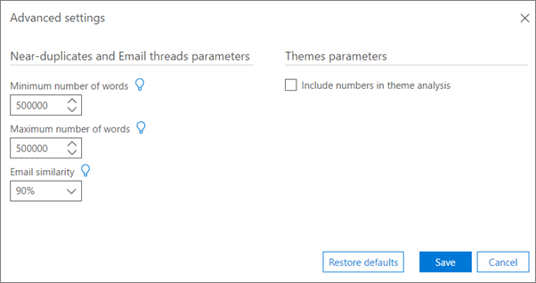

# 高度な電子情報開示の高度な設定を分析する設定を行う

> [!NOTE]
> Advanced eDiscovery を使用するには、Advanced Compliance アドオンがインストールされた Office 365 E3 サブスクリプション、または E5 サブスクリプションがお客様の組織で必要になります。このプランを利用しておらず、Advanced eDiscovery をお試しになりたい場合は、[Office 365 Enterprise E5 の試用版にサインアップ](https://go.microsoft.com/fwlink/p/?LinkID=698279)してください。 
  
Advanced eDiscovery は、モジュール設定を分析するための既定の高度なパラメーターを提供します。 次の手順では、指定可能な設定について説明します。
  
1. [Analyze の設定の準備] タブで、[**詳細設定**] (ページの下部) をクリックします。 ** \> \> ** 次のパネルが表示されます。 
    
    
  
2. [**ほぼ重複] および [電子メールスレッド] パラメーター**で、必要に応じて次の値を選択します。
    
  - **少なく**とも1つの単語の最小数: ファイルがほぼ重複した分析のために送信されません。 
    
  - **単語の**最大数: 単語の最大数。これは、ほぼ重複した分析のためにファイルが送信されません。
    
  - **電子メールの類似性**: 2 通の電子メールについては、resemblance の最低限のレベルで類似したものと見なされます。 値は常に等しいか、ドキュメントの類似性よりも大きい値です。 既定値は90% です。
    
3. [テーマの**パラメーター**] で、[**テーマの分析に数字を含める**] チェックボックスをオンにして、分析中のテーマの処理に番号を含めます。 
    
4. [**保存**] をクリックします。 
    
## 関連トピック

[Advanced eDiscovery (クラシック)](office-365-advanced-ediscovery.md)
  
[ドキュメントの類似点について](understand-document-similarity-in-advanced-ediscovery.md)
  
[分析オプションの設定](set-analyze-options-in-advanced-ediscovery.md)
  
[無視するテキストの設定](set-ignore-text-in-advanced-ediscovery.md)
  
[分析結果の表示](view-analyze-results-in-advanced-ediscovery.md)

