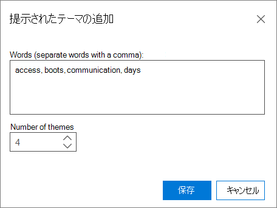

# Advanced eDiscovery で分析オプションを設定する (クラシック)

> [!NOTE]
> Advanced eDiscovery requires an Office 365 E3 with the Advanced Compliance add-on or an E5 subscription for your organization. If you don't have that plan and want to try Advanced eDiscovery, you can [sign up for a trial of Office 365 Enterprise E5](https://go.microsoft.com/fwlink/p/?LinkID=698279). 
  
Advanced eDiscovery で、analyze を実行する前に Analyze オプションを設定します。
  
## 分析オプションを設定する

[ ** \> Analyze の準備**] \> **セットアップ**を開きます。 次のウィンドウが表示されます。
  
![[分析設定] のオプション](../media/c3ec7a92-8484-4812-b98c-aa3eb740e5b7.png)
  
 **ほぼ重複した電子メールスレッド**分析を実行する場合は、このチェックボックスをオンにします。 既定では選択されています。 
  
 **ドキュメントの類似性**[重複した場合のしきい値」の値を入力するか、既定値の65% をそのまま使用します。 
  
 **テーマ**すべてのファイルを処理して、テーマを割り当てるには、このボックスをオンにします。 既定では、このチェックボックスはオフになっています。 テーマ処理を実行する場合は、次のオプションを入力します。
  
- **テーマの最大数**作成するテーマの数の値を入力または選択します。 既定値は 200 です。 
    
    > [!NOTE]
    > テーマの数を増やすと、パフォーマンスに影響が及び、一般化するテーマの能力が向上します。 テーマの数が多いほど、より詳細なものになります。 たとえば、50テーマのセットに "バスケットボール、Spurs、Clippers、Lakers" などのテーマが含まれているとします。300テーマには、"Spurs"、"Clippers"、"Lakers" の各テーマが含まれている場合があります。 テーマ "バスケットボール" を認識していない場合に、ECA でこの機能を使用すると、"バスケットボール" というテーマが役に立つ場合があります。 しかし、処理に含まれているテーマの数が多すぎると、"バスケットボール" という単語は表示されず、Spurs と Clippers が、起動時に表示されて、ヘアサイトで使用されるアイテムではなく、確認が適切なバスケットボールテーマであることがわかりません。 
  
- **推奨**されるテーマテーマの単語を提案して、テーマの処理を制御することができます。 高度な電子情報開示では、推奨される単語に焦点を絞り、"テーマの最大数" の設定に基づいて1つ以上の関連するテーマの作成を試みます。 
    
    たとえば、提案された単語が "computer" で、"2" が "テーマの最大数" として指定されている場合、上級電子情報開示では、"computer" という単語に関連する2つのテーマが生成されます。 この2つのテーマは、「コンピューターソフトウェア」と「コンピュータハードウェア」などです。 
    
    
  
1. 提案されたテーマを表示、追加、または編集するには、[**変更**] をクリックします。
    
2. [**推奨**されたテーマ] パネルで、 **[追加** ![ ] アイコンアイコンをクリックして ](../media/c2dd8b3a-5a22-412c-a7fa-143f5b2b5612.png) テーマを追加します。 [**推奨テーマの追加**] パネルで、単語をコンマで区切って追加します。 
    
3. [**テーマの数**] で、詳細電子情報開示によって生成されるテーマの数を決定する値を選択します (既定では1テーマ)。
    
4. [**保存**] をクリックし、ダイアログを閉じます。 
    
    > [!NOTE]
    > テーマの合計数には、提案されたテーマが含まれています。 推奨されるテーマの合計は、テーマ合計を超えることはできません。 テーマの総数に対して多数の推奨テーマがある場合は、ほとんどのテーマが提案されたテーマに特化されるので、いくつかの "" 斬新 "テーマのみがシステムによって検出されます。 
  
- **モード**ドロップダウンリストから [**テーマ**] オプションを選択します。 
    
  - **モデルの作成と適用**: モデルによって、ファイルのセグメントからテーマを計算し、それらの間でファイルを配布します。
    
  - **Create model**: ファイルのセグメントからテーマモデルを計算します。 ファイルを分割する処理は、別の時点で個別に実行されます。
    
  - [**モデルの適用**]: このオプションは、モデルが以前に作成され、まだ適用されていない場合にのみ表示されます。 これにより、テーマに基づいてファイルが分割されます。
    
また、[[無視] テキストを設定](set-ignore-text-in-advanced-ediscovery.md)し、[分析のために[詳細設定を分析](set-analyze-advanced-settings-in-advanced-ediscovery.md)] を設定することもできます。 
  
これらのオプションを設定した後、[ **Analyze** ] をクリックして実行します。 [分析結果の表示](view-analyze-results-in-advanced-ediscovery.md)が表示されます。 
  
## 関連トピック

[Advanced eDiscovery (クラシック)](office-365-advanced-ediscovery.md)
  
[ドキュメントの類似点について](understand-document-similarity-in-advanced-ediscovery.md)
  
[無視するテキストを設定する](set-ignore-text-in-advanced-ediscovery.md)
  
[分析設定の拡張設定](set-analyze-advanced-settings-in-advanced-ediscovery.md)
  
[分析結果の表示](view-analyze-results-in-advanced-ediscovery.md)

