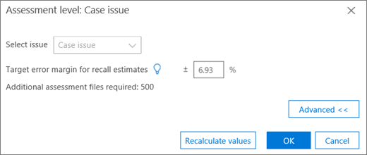
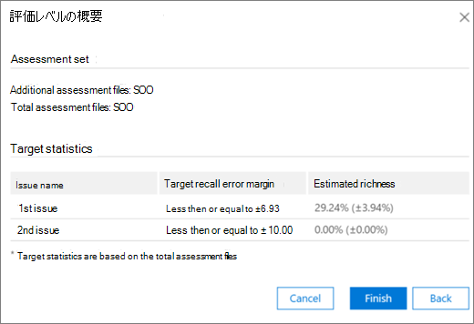

# 高度な電子情報開示でのタグ付けと評価 (クラシック)

> [!NOTE]
> Advanced eDiscovery を使用するには、Advanced Compliance アドオンがインストールされた Office 365 E3 サブスクリプション、または E5 サブスクリプションがお客様の組織で必要になります。このプランを利用しておらず、Advanced eDiscovery をお試しになりたい場合は、[Office 365 Enterprise E5 の試用版にサインアップ](https://go.microsoft.com/fwlink/p/?LinkID=698279)してください。 
  
このセクションでは、Advanced eDiscovery 関連性評価モジュールの手順について説明します。 
  
## 評価トレーニングと分析の実行

1. [**関連\>トラック**] タブで、[case**評価を開始する] を**クリックします。 
    
    この手順では、例として、500ファイルの評価セットのサンプルを作成し、[**タグ**] タブを表示します。これには、タグパネル、表示されるファイルのコンテンツ、およびその他のタグ付けのオプションが含まれます。 
    
    ![評価ための [関連性タグ] タブ](../media/c8acf891-b1cd-4344-816c-eabb8cbbe742.png)
  
2. サンプル内の各ファイルを確認し、各ケースの問題についてファイルの関連性を調べて、関連性 (R) を使用してファイルをタグ付けし、[タグ**付けパネル**] ウィンドウで関連 (NR) および Skip ボタンを使用します。 
    
    > [!NOTE]
    >  評価には、500のタグ付きファイルが必要です。 ファイルが "スキップ" された場合は、タグに追加のファイルを受信します。 
  
3. サンプル内のすべてのファイルにタグを付けた後、[**計算**] をクリックします。 
    
    次に示すように、評価の現在の誤差範囲と多様性が計算され、[**関連性の追跡**] タブに表示され、問題ごとの詳細が展開されます。 このダイアログの詳細については、後の「評価結果をレビューする」セクションで説明します。 
    
    
  
    > [!TIP]
    > 既定では、問題の評価進行状況インジケーターが完了したときに、評価サンプルが確認され、十分な関連ファイルがタグ付けされたことを示す、既定の次の手順に進むことをお勧めします。 それ以外の場合は、[**トラック**] タブの結果を表示し、エラーの余白と次の手順を制御するには、[**次のステップ**に**変更**します] をクリックし、[**評価を続行**する] を選択して、[ **OK]** をクリックします。 > 
  
1. [**評価**] チェックボックスの右にある [**変更**] をクリックして、問題ごとの評価パラメーターを表示および指定します。 次の例に示すように、各問題の**評価レベル**のダイアログボックスが表示されます。 
    
    
  
    次の問題のパラメーターが計算され、[**評価レベル**] ダイアログボックスに表示されます。 
    
    **呼び戻し推定のターゲット誤差**範囲: この値に基づいて、確認に必要な追加ファイルの推定数が計算されます。 呼び戻しで使用される余白は75% より大きく、信頼度は95% です。 
    
    **必要な追加評価ファイル**: 現在の誤差範囲の要件が満たされていない場合に必要なファイルの数を示します。 
    
2. 現在の誤差範囲を調整し、さまざまな誤差の余白の効果を確認する (1 つの問題):
    
1. **[問題の選択**] リストで、問題を選択します。 
    
2. [**呼び戻しの推定の対象誤差**範囲] に、新しい値を入力します。
    
3. [**値の更新**] をクリックして、調整の影響を確認します。 
    
3. [**評価レベル**] ダイアログボックスの [**詳細設定**] をクリックして、次の追加パラメーターと詳細を確認します。 
    
    ![[評価レベルのケースの問題] 詳細ビュー](../media/577d7e0e-95df-48c2-9dec-bdeab5e801d8.png)
  
    現在の評価結果に応じて予想さ**れる豊富な見積もり:**
    
    **呼び戻しの推定**値: 既定では、ターゲットの誤差範囲は、75% を超える呼び戻しに適用されます。 このパラメーターを変更して、別の範囲の呼び戻し値に対する誤差の余白を制御する場合は、[**編集**] をクリックします。 
    
    **信頼**度: 既定では、推奨される精度の誤差の余白は95% です。 このパラメーターを変更する場合は、[**編集**] をクリックします。 
    
    **必要な豊富な誤差**範囲: 更新された値がある場合は、その他の評価ファイルがすべてレビューされた後に、この誤差の誤差の予想される余白を指定します。
    
    **必要な追加評価ファイル**: 更新された値があれば、ターゲットに到達するためにレビューする必要がある追加評価ファイルの数を指定します。
    
    **必要な合計評価ファイル**: 更新された値、レビューに必要な評価ファイルの総数が表示されます。
    
    **評価に必要な関連ファイルの数**: 更新された値があれば、すべての追加評価ファイルがレビューされた後に、評価全体で予想される関連ファイルの数。
    
4. パラメーターが変更された場合は、[**値の再計算**] をクリックします。 完了したら、1つの問題が発生した場合は [ **OK** ] をクリックして変更を保存します (または、複数の問題があり、確認または変更して**終了**する場合は、**次**の操作を行います)。 
    
    複数の問題がある場合、次の例に示すように、すべての問題がレビューまたは調整された後に、**評価レベル: 概要**ダイアログが表示されます。 
    
    
  
    評価が正常に完了したら、関連トレーニングの次のステージに進みます。
    
## 評価結果の確認

評価サンプルにタグ付けされた後、評価結果が計算され、[関連トラック] タブに表示されます。
  
次の結果が、展開されたトラックの表示に表示されます。 
  
- 評価の現在のエラーのマージン (呼び戻し推定)
    
- 予想豊富
    
- その他の評価ファイルが必要 (レビュー用)
    
[評価電流誤差] 余白は、Advanced eDiscovery で推奨されるエラーの余白です。 「その他の評価ファイルが必要」に表示される番号は、その推奨事項に対応しています。
  
評価進行状況インジケーターは、現在の誤差範囲に指定された評価の完了レベルを示します。 評価が進行している場合、ユーザーは別の評価サンプルにタグ付けします。
  
評価の進行状況インジケーターで評価が完了と表示された場合、評価サンプルレビューが完了し、十分な関連ファイルがタグ付けされたことを意味します。 
  
展開されたトラックの表示には、推奨される次のステップ、評価統計、詳細結果へのアクセスが表示されます。
  
豊富な機能が非常に少ない場合は、有用な統計情報を生成するために最小限の数の関連ファイルを得るために必要な追加の評価ファイルの数が非常に高くなります。 上級電子情報開示については、トレーニングに移行することをお勧めします。 評価進行状況インジケーターは影付きになり、統計情報は利用できません。 
  
統計的に基づく安定化が行われていない場合、精度と信頼度のレベルが低いという結果になります。 ただし、検出された関連ファイルの割合を知る必要がない場合は、これらの結果を使用して関連するファイルを見つけることができます。 同様に、この状態を使用して、関連性スコアが特定の問題に関連するファイルへのアクセスを促進する、低低性の問題をトレーニングすることもできます。
  
> [!TIP]
> [**関連性\>の追跡**] タブの展開された案件の表示では、次の表示オプションを使用できます。次の手順のような、推奨される次の手順を > します。 [**変更**] ボタンを右にクリックして、**次の手順**で別の手順を選択することで、**タグ付け**を省略できます (問題ごと)。 評価の進行状況インジケーターが完了していない場合は、評価ファイルを追加して、統計の精度を上げるための次の推奨オプションとなります。 > 誤差範囲を変更し、その影響を評価するには、[**変更**] をクリックし、[**評価レベル] ダイアログ**で [**取り消しの推定] の対象**となるエラーの余白を変更して、[**値の更新**] をクリックします。 また、このダイアログボックスで、[**詳細**設定] をクリックして詳細オプションを表示することもできます。 > [**表示**] をクリックすると、追加の評価レベルの統計情報とその影響を表示できます。 [詳細結果の表示] ダイアログでは、1つの問題について、少なくとも500のタグ付き評価ファイルがあり、少なくとも18個のファイルが問題に関連してタグ付けされている場合に、統計情報を使用できます。 
  
## 関連項目

[Advanced eDiscovery (クラシック)](office-365-advanced-ediscovery.md)
  
[関連性の評価について](assessment-in-relevance-in-advanced-ediscovery.md)
  
[タグ付けと関連性トレーニング](tagging-and-relevance-training-in-advanced-ediscovery.md)
  
[関連性分析の追跡](track-relevance-analysis-in-advanced-ediscovery.md)
  
[結果に基づいて決定する](decision-based-on-the-results-in-advanced-ediscovery.md)
  
[関連性分析のテスト](test-relevance-analysis-in-advanced-ediscovery.md)

