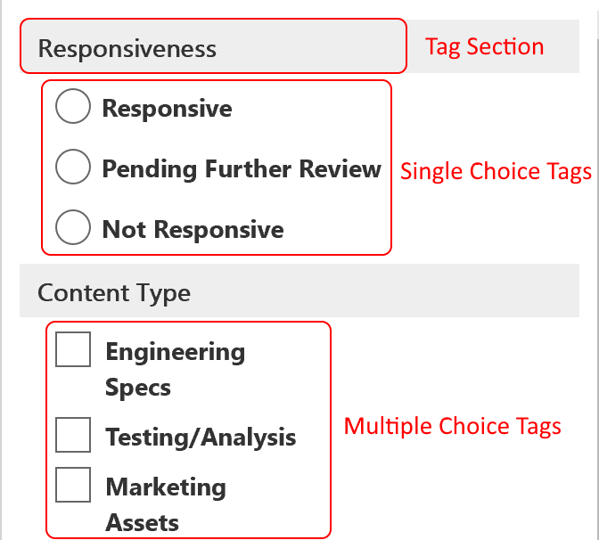

# レビュー セット内のドキュメントをタグ付けするTag documents in a review set

レビューセットのコンテンツを整理することは、電子情報開示プロセスでさまざまなワークフローを完了するために重要です。Organizing content in a review set is important to complete various workflows in the eDiscovery process. これには、次の内容が含まれます。This includes:

- 不要なコンテンツのカリングCulling unnecessary content

- 関連するコンテンツを特定するIdentifying relevant content
 
- 専門家または弁護士が確認する必要があるコンテンツを特定するIdentifying content that must be reviewed by an expert or an attorney

専門家、弁護士、または他のユーザーがレビューセットのコンテンツをレビューする場合、コンテンツに関連する意見をタグを使用して取得できます。When experts, attorneys, or other users review content in a review set, their opinions related to the content can be captured by using tags. たとえば、不要なコンテンツをカリングすることが目的の場合、ユーザーは "応答不可" などのタグを持つドキュメントにタグを付けます。For example, if the intent is to cull unnecessary content, a user can tag documents with a tag such as “non-responsive”. コンテンツをレビューしてタグ付けした後は、レビューセット検索を作成して、"応答不可" とタグ付けされたコンテンツを除外することができます。これにより、電子情報開示ワークフローの次のステップからそのコンテンツが削除されます。After content has been reviewed and tagged, a review set search can be created to exclude any content tagged as “non-responsive”, which eliminates this content from the next steps in the eDiscovery workflow. タグパネルは、すべてのケースについてカスタマイズできます。そのため、タグが目的のレビューワークフローをサポートできるようになります。The tag panel can be customized for every case so that the tags can support the intended review workflow.

## タグの種類Tag types

上級電子情報開示には、次の2種類のタグがあります。Advanced eDiscovery provides two types of tags:

- **単一選択タグ**-ユーザーがグループ内の1つのタグを選択できるように制限します。**Single choice tags** - Restricts users to select a single tag within a group. これは、ユーザーが "応答可能" や "応答不可" などの競合するタグを選択しないようにするのに便利です。This can be useful to ensure users don’t select conflicting tags such as “responsive” and “non-responsive”. これらはラジオボタンとして表示されます。These will appear as radio buttons.

- **複数選択タグ**-ユーザーがグループ内で複数のタグを選択できるようにします。**Multiple choice tags** - Allow users to select multiple tags within a group. これらはチェックボックスとして表示されます。These will appear as checkboxes.

## タグ構造Tag structure

タグの種類に加えて、タグパネルでタグを構成する方法の構造を使用して、タグ付きドキュメントをより直観的に作成できます。In addition to the tag types, the structure of how tags are organized in the tag panel can be used to make tagging documents more intuitive. タグはセクションごとにグループ化されます。Tags are grouped by sections. レビューセット検索は、タグとタグで検索する機能をサポートしています。Review set search supports the ability to search by tag and by tag section. つまり、レビューセット検索を作成して、セクション内のタグでタグ付けされたドキュメントを取得することができます。This means you can create a review set search to retrieve documents tagged with any tag in a section.

タグは、セクション内にネストすることで、さらに整理することができます。Tags can be further organized by nesting them within a section. たとえば、権限のあるコンテンツを識別し、タグ付けすることを目的としている場合は、ネストを使用して、ユーザーがドキュメントを "特権付き" としてタグ設定し、適切なネストされたタグをチェックすることで特権の種類を選択できることを明確にすることができます。For example, if the intent is to identify and tag privileged content, nesting can be used to make it clear that a user can tag a document as “Privileged” and select the type of privilege by checking the appropriate nested tag.

## タグの適用Applying tags

コンテンツにタグを適用するには、いくつかの方法があります。There are several ways to apply a tag to content.

### 1つのドキュメントにタグを付けます。Tagging a single document

校閲セットでドキュメントを表示するときに、[タグ**付けパネル]** をクリックすると、レビューで使用できるタグを表示できます。When viewing a document in a review set, you can display the tags that a review can use by clicking **Tagging panel**.

![[タグパネル] をクリックして、タグパネルを表示します。](../media/Singledoctag.png)

これにより、ビューアーに表示されるドキュメントにタグを適用することができます。This will enable you to apply tags to the document displayed in the viewer.

### 一括タグ付けBulk tagging

一括タグ付けを行うには、結果グリッドで複数のファイルを選択し、1つのドキュメントにタグ付けするのと同じように、タグ**付けパネル**のタグを使用します。Bulk tagging can be done by selecting multiple files in the results grid and then using the tags in the **Tagging panel** similar to tagging single documents. タグを2回選択することで一括でのタグの解除を行うことができます。最初のクリックでタグが適用され、2番目の選択によって、選択されているすべてのファイルのタグがクリアされます。Bulk un-tagging can be done by selecting tags twice; the first click will apply the tag, and the second selection will ensure that tag is cleared for all selected files.

> [!NOTE]
> 一括タグ付けの場合、タグ付けパネルには、パネル内の各タグに対してタグ付けされたファイルの数が表示されます。When bulk tagging, the tagging panel will display a count of files that are tagged for each tag in the panel.

### 他のレビューパネルでのタグ付けTagging in other review panels

ドキュメントを確認するときは、他のレビューパネルを使用して、結果グリッド内のドキュメントの他の特性を確認できます。When reviewing documents, you can use the other review panels to review other characteristics of documents in the results grid. これには、その他の関連ドキュメント、電子メールスレッド、ほぼ重複、ハッシュの重複の確認が含まれます。This includes reviewing other related documents, email threads, near duplicates, and hash duplicates. たとえば、[**ドキュメントファミリ**レビュー] パネルを使用して関連ドキュメントをレビューしている場合は、関連するドキュメントを一括でタグ付けすることで、レビュー時間を大幅に短縮できます。For example, when you're reviewing related documents (by using the **Document family** review panel), you can significantly reduce review time by bulk tagging related documents. たとえば、電子メールメッセージに複数の添付ファイルがあり、ファミリー全体が一貫してタグ付けされるようにする場合などです。For example, if an email message has several attachments and you want to ensure that the entire family is tagged consistently.

たとえば、**ドキュメントファミリー**レビューパネルを使用しているときに**タグ付けパネル**を表示する方法は次のとおりです。For example, here's how to display the **Tagging panel** when using the **Document family** review panel:

1. 選択したドキュメントに対してレビューパネルを開き (たとえば、関連するコンテンツのリストを**ドキュメントファミリー**レビューパネルに表示する)、ドキュメントファミリーレビューパネルの下の [**タグ付けドキュメント**] をクリックします。With the review panel open for a selected document (for example, displaying the list of related content in the **Document family** review panel, click **Tag documents** under the document family review panel.

   タグパネルはポップアップウィンドウとして表示されます。The tagging panel is displayed as a pop-up window.

2. 1つ以上のタグを選択して、選択したドキュメントを適用します。Choose one or more tags to apply the selected document. 

3. すべてのドキュメントにタグ付けするには、**ドキュメントファミリー**パネルで [すべてのドキュメント] を選択し、[**ドキュメントのタグ付け**] をクリックして、ドキュメントのファミリー全体に適用するタグを選択します。To tag all documents, select all documents in the **Document family** panel, click **Tag documents**, and then choose the tags to apply to the entire family of documents.

