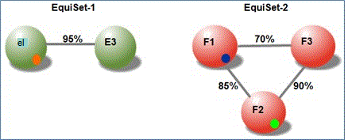
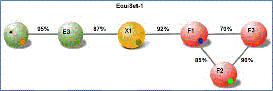

# Advanced eDiscovery でのドキュメントの類似性 (クラシック) についてUnderstand document similarity in Advanced eDiscovery (classic)

> [!NOTE]
> Advanced eDiscovery を使用するには、Advanced Compliance アドオンがインストールされた Office 365 E3 サブスクリプション、または E5 サブスクリプションがお客様の組織で必要になります。このプランを利用しておらず、Advanced eDiscovery をお試しになりたい場合は、[Office 365 Enterprise E5 の試用版にサインアップ](https://go.microsoft.com/fwlink/p/?LinkID=698279)してください。Advanced eDiscovery requires an Office 365 E3 with the Advanced Compliance add-on or an E5 subscription for your organization. If you don't have that plan and want to try Advanced eDiscovery, you can [sign up for a trial of Office 365 Enterprise E5](https://go.microsoft.com/fwlink/p/?LinkID=698279). 
  
詳細な電子情報開示では、ドキュメントの類似性は、2つのドキュメントがほぼ重複していると見なされるために必要な resemblance の最小レベルです。In Advanced eDiscovery, Document Similarity is the minimal level of resemblance required for two documents to be considered as near-duplicates.
  
> [!TIP]
> ほとんどのビジネスアプリケーションでは、類似性値 60%-75% を使用することをお勧めします。For most business applications, it is recommended to use a Similarity value of 60%-75%. 非常に低品質な光学式文字認識 (OCR) 資料の場合は、類似性の値を低くして適用できます。For very poor quality optical character recognition (OCR) material, lower Similarity values can be applied. 
  
> [!NOTE]
> 特定のケースに対して設定して実行した後、類似性の値を変更することはできません。After it's set and run for a given case, the Similarity value cannot be changed. 
  
同一の複製 (ND) セット内では、類似性のしきい値の下に resemblance レベルのドキュメントが存在することがあります。Within a Near-duplicate (ND) set, there may be documents with a level of resemblance below the Similarity threshold. 文書を ND セットに参加させるには、その類似性を超えるレベルの resemblance で、ND セットに少なくとも1つのドキュメントが存在する必要があります。For a document to join an ND set, there must be at least one document in the ND set with a level of resemblance exceeding the Similarity. 
  
たとえば、類似性が80% に設定されている場合、document F1 はレベル85% のドキュメント F2 に似ていますが、ドキュメント F2 はドキュメント F3 のレベルが90% であると仮定します。For example, assume the Similarity is set to 80%, document F1 resembles document F2 at a level of 85%, and document F2 resembles document F3 at a level of 90%. 
  
ただし、document F1 は、しきい値を下回る70% のレベルで、document F3 のようになります。However, document F1 may resemble document F3 at a level of only 70%, which is below the threshold. しかし、この例では、ドキュメント F1、F2、および F3 はすべて、一方の ND セットに表示されます。Nonetheless, in this example, documents F1, F2, and F3 all appear in the one ND set. 同様に、類似性値80% を使用すると、2つのセットが作成されている可能性があります。Similarly, using a Similarity value of 80%, we may have created two sets, EquiSet-1 and EquiSet-2. 設定-1 には、E1 および E2 というドキュメントが含まれています。EquiSet-1 contains documents E1 and E2. [設定] は、ドキュメント F1、F2、および F3 を含みます。Equiset-2 contains documents F1, F2, and F3. 
  
Resemblance のレベルは次のように示されています。The levels of resemblance are illustrated as follows:
  

  
別のドキュメント X1 が挿入されたと仮定します。Assume that another document, X1, is now inserted. X1 と E3 の間の resemblance は87% です。The resemblance between X1 and E3 is 87%. 同様に、X1 と F1 の間の resemblance は92% です。Similarly, the resemblance between X1 and F1 is 92%. その結果として、すべての設定が1つの ND セットに結合されるようにします。As a result, EquiSet -1, EquiSet -2, and X1 are now combined into one ND set.
  

  
> [!NOTE]
> 1つの ND セットに2つのドキュメントが割り当てられている場合は、そのセットに追加のドキュメントが追加された場合でも、セットが結合された場合でも、同じ ND セットに残ります。If any two documents are assigned to one ND set, they will remain together in the same ND set, even if additional documents are added to the set or if the sets are merged. 
  
設定が結合されると、新しい文書がセットに追加されたときにピボットドキュメントが変更されることがあります。After sets are merged, the Pivot document can change when new documents are added to a set. 
  
## 関連項目See also

[Advanced eDiscovery (クラシック)Advanced eDiscovery (classic)](office-365-advanced-ediscovery.md)
  
[分析オプションの設定Setting Analyze options](set-analyze-options-in-advanced-ediscovery.md)
  
[無視するテキストの設定Setting ignore text](set-ignore-text-in-advanced-ediscovery.md)
  
[[詳細設定の分析] の設定](set-analyze-advanced-settings-in-advanced-ediscovery.md)[Setting Analyze advanced settings](set-analyze-advanced-settings-in-advanced-ediscovery.md)
  
[分析結果の表示Viewing Analyze results](view-analyze-results-in-advanced-ediscovery.md)

