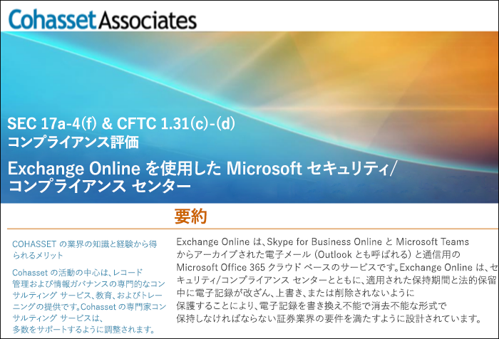

# Exchange Online および セキュリティ/コンプライアンス センターを使用して米国証券取引委員会規則 17a-4 (SEC Rule 17a-4) に準拠する

>*[セキュリティとコンプライアンスのための Microsoft 365 ライセンス ガイダンス](https://aka.ms/ComplianceSD)。*

If your organization needs to comply with regulatory standards for retaining your data, the Security & Compliance Center provides features to manage the lifecycle of your data in Exchange Online. This includes the ability to retain, audit, search, and export your data. These capabilities are sufficient to meet the needs of most organizations.

However, some organizations in highly regulated industries are subject to more stringent regulatory requirements. For example, financial institutions such as banks or broker dealers are subject to Rule 17a-4 issued by the Securities and Exchange Commission (SEC). Rule 17a-4 has specific requirements for electronic data storage, including many aspects of record management, such as the duration, format, quality, availability, and accountability of records retention.

セキュリティ/コンプライアンス センターを活用して Exchange Online での規制上の義務 (特に、規則 17a-4 の要件に関する義務) を遵守することができ、これをこれらの組織でもっと知っていただくために、Microsoft は Cohasset Associates と協力して評価をリリースしました。

Cohasset validated that when Exchange Online and the Security & Compliance Center are configured as recommended, they meet the relevant storage requirements of CFTC Rule 1.31(c)-(d), FINRA Rule 4511, and SEC Rule 17a-4. We targeted this set of rules because they represent the most prescriptive guidance globally for records retention for financial institutions.

## Cohasset 評価をダウンロードする

[Cohasset 評価はこちらからダウンロード](https://servicetrust.microsoft.com/ViewPage/TrustDocuments?command=Download&downloadType=Document&downloadId=9fa8349d-a0c9-47d9-93ad-472aa0fa44ec&docTab=6d000410-c9e9-11e7-9a91-892aae8839ad_FAQ_and_White_Papers)できます。

## この評価は、Exchange Online に固有のものです

Note that this assessment is specific to Exchange Online. The assessment does not include other Microsoft 365 services such as SharePoint Online or OneDrive for Business, although we are planning support for those services with respect to SEC 17a-4 in the future.

It's important to understand that Skype for Business and Teams also store data in Exchange Online. Therefore, the assessment does cover messages from Skype for Business and channel and chat messages from Teams.

## 推奨構成の鍵は保持ロックを使用することです

Highly regulated industries are often required to store electronic communications to meet the WORM (write once, read many) requirement. The WORM requirement dictates a storage solution in which a record must be:

- 記録は義務づけられた保持期間保持される必要があります。保持期間を短縮することはできず、延長のみが可能です。
- 記録は不変である必要があります。つまり、保持期間中は記録の上書き、消去、または変更をすることができません。

In Exchange Online, when a [retention policy](retention.md) is applied to a user's mailbox, all the user's content will be retained based on the criteria of the policy. In fact, if a user attempts to delete or modify an email, a copy of the email before the change is made will be preserved in a secure, hidden location in the user's mailbox. Retention policies can help ensure that an organization retains electronic communications, but those policies can be modified.

By placing a Preservation Lock on a retention policy, an organization ensures that the policy cannot be modified. In fact, after a Preservation Lock is applied to a retention policy, the following actions are restricted:

- ポリシーの保持期間は延長のみが可能で、短縮することはできません。
- ユーザーをポリシーに追加することはできますが、ユーザーを削除することはできません。
- アイテム保持ポリシーを管理者が削除することはできません。

保持ロックを使用して、米国証券取引委員会規則 17a-4 の規制要件を満たすことができます。

## 保持ロックを設定する方法

アイテム保持ポリシーは、PowerShell を使用してロックできます。 詳細については、「[[保持ロック] を使用して規制要件に準拠する](retention.md#use-preservation-lock-to-comply-with-regulatory-requirements)」をご覧ください。

## 既知の制限

現在、Exchange Online にはいくつかの制限があります。

- スレッド形式の通信は、Teams チャットおよびチャンネル メッセージでサポートされていません。
- Teams チャットおよびチャンネル メッセージでの "いいね" は保持されません。

> [!NOTE]
> アイテム レベルの監査は Microsoft 365 グループのメールボックスで利用できるようになりました。 詳細については、「[メールボックスの監査を管理する](enable-mailbox-auditing.md)」を参照してください。
