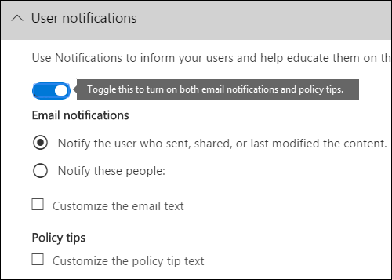
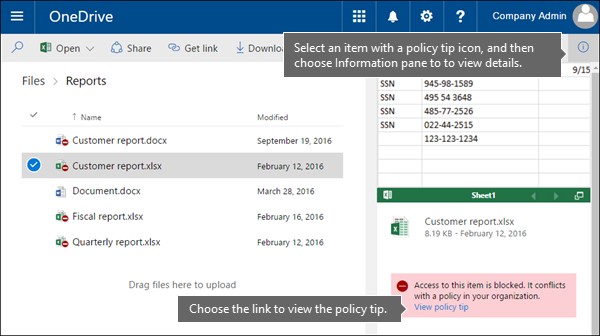

# メール通知を送信して、DLP ポリシーのポリシーのヒントを表示する

データ損失防止 (DLP) ポリシーを使用して、Office 365 全体の機密情報の識別、監視、保護を行うことができます。このような機密情報を扱う組織内のユーザーを DLP ポリシーに準拠させつつ、不必要にブロックしてユーザーの作業が完了できないような事態は避けたいでしょう。このような場合に、メール通知とポリシー ヒントが役立ちます。
  

  
ポリシー ヒントは、誰かがコンテンツを使用していて、それが DLP ポリシーと競合している場合に表示される通知または警告です。たとえば、個人情報 (PII) が含まれ、外部ユーザーと共有されている OneDrive for Business サイト上の Excel ブックなどのコンテンツがこれに該当します。
  
メール通知とポリシー ヒントを使用して、組織のポリシーに関する認識を高め、ユーザーの教育に役立てることができます。また、業務上の正当な理由がある場合や、ポリシーが誤検知した場合にブロックされないように、ユーザーにポリシーを上書きするオプションを提供することもできます。
  
Office 365 セキュリティ/コンプライアンス センターでは、DLP ポリシーを作成するときに、ユーザー通知を構成して次のことができます。
  
- 選択したユーザーに、問題を説明するメール通知を送信します。
    
- DLP ポリシーと競合しているコンテンツのポリシー ヒントを表示します。
    
  - Outlook on the web および Outlook 2013 以降のメールの場合は、メッセージの作成中、受信者の上のメッセージの上部にポリシー ヒントが表示されます。
    
  - OneDrive for Business アカウントまたは SharePoint Online サイトのドキュメントの場合、ポリシーヒントには、アイテムに表示される警告アイコンが示されます。 詳細情報を表示するには、アイテムを選択してから、ページの](../media/50b6d51b-92b4-4c5f-bb4b-4ca2d4aa3d04.png)右上隅にある [**情報** ![情報] ウィンドウのアイコンを選択して、詳細ウィンドウを開きます。 
    
  - DLP ポリシーに含まれている OneDrive for business サイトまたは SharePoint Online サイトに格納されている Excel、PowerPoint、および Word ドキュメントでは、ポリシーヒントがメッセージバーおよび Backstage ビュー ([**ファイル**] \>メニュー**情報**) に表示されます。
    
## ユーザー通知を DLP ポリシーに追加する

DLP ポリシーを作成すると、メール通知とポリシー ヒントはどちらも **[ユーザー通知]** セクションの一部になります。 
  
1. [https://protection.office.com](https://protection.office.com) に移動します。
    
2. 職場または学校のアカウントを使用して、Office 365 にサインインします。これで、Office 365 セキュリティ/コンプライアンス センターに移動します。
    
3. セキュリティ/コンプライアンス センターの左側のナビゲーションで、**[データ損失防止]** \> **[ポリシー]** \> **[+ ポリシーの作成]** の順に移動します。
    
    ![[ポリシーの作成] ボタン](../media/b1e48a08-92e2-47ca-abdc-4341694ddc7c.png)
  
4. 必要な種類の機密情報を保護する DLP ポリシー テンプレートを選び、**[次へ]** を選択します。
    
    空のテンプレートから始めるには、**[カスタム]** \> **[カスタム ポリシー]** \> **[次へ]** の順に選びます。
    
5. ポリシーの名前を設定し、**[次へ]** を選びます。
    
6. DLP ポリシーで保護する場所を選ぶには、次のいずれかを行います。
    
  - **[Office 365 のすべての場所]** \> **[次へ]** と選びます。
    
  - **[自分で特定の場所を選択する]** \> **[次へ]** と選びます。
    
    すべての Exchange メールやすべての OneDrive アカウントなど、特定の場所全体を含めたり除外したりするには、その場所の **[状態]** をオンまたはオフに切り替えます。 
    
    特定の SharePoint サイトまたは OneDrive アカウントだけを含めるには、**[状態]** をオンに切り替えた後、**[含める]** の下のリンクをクリックして、特定のサイトまたはアカウントを選びます。 
    
7. **[詳細設定を使う]** \> **[次へ]** の順に選びます。
    
8. **[+ 新しいルール]** を選びます。
    
9. ルール エディターで、**[ユーザー通知]** の状態をオンにします。
    
    

> [!NOTE]
> DLP ポリシーは、それらのドキュメントが新規か既存かにかかわらず、ポリシーに一致するすべてのドキュメントに適用されます。 ただし、電子メール通知は、新しいコンテンツが既存の DLP ポリシーと一致する場合にのみ生成されます。 既存のコンテンツは保護されますが、電子メールによるユーザー通知は生成されません。
  
## メール通知を設定するためのオプション

DLP ポリシーのそれぞれのルールで、次のことを行えます。
  
- 選択したユーザーに通知を送信します。これらのユーザーとしては、コンテンツ所有者、コンテンツの最終変更者、コンテンツが格納されているサイトの所有者、または特定のユーザーなどが挙げられます。
    
- HTML またはトークンを使用して、通知に含まれるテキストをカスタマイズできます。詳細については、次のセクションを参照してください。
    
> [!NOTE]
>  電子メール通知は、グループまたは配布リストではなく、個々の受信者にのみ送信できます。 電子メール通知をトリガーするのは新しいコンテンツだけです。 既存のコンテンツを編集すると、ポリシーヒントが表示されますが、電子メール通知はトリガーされません。 
  

  
### 既定のメール通知

通知には、実行されるアクションから始まる件名行があります。たとえば、メールの場合は、“通知”、“メッセージがブロックされました” など、ドキュメントの場合は、“アクセスがブロックされました” などと表示されます。ドキュメントに関する通知の場合、通知メッセージの本文には、ドキュメントが保存されているサイトに移動し、ドキュメントのポリシー ヒントを表示するリンクが含まれています。ここで問題を解決できます (ポリシー ヒントについては、以下のセクションを参照)。メールに関する通知の場合、通知には DLP ポリシーと一致するメッセージが添付ファイルとして含まれます。
  

  
既定では、通知には、サイト上の項目に対して以下のようなテキストが表示されます。通知テキストは、ルールごとに個別に構成されるため、表示されるテキストは、一致するルールによって異なります。

|**構成されている DLP ポリシー ルール**|**SharePoint または OneDrive for Business のドキュメントの既定の通知内容**|**Outlook メッセージの既定の通知内容**|
|:-----|:-----|:-----|
|通知を送信するが、上書きは許可しない    |このアイテムは、組織のポリシーと競合しています。    |あなたのメール メッセージは、組織のポリシーと競合しています。    |
|アクセスをブロックし、通知を送信し、上書きを許可する    |このアイテムは組織のポリシーと競合しています。この競合を解決しないと、このファイルへのアクセスがブロックされる可能性があります。    |あなたのメール メッセージは、組織のポリシーと競合しています。 メッセージはすべての受信者に配信されませんでした。    |
|アクセスをブロックして、通知を送信する    |このアイテムは組織内のポリシーと競合します。アイテムの所有者、最後に更新した人、プライマリ サイト コレクションの管理者を除くすべてのユーザーが、このアイテムへのアクセスをブロックされます。    |あなたのメール メッセージは、組織のポリシーと競合しています。メッセージは、すべての受信者には配信されませんでした。    |
   
### ユーザー設定のメール通知

エンド ユーザーまたは管理者に既定のメール通知を送信する代わりに、カスタムのメール通知を作成することができます。ユーザー設定のメール通知は、HTML に対応しており、5,000 文字の制限があります。HTML を使用すると、通知に画像、書式、その他のブランド設定を含めることができます。
  
また、次のトークンを使用して、メール通知をカスタマイズすることもできます。これらのトークンは、送信される通知の固有の情報によって置き換えられる変数です。

|**トークン**|**説明**|
|:-----|:-----|
|%%AppliedActions%%    |アクションがコンテンツに適用されます。    |
|%%ContentURL%%    |SharePoint Online サイトまたは OneDrive for Business サイトのドキュメントの URL。    |
|%%MatchedConditions%%    |コンテンツと一致した条件。コンテンツで想定される問題をユーザーに通知する場合にこのトークンを使用します。    |
   

  
## ポリシー ヒントを構成するためのオプション

DLP ポリシー内の各ルールに関して、次の事柄を行うポリシー ヒントを構成できます。
  
- コンテンツが DLP ポリシーと競合していることをユーザーに通知して、競合を解決するアクションを実行できるようにします。既定のテキスト (下記の表を参照) を使用するか、または組織の特定のポリシーに関するユーザー設定のテキストを入力することができます。
    
- ユーザーによる DLP ポリシーの上書きを許可します。必要に応じて、次のことも行えます。
    
  - ポリシーを無効にするための業務上の正当な理由の入力をユーザーに求めることができます。この情報はログに記録され、セキュリティ/コンプライアンス センターの **[レポート]** セクションの DLP レポートで確認できます。 
    
  - ユーザーが誤検知を報告し、DLP ポリシーを上書きできるようにします。この情報はレポート用にも記録されるので、誤検知を使用してルールを微調整できます。
    

  
たとえば、個人を特定できる情報 (PII) を検出する DLP ポリシーを OneDrive for Business サイトに適用する場合、このポリシーに次の 3 つのルールを含めることができます。
  
1. 最初のルール:5 個以下の対象機密情報インスタンスがドキュメントで検出され、ドキュメントが組織内のユーザーと共有されている場合、[**通知を送信**] アクションによってポリシー ヒントが表示されます。ポリシー ヒントについては、上書きオプションは必要ありません。このルールは単にユーザーに通知を行うだけで、アクセスをブロックするわけではないからです。 
    
2. 2 番目のルール: 5 個を超える対象機密情報インスタンスがドキュメントで検出され、組織内のユーザーとドキュメントを共有する場合、**[コンテンツへのアクセスの禁止]** アクションによってファイルのアクセス許可が制限され、**[通知の送信]** アクションでは業務上の理由を提供することによってこのルールのアクションの上書きをユーザーに許可します。場合によっては、組織のビジネスにおいて内部ユーザーが PII データを共有する必要が生じ、DLP ポリシーによってその作業をブロックしたくないことがあります。 
    
3. 3 番目のルール:5 個を超える対象機密情報インスタンスがドキュメントで検出され、組織外のユーザーとドキュメントを共有する場合、[**コンテンツへのアクセスの禁止**] アクションによってファイルのアクセス許可が制限され、[**通知の送信**] アクションではこのルールのアクションの上書きをユーザーに許可しません。情報が外部共有されているためです。いかなる状況においても、組織内のユーザーが組織外で PII データを共有することを許可すべきではありません。 
    
ルールを上書きするポリシー ヒントを使用する際に把握しておくべきいくつかの点を以下に記します。
  
- 上書きオプションはルールごとのオプションで、対象ルール内のすべてのアクションを上書きします (ただし、上書きできない通知の送信は除きます)。
    
- コンテンツが 1 つの DLP ポリシー内の複数のルールに一致する可能性がありますが、その場合には最も制限的で優先順位の高いルールのポリシー ヒントのみが表示されます。たとえば、単に通知を送信するルールのポリシー ヒントよりも、コンテンツへのアクセスを禁止するルールのポリシー ヒントの方が優先して表示されます。これにより、ポリシー ヒントがカスケード表示されるのを防止します。
    
- 	最も制限の厳しいルールでユーザーにルールを上書きすることを許可している場合は、このルールを上書きすることで、コンテンツに一致した他のルールもすべて上書きされます。
    
## OneDrive for Business サイトおよび SharePoint Online サイトのポリシー ヒント

OneDrive for Business サイトまたは SharePoint Online サイト上のドキュメントが DLP ポリシー内のルールに一致し、そのルールがポリシー ヒントを使用する場合、ポリシー ヒントは特別なアイコンをドキュメント上に表示します。
  
1. ルールがファイルに関する通知を送信する場合、警告アイコンが表示されます。
    
2. ルールがドキュメントへのアクセスをブロックする場合、ブロックされたアイコンが表示されます。
    

  
ドキュメントに対してアクションを実行するには、ページ\>の右上隅にある](../media/50b6d51b-92b4-4c5f-bb4b-4ca2d4aa3d04.png) [**情報** ![情報の選択] ウィンドウのアイコンを選択して、 \> [詳細] ウィンドウの [**ポリシーヒント] ヒント**を開きます。
  
ポリシー ヒントにはコンテンツに関する問題が一覧表示され、ポリシー ヒントにオプションが構成されている場合には、[**解決**] を検索してから、ポリシー ヒントの [**上書き**] または誤検知の [**レポート**] を選択できます。 
  

  

  
DLP ポリシーがサイトと同期され、コンテンツが定期的かつ非同期的に評価されます。それで、DLP ポリシーを作成してからポリシー ヒントが表示されるまで少しの遅延があります。ポリシーを解決または上書きしてから、サイトのドキュメントのアイコンが消えるまで同様の遅延が生じる可能性があります。
  
### サイト上のポリシー ヒントの既定テキスト

既定では、ポリシー ヒントは、サイト上の項目に対して以下のようなテキストを表示します。通知テキストは、ルールごとに個別に構成されるため、表示されるテキストは、一致するルールによって異なります。

|**構成されている DLP ポリシー ルール**|**既定のポリシー ヒント内容**|
|:-----|:-----|
|通知を送信するが、上書きは許可しない    |このアイテムは、組織のポリシーと競合しています。    |
|アクセスをブロックし、通知を送信し、上書きを許可する    |このアイテムは組織のポリシーと競合しています。この競合を解決しないと、このファイルへのアクセスがブロックされる可能性があります。    |
|アクセスをブロックして、通知を送信する    |このアイテムは組織内のポリシーと競合します。アイテムの所有者、最後に更新した人、プライマリ サイト コレクションの管理者を除くすべてのユーザーが、このアイテムへのアクセスをブロックされます。    |
   
### サイトのポリシー ヒントのユーザー設定テキスト

メール通知とは別に、ポリシー ヒントのテキストをカスタマイズすることができます。メール通知のユーザー設定テキストとは異なり (上のセクションを参照)、ポリシー ヒントのユーザー設定テキストでは HTML もトークンも使用できません。代わりに、ポリシー ヒントのユーザー設定テキストは、プレーン テキストで、256 文字の制限があります。
  
## Outlook on the web および Outlook 2013 以降におけるポリシー ヒント

Outlook on the web および Outlook 2013 以降で新しいメールを作成するとき、DLP ポリシーのルールに一致するコンテンツを追加し、そのルールがポリシー ヒントを使用する場合、ポリシー ヒントが表示されます。ポリシー ヒントは、メッセージの作成中、受信者の上のメッセージの上部に表示されます。
  

  
ポリシー ヒントは、次のように、機密情報がメッセージの本文、件名行、またはメッセージの添付ファイルに含まれる場合でも機能します。
  

  
ポリシー ヒントが上書きできるように構成されている場合は、**[詳細の表示]**、**[上書き]** を選択し、業務上の妥当性を入力するか、誤検知を報告し、**[上書き]** を選択します。
  

  

  
メールに機密情報を追加すると、機密情報を追加してからポリシー ヒントが表示されるまでに遅延が生じる場合があることに注意してください。

### Outlook 2013 以降では、一部の条件に対するポリシー ヒントのみが表示

現在、Outlook 2013 以降では、次の条件に対するポリシー ヒントのみが表示されます。

- コンテンツが含まれている
- コンテンツが共有されている

これらのすべての条件は、条件がコンテンツに一致し、コンテンツに関して保護アクションが適用される Outlook で機能しますが、ユーザーへのポリシー ヒントの表示はまだサポートされていないことに注意してください。
  
### Exchange 管理センターと Office 365 セキュリティ/コンプライアンス センターでのポリシー ヒント

ポリシー ヒントは、Exchange 管理センターで作成される DLP ポリシーとメール フロー ルール、または Office 365 セキュリティ/コンプライアンス センターで作成される DLP ポリシーのいずれかによって機能します。両方ではありません。これは、これらのポリシーは異なる場所に保存されますが、ポリシー ヒントは 1 つの場所からのみ適用されるためです。
  
Exchange 管理センターでポリシー ヒントを構成した場合、Office 365 セキュリティ/コンプライアンス センターで構成するポリシー ヒントは、Exchange 管理センターでヒントをオフにしない限り、Outlook on the web および Outlook 2013 以降でユーザーに表示されません。これにより、Office 365 セキュリティ/コンプライアンス センターへの切り替えを選択するまで、現在の Exchange メール フロー ルール (トランスポート ルールとも呼ばれる) が動作し続けます。
  
ポリシー ヒントは 1 つの場所からのみ適用されますが、Office 365 セキュリティ/コンプライアンス センターおよび Exchange 管理センターの両方で DLP ポリシーを使用している場合でも、メール通知は常に送信されることに注意してください。
  
### メールのポリシー ヒントの既定のテキスト

既定では、ポリシー ヒントは、次のようなテキストでメールに表示されます。

|**構成されている DLP ポリシー ルール**|**既定のポリシー ヒント内容**|
|:-----|:-----|
|通知を送信するが、上書きは許可しない    |メールは組織内のポリシーと競合しています。    |
|アクセスをブロックし、通知を送信し、上書きを許可する    |メールは組織内のポリシーと競合しています。    |
|アクセスをブロックして、通知を送信する    |メールは組織内のポリシーと競合しています。    |
   
## Excel、PowerPoint、Word のポリシーヒント

ユーザーがデスクトップバージョンの Excel、PowerPoint、および Word の機密コンテンツを操作する場合、ポリシーヒントは、コンテンツが DLP ポリシーと競合することをリアルタイムで通知できます。 そのためには以下のことが必要となります。
  
- Office ドキュメントが OneDrive for Business サイトまたは SharePoint Online サイトに保存されていること。
    
- サイトが、ポリシー ヒントを使用するように構成された DLP ポリシーに含まれていること。
    
Office デスクトッププログラムは、自動的に Office 365 から DLP ポリシーを同期し、ドキュメントをスキャンして DLP ポリシーと競合しないことを確認し、リアルタイムでポリシーヒントを表示します。
  
DLP ポリシーにおけるポリシー ヒントの構成法によっては、ユーザーがポリシー ヒントを単に無視すること、業務上の理由を提供してまたは提供せずにポリシーを上書きすること、誤検知を報告することを選択できます。
  
ポリシー ヒントは、メッセージ バーに表示されます。
  

  
ポリシー ヒントは、(**[ファイル]** タブ上の) Backstage ビューにも表示されます。 
  

  
DLP ポリシーのポリシー ヒントにこれらのオプションが設定されている場合、[**解決**] を選択した後、ポリシー ヒントの [**上書き**]、または誤検知の [**レポート**] を選択できます。 
  

  
これらの各 Office デスクトッププログラムでは、ユーザーがポリシーヒントをオフにすることを選択できます。 無効にすると、通知を単に行うポリシー ヒントはメッセージ バーにも Backstage ビュー ([**ファイル**] タブ) にも表示されません。 ただし、ブロックおよび上書きに関するポリシー ヒントは依然表示され、電子メール通知も引き続き受け取ります。 さらに、ポリシー ヒントを無効にしても、適用されている DLP ポリシーがドキュメントに対して無効になるわけではありません。 
  
### Excel 2016、PowerPoint 2016、Word 2016 におけるポリシー ヒントの既定テキスト

既定では、ポリシー ヒントは、開いているドキュメントのメッセージ バーと Backstage ビューに次のようなテキストを表示します。通知テキストは、ルールごとに個別に構成されるため、表示されるテキストは、一致するルールによって異なります。

|**構成されている DLP ポリシー ルール**|**既定のポリシー ヒント内容**|
|:-----|:-----|
|通知を送信するが、上書きは許可しない    |このファイルは組織内のポリシーと競合します。詳細については、**[ファイル]** メニューに移動します。  |
|アクセスをブロックし、通知を送信し、上書きを許可する    |このファイルは組織内のポリシーと競合します。この競合を解決しないと、このファイルへのアクセスがブロックされる可能性があります。詳細については、**[ファイル]** メニューに移動します。  |
|アクセスをブロックして、通知を送信する    |このファイルは組織内のポリシーと競合します。この競合を解決しないと、このファイルへのアクセスがブロックされる可能性があります。詳細については、**[ファイル]** メニューに移動します。  |
   
### Excel、PowerPoint、および Word のポリシーヒントのカスタムテキスト

メール通知とは別に、ポリシー ヒントのテキストをカスタマイズすることができます。メール通知のユーザー設定テキストとは異なり (上のセクションを参照)、ポリシー ヒントのユーザー設定テキストでは HTML もトークンも使用できません。代わりに、ポリシー ヒントのユーザー設定テキストは、プレーン テキストで、256 文字の制限があります。
  
## 詳細情報

- [データ損失防止ポリシーの概要](data-loss-prevention-policies.md)
    
- [テンプレートからの DLP ポリシーの作成](create-a-dlp-policy-from-a-template.md)
    
- [FCI または他のプロパティを含むドキュメントを保護するために DLP ポリシーを作成する](protect-documents-that-have-fci-or-other-properties.md)
    
- [DLP ポリシー テンプレートに含まれるもの](what-the-dlp-policy-templates-include.md)
    
- [機密情報の種類の検索基準](what-the-sensitive-information-types-look-for.md)
