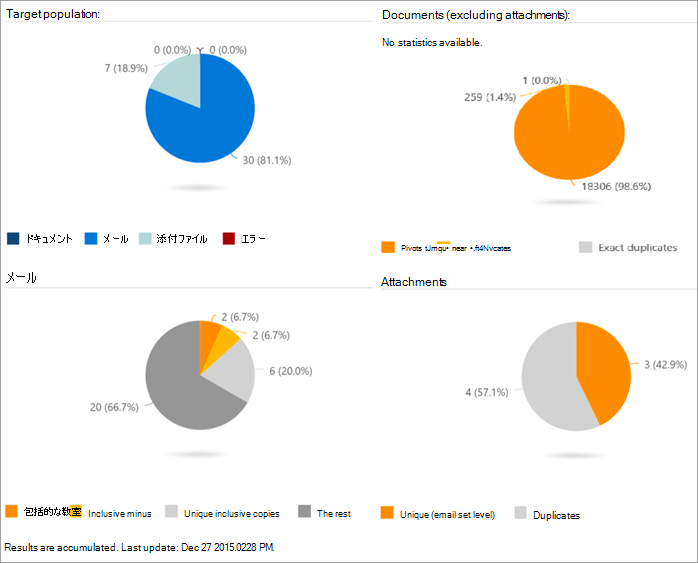

# 高度な電子情報開示での分析結果の表示 (クラシック)View Analyze results in Advanced eDiscovery (classic)

> [!NOTE]
> Advanced eDiscovery を使用するには、Advanced Compliance アドオンがインストールされた Office 365 E3 サブスクリプション、または E5 サブスクリプションがお客様の組織で必要になります。このプランを利用しておらず、Advanced eDiscovery をお試しになりたい場合は、[Office 365 Enterprise E5 の試用版にサインアップ](https://go.microsoft.com/fwlink/p/?LinkID=698279)してください。Advanced eDiscovery requires an Office 365 E3 with the Advanced Compliance add-on or an E5 subscription for your organization. If you don't have that plan and want to try Advanced eDiscovery, you can [sign up for a trial of Office 365 Enterprise E5](https://go.microsoft.com/fwlink/p/?LinkID=698279). 
  
詳細な電子情報開示では、以下に示すように、分析プロセスの進行状況と結果をさまざまな方法で表示できます。In Advanced eDiscovery, progress and results for the Analyze process can be viewed in a variety of displays as described below.
  
## タスクの進捗状況を表示するView Analyze task status

[ \*\* \> 結果の分析 \> タスクの \> 状態の準備\*\*] では、プロセスの実行中および分析後に状態が表示されます。In **Prepare \> Analyze \> Results \> Task status**, the status is displayed during and after Analyze process execution. 
  

  
表示されるタスクは、選択したオプションによって異なる場合があります。The tasks displayed may vary depending on the options selected. 
  
- **ND/ET: セットアップ**: 実行の準備をします。たとえば、run および case パラメーターを設定します。**ND/ET: setup**: Prepares for the run, for example, sets run and case parameters.
    
- **Nd/ET: nd 計算**: ファイルのほぼ重複した分析を処理します。**ND/ET: ND calculation**: Processes Near-duplicate analysis of files.
    
- **ND/et: et 計算**: 電子メールセット全体で電子メールスレッド分析を実行します。**ND/ET: ET calculation**: Performs Email Thread analysis on the entire email set.
    
- **ND/ET: pivot and 類似性**: ピボットおよびファイル類似性処理を実行します。**ND/ET: pivots and similarities**: Performs pivot and file similarity processing.
    
- [ **ND/ET: metadata update**]: データベース内のファイルで収集された新しいデータがファイナライズされます。**ND/ET: metadata update**: Finalizes the new data collected on the files in the database.
    
- **テーマ: テーマの計算**: テーマの分析を実行します。**Themes: themes calculation**: Runs themes analysis. (選択されている場合のみ表示されます)。(Displayed only if selected.)
    
- **タスクの状態**: この行は、タスクの完了後に表示されます。**Task status**: This line is displayed after task completion. タスクの実行中は、実行期間が表示されます。While tasks are running, run duration is displayed.
    
> [!NOTE]
> ほぼ重複した電子メールスレッド (ND および ED) の分析結果は、処理するドキュメント数に適用されます。The Analyze results of Near-duplicates and Email Threads (ND and ED) applies to the number of documents to be processed. 完全に重複したファイルは含まれません。It does not include Exact duplicate files. 
  
## ほぼ重複した電子メールスレッドの状態を表示するView Near-duplicates and Email Threads status

**ターゲット**の作成結果には、対象の作成におけるドキュメント、メール、添付ファイル、およびエラーの数が表示されます。The **Target** population results display the number of documents, emails, attachments, and errors in the target population. 
  
**ドキュメント**の結果には、ピボットの数、一意の重複した一意のファイル、および正確な重複ファイルが表示されます。The **Documents** results display the number of pivots, unique near-duplicates, and exact duplicate files. 
  
電子**メール**の結果には、包括数、包括的な一意の包括的コピー、および残りの電子メールメッセージの数が表示されます。The **Emails** results display the number of inclusive, inclusive minus, unique inclusive copies, and the rest of the email messages. さまざまな種類の電子メールの結果は次のとおりです。The different types of email results are: 
  
- **包括**: 包括的な電子メールは、電子メールスレッドの終了ノードであり、そのスレッドの以前のすべての履歴が含まれています。**Inclusive**: An inclusive email is the terminating node in an email thread and contains all the previous history of that thread. その結果、レビュー担当者は、スレッド内の前のメッセージを読み取らずに、包括的な電子メールに安全に集中できます。As a result, the reviewer can safely focus on the inclusive email, without the need to read the previous messages in the thread. 
    
- **包括マイナス**: 包括的な電子メールの親に関連付けられた1つまたは複数の異なる添付ファイルがある場合は、包括的な電子メールが包括を差し引いたものとして指定されます。**Inclusive minus**: An inclusive email is designated as inclusive minus if there are one or more different attachments associated with the parents of the inclusive message. このコンテキストでは、"Parent" という用語が、その特定の包括的な電子メールに含まれている電子メールスレッドまたは会話の上にあるメッセージに使用されます。In this context, the term Parent is used for messages located upwards on the email thread or conversations included in that specific inclusive email. レビュー担当者は、包括的なマイナス表示をシグナルとして使用できますが、包括的な電子メールの親の内容を確認する必要はないかもしれませんが、この包含パスの親に関連付けられている添付ファイルを確認すると便利な場合があります。A reviewer can use the inclusive minus indication as a signal that although it might not be necessary to review the content of the inclusive email parents, it may be useful to review the attachments associated with the inclusive path parents. 
    
- **包括的コピー**: 包括的なメールまたは包括的なメールが含まれている別のメッセージのコピーである場合は、包括コピーとして指定します。**Inclusive copy**: An inclusive email is designated as inclusive copy if it's the copy of another message marked as inclusive or inclusive minus. 言い換えると、このメッセージの件名と本文は別の包括的なメッセージと同じであり、同じノードに共存しています。In other words, this message has the same subject and body as another inclusive message and, as such, co-resides in the same node. 包括的なコピーメッセージには同じ内容が含まれているため、通常はレビュープロセスでスキップできます。Because inclusive copy messages contain the same content, they can usually be skipped in the review process. 
    
- **Rest**: これは、一意のコンテンツがまったく含まれていないため、上記の3つのカテゴリに分類されないメールを示します。**The rest**: This indicates email that doesn't contain any unique content, and therefore doesn't fall into any of the previous three categories. これらの電子メールメッセージを確認する必要はありません。These email messages don't need to be reviewed. メッセージに添付ファイルが含まれていて、それより後の包括的な電子メールに含まれていない場合は、添付ファイルのレビューが必要になる可能性があります。If a message contains an attachment that isn't on a later inclusive email, then the attachment might need to be reviewed. これは、スレッド内に包括的なマイナスの電子メールが存在することによって示されます。This is indicated by the existence of an inclusive minus email within the thread.
    
**添付ファイル**の結果には、重複した種類によって添付ファイルの数が表示されます。The **Attachments** results display the number of attachments, according to such type as unique and duplicates. 
  

  
## 関連項目See also

[Advanced eDiscovery (クラシック)Advanced eDiscovery (classic)](office-365-advanced-ediscovery.md)
  
[ドキュメントの類似点についてUnderstanding document similarity](understand-document-similarity-in-advanced-ediscovery.md)
  
[分析オプションの設定Setting Analyze options](set-analyze-options-in-advanced-ediscovery.md)
  
[無視するテキストの設定Setting ignore text](set-ignore-text-in-advanced-ediscovery.md)
  
[[詳細設定の分析] の設定](view-analyze-results-in-advanced-ediscovery.md)[Setting Analyze advanced settings](view-analyze-results-in-advanced-ediscovery.md)

