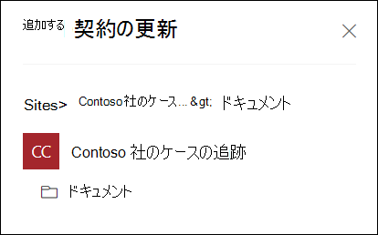
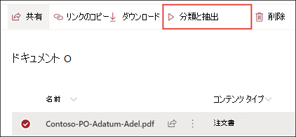

# ドキュメントを適用するモデルについて (プレビュー)Apply a document understanding model (Preview)

> [!Note] 
> この記事の内容は、Project Cortex のプライベートプレビュー用です。The content in this article is for Project Cortex Private Preview. [詳細については、「Project Cortex](https://aka.ms/projectcortex)」を参照してください。[Find out more about Project Cortex](https://aka.ms/projectcortex).

 

> [!VIDEO https://www.microsoft.com/videoplayer/embed/RE4CSoL]

 

ドキュメントを公開した後、モデルを理解した後、Microsoft 365 テナントの SharePoint ドキュメントライブラリに適用することができます。After publishing your document understanding model, you can apply it to a SharePoint document library in your Microsoft 365 tenant.

> [!Note]
> アクセスできるドキュメントライブラリに対してのみ、モデルを適用することができます。You will only be able to apply the model to document libraries that you have access to.

## モデルをドキュメントライブラリに適用します。Apply your model to a document library.

モデルを SharePoint ドキュメントライブラリに適用するには、次のようにします。To apply your model to to a SharePoint document library:

1. モデルのホームページで、[**ライブラリにモデルを適用**] タイルで、[**モデルの発行**] を選択します。On the model home page, on the **Apply model to libraries** tile, select **Publish model**. または、[**このモデルを使用してライブラリ**内の**ライブラリを追加**] を選択することもできます。Or you can  select  **+Add Library** in the **Libraries with this model** section.  

     

2. その後、モデルを適用するドキュメントライブラリを含む SharePoint サイトを選択できます。You can then select the SharePoint site that contains the document library that you want to apply the model to. サイトが一覧に表示されない場合は、検索ボックスを使用して検索します。If the site does not show in the list, use the search box to find it. 

     

    > [!Note]
    > リストのアクセス許可を*管理*するか、モデルを適用するドキュメントライブラリに対する*編集*権限を持っている必要があります。You must have *Manage List* permissions or *Edit* rights to the document library you are applying the model to. 

3. サイトを選択した後、モデルを適用するドキュメントライブラリを選択する必要があります。After selecting the site, you then need to select the document library to which you want to apply the model. この例では、 *Contoso 社のケーストラッキング*サイトから*ドキュメント*ドキュメントライブラリを選択しています。In the example, we are selecting the *Documents* document library from the *Contoso Case Tracking* site. 

     

4. モデルはコンテンツタイプに関連付けられているため、ライブラリに適用すると、抽出したラベルが列として表示されるコンテンツタイプのビューが作成されます。Since the model is associated to a content type, when you apply it to the library it will create a view for the content type with the labels you extracted showing as columns. このビューは既定ではライブラリの既定のビューになりますが、オプションで [**詳細設定**] を選択し、[**この新しいビューを既定として設定**する] を選択解除して、既定のビューにしないように選択することもできます。This view will be the library's default view by default, but you can optionally choose to not have it be the default view by selecting **Advanced settings** and deselecting **Set this new view as default**. 

     

5. [**追加**] を選択してモデルをライブラリに適用します。Select **Add** to apply the model to the library. 
6. モデルのホームページの [**このモデルを持つライブラリ**] セクションに、SharePoint サイトの URL が表示されます。On the model home page, in the **Libraries with this model** section, you will see the URL to the SharePoint site listed. 

     

7. ドキュメントライブラリに移動し、モデルのドキュメントライブラリビューを使用していることを確認します。Go to your document library and make sure you are in the model's document library view. ドキュメントライブラリ名の横にある [情報] ボタンを選択すると、モデルがドキュメントライブラリに適用されていることを示すメッセージが表示されます。You'll notice that if you select the information button next to the document library name, a message will note that your model has been applied to the document library.

      

ドキュメントライブラリにモデルを適用した後で、サイトへのドキュメントのアップロードを開始し、結果を確認できます。After applying the model to the document library, you can begin uploading documents to the site and see the results.

モデルは、モデルに関連付けられたコンテンツタイプを持つファイルを識別し、ビューにそのファイルをリストします。The model will identify any files with model’s associated content type and will list them in your view. モデルに抽出器がある場合、各ファイルから抽出するデータの列がビューに表示されます。If your model has any extractors, the view will display columns for the data you are extracting from each file.

### ドキュメントライブラリに既に存在するファイルにモデルを適用するApply the model to files already in the document library

適用したモデルでは、適用後にドキュメントライブラリにアップロードされたすべてのファイルが処理されますが、次の操作を実行して、モデルを適用する前にドキュメントライブラリに既に存在していたファイルに対してモデルを実行することもできます。While an applied model will process all files uploaded to the document library after it is applied, you can also do the following to run the model on files that already existed in the document library prior to the model being applied:

1. ドキュメントライブラリで、モデルで処理するファイルを選択します。In your document library, select the files that you want to be processed by your model.
2. ファイルを選択すると、[ドキュメントライブラリ] リボンに**分類と抽出**が表示されます。After selecting your files, **Classify and extract** will appear in the document library ribbon. [**分類と抽出**] を選択します。Select **Classify and extract**.
3. 選択したファイルが処理されるキューに追加されます。The files you selected will be added to the queue to be processed.

        

## 関連項目See Also
[分類子を作成するCreate a classifier](create-a-classifier.md) 
[抽出器を作成するCreate an extractor](create-an-extractor.md) 
[ドキュメント理解の概要Document Understanding overview](document-understanding-overview.md) 
[フォーム処理モデルを作成するCreate a form processing model](create-a-form-processing-model.md)  

