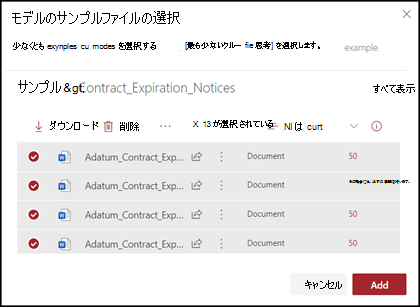
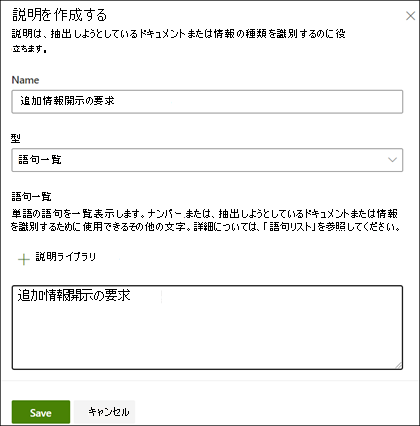
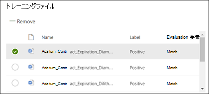

# 分類子を作成する (プレビュー)Create a classifier (Preview)

> [!Note] 
> この記事の内容は、Project Cortex のプライベートプレビュー用です。The content in this article is for Project Cortex Private Preview. [詳細については、「Project Cortex](https://aka.ms/projectcortex)」を参照してください。[Find out more about Project Cortex](https://aka.ms/projectcortex).

 

> [!VIDEO https://www.microsoft.com/videoplayer/embed/RE4CL0R]  

 

分類子は、ドキュメントの種類の識別と分類を自動化するモデルの種類です。A classifier is a type of model that automates identification and classification of a document type. たとえば、次のような、ドキュメントライブラリに追加されたすべての *契約の更新* ドキュメントを特定することができます。For example, you may want to identify all *Contract Renewal* documents that are added to your document library, such as the following.

分類子を作成すると、モデルに関連付けられる新しい [SharePoint コンテンツタイプ](https://docs.microsoft.com/sharepoint/governance/content-type-and-workflow-planning#content-type-overview) が作成されます。Creating a classifier will create a new [SharePoint Content Type](https://docs.microsoft.com/sharepoint/governance/content-type-and-workflow-planning#content-type-overview) that will be associated to the model.

分類子を作成するときには、このドキュメントの種類に対して一貫して検索すると予想される一般的なデータを記録してモデルを定義するのに役立つ *説明* を作成する必要があります。When creating the classifier, you need to create *explanations* that help to define the model by noting common data that you would expect to find consistently for this document type. 

ドキュメントの種類 ("ファイルの例") の例を使用して、同じコンテンツタイプのファイルを識別するために、モデルを "トレーニング" します。You use examples of the document type ("example files") to help "train" your model to identify files that have the same content type.

分類子を作成するには、次のことを行う必要があります。To create a classifier, you need to:
1. モデルに名前をつけるName your model
2. サンプルファイルを追加するAdd your example files
3. サンプルファイルにラベルを付けるLabel your example files
4. 説明を作成するCreate an explanation
5. モデルをテストするTest your model 

> [!Note]
> 分類子は、ドキュメントの種類を識別して分類するためにモデルによって使用されますが、モデルによって識別される各ファイルから特定の情報を取得するよう選択することもできます。While a classifier is used by your model to identify and classify document types, you can also choose to pull specific pieces of information from each file identified by the model. これを行うには、モデルに追加する **抽出器** を作成します。これについては、「 [Create a エクストラクター](create-an-extractor.md)」で説明されています。You do this by creating an **extractor** to add to your model, and this is described in [Create an extractor](create-an-extractor.md).

## モデルに名前をつけるName your model

最初の手順として、名前を指定して、コンテンツセンターにモデルを作成します。The first step is to create your model in your Content Center by giving it a name:

1. コンテンツセンターで、[ **新規**] をクリックし、[ **モデルの作成**] をクリックします。In your Content Center, click **New**, and then click **Create a model**.
2. [ **新しいドキュメントのモデル** ] ウィンドウで、[ **名前** ] フィールドにモデルの名前を入力します。In the **New document understanding model** pane, in the **Name** field, type the name of the model. この例では、契約の更新ドキュメントを特定する場合、このモデル契約の *更新*の名前を付けることができます。For our example, if we want to identify contract renewal documents, we might name this model *Contract Renewal*.
3. **[作成]** をクリックします。Click **Create**. これにより、モデルのホームページが作成されます。This will create a home page for the model. 

    

モデルを作成するときには、新しい SharePoint コンテンツタイプを作成します。When you create a model, you are creating a new SharePoint content type. SharePoint コンテンツタイプは、共通の特性を持つドキュメントのカテゴリを表し、その特定のコンテンツの列またはメタデータプロパティのコレクションを共有します。A SharePoint content type represents a category of documents that have common characteristics and share a collection of columns or metadata properties for that particular content. SharePoint コンテンツタイプは、 [コンテンツタイプギャラリー]()を使用して管理されます。SharePoint Content Types are managed through the [Content types gallery](). この例では、モデルを作成するときに、新しい *契約更新* コンテンツタイプを作成します。For our example, when we create the model, we will be creating a new *Contract Renewal* content type.

このモデルを SharePoint コンテンツタイプギャラリーの既存のコンテンツタイプにマッピングして、そのスキーマを使用する場合は、[ **詳細設定** ] を選択します。Select **Advanced settings** if you want to map this model to an existing content type in the SharePoint Content types gallery to use its schema. 既存のコンテンツタイプを使用してスキーマを活用し、識別と分類に役立てることができますが、識別されたファイルから情報を抽出するためにモデルをトレーニングする必要があります。Note that while you can use an existing content type to leverage its schema to help with identification and classification, you will still need to train your model to extract information from files it identifies. 

## サンプルファイルを追加するAdd your example files

モデルのホームページでは、ドキュメントの種類を識別するためにモデルをトレーニングするのに役立つサンプルファイルを追加することができます。On the model home page, you can add your examples files you will need to help train the model to identify your document type.  
 

> [!VIDEO https://www.microsoft.com/videoplayer/embed/RE4D0iX] 

 

> [!Note]
> 分類子と [抽出器トレーニング](create-an-extractor.md)の両方に同じファイルを使用する必要があります。The same files should be used for both classifier and [extractor training](create-an-extractor.md). 後で追加するオプションは常に用意されていますが、通常は、サンプルファイルの完全なセットを追加する必要があります。You always have the option to add more later, but typically you should add a full set of example files. モデルの適合性を評価するために、いくつかのラベルを付けて、モデルを学習し、残りの未ラベルのものをテストします。You will label some to train your model, and test the remaining unlabeled ones to evaluate model fitness. 

トレーニングセットについては、正の例と負の例の両方を使用する必要があります。For your training set, you will want to use both positive examples, and negative examples:
- 正の例: ドキュメントの種類を表すドキュメント。Positive example: Documents that represent the document type. これらには、常にこの種類のドキュメントに含まれる文字列と情報が含まれています。They contain strings and information that would always be in this type of document.
- 負の例: ドキュメントの種類を表していないドキュメント。Negative example: Documents that do not represent the document type.  このドキュメントでは、文字列と情報が含まれていない必要があります。They are missing strings and information that needs to be present in this type of document.

モデルを学習するには、少なくとも5つの正の例と1つの負の例を使用する必要があります。You will want to use at least five positive examples and one negative examples to train your model.  トレーニング後に、モデルをテストするための追加のものが必要になります。You will want to have additional ones to test your model after training.

サンプルファイルを追加するには:To add sample files:

1. モデルのホームページで、[ **サンプルライブラリのビルド** ] タイルの [ **ファイルの追加**] をクリックします。On the model home page, in the **Build sample library** tile, click **Add files**.
2. [ **モデルのサンプルファイルを選択** してください] ページで、コンテンツセンターのサンプルファイルライブラリからサンプルファイルを選択します。On the **Select sample files for your model** page, select your example files from the Sample files library in the Content Center. まだアップロードしていない場合は、[ **アップロード** ] をクリックしてサンプルファイルライブラリに移動することによって、今すぐアップロードすることを選択できます。If you had not already uploaded them there, you can choose to upload them now by clicking **Upload** to move them the Sample file library.
3. モデルのトレーニングに使用するサンプルファイルを選択したら、[ **追加**] をクリックします。After selecting your example files to use to train the model, click **Add**.

     

## サンプルファイルにラベルを付けるLabel your example files

サンプルファイルを追加した後、そのファイルに正の例または負の例のいずれかとしてラベルを付ける必要があります。After adding your example files, you then need to label them as either positive examples or negative examples.

1. モデルのホームページで、[ **ファイルの分類] および [トレーニングの実行** ] タイルの [ **分類子のトレーニング**] をクリックします。On the model home page, on the **Classify files and run training** tile, click **Train Classifier**.
   これにより、最初のファイルが viewer に表示された状態で、サンプルファイルの一覧を示すラベルページが表示されます。This will display the label page that shows a listing of your example files, with the first file visible in the viewer.
2. Viewer の最初のサンプルファイルの先頭に、作成したモデルの例としてファイルがあるかどうかを確認するテキストが表示されます。In the viewer, on the top of the first example file, you will see text asking you if the file is an example of the model you just created. 正の例の場合は、[ **はい]** を選択します。If it is a positive example, select **Yes**. 負の例の場合は、[ **いいえ**] を選択します。If it is a negative example, select **No**.
3. 左側の **ラベル付きの例** リストから、例として使用する追加のファイルを選択して、それらにラベルを付けます。From the **Labeled examples** list on the left, select additional files that you want to use as examples, and label them as well. 

     

> [!Note]
> 少なくとも5つの正の例と1つの負の例をラベル付けします。Label at least five positive examples, and one negative example. 

## 説明を作成するCreate an explanation

次の手順では、[Train] ページで説明を作成します。The next step is to create an explanation on the Train page.  説明は、モデルでこのドキュメントを認識する方法を理解するためのヒントまたは手掛かりです。An explanation is a hint or clue to help the model understand how to recognize this document. たとえば、契約の更新ドキュメントには、常に *追加の開示テキスト文字列の要求* が含まれています。For example, our Contract Renewal documents always contain a *Request for additional disclosure* text string.

> [!Note]
> 抽出機能を使用する場合、文書から抽出する文字列を識別するために説明を使用します。When used with extractors, an explanation is use to identify the string that you want to extract from the document. 

説明を作成するには、次のようにします。To create an explanation:

1. モデルのホームページで、[ **列車** ] タブをクリックして [列車] ページに移動します。On the model home page, click the **Train** tab to go to the Train page.
2. [トレーニング] ページの [ **トレーニングファイル** ] セクションに、以前にラベル付けしたサンプルファイルの一覧が表示されます。On the Train page, in the **Trained files** section, you will see a list of the example files that you had labeled previously. リストから1つのポジファイルを選択すると、ビューアーに表示されます。Select one of your positive files from the list, and it will display in the viewer.
3. [説明] セクションで、[ **新規**] をクリックし、[ **空白**] をクリックします。In the Explanation section, click **New**, then click **Blank**.
4. [ **説明の作成** ] ページで、次のようにします。On the **Create an explanation** page: 
    a. a. **名前**を入力します ("暴露ブロック" など)。Type the **Name** (for example, "Disclosure Block"). 
    b. b. **種類**を選択します。Select the **Type**. この例では、テキスト文字列を追加しているため、 **語句リスト**を選択します。For our example, we'll select **Phrase list**, since we are adding a text string. 
    c. c. [ **ここに入力** ] ボックスに、文字列を入力します。In the **Type here** box, type the string.  この例では、「追加情報開示のための要求」を追加します。For our example, we'll add "Request for additional disclosure". 文字列が大文字小文字を区別する必要がある場合は、 **大文字小文字を区別** することができます。You can select **Case sensitive** if the string needs to be case sensitive. 
    d. d. [**保存**] をクリックします。Click **Save**.

     
    
 
5.  モデルでは、作成した説明が、正の例および負の例のように、ラベル付けされた残りのサンプルファイルを正確に識別できるかどうかを確認します。The model will now check to see if the explanation you created was good enough to identify your remaining labeled example files correctly as positive and negative examples. [トレーニングされたファイル] セクションで、トレーニングの完了後に [ **評価** ] 列をチェックして、結果を確認します。In Trained Files section, check the **Evaluation** column after the training has completed to see the results.  作成した説明が、ラベル付けした内容 (正または負) と一致するように十分に一致した場合は、ファイルに **一致** する値が表示されます。The files will show a value of **Match** if the explanation you created was enough to match what you had labeled them as (positive or negative).

     

ラベル付けされたファイルに **不一致** が発生した場合は、ドキュメントの種類を識別するための詳細な情報をモデルに提供するために追加の説明を作成する必要があります。If you receive a **Mismatch** on your labeled files, you may need to create an additional explanation to provide the model more information to identify the document type. このファイルをクリックすると、不一致が発生した理由に関する詳細情報が表示されます。You can click on the file to get more information about why the mismatch occurred.

## モデルをテストするTest your model

ラベル付けされたサンプルファイルで一致するものを受信した場合、残りのラベルのないサンプルファイルでモデルをテストできるようになりました。If you received a match on your labeled example files, you can now test your model on your remaining unlabeled example files.

1. モデルのホームページで、[ **テスト** ] タブをクリックします。 これにより、ラベルのないサンプルファイルでモデルが実行されます。On the model home page, click the **Test** tab.  This will run the model on your unlabeled example files.
2. [ **テストファイル** ] リストでは、サンプルファイルが表示され、モデルが正または負の例として予測されているかどうかが表示されます。In the **Test files** list, your example files will display and will show if the model predicted them to be positive or negative examples. この情報を使用して、ドキュメントを識別する際に、分類子の有効性を判断することができます。You can use this information to help determine the effectiveness of your classifier in identifying your documents.

     

## 関連項目See Also
[抽出器を作成するCreate an extractor](create-an-extractor.md) 
[ドキュメント理解の概要Document Understanding overview](document-understanding-overview.md) 
[フォーム処理モデルを作成するCreate a form processing model](create-a-form-processing-model.md) 
[モデルを適用するApply a model](apply-a-model.md) 

