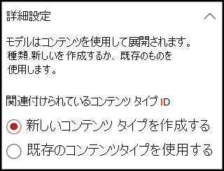

# 分類子を作成する (プレビュー)

> [!Note] 
> この記事の内容は、Project Cortex のプライベートプレビュー用です。 [詳細については、「Project Cortex](https://aka.ms/projectcortex)」を参照してください。

 

> [!VIDEO https://www.microsoft.com/videoplayer/embed/RE4CL0R]  

 

分類子は、ドキュメントの種類の識別と分類を自動化するモデルの種類です。 たとえば、次のような、ドキュメントライブラリに追加されたすべての *契約の更新* ドキュメントを特定することができます。

分類子を作成すると、モデルに関連付けられる新しい [SharePoint コンテンツタイプ](https://docs.microsoft.com/sharepoint/governance/content-type-and-workflow-planning#content-type-overview) が作成されます。

分類子を作成するときには、このドキュメントの種類に対して一貫して検索すると予想される一般的なデータを記録してモデルを定義するのに役立つ *説明* を作成する必要があります。 

ドキュメントの種類 ("ファイルの例") の例を使用して、同じコンテンツタイプのファイルを識別するために、モデルを "トレーニング" します。

分類子を作成するには、次のことを行う必要があります。
1. モデルに名前をつける
2. サンプルファイルを追加する
3. サンプルファイルにラベルを付ける
4. 説明を作成する
5. モデルをテストする 

> [!Note]
> 分類子は、ドキュメントの種類を識別して分類するためにモデルによって使用されますが、モデルによって識別される各ファイルから特定の情報を取得するよう選択することもできます。 これを行うには、モデルに追加する **抽出器** を作成します。これについては、「 [Create a エクストラクター](create-an-extractor.md)」で説明されています。

## モデルに名前をつける

最初の手順として、名前を指定して、コンテンツセンターにモデルを作成します。

1. コンテンツセンターで、[ **新規**] をクリックし、[ **モデルの作成**] をクリックします。
2. [ **新しいドキュメントのモデル** ] ウィンドウで、[ **名前** ] フィールドにモデルの名前を入力します。 この例では、契約の更新ドキュメントを特定する場合、このモデル契約の *更新*の名前を付けることができます。
3. **[作成]** をクリックします。 これにより、モデルのホームページが作成されます。 

    

モデルを作成するときには、新しい SharePoint コンテンツタイプを作成します。 SharePoint コンテンツタイプは、共通の特性を持つドキュメントのカテゴリを表し、その特定のコンテンツの列またはメタデータプロパティのコレクションを共有します。 SharePoint コンテンツタイプは、 [コンテンツタイプギャラリー]()を使用して管理されます。 この例では、モデルを作成するときに、新しい *契約更新* コンテンツタイプを作成します。

このモデルを SharePoint コンテンツタイプギャラリーの既存のコンテンツタイプにマッピングして、そのスキーマを使用する場合は、[ **詳細設定** ] を選択します。 既存のコンテンツタイプを使用してスキーマを活用し、識別と分類に役立てることができますが、識別されたファイルから情報を抽出するためにモデルをトレーニングする必要があります。 

## サンプルファイルを追加する

モデルのホームページでは、ドキュメントの種類を識別するためにモデルをトレーニングするのに役立つサンプルファイルを追加することができます。  
 

> [!VIDEO https://www.microsoft.com/videoplayer/embed/RE4D0iX] 

 

> [!Note]
> 分類子と [抽出器トレーニング](create-an-extractor.md)の両方に同じファイルを使用する必要があります。 後で追加するオプションは常に用意されていますが、通常は、サンプルファイルの完全なセットを追加する必要があります。 モデルの適合性を評価するために、いくつかのラベルを付けて、モデルを学習し、残りの未ラベルのものをテストします。 

トレーニングセットについては、正の例と負の例の両方を使用する必要があります。
- 正の例: ドキュメントの種類を表すドキュメント。 これらには、常にこの種類のドキュメントに含まれる文字列と情報が含まれています。
- 負の例: ドキュメントの種類を表していないドキュメント。  このドキュメントでは、文字列と情報が含まれていない必要があります。

モデルを学習するには、少なくとも5つの正の例と1つの負の例を使用する必要があります。  トレーニング後に、モデルをテストするための追加のものが必要になります。

サンプルファイルを追加するには:

1. モデルのホームページで、[ **サンプルライブラリのビルド** ] タイルの [ **ファイルの追加**] をクリックします。
2. [ **モデルのサンプルファイルを選択** してください] ページで、コンテンツセンターのサンプルファイルライブラリからサンプルファイルを選択します。 まだアップロードしていない場合は、[ **アップロード** ] をクリックしてサンプルファイルライブラリに移動することによって、今すぐアップロードすることを選択できます。
3. モデルのトレーニングに使用するサンプルファイルを選択したら、[ **追加**] をクリックします。

     

## サンプルファイルにラベルを付ける

サンプルファイルを追加した後、そのファイルに正の例または負の例のいずれかとしてラベルを付ける必要があります。

1. モデルのホームページで、[ **ファイルの分類] および [トレーニングの実行** ] タイルの [ **分類子のトレーニング**] をクリックします。
   これにより、最初のファイルが viewer に表示された状態で、サンプルファイルの一覧を示すラベルページが表示されます。
2. Viewer の最初のサンプルファイルの先頭に、作成したモデルの例としてファイルがあるかどうかを確認するテキストが表示されます。 正の例の場合は、[ **はい]** を選択します。 負の例の場合は、[ **いいえ**] を選択します。
3. 左側の **ラベル付きの例** リストから、例として使用する追加のファイルを選択して、それらにラベルを付けます。 

     

> [!Note]
> 少なくとも5つの正の例と1つの負の例をラベル付けします。 

## 説明を作成する

次の手順では、[Train] ページで説明を作成します。  説明は、モデルでこのドキュメントを認識する方法を理解するためのヒントまたは手掛かりです。 たとえば、契約の更新ドキュメントには、常に *追加の開示テキスト文字列の要求* が含まれています。

> [!Note]
> 抽出機能を使用する場合、文書から抽出する文字列を識別するために説明を使用します。 

説明を作成するには、次のようにします。

1. モデルのホームページで、[ **列車** ] タブをクリックして [列車] ページに移動します。
2. [トレーニング] ページの [ **トレーニングファイル** ] セクションに、以前にラベル付けしたサンプルファイルの一覧が表示されます。 リストから1つのポジファイルを選択すると、ビューアーに表示されます。
3. [説明] セクションで、[ **新規**] をクリックし、[ **空白**] をクリックします。
4. [ **説明の作成** ] ページで、次のようにします。 
    a.  **名前**を入力します ("暴露ブロック" など)。 
    b.  **種類**を選択します。 この例では、テキスト文字列を追加しているため、 **語句リスト**を選択します。 
    c.  [ **ここに入力** ] ボックスに、文字列を入力します。  この例では、「追加情報開示のための要求」を追加します。 文字列が大文字小文字を区別する必要がある場合は、 **大文字小文字を区別** することができます。 
    d.  [**保存**] をクリックします。

     
    
 
5.  モデルでは、作成した説明が、正の例および負の例のように、ラベル付けされた残りのサンプルファイルを正確に識別できるかどうかを確認します。 [トレーニングされたファイル] セクションで、トレーニングの完了後に [ **評価** ] 列をチェックして、結果を確認します。  作成した説明が、ラベル付けした内容 (正または負) と一致するように十分に一致した場合は、ファイルに **一致** する値が表示されます。

     

ラベル付けされたファイルに **不一致** が発生した場合は、ドキュメントの種類を識別するための詳細な情報をモデルに提供するために追加の説明を作成する必要があります。 このファイルをクリックすると、不一致が発生した理由に関する詳細情報が表示されます。

## モデルをテストする

ラベル付けされたサンプルファイルで一致するものを受信した場合、残りのラベルのないサンプルファイルでモデルをテストできるようになりました。

1. モデルのホームページで、[ **テスト** ] タブをクリックします。 これにより、ラベルのないサンプルファイルでモデルが実行されます。
2. [ **テストファイル** ] リストでは、サンプルファイルが表示され、モデルが正または負の例として予測されているかどうかが表示されます。 この情報を使用して、ドキュメントを識別する際に、分類子の有効性を判断することができます。

     

## 関連項目
[抽出器を作成する](create-an-extractor.md) 
[ドキュメント理解の概要](document-understanding-overview.md) 
[フォーム処理モデルを作成する](create-a-form-processing-model.md) 
[モデルを適用する](apply-a-model.md) 

