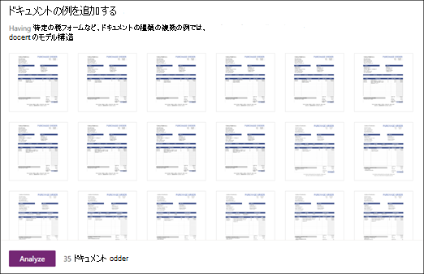

# フォーム処理モデルを作成する (プレビュー)Create a form processing model (Preview)

> [!Note] 
> この記事の内容は、Project Cortex のプライベートプレビュー用です。The content in this article is for Project Cortex Private Preview. [詳細については、「Project Cortex](https://aka.ms/projectcortex)」を参照してください。[Find out more about Project Cortex](https://aka.ms/projectcortex).

[AI ビルダー](https://docs.microsoft.com/ai-builder/overview)を使用する-Microsoft PowerApps のフィーチャー-プロジェクト cortex ユーザーは、SharePoint ドキュメントライブラリから直接[フォーム処理モデル](form-processing-overview.md)を作成できます。Using [AI Builder](https://docs.microsoft.com/ai-builder/overview) - a feature in Microsoft PowerApps - Project Cortex users can create a [form processing model](form-processing-overview.md) directly from a SharePoint document library. 

フォーム処理モデルを作成するには、以下の作業を行います。Creating a form processing model involves the following:
 - 手順 1: コンテンツタイプを作成するための from 処理モデルを作成するStep 1: Create the from processing model to create the content type
 - 手順 2: サンプルファイルを追加して分析するStep 2: Add and analyze example files
 - 手順 3: フォームフィールドを選択するStep 3: Select your form fields
 - 手順 4: モデルをトレーニングおよびテストするStep 4: Train and test your model
 - 手順 5: モデルを発行するStep 5: Publish your model
 - 手順 6: モデルを使用するStep 6: Use your model

## RequirementsRequirements

フォーム処理モデルは、それが有効になっている SharePoint ドキュメントライブラリでのみ作成できます。You can only create a form processing model in SharePoint document libraries in which it is enabled. フォーム処理が有効になっている場合は、ドキュメントライブラリの [**自動化**] メニューにある [**フォーム処理モデルを作成**する] という**AI ビルダー**が表示されます。If form processing is enabled, you will be able to see the **AI Builder** **"Create a form processing model'** under the **Automate** menu in your document library.  ドキュメントライブラリで処理が有効になっている必要がある場合は、管理者に問い合わせてください。If you need from processing enabled on your document library, contact your admin.

  

## 手順 1: フォーム処理モデルを作成するStep 1: Create a Form Processing model

フォーム処理モデルを作成する最初の手順は、新しいコンテンツタイプを定義して、そのコンテンツタイプに新しいドキュメントライブラリビューを作成するための名前を作成することです。The first step in creating a form processing model is to name it to create the define the new content type and create a new document library view for it.

1. ドキュメントライブラリで、[**自動化**] メニューの [ **AI ビルダー**] を選択し、[**フォーム処理モデルの作成**] を選択します。In your document library, select the **Automate** menu, select **AI Builder**, and then select **Create a Form Processing model**.

     
2. [**新しいフォーム処理モデル**] ウィンドウの [**名前**] フィールドに、モデルの名前を入力します (例:*発注書*)。In the **New form processing model** pane, in the  **Name** field, type a name for your model (for example, *Purchase Orders*).

      

3. フォーム処理モデルを作成するときは、新しい SharePoint コンテンツタイプを作成します。When you create a form processing model, you are creating a new SharePoint content type. SharePoint コンテンツタイプは、共通の特性を持つドキュメントのカテゴリを表し、その特定のコンテンツの列またはメタデータプロパティのコレクションを共有します。A SharePoint content type represents a category of documents that have common characteristics and share a collection of columns or metadata properties for that particular content. SharePoint コンテンツタイプは、[コンテンツタイプギャラリー]()を使用して管理されます。SharePoint Content Types are managed through the [Content types gallery]().

    このモデルを SharePoint コンテンツタイプギャラリーの既存のコンテンツタイプにマッピングして、そのスキーマを使用する場合は、[**詳細設定**] を選択します。Select **Advanced settings** if you want to map this model to an existing content type in the SharePoint Content types gallery to use its schema. 

4. モデルによって、抽出されたデータ用のドキュメントライブラリに新しいビューが作成されます。Your model will create a new view in your document library for your extracted data. これを既定のビューにしない場合は、[**既定としてビューを設定**する] をオフにします。If you do not want it to the default view, deselect **Set the view as default**.
5. **[作成]** を選択します。Select **Create**.

## 手順 2: ドキュメントを追加して分析するStep 2: Add and analyze documents

新しいフォーム処理モデルを作成すると、ブラウザーに新しい PowerApps AI ビルダーフォーム処理モデルページが表示されます。After you create your new form processing model, your browser will open a new PowerApps AI Builder forms processing model page. このページでは、サンプルドキュメントを追加して分析することができます。On this page you can add and analyze your example documents.  

> [!Note]
> 使用するファイルの例については、「[フォーム処理モデルの入力文書の要件」と「最適化のヒント](https://docs.microsoft.com/ai-builder/form-processing-model-requirements)」を参照してください。When looking for example files to use, see the [form processing model input document requirements and optimization tips](https://docs.microsoft.com/ai-builder/form-processing-model-requirements). 

     
 

1. [**ドキュメントの追加**] をクリックして、分析するサンプルドキュメントの追加を開始し、抽出できる名前付き値のペアを決定します。Click **Add documents** to begin adding example documents that are analyzed to determine what named value pairs can be extracted. [ローカルストレージ、 **SharePoint**、または**Azure Blob ストレージ\*\*\*\*からのアップロード**] のいずれかを選択できます。You can choose either **Upload from local storage**, **SharePoint**, or **Azure Blob storage**. トレーニングには、少なくとも5つのファイルを使用する必要があります。You will need to use at least five files for training.
2. ファイルを追加した後、[**分析**] を選択して、一般的な情報がすべてのファイルであるかどうかを確認します。After adding your files, select **Analyze** to check for any information that is common is all files. この処理が完了するまで数分かかる場合があることに注意してください。Note that this may take several minutes to complete.  
 
      

3. 分析した後、[保存する**フォームフィールドを選択**してください] ページで、ファイルをクリックして検出されたフィールドを表示します。After they have been analyzed, in the **Select the form fields you want to save** page, click the file to see the fields that were detected. 

      

## 手順 3: フォームフィールドを選択するStep 3: Select your form fields

フィールドのドキュメントを分析すると、どのフィールドが検索されたか、どのフィールドが保存されるかを確認できるようになります。After analyzing your documents for fields, you can now see which fields were found, and which ones you want to save. 保存されたフィールドは、モデルのドキュメントライブラリビューで列として表示され、各ドキュメントから抽出された値を表示します。Saved fields will display as columns in your model's document library view and will show the values extracted from each document.

1. 次のページは、サンプルファイルの1つを表示し、システムによって自動的に検出されたすべての共通フィールドを強調表示します。The next page will display one of your sample files and will highlight all common fields that were automatically detected by the system.  

      

2. 保存するフィールドを選択し、チェックボックスをオンにして選択内容を確認します。Select the fields you want to save, and select the checkbox to confirm your selection. たとえば、発注書モデルでは、*日付*、 *PO*、および*集計*フィールドを選択することができます。For example, in the Purchase Order model, you can choose to select the *Date*, *PO*, and *Total* fields.  また、選択した場合は、フィールドの名前を変更することもできます。Note that you can also choose to rename a field if you choose.  

      

3. 分析でフィールドが検出されなかった場合でも、追加することを選択できます。If a field was not detected by analysis, you can still choose to add it. 抽出する情報を選択し、[名前] ボックスに目的の名前を入力します。Highlight the information you want to extract, and in the name box type in the name you want to give it. 次に、チェックを選択します。Then select the check. このようなファイルの例では、検出されていないフィールドを確認する必要があることに注意してください。Note that you will need to confirm undetected fields in your remaining example files.
4. 保存するフィールドを選択したら、[**フィールドの確認**] をクリックします。Click **Confirm fields** after you have selected the fields you want to save.  
 
      
 
5. [**保存するフォームフィールドを選択**してください] ページで、選択したフィールドの数が表示されます。On the **Select the form fields you want to save** page, it will show the number of fields you have selected. [**完了**] を選択します。Select **Done**.

## 手順 4: モデルをトレーニングおよびテストするStep 4: Train and test your model

保存するフィールドを選択すると、モデルの**概要**ページが表示され、モデルのトレーニングとテストができるようになります。After selecting the fields you want to save, the **Model Summary** page will let you train and test your model.

1. [**モデルの概要**] ページの [**選択したフィールド**] セクションに、保存したフィールドが表示されます。On the **Model Summary** page, the saved fields will show in the **Selected fields** section. サンプルファイルのトレーニングを開始するには、[ **Train** ] を選択します。Select **Train** to begin training on your example files. この処理が完了するまで数分かかる場合があることに注意してください。Note that this may take a few minutes to complete. 
      
2. トレーニングが完了したことを示す通知が表示されたら、[**詳細ページに移動**] を選択します。When you see the notification that training has completed, select **Go to details page**. 
3. [**モデルの詳細**] ページで、[**クイックテスト**] を選択してモデルの動作をテストできます。On the **Model details** page, you can choose to test how your model works by selecting **Quick test**. これにより、ファイルをページにドラッグアンドドロップして、フィールドが検出されたかどうかを確認できます。This lets you drag and drop files to the page and see if the fields are detected.

## 手順 5: モデルを発行するStep 5: Publish your model

1. モデルの結果に問題がなければ、[**発行**] を選択して使用できるようにします。If you are satisfied with the results of your model, select **Publish** to make it available for use.
2. モデルが公開されたら、[ **Use model**] を選択します。After the model published, select **Use model**. これにより、SharePoint ドキュメントライブラリで実行され、モデルで識別されたフィールドが抽出される PowerAutomate フローが作成されます。This creates a PowerAutomate flow that will run in your SharePoint document library and will extract the fields that have been identified in the model. [**フローの作成**] を選択します。Select **Create Flow**.  
3. 完了すると、**フローが正常に作成され**たことをメッセージが表示されます。When completed, you will see the message **Your flow has been successfully created**.
 
 
## 手順 6: モデルを使用するStep 6: Use your model

モデルを発行して、そのモデルの PowerAutomate フローを作成した後、モデルを SharePoint ドキュメントライブラリで使用できます。After publishing your model and creating it's PowerAutomate flow, you can use your model in your SharePoint document library.

1. モデルを公開した後、[ **SharePoint に移動**] を選択してドキュメントライブラリに移動します。After publishing your model , select **Go to SharePoint** to go to your document library.
2. [ドキュメントライブラリモデル] ビューで、選択したフィールドが列として表示されることに注意してください。On your document library model view, notice that the fields you selected now display as columns. 

      

    また、[**ドキュメント**] の横にある [情報] リンクは、フォーム処理モデルがこのドキュメントライブラリに適用されていることに注意してください。Also notice that the information link next to **Documents** will note that a forms processing model is applied to this document library.

       

3. ファイルをドキュメントライブラリにアップロードします。Upload files to your document library. モデルがコンテンツタイプとして識別するすべてのファイルは、ビュー内のファイルを一覧表示し、抽出されたデータを列に表示します。Any files that the model identifies as it's content type will list the files in your view, and will display the extracted data in the columns. 

       

## 関連項目See Also
  
[電力の自動化に関するドキュメントPower Automate documentation](https://docs.microsoft.com/power-automate/) 
[トレーニング: AI ビルダーを使用してビジネスパフォーマンスを向上させるTraining: Improve business performance with AI Builder](https://docs.microsoft.com/learn/paths/improve-business-performance-ai-builder/?source=learn) 

