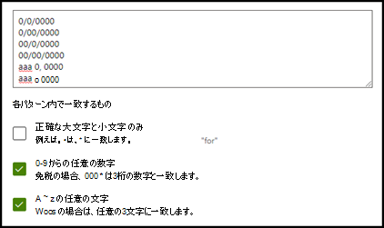
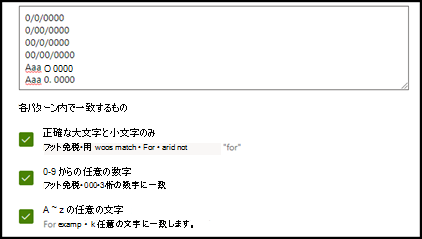
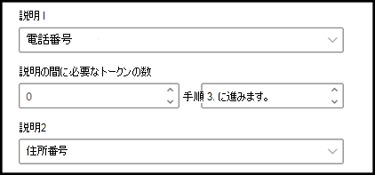
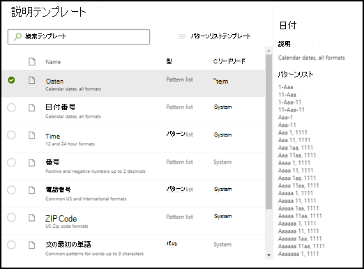

# 説明の種類の概要

説明を使用して、ラベル付けする情報を定義し、ドキュメント内で抽出します。 Microsoft SharePoint の同期のモデルについて理解します。 説明を作成する場合は、必ず説明の種類を選択してください。 

この記事では、さまざまな説明の種類とその使用方法を理解するのに役立つ情報を示します。

    
   
次の説明タイプを使用できます。

- **Phrase list**: ドキュメントまたは抽出する情報で使用できる単語、語句、数字、またはその他の文字のリスト。 たとえば、ユーザーが認識しているすべての医療照会ドキュメントに、 **医師を参照** しているテキスト文字列が含まれているとします。 

- **パターンリスト**: 抽出する情報を識別するために使用できる、数字、文字、またはその他の文字のパターンを一覧表示します。 たとえば、識別しているすべての医療照会ドキュメントから、参照した医師の **電話番号** を抽出できます。 

- **近接**: 説明が互いにどのように近いかを表します。 たとえば、ストリート *番号* パターンリストは、間にトークンがない状態で、 *ストリート名* の語句リストの直前にあります (トークンについては、この記事の後半で説明します)。 
 
## 語句一覧

語句リストの説明タイプは、通常、モデルを通じてドキュメントを識別して分類するために使用されます。 「 *参照する医師* 」ラベルの例で説明されているように、識別するドキュメント内で一貫している単語、語句、数字、または文字の文字列です。

必要なものではありませんが、取り込んだ語句が文書内の一貫した場所にある場合、説明に対して適切な成功を実現できます。 たとえば、文書の最初の段落には、文書の最初の段落に表示される *医師* のラベルが一貫して存在する場合があります。

ラベルを識別する際に大文字と小文字を区別する必要がある場合は、語句リストの種類を使用すると、[ **大文字と小文字** を区別する] チェックボックスをオンにすることにより、説明にそれを指定できます。

    

## パターン一覧

パターンリストの種類は、ドキュメントから情報を識別および抽出する説明を作成する場合に特に便利です。 通常は、日付、電話番号、クレジットカード番号など、さまざまな形式で表示されます。 たとえば、日付をさまざまな形式で表示できます (1/1/2020、1-1-2020、01/01/20、01/01/2020、Jan 1、2020など)。 パターンリストを定義することで、わかりやすくするために、特定して抽出しようとしているデータにあらゆるバリエーションを取り込むことにより、説明がより効率的になります。 

**電話番号**サンプルの場合は、モデルで認識されているすべての医療照会ドキュメントから、各参照医師の電話番号を抽出します。 説明を作成するときに、[パターン] ボックスの一覧を選択して、返される可能性があるさまざまな形式を許可します。

   

この例では、[ **任意の数字を0-9 から** 選択します] チェックボックスをオンにします。 これを選択すると、パターンリストで使用されている各 "0" 値が0から9までの数字であることを認識します。

   

同様に、テキスト文字を含むパターンリストを作成する場合は、 **-z チェックボックスから任意の文字** を選択します。 これを選択すると、パターンリストで使用される各 "a" 文字が "a" ~ "z" のいずれかの文字として認識されます。

たとえば、 **日付** パターンリストを作成している場合に、 *2020 年1月 1* 日などの日付形式が認識されるようにするには、次のことを行う必要があります。
- 自分のパターンリストに *aaa 0、0000* 、 *aaa 00、0000* を追加します。
- **-Z からの文字**も選択されていることを確認してください。

   

また、パターンリストに大文字/小文字の要件がある場合は、[ **大文字と小文字** を区別する] チェックボックスのみを選択できます。 日付の例では、月の最初の文字を大文字にする必要がある場合は、次のことを行う必要があります。

- 自分のパターンリストに *aaa 0、0000* 、 *aaa 00、0000* を追加します。
- **完全な大文字と小文字だけ**も選択されていることを確認してください。

   

> [!NOTE]
> パターンリストの説明を手動で作成する代わりに、 [説明ライブラリ]() を使用して、 *日付*、 *電話番号*、 *クレジットカード番号*などの共通パターンリストに対して事前に定義されたパターンリストテンプレートを使用します。 

## 近接性 

近接説明の種類は、モデルがデータを識別する際に、別のデータをどのように閉じるかを定義するのに便利です。 たとえば、モデルでは、顧客の *番地* と *電話番号*の両方をラベルする2つの説明が定義されています。 

また、顧客の電話番号は、番地の番号の前に常に表示されることにも注意してください。 

Alex/書き込み 
555-555-5555 
One Microsoft Way 
Redmond、ワシントン98034 

近接説明を使用して、ドキュメント内の番地を識別するための電話番号の説明の詳細を定義します。

    

#### トークンとは

近接度の説明の種類を使用するには、トークンの数は、ある説明から別の説明への距離を近接説明で測定する方法として、トークンの数を理解します。  

トークンは、文字と数字の連続したスパン (スペースや句読点なし) です。 スペースはトークンではありません。 各区切り文字はトークンです。 次の表は、語句内のトークンの数を確認する方法の例を示しています。

|Sdl|トークンの数|説明|
|--|--|--|
|`Dog`|1 |句読点またはスペースを含まない1つの単語。|
|`RMT33W`|1 |レコードロケーター番号。 数字と文字を含めることができますが、句読点は含まれません。|
|`425-555-5555`|5 |電話番号。 各句読点マークは1つのトークンであるため、5つのトークンが  `425-555-5555` あります。 `425` `-` `555` `-` `5555` |
|`https://luis.ai`|7 |`https` `:` `/` `/` `luis` `.` `ai` |

#### 近接説明の種類を構成する

この例では、 *電話番号* の説明が *番地* の説明からのトークン数の範囲を定義できるように近接設定を構成します。

電話番号とストリートアドレス番号の間にトークンがないため、最小範囲が "0" であることがわかります。

ただし、サンプルドキュメント内の一部の電話番号は、 *(mobile)* に追加されています。

Nestor/Ke 
111-111-1111 (モバイル) 
One Microsoft Way 
Redmond、ワシントン98034 

*(Mobile)* には、次の3つのトークンがあります。

|Sdl|トークンの数|
|--|--|
|(|1 |
|体|2 |
|)|3 |

0 ~ 3 の範囲の近接設定を構成します。

    

## 説明ライブラリを使用する

説明用にさまざまなパターンリストの値を手動で追加することができますが、説明ライブラリで提供されている作成済みテンプレートを使用する方がはるかに簡単です。

たとえば、 *日付*のバリエーションを手動で追加する代わりに、 *日付*のパターンリストテンプレートを使用して、既にいくつかのパターンリストの値が含まれています。 

    
 
説明ライブラリには、一般的に使用される次のようなパターンリストの説明が含まれています。 

- 日付 
- Date (数値) 
- Time 
- 番号 
- 電話番号 
- 郵便番号 
- 文の最初の単語 
- クレジットカード 
- 社会保障番号 

説明ライブラリにも、語句一覧の説明のためのテンプレートが含まれていることに注意してください。
- 文の終わり
- 通貨

#### 説明ライブラリからテンプレートを使用するには

1. モデルの [**トレーニング**] ページの [**説明**] セクションで、[**新規**] を選択し、[**テンプレートから**] を選択します。 

    

2.  [ **説明テンプレート** ] ページで、使用する説明を選択し、[ **追加**] を選択します。 

        

3. 選択したテンプレートの情報は、[説明の **作成** ] ページに表示されます。 必要に応じて、説明の名前を編集し、[パターン] ボックスの一覧からアイテムを追加または削除します。   

    

4. 完了したら、[ **保存**] を選択します。
