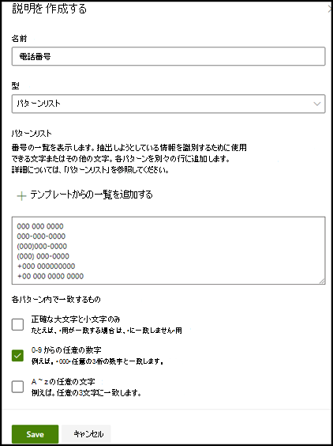

# 説明の種類の概要Introduction to explanation types

説明を使用して、ラベル付けする情報を定義し、ドキュメント内で抽出します。 Microsoft SharePoint の同期のモデルについて理解します。Use explanations to help to define the information that you want to label, and extract in your document the understanding models for Microsoft SharePoint Syntex. 説明を作成する場合は、必ず説明の種類を選択してください。When you create an explanation, be sure to select an explanation type. 

この記事では、さまざまな説明の種類とその使用方法を理解するのに役立つ情報を示します。This article helps you understand the different explanation types and how they are used.

    
   
次の説明タイプを使用できます。These explanation types are available:

- **Phrase list**: ドキュメントまたは抽出する情報で使用できる単語、語句、数字、またはその他の文字のリスト。**Phrase list**: List of words, phrases, numbers, or other characters you can use in the document or information that you are extracting. たとえば、ユーザーが認識しているすべての医療照会ドキュメントに、 **医師を参照** しているテキスト文字列が含まれているとします。For example, the text string **Referring Doctor** is in all Medical Referral documents you are identifying. 

- **パターンリスト**: 抽出する情報を識別するために使用できる、数字、文字、またはその他の文字のパターンを一覧表示します。**Pattern list**: List patterns of numbers, letters, or other characters that you can use to identify the information that you are extracting. たとえば、識別しているすべての医療照会ドキュメントから、参照した医師の **電話番号** を抽出できます。For example, you can extract the **Phone number** of the referring doctor from all Medical Referral document that you are identifying. 

- **近接**: 説明が互いにどのように近いかを表します。**Proximity**: Describes how close explanations are to each other. たとえば、ストリート *番号* パターンリストは、間にトークンがない状態で、 *ストリート名* の語句リストの直前にあります (トークンについては、この記事の後半で説明します)。For example, a *street number* pattern list goes right before the *street name* phrase list, with no tokens in between (you'll learn about tokens later in this article). 
 
## 語句一覧Phrase list

語句リストの説明タイプは、通常、モデルを通じてドキュメントを識別して分類するために使用されます。A phrase list explanation type is typically used to identify and classify a document through your model. 「 *参照する医師* 」ラベルの例で説明されているように、識別するドキュメント内で一貫している単語、語句、数字、または文字の文字列です。As described in the *Referring Doctor* label example, it is a string of words, phrases, numbers, or characters that is consistently in the documents that you are identifying.

必要なものではありませんが、取り込んだ語句が文書内の一貫した場所にある場合、説明に対して適切な成功を実現できます。While not a requirement, you can acheive better success with your explanation if the phrase you are capturing is located in a consistent location in your document. たとえば、文書の最初の段落には、文書の最初の段落に表示される *医師* のラベルが一貫して存在する場合があります。For example, the *Referring Doctor* label may be consistently located in the first paragraph of the document.

ラベルを識別する際に大文字と小文字を区別する必要がある場合は、語句リストの種類を使用すると、[ **大文字と小文字** を区別する] チェックボックスをオンにすることにより、説明にそれを指定できます。If case sensitivity is a requirement in identifying your label, using the phrase list type allows you to specify it in your explanation by selecting the **Only exact capitalization** checkbox.

    

## パターン一覧Pattern lists

パターンリストの種類は、ドキュメントから情報を識別および抽出する説明を作成する場合に特に便利です。A pattern list type is especially useful when you create an explanation that identifies and extracts information from a document. 通常は、日付、電話番号、クレジットカード番号など、さまざまな形式で表示されます。It is typically presented in different formats, such as dates, phone numbers, or credit card numbers. たとえば、日付をさまざまな形式で表示できます (1/1/2020、1-1-2020、01/01/20、01/01/2020、Jan 1、2020など)。For example, a date can be displayed in a number of different formats (1/1/2020, 1-1-2020, 01/01/20, 01/01/2020, Jan 1,2020, etc.). パターンリストを定義することで、わかりやすくするために、特定して抽出しようとしているデータにあらゆるバリエーションを取り込むことにより、説明がより効率的になります。Defining a pattern list makes your explanation more efficient by capturing any possible variations in the data that you are trying to identify and extract. 

**電話番号**サンプルの場合は、モデルで認識されているすべての医療照会ドキュメントから、各参照医師の電話番号を抽出します。For the **Phone number** sample, extract the phone number for each referring doctor from all Medical Referral documents that the model identifies. 説明を作成するときに、[パターン] ボックスの一覧を選択して、返される可能性があるさまざまな形式を許可します。When you create the explanation, select the Pattern list type to allow the different formats that you may expect to be returned.

   

この例では、[ **任意の数字を0-9 から** 選択します] チェックボックスをオンにします。For this sample, select the **Any digit from 0-9** checkbox. これを選択すると、パターンリストで使用されている各 "0" 値が0から9までの数字であることを認識します。Selecting this recognizes each "0" value used in your pattern list to be any digit from 0 through 9.

   

同様に、テキスト文字を含むパターンリストを作成する場合は、 **-z チェックボックスから任意の文字** を選択します。Similarly, if you create a pattern list that includes text characters, select the **Any letter from a-z** checkbox. これを選択すると、パターンリストで使用される各 "a" 文字が "a" ~ "z" のいずれかの文字として認識されます。Selecting this recognizes each "a" character used in the pattern list to be any character from "a" to "z".

たとえば、 **日付** パターンリストを作成している場合に、 *2020 年1月 1* 日などの日付形式が認識されるようにするには、次のことを行う必要があります。For example, if you create a **Date** pattern list and you want to make sure that a date format such as *Jan 1, 2020* is recognized, you need to:
- 自分のパターンリストに *aaa 0、0000* 、 *aaa 00、0000* を追加します。Add *aaa 0, 0000* and *aaa 00, 0000* to your pattern list.
- **-Z からの文字**も選択されていることを確認してください。Make sure that **Any letter from a-z** is also selected.

   

また、パターンリストに大文字/小文字の要件がある場合は、[ **大文字と小文字** を区別する] チェックボックスのみを選択できます。Additionally, if you have capitalization requirements in your pattern list, you have the option to select the **Only exact capitalization** checkbox. 日付の例では、月の最初の文字を大文字にする必要がある場合は、次のことを行う必要があります。For the Date example, if you require the first letter of the month to be capitalized, you need to:

- 自分のパターンリストに *aaa 0、0000* 、 *aaa 00、0000* を追加します。Add *Aaa 0, 0000* and *Aaa 00, 0000* to your pattern list.
- **完全な大文字と小文字だけ**も選択されていることを確認してください。Make sure that **Only exact capitalization** is also selected.

   

> [!NOTE]
> パターンリストの説明を手動で作成する代わりに、 [説明ライブラリ]() を使用して、 *日付*、 *電話番号*、 *クレジットカード番号*などの共通パターンリストに対して事前に定義されたパターンリストテンプレートを使用します。Instead of manually creating pattern list explanation, use the [explanation library]() to use pre-made pattern list templates for common pattern list, such as *date*, *phone number*, *credit card number*, etc.. 

## 近接性Proximity 

近接説明の種類は、モデルがデータを識別する際に、別のデータをどのように閉じるかを定義するのに便利です。The proximity explanation type helps your model identify data through defining how close another piece of data is to it. たとえば、モデルでは、顧客の *番地* と *電話番号*の両方をラベルする2つの説明が定義されています。For example, in your model, you have defined two explanations that label both the customer *Street address number* and *Phone number*. 

また、顧客の電話番号は、番地の番号の前に常に表示されることにも注意してください。You also notice that customer phone numbers always appear before the street address number. 

Alex/書き込みAlex Wilburn 
555-555-5555555-555-5555 
One Microsoft WayOne Microsoft Way 
Redmond、ワシントン98034Redmond, WA 98034 

近接説明を使用して、ドキュメント内の番地を識別するための電話番号の説明の詳細を定義します。Use the proximity explanation to define how far away the phone number explanation is to better identify the street address number in your documents.

    

#### トークンとはWhat are tokens?

近接度の説明の種類を使用するには、トークンの数は、ある説明から別の説明への距離を近接説明で測定する方法として、トークンの数を理解します。In order to use the proximity explanation type, understand what a token is, as the number of tokens is how the proximity explanation measures distance from one explanation to another.  

トークンは、文字と数字の連続したスパン (スペースや句読点なし) です。A token is a continuous span (no spaces or punctuation) of letters and numbers. スペースはトークンではありません。A space is NOT a token. 各区切り文字はトークンです。Each punctuation character is a token. 次の表は、語句内のトークンの数を確認する方法の例を示しています。The following table shows some examples of how to determine the number of tokens in a phrase.

|SdlPhrase|トークンの数Number of tokens|説明Explanation|
|--|--|--|
|`Dog`|1 1|句読点またはスペースを含まない1つの単語。A single word with no punctuation or spaces.|
|`RMT33W`|1 1|レコードロケーター番号。A record locator number. 数字と文字を含めることができますが、句読点は含まれません。It may have numbers and letters, but does not have any punctuation.|
|`425-555-5555`|5 5|電話番号。A phone number. 各句読点マークは1つのトークンであるため、5つのトークンが  `425-555-5555` あります。Each punctuation mark is a single token so  `425-555-5555` would be 5 tokens: `425` `-` `555` `-` `5555` |
|`https://luis.ai`|7 7|`https` `:` `/` `/` `luis` `.` `ai` |

#### 近接説明の種類を構成するConfigure the proximity explanation type

この例では、 *電話番号* の説明が *番地* の説明からのトークン数の範囲を定義できるように近接設定を構成します。For the sample, configure the proximity setting so that we can define the range of the number of tokens the *Phone number* explanation is from the *Street address number* explanation.

電話番号とストリートアドレス番号の間にトークンがないため、最小範囲が "0" であることがわかります。You should see that the minimum range is "0" since there are no tokens between the phone number and street address number.

ただし、サンプルドキュメント内の一部の電話番号は、 *(mobile)* に追加されています。However, some phone numbers in the sample documents are appended with *(mobile)*.

Nestor/KeNestor Wilke 
111-111-1111 (モバイル)111-111-1111 (mobile) 
One Microsoft WayOne Microsoft Way 
Redmond、ワシントン98034Redmond, WA 98034 

*(Mobile)* には、次の3つのトークンがあります。There are three tokens in *(mobile)*:

|SdlPhrase|トークンの数Token count|
|--|--|
|((|1 1|
|体mobile|2 2|
|))|3 3|

0 ~ 3 の範囲の近接設定を構成します。Configure the proximity setting to have a range of 0 through 3.

    

## 説明ライブラリを使用するUse the explanation library

説明用にさまざまなパターンリストの値を手動で追加することができますが、説明ライブラリで提供されている作成済みテンプレートを使用する方がはるかに簡単です。While you can manually add various pattern list values for your explanation, it's much easier to use the pre-created templates provided to you in the explanation library.

たとえば、 *日付*のバリエーションを手動で追加する代わりに、 *日付*のパターンリストテンプレートを使用して、既にいくつかのパターンリストの値が含まれています。For example, instead of manually adding all the variations for *Date*, use the pattern list template for *Date*, that already includes a number of pattern lists values: 

    
 
説明ライブラリには、一般的に使用される次のようなパターンリストの説明が含まれています。The explanation library includes a number of commonly used pattern list explanations, including: 

- 日付Date 
- Date (数値)Date (numeric) 
- TimeTime 
- 番号Number 
- 電話番号Phone number 
- 郵便番号Zip code 
- 文の最初の単語First word of sentence 
- クレジットカードCredit card 
- 社会保障番号Social security number 

説明ライブラリにも、語句一覧の説明のためのテンプレートが含まれていることに注意してください。Note that the explanation library also includes templates for phrase list explanations as well, including:
- 文の終わりEnd of sentence
- 通貨Currency

#### 説明ライブラリからテンプレートを使用するにはTo use a template from the explanation library

1. モデルの [**トレーニング**] ページの [**説明**] セクションで、[**新規**] を選択し、[**テンプレートから**] を選択します。From the **Explanations** section of your model's **Train** page, select **New**, then select **From a template**. 

    

2.  [ **説明テンプレート** ] ページで、使用する説明を選択し、[ **追加**] を選択します。On the **Explanation templates** page, select the explanation you want to use, and then select **Add**. 

        

3. 選択したテンプレートの情報は、[説明の **作成** ] ページに表示されます。The information for the template you selected will display on the **Create an explanation** page. 必要に応じて、説明の名前を編集し、[パターン] ボックスの一覧からアイテムを追加または削除します。If needed, edit the explanation name, and add or remove items from the pattern list.   

    

4. 完了したら、[ **保存**] を選択します。When finished, select **Save**.
