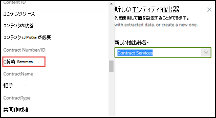

# 抽出子の作成時に用語ストアの分類を活用するLeverage term store taxonomy when creating an extractor

 

> [!VIDEO https://www.microsoft.com/videoplayer/embed/RE4GpJJ]  

 

SharePoint Syntex のドキュメント理解モデルで抽出子を作成する場合、[マネージド メタデータ サービス](https://docs.microsoft.com/sharepoint/managed-metadata#terms)の用語ストア分類を利用して、抽出するデータの優先用語を表示できます。When you create an extractor in your document understanding model in SharePoint Syntex, you can take advantage of [Managed Metadata services](https://docs.microsoft.com/sharepoint/managed-metadata#terms) term store taxonomy to display preferred terms for data that you extract.  

例として、モデルは、ドキュメント ライブラリにアップロードされているすべての **契約** ドキュメントを識別して分類します。As an example, your model identifies and classifies all **Contract** documents that are uploaded to the document library.  さらに、モデルは各契約から **契約サービス** 値も抽出し、ライブラリ ビューの列に表示します。Additionally, the model also extracts a **Contract Service** value from each contract, and will display it in a column in your library view. 契約内のさまざまな契約サービス値の中には、会社が使用しなくなって名前が変更された古い値がいくつかあります。Among the various Contract Services values in the contracts, there are several older values that your company no longer uses and have been renamed. たとえば、契約サービスでの *Design*、*Graphics*、*Topography* という用語への参照はすべて、*Creative* と呼ばれる必要があります。For example, all references to the terms *Design*, *Graphics*, or *Topography* contract services should now be called *Creative*. モデルが契約ドキュメントから過去の条件の 1 つを抽出するときは必ず、ライブラリ ビューに現在の条件 (Creative) を表示する必要があります。Whenever your model extracts one of the outdated terms from a contract document, you want it to display the current term - Creative - in your library view. 以下の例では、モデルのトレーニング中に、1 つのサンプル ドキュメントに古い用語である *Design* が含まれていることがわかります。In the example below, while training the model we see that one sample document contains the outdated term of *Design*.

    

## 抽出子で管理されたメタデータ列を使用するUse a Managed metadata column in your extractor

用語セットは、SharePoint 管理センターの 管理されたメタデータ サービス 用語ストアで構成されます。Term sets are configured in the Managed Metadata services term store in the SharePoint admin center. 以下の例では、*契約サービス* の [用語セット](https://docs.microsoft.com/sharepoint/managed-metadata#term-set)は、*Creative* などのいくつかの用語を含むように構成されています。In the the example below, the *Contract Services* [term set](https://docs.microsoft.com/sharepoint/managed-metadata#term-set) is configured to include a number of terms, including *Creative*.  詳細は、この用語に 3 つの同義語 (*Design*、*Graphics*、*Topography*) があり、これらの同義語を *Creative* に翻訳する必要があることを示しています。The details for it show that the term has three synonyms (*Design*, *Graphics*, and *Topography*) and the synonyms should be translated to *Creative*. 

    

用語セットで同義語を使用する理由はいくつか考えられます。There could be a number of reasons why you might want to use a synonym in your term set. たとえば、古い用語、名前が変更された用語、または名前付けに関する組織部門間のバリエーションがある可能性があります。For example, there could be outdated terms, renamed terms, or variations between your organizations departments on naming.

モデルで抽出子を作成するときに管理メタデータ フィールドを選択できるようにするには、それを[管理メタデータ サイト列として追加する](https://support.microsoft.com/office/8fad9e35-a618-4400-b3c7-46f02785d27f)必要があります。To make the managed metadata field available for you to select when you create your extractor in your model, you need to [add it as a managed-metadata site column](https://support.microsoft.com/office/8fad9e35-a618-4400-b3c7-46f02785d27f). サイト列を追加すると、モデルの抽出子を作成するときに選択できるようになります。After you add the site column, it will be available for you to select when you create the extractor for your model.

    

モデルをドキュメント ライブラリに適用した後、ドキュメントがライブラリにアップロードされると、抽出子が同義語の値 (*Design*、*Graphics*、*Topography*) のいずれかを検出すると、*Creative Services* 列に優先用語 (*Creative*) が表示されます。After applying your model to the document library, when documents are uploaded to library, the *Creative Services* column will display the preferred term (*Creative*) when the extractor finds any of the synonym values (*Design*, *Graphics*, and *Topography*).

    

## 関連項目See Also
[管理されたメタデータの概要Introduction to Managed Metadata](https://docs.microsoft.com/sharepoint/managed-metadata#terms)

[抽出子を作成するCreate an extractor](create-an-extractor.md)

[管理メタデータ列を作成するCreate a managed metadata column](https://support.microsoft.com/office/create-a-managed-metadata-column-8fad9e35-a618-4400-b3c7-46f02785d27f?redirectSourcePath=%252farticle%252fc2a06717-8105-4aea-890d-3082853ab7b7&ui=en-US&rs=en-US&ad=US)

