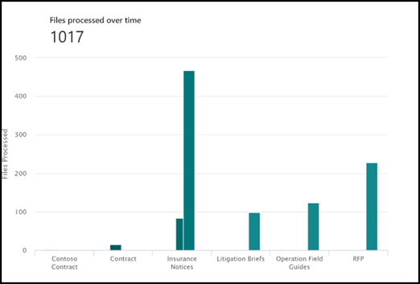

# モデル使用状況分析についてのドキュメント

 

> [!VIDEO https://www.microsoft.com/videoplayer/embed/RE4CSoL]

 

Microsoft SharePoint の同期 Tex コンテンツセンターは、モデル使用状況分析を提供して、コンテンツセンターから公開されたモデルの使用方法に関する詳細情報を提供します。 これには、次の情報が含まれています。

- モデルが適用されている場所
- 時間の経過とともに処理されているファイルの数

   

## モデルの合計の割合

     

[ **総合モデル比率** 円グラフの場合、コンテンツセンターのすべての公開モデルによって処理された総ファイル数の割合として、各公開モデルが表示されます。

各モデルには、モデルによって正常に分析されたアップロード済みファイルの割合 ( **完全なレート**) も表示されます。 完全性率が低い場合は、分析対象のモデルまたはファイルのいずれかに問題があることを意味します。

## 時間の経過によって処理されるファイル

     

タイムバーグラフ **で処理** されたファイルは、各モデルで時間の経過と共に処理されるファイルの数だけでなく、モデルが適用されたドキュメントライブラリも表示します。

     

## 関連項目
[分類子を作成する](create-a-classifier.md) 
[抽出器を作成する](create-an-extractor.md) 
[ドキュメント理解の概要](document-understanding-overview.md) 
[フォーム処理モデルを作成する](create-a-form-processing-model.md)  
