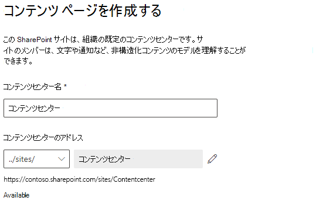

# コンテンツの理解を設定する (プレビュー)Set up content understanding (Preview)

> [!Note] 
> この記事の内容は、Project Cortex のプライベートプレビュー用です。The content in this article is for Project Cortex Private Preview. [詳細については、「Project Cortex](https://aka.ms/projectcortex)」を参照してください。[Find out more about Project Cortex](https://aka.ms/projectcortex).

管理者は、Microsoft 365 管理センターを使用して、コンテンツの理解を設定し、構成することができます。Admins can use the Microsoft 365 admin center to set up and configure content understanding. 

セットアップの前に、環境内のコンテンツの理解を設定して構成するための最善の方法を計画してください。Prior to setup, make sure to plan for the best way to set up and configure content understanding in your environment. たとえば、次の点について考慮する必要があります。For example, you will need to make considerations about the following:
- どの SharePoint サイトでフォーム処理を有効にしますか?Which SharePoint sites will you enable form processing? すべてのサイト、一部、またはサイトの選択All of them, some, or select sites?
- コンテンツセンターの名前、およびプライマリサイト管理者は誰ですか。Name of your content center, and who is the primary site admin?

管理者は、コンテンツのセットアップ後に、選択した設定を変更して、Microsoft 365 管理センターの管理設定を理解することもできます。An admin can also make changes to your selected settings anytime after setup through the content understanding management settings in the Microsoft 365 admin center.

## RequirementsRequirements 
Microsoft 365 管理センターにアクセスし、コンテンツの理解を設定するには、グローバル管理者または SharePoint 管理者のアクセス許可を持っている必要があります。You must have Global Admin or SharePoint admin permissions to be able to access the Microsoft 365 admin center and set up content understanding.

## コンテンツの理解を設定するにはTo set up content understanding

1. Microsoft 365 管理センターで、[ **セットアップ**] を選択し、[ **組織ナレッジ** ] セクションを表示します。In the Microsoft 365 admin center, select **Setup**, and then view the **Organizational knowledge** section.
2. [ **組織ナレッジ** ] セクションで、[ **コンテンツの理解を自動化**する] を選択します。In the **Organizational knowledge** section, select **Automate content understanding**. 

     

3. [ **コンテンツを自動的に理解** する] ページで、[ **開始** ] をクリックして、セットアッププロセスを案内します。On the **Automate content understanding** page, click **Get started** to walk you through the setup process. 

     

4. [ **フォーム処理の構成** ] ページで、ユーザーが AI ビルダーを使用して、特定の SharePoint ドキュメントライブラリのフォーム処理モデルを作成できるようにするかどうかを選択できます。On the **Configure Form Processing** page, you can choose if you want to let users be able to use AI Builder to create form processing models in specific SharePoint document libraries. [ドキュメントライブラリ] リボンでメニューオプションを使用して、フォーム処理モデルが有効になっている SharePoint ドキュメントライブラリに **フォーム処理モデルを作成** できます。A menu option will be available in the document library ribbon to **Create a form processing model** in SharePoint document libraries in which it is enabled.
 
     **フォーム処理モデルを作成するためのオプションをどの SharePoint ライブラリに表示するかを指定**するには、次のオプションを選択します。For **Which SharePoint libraries should show option to create a form processing model**, you can select: 
    - テナント内のすべての SharePoint ライブラリで利用できるようにするための**すべての sharepoint ライブラリ**。**All SharePoint libraries** to make it available to all SharePoint libraries in your tenant. 
    - [**選択したサイトのライブラリのみ**] を選択し、使用できるようにするサイトを選択します。**Only libraries in selected sites**, and then select the sites in which you want to make it available. 
    - 現在、どのサイトでも使用できるようにしない場合は、 **SharePoint ライブラリはありません**(セットアップ後に変更できます)。**No SharePoint libraries** if you currently don't want to make it available to any sites (you can change this after setup).
 

   

 

   > [!Note]
   > SharePoint ドキュメントライブラリでこの設定を有効にしても、ライブラリに適用されている既存のモデル、またはドキュメントを認識するモデルをライブラリに適用する機能には影響しません。Enabling this setting on a SharePoint document library does not affect existing models applied to the library or the ability to apply document understanding models to a library. 

    
5. [ **コンテンツセンターの作成** ] ページで、ユーザーがドキュメントを作成および管理できる SharePoint コンテンツセンターサイトを作成できます。On the **Create Content Center** page, you can create a SharePoint content center site on which your users can create and manage document understanding models.  
    a. a. [ **サイト名**] に、コンテンツセンターサイトに付ける名前を入力します。For **Site name**, type the name you want to give your content center site. 
    b. b. サイト **アドレス** には、サイト名に対して選択した内容に基づいてサイトの URL が表示されます。The **Site address** will show the URL for your site, based on what you selected for the site name. 

    > [!Note] 
    > サポートされている言語を選択することはできますが、モデルを理解しているのは英語版のコンテンツのみを作成できることに注意してください。While you can select any supported language, note that content understanding models can only be created for English. 

       

    [**次へ**] を選択します。Select **Next**.
6. [ **完了と確認** ] ページで、選択した設定を確認して、変更を行うことができます。On the **Finish and review** page, you can look at your selected setting and choose to make changes. 選択内容に問題がなければ、[ **アクティブ化**] を選択します。If you are satisfied with your selections, select **Activate**.

7. コンテンツを理解すると、 **アクティブ化** されたページが表示され、システムがフォーム処理の設定を追加し、コンテンツセンターサイトを作成したことを確認できます。The **Content understanding activated** page will display, confirming that the system has added your form processing preferences and creating the Content Center site. [**完了**] を選択します。Select **Done**.

8. **コンテンツの自動理解**ページに戻ります。You'll be returned to your **Automate content understanding** page. このページでは、[ **管理** ] を選択して構成設定に変更を加えることができます。From this page, you can select **Manage** to make any changes to your configuration settings. 

## 関連項目See also

  

