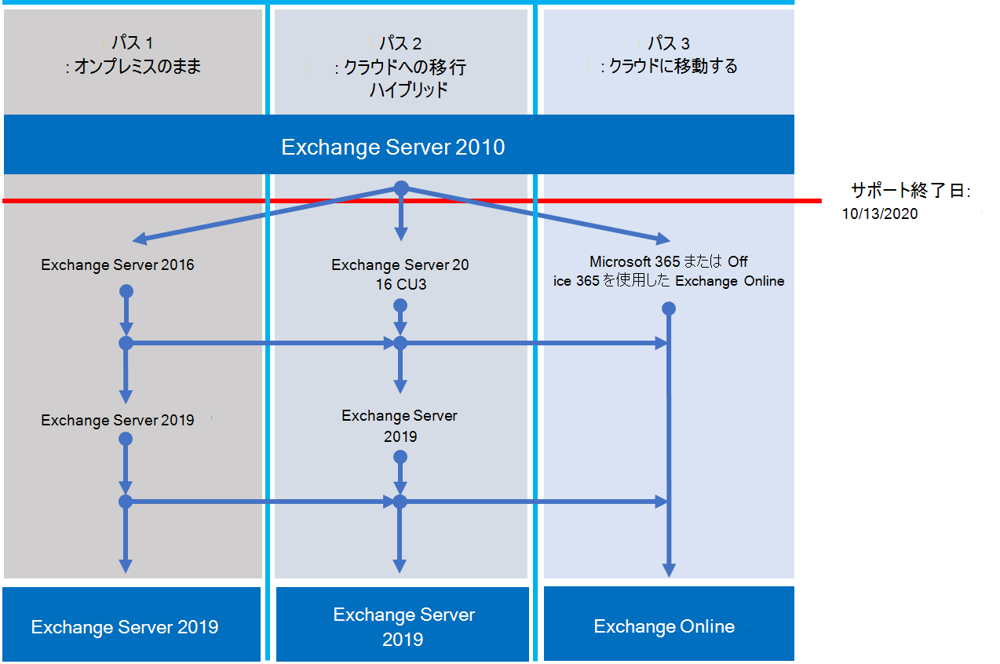

# Exchange 2010 のサポート終了のロードマップ

*この記事は、Microsoft 365 Enterprise および Office 365 Enterprise の両方に適用されます。*

Exchange Server 2010 **は、2020年10月 13** 日にサポート終了に達しました。 Exchange 2010 から Microsoft 365、Office 365、または Exchange 2016 への移行をまだ開始していない場合は、計画を開始する時間になります。

## *サポート終了の* 意味

ほとんどの Microsoft 製品には、新機能、バグ修正、セキュリティ修正プログラムを入手するためのライフサイクルが用意されています。 このライフサイクルは通常、製品の最初のリリースから10年間続きます。 このライフサイクルの終了は、製品のサポート終了と呼ばれます。 Exchange 2010 は、2020年10月13日にサポートが終了してから、Microsoft は提供されなくなりました。

- 発生する可能性のある問題のテクニカルサポート。
- サーバーの安定性と有用性に影響を与える可能性がある問題について、バグ修正が行われます。
- セキュリティ侵害に対してサーバーが脆弱になる可能性がある脆弱性に対するセキュリティ修正。
- タイム ゾーンの更新。

Exchange 2010 のインストールは、この日付以降も引き続き実行されます。 ただし、上記の変更によって、Exchange 2010 からできるだけ早く移行することを強くお勧めします。

サポートの終了間近に関する詳細については、「 [Office 2010 サーバーおよびクライアントからのアップグレードに役立つリソース](upgrade-from-office-2010-servers-and-products.md)」を参照してください。

## 使用できるオプション

オプションを調べて移行計画を準備するのに非常に時間がかかります。 次の操作を行うことができます:

- 完全に Microsoft 365 に移行します。 カットオーバー、最小ハイブリッド、または完全なハイブリッド移行を使用してメールボックスを移行します。 次に、オンプレミスの Exchange サーバーと Active Directory を削除します。
- オンプレミスサーバー上の exchange 2010 サーバーを Exchange 2016 に移行します。

> [!IMPORTANT]
> メールボックスを Microsoft 365 に移行することを選択しても、オンプレミスの Active Directory からのユーザーアカウントの管理を続行するために DirSync または Azure AD Connect を保持することを計画している場合は、オンプレミスの Microsoft Exchange server を少なくとも1つ保持する必要があります。 すべての Exchange サーバーを削除した場合、権限のソースは社内の Active Directory に残っているため、exchange Online の Exchange 受信者を変更することはできません。 変更は、そこで行う必要があります。 このシナリオでは、次のオプションを使用できます。
>
>- *推奨:* メールボックスを Microsoft 365 に移行し、サーバーを2020年10月13日にアップグレードした場合は、Exchange 2010 を使用して Microsoft 365 に接続し、メールボックスを移行します。 次に、exchange 2010 を Exchange 2016 に移行し、残りの Exchange 2010 サーバーをすべて使用停止にします。
>- 2020年10月13日に、メールボックスの移行とオンプレミスサーバーのアップグレードを完了しなかった場合は、オンプレミスの Exchange 2010 サーバーを最初に Exchange 2016 にアップグレードします。 次に、Exchange 2016 を使用して、Microsoft 365 に接続し、メールボックスを移行します。

> [!NOTE]
> これは少し複雑ですが、オンプレミスの Exchange 2010 サーバーを Exchange 2016 に移行する際に、メールボックスを Microsoft 365 に移行することもできます。

Exchange Server 2010 のサポート終了を回避するために実行できる3つのパスを次に示します。

次のセクションでは、それぞれのオプションについて詳しく説明します。

## Microsoft 365 に移行する

メールを Microsoft 365 に移行することは、Exchange 2010 の展開を廃止する際に役立つ最良かつ最も簡単なオプションです。 Microsoft 365 への移行により、次のような古いテクノロジから現在の機能までの単一ホップを作成できます。

- 保持ポリシー、In-Place および訴訟ホールド、インプレース電子情報開示などのコンプライアンス機能。
- Microsoft Teams。
- Power BI。
- 優先受信トレイ。
- MyAnalytics.

また、Microsoft 365 は、最初に新機能とエクスペリエンスを取得するので、組織はすぐに使用を開始できます。 また、次のことについて心配する必要はありません。

- ハードウェアを購入および保守する。
- サーバーの発熱と冷却にお支払いください。
- 常に最新のセキュリティ、製品、タイムゾーンを更新します。
- コンプライアンス要件をサポートするためのストレージとソフトウェアの管理。
- 新しいバージョンの Exchange にアップグレードします。 Microsoft 365 では常に最新バージョンの Exchange を使用しています。

### Microsoft 365 に移行する方法

組織によっては、Microsoft 365 にアクセスするためのオプションがいくつか用意されています。 最初に、次の点を考慮する必要があります。
- 移動する必要がある座席またはメールボックスの数。
- 移行を最後に実行する時間。
- 移行中にオンプレミスのインストールと Microsoft 365 との間でシームレスな統合が必要かどうか。
 
次の表に、移行オプションと、使用する方法を決定する最も重要な要素を示します。

|移行オプション|組織の規模|期間|
|---|---|---|
|カットオーバー移行|座席数が150未満|1週間以内|
|最小限のハイブリッド移行|座席数が150未満|数週間以内|
|完全なハイブリッド移行|150を超える座席|数週間以上|

次のセクションでは、これらの方法の概要について説明します。 詳細については、「 [移行パスの決定](https://support.office.com/article/Decide-on-a-migration-path-0d4f2396-9cef-43b8-9bd6-306d01df1e27)」を参照してください。

### カットオーバー移行

カットオーバー移行では、すべてのメールボックス、配布グループ、連絡先などを、設定した日時に Office 365 に移行します。 完了したら、オンプレミスの Exchange サーバーをシャットダウンし、Microsoft 365 のみの使用を開始します。

メールボックス数の少ない小規模な組織では、メールボックスのカットオーバーが非常に重要であり、Microsoft 365 を迅速に取得し、その他の方法を使用しないことを希望しています。 ただし、1週間以内に完了する必要があります。 また、ユーザーが Outlook プロファイルを再構成する必要があります。 カットオーバー移行は最大2000のメールボックスを移行できますが、最大で150で使用することをお勧めします。 さらに移行しようとすると、期限までにすべてのメールボックスを移行するのに時間がかかり、ユーザーが Outlook を再構成するのを支援する要求に IT サポートスタッフが圧倒される可能性があります。

一括移行について考慮すべき点は次のとおりです。

- Microsoft 365 は、TCP ポート443で Outlook Anywhere を使用して、Exchange 2010 サーバーに接続する必要があります。
- すべてのオンプレミスメールボックスは、Microsoft 365 に移動されます。
- ユーザーのメールボックスに対する読み取りアクセス権を持つオンプレミスの管理者アカウントが必要です。
- Microsoft 365 で使用する Exchange 2010 の承認済みドメインは、サービスの確認済みドメインとして追加する必要があります。
- 移行を開始してから完了フェーズを開始すると、Microsoft 365 は定期的に Microsoft 365 とオンプレミスのメールボックスを同期します。 これにより、オンプレミスのメールボックスに残った電子メールを気にすることなく、移行を完了できます。
- ユーザーは、Microsoft 365 アカウントの新しい一時パスワードを受け取ります。 ユーザーは、メールボックスに初めてサインインするときに、それらを変更する必要があります。
- 移行するユーザーメールボックスごとに、Exchange Online を含む Microsoft 365 ライセンスが必要になります。
- ユーザーは、それぞれのデバイスに新しい Outlook プロファイルを設定して、電子メールをもう一度ダウンロードする必要があります。 Outlook がダウンロードするメールの量は異なる場合があります。 詳細については、「 [Outlook でオフラインで作業](https://support.microsoft.com/office/f3a1251c-6dd5-4208-aef9-7c8c9522d633)する」を参照してください。

カットオーバー移行の詳細については、以下を参照してください。

- [カットオーバーメール移行について知っておくべきこと](https://docs.microsoft.com/Exchange/mailbox-migration/what-to-know-about-a-cutover-migration)
- [Office 365 への電子メールの一括移行を実行する](https://docs.microsoft.com/Exchange/mailbox-migration/cutover-migration-to-office-365)

### 最小限のハイブリッド移行

最低限のハイブリッドまたは高速移行では、数週間以内に数百のメールボックスを Microsoft 365 に移行します。 この方法は、空き時間情報の共有予定表情報などの高度なハイブリッド移行機能をサポートしていません。

最小限のハイブリッド移行は、メールボックスを Microsoft 365 に移行するのに時間がかかるようにする必要がある組織に適していますが、数週間以内に移行を完了することを計画しています。 複雑さの多くを伴わずに、より高度 *な完全なハイブリッド移行* のメリットのいくつかを得ることができます。 特定の時間に、移行するメールボックスの数と数を制御できます。 Microsoft 365 メールボックスは、社内アカウントのユーザー名とパスワードを使用して作成されます。 また、カットオーバー移行とは異なり、ユーザーが Outlook プロファイルを再作成する必要はありません。

最低限のハイブリッド移行に関する考慮事項を以下に示します。

- オンプレミスの Active Directory サーバーと Microsoft 365 の間では、1回限りのディレクトリ同期を行う必要があります。
- ユーザーは、自分のメールボックスの前と同じユーザー名とパスワードを使用して、自分の Microsoft 365 メールボックスにサインインできるようになります。
- 移行するユーザーメールボックスごとに、Exchange Online を含む Microsoft 365 ライセンスが必要になります。
- ユーザーは、多くのデバイスで新しい Outlook プロファイルを設定する必要はありませんが、一部の古い Android 電話機では新しいプロファイルが必要になることがあります。 ユーザーはメールを再度ダウンロードする必要はありません。

詳細については、「 [最小限のハイブリッドを使用して Exchange メールボックスを Office 365 にすばやく移行する](https://docs.microsoft.com/Exchange/mailbox-migration/use-minimal-hybrid-to-quickly-migrate)」を参照してください。

### 完全なハイブリッド

完全なハイブリッド移行では、数百から数万のメールボックスがあり、一部またはすべてを Microsoft 365 に移行します。 通常、これらの移行は長期間になるため、ハイブリッド移行によって次のことが可能になります。

- オンプレミスのユーザーに、Microsoft 365 のユーザーの予定表の空き時間情報を表示します。その逆も同様です。
- オンプレミスと Microsoft 365 の両方の受信者が含まれる統合グローバルアドレス一覧を参照してください。
- オンプレミスであるか Microsoft 365 であるかに関係なく、すべてのユーザーの完全な Outlook 受信者プロパティを表示します。
- TLS と証明書を使用して、オンプレミスの Exchange サーバーと Office 365 間の電子メール通信をセキュリティで保護します。
- オンプレミスの Exchange サーバーと Microsoft 365 間で送信されたメッセージを内部として処理し、次のことを可能にします。
  - 内部メッセージを対象とするトランスポートおよびコンプライアンスエージェントにより、適切に評価および処理されます。
  - スパム対策フィルターをバイパスします。

完全なハイブリッド移行は、数か月以上のハイブリッド構成にとどまることが予想される組織に最適です。 このセクションで前述した機能に加えて、ディレクトリ同期、統合されたコンプライアンス機能、およびオンラインメールボックスの移動を使用して Microsoft 365 との間でメールボックスを移動する機能を取得します。 Microsoft 365 は、オンプレミスの組織の拡張機能になります。

完全なハイブリッド移行に関する考慮事項:

- すべての組織には適していません。 完全なハイブリッド移行は複雑であるため、数百のメールボックスを使用していない組織では、多くの場合、労力とコストに関連する利点を示していません。 そのような場合は、代わりに一括移行を一括移行または最小限にすることをお勧めします。
- オンプレミスの Active Directory サーバーと Microsoft 365 との間で Azure Active Directory (Azure AD) 接続を使用してディレクトリ同期をセットアップする必要があります。
- ユーザーは、ローカルネットワークにサインインするときに使用したのと同じユーザー名とパスワードを使用して、自分の Microsoft 365 メールボックスにサインインできます。 (この機能には、パスワード同期や Active Directory フェデレーションサービスを使用した Azure AD Connect が必要です)。
- 移行するユーザーメールボックスごとに、Exchange Online を含む Microsoft 365 ライセンスが必要です。
- ユーザーは、多くのデバイスで新しい Outlook プロファイルを設定する必要はありませんが、一部の古い Android 電話機では新しいプロファイルが必要になることがあります。 ユーザーはメールを再度ダウンロードする必要はありません。

> [!IMPORTANT]
> メールボックスを Microsoft 365 に移行することを選択しても、オンプレミスの Active Directory からのユーザーアカウントの管理を続行するために DirSync または Azure AD Connect を保持することを計画している場合は、オンプレミスの Exchange サーバーを少なくとも1つ保持する必要があります。 すべての Exchange サーバーが削除されても、exchange Online の Exchange 受信者に変更を加えることはできません。 これは、権限のソースがオンプレミスの Active Directory に残っており、そこに変更を加える必要があるためです。

完全なハイブリッド移行が適切な場合は、次の参考資料を参照してください。

- [Exchange 展開アシスタント](https://aka.ms/exdeploy)
- [Exchange Server のハイブリッド展開](https://docs.microsoft.com/exchange/exchange-hybrid)
- [ハイブリッド構成ウィザード](https://docs.microsoft.com/exchange/hybrid-configuration-wizard)
- [ハイブリッド構成ウィザードに関する FAQ](https://docs.microsoft.com/exchange/hybrid-configuration-wizard-faqs)
- [ハイブリッド展開の前提条件](https://docs.microsoft.com/exchange/hybrid-deployment-prerequisites)

## オンプレミスの Exchange Server の新しいバージョンにアップグレードする

マイクロソフトは、完全に Microsoft 365 に移行することによって、最高の価値とユーザーの利便性を得られることを強く確信しています。 しかし、一部の組織では、一部の Exchange サーバーをオンプレミスのままにしておく必要があることを理解しています。 これは、クラウドでは満たすことができない固有の設定または要件がある場合や、クラウドメールボックスを管理するために Exchange が依然としてオンプレミスで使用されているために、データが外部データセンターに保存されないことが保証されるためです。 いずれの場合も、Exchange をオンプレミスで保持している場合は、exchange 2010 環境が少なくとも Exchange 2013 または Exchange 2016 にアップグレードされていることを確認する必要があります。

最良の結果を得るために、残りのオンプレミス環境を Exchange 2016 にアップグレードすることをお勧めします。 Exchange server 2010 から Exchange Server 2016 に直接移動する場合は、Exchange Server 2013 をインストールする必要はありません。

Exchange 2016 には、以前のリリースの Exchange のすべての機能が含まれています。 Microsoft 365 で利用できる機能に最も近いものがありますが、一部の機能は Microsoft 365 でのみ利用可能です。 不足しているもののいくつかを確認してください。

|Exchange リリース|機能|
|---|---|
|**Exchange 2013**|シンプルなアーキテクチャにより、サーバーの役割の数が 3 (メールボックス、クライアントアクセス、エッジトランスポート) に削減されます。|
||機密情報を漏洩させないようにするデータ損失防止ポリシー (DLP)|
||Outlook Web App の操作性の向上|
|**Exchange 2016**|*Exchange 2013 の機能*|
||メールボックスとエッジトランスポートだけのサーバーの役割をさらに簡素化する|
||SharePoint との統合と共に DLP が向上しました。|
||データベースの復元性の向上|
||オンラインドキュメントのコラボレーション|

|考慮事項|詳細|
|---|---|
|サポート終了日|Exchange 2010 と同様に、Exchange の各バージョンには、サポート終了日が含まれています。  Exchange 2013-2023 年4月 Exchange 2016 年10月2025  以前のサポート終了日よりも早く、もう一度移行を実行する必要があります。 2023年4月は、ご想像を超えるほど多くなります。|
|Exchange 2013 または2016への移行パス|Exchange 2010 から新しいバージョンへの移行パスは、Exchange 2013 または Exchange 2016 のどちらを選択する場合も同じです。  Exchange 2013 または2016を既存の Exchange 2010 組織にインストールします。 サービスとその他のインフラストラクチャを Exchange 2013 または2016に移動します。 メールボックスとパブリックフォルダーを Exchange 2013 または2016に移動する残りの Exchange 2010 サーバーを使用停止にします。|
|バージョンの共存|Exchange 2013 または Exchange 2016 に移行する場合は、いずれかのバージョンを既存の Exchange の2010組織にインストールできます。 これにより、1つ以上の Exchange 2013 または Exchange 2016 サーバーをインストールして、移行することができます。|
|サーバー ハードウェア|サーバーハードウェア要件が Exchange 2010 から変更されました。 ハードウェアに互換性があることを確認してください。 各バージョンのハードウェア要件の詳細については、以下を参照してください。  [Exchange 2016 のシステム要件](https://docs.microsoft.com/Exchange/plan-and-deploy/system-requirements?view=exchserver-2016) [Exchange 2013 のシステム要件](https://docs.microsoft.com/Exchange/exchange-2013-system-requirements-exchange-2013-help)  新しいサーバーでは、Exchange のパフォーマンスが大幅に向上し、コンピューティングの処理能力とストレージ容量が増加したため、同じ数のメールボックスをサポートするために必要なサーバーの数が少なくなる可能性があります。|
|オペレーティング システムのバージョン|各バージョンでサポートされているオペレーティングシステムの最小バージョンは次のとおりです。  Exchange 2016-Windows Server 2012 Exchange 2013-Windows Server 2008 R2 SP1  オペレーティングシステムのサポートの詳細については、「 [Exchange サポートのマトリックス](https://docs.microsoft.com/exchange/plan-and-deploy/supportability-matrix)」を参照してください。|
|Active Directory フォレストの機能レベル|各バージョンのサポートされている最小 Active Directory フォレストの機能レベルは次のとおりです。  Exchange 2016-Windows Server 2008 R2 SP1 Exchange 2013-Windows Server 2003  フォレストの機能レベルのサポートの詳細については、「 [Exchange サポートのマトリックス](https://docs.microsoft.com/exchange/plan-and-deploy/supportability-matrix)」を参照してください。|
|Office クライアントのバージョン|各バージョンでサポートされている最小 Office クライアントバージョンは次のとおりです。  Exchange 2016-Office 2010 (最新の更新プログラム) Exchange 2013-Office 2007 SP3  Office クライアントサポートの詳細については、「 [Exchange サポートのマトリックス](https://docs.microsoft.com/exchange/plan-and-deploy/supportability-matrix)」を参照してください。||| 

以下のリソースを使用して、移行に役立ててください。

- [Exchange 展開アシスタント](https://aka.ms/exdeploy)
- Exchange [2016](https://docs.microsoft.com/exchange/plan-and-deploy/active-directory/ad-schema-changes?view=exchserver-2016)の Active Directory スキーマの変更 [2013](https://docs.microsoft.com/Exchange/exchange-2013-active-directory-schema-changes-exchange-2013-help)
- Exchange [2016](https://docs.microsoft.com/exchange/plan-and-deploy/system-requirements?view=exchserver-2016)のシステム要件 [2013](https://docs.microsoft.com/Exchange/exchange-2013-system-requirements-exchange-2013-help)
- Exchange [2016](https://docs.microsoft.com/exchange/plan-and-deploy/prerequisites?view=exchserver-2016)の前提条件 [2013](https://docs.microsoft.com/Exchange/exchange-2013-prerequisites-exchange-2013-help)

## Office 2010 のクライアントおよびサーバーおよび Windows 7 のオプションの概要

Office 2010 サーバー/クライアント、および Windows 7のアップグレード、移行、およびクラウドへの移行オプションを視覚的にまとめた概要は、[サポート終了ポスター](../downloads/Office2010Windows7EndOfSupport.pdf) をご覧ください。

この1ページのポスターは、Office 2010 のクライアントおよびサーバー製品と Windows 7 に応答するために使用できるさまざまなパスを示しています。これは、Microsoft 365 Enterprise で推奨されるパスとオプションのサポートが強調表示されています。

このポスターを [ダウンロード](https://github.com/MicrosoftDocs/microsoft-365-docs/raw/public/microsoft-365/downloads/Office2010Windows7EndOfSupport.pdf) して、レター、リーガル、またはタブロイド (11 x 17) 形式で印刷することもできます。

## サポートが必要な場合はどうすればよいですか?

Microsoft 365 に移行している場合は、Microsoft FastTrack サービスを使用することができます。 FastTrack は、Microsoft 365 への移行を可能な限りシームレスに行うためのベストプラクティス、ツール、およびリソースを提供します。 何よりも、計画と設計から最後のメールボックスを移行するために、サポートエンジニアを案内することができます。 FastTrack の詳細については、「 [Microsoft FastTrack](https://fasttrack.microsoft.com/)」を参照してください。

Microsoft 365 への移行中に FastTrack を使用していない場合や、新しいバージョンの Exchange Server に移行している場合は、以下のリソースを使用できます。

- [テクニカル コミュニティ](https://social.technet.microsoft.com/Forums/office/home?category=exchangeserver)
- [カスタマー サポート](https://support.microsoft.com/gp/support-options-for-business)

## 関連記事

[Office 2010 サーバー/クライアントからのアップグレードに役立つリソース](upgrade-from-office-2010-servers-and-products.md)
