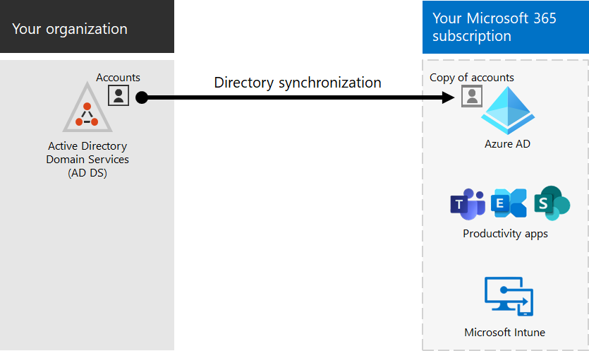

# Microsoft 365 とオンプレミス環境との統合

*この記事は、Microsoft 365 Enterprise および Office 365 Enterprise の両方に適用されます。*

Microsoft 365 を既存のオンプレミスの Active Directory ドメインサービス (AD DS) とオンプレミスの Exchange Server、Skype for Business Server 2015、または SharePoint Server と統合することができます。
  
 - AD DS を統合すると、両方の環境のユーザーアカウントを同期して管理することができます。 また、ユーザーがオンプレミスの資格情報を使用して両方の環境にログオンできるように、パスワードハッシュ同期 (PHS) またはシングルサインオン (SSO) を追加することもできます。
 - オンプレミスのサーバー製品と統合する場合は、ハイブリッド環境を作成します。 ハイブリッド環境は、ユーザーまたは情報を Microsoft 365 に移行する際に役立つことがあります。または、一部のユーザーまたは一部の情報を社内とクラウドに移行することができます。 ハイブリッド環境の詳細については、「 [hybrid cloud](../solutions/cloud-architecture-models.md#hybrid)」を参照してください。

また、Microsoft 365 管理センターでカスタマイズされたセットアップガイダンスに Azure Active Directory (Azure AD) アドバイザーを使用することもできます (Microsoft 365 にサインインする必要があります)。

- [Azure AD セットアップガイド](https://aka.ms/aadpguidance)
- [組織のディレクトリからユーザーを同期する](https://aka.ms/aadconnectpwsync)
- [Active Directory フェデレーションサービス (AD FS) の展開アドバイザー](https://aka.ms/adfsguidance)
   
## はじめに

Microsoft 365 とオンプレミス環境を統合する前に、 [ネットワークの計画とパフォーマンスの調整](network-planning-and-performance.md)も行う必要があります。 利用可能な [id モデル](about-microsoft-365-identity.md)についても理解しておく必要があります。 

Microsoft 365 ユーザーアカウントの管理に使用できるツールの一覧については、「 [microsoft 365 アカウントの管理](manage-microsoft-365-accounts.md) 」を参照してください。 
  
## Microsoft 365 を AD DS と統合する

AD DS に既存のユーザーアカウントがある場合は、これらのアカウントを Microsoft 365 で再作成して、環境間での相違点やエラーを発生させないようにする必要があります。 ディレクトリ同期を使用すると、オンプレミスの環境とオンライン環境との間でアカウントをミラーリングできます。 ディレクトリ同期を使用すると、ユーザーは環境ごとに新しい情報を記憶する必要がなくなります。また、アカウントを2回作成または更新する必要はありません。 ディレクトリ同期のために [、オンプレミスのディレクトリを準備](prepare-for-directory-synchronization.md) する必要があります。
  

  
ユーザーがオンプレミスの資格情報を使用して Microsoft 365 にログオンできるようにする場合は、SSO を構成することもできます。 SSO を使用すると、Microsoft 365 は、ユーザー認証用にオンプレミス環境を信頼するように構成されます。
  

### パスワードのハッシュ同期またはパススルー認証 (PTA) を含む、または使用しないディレクトリ同期

ユーザーが自分のユーザーアカウント (domain\username) を使用してオンプレミス環境にログオンします。 Microsoft 365 に移行する場合は、職場または学校アカウント (user@domain.com) を使用して再度ログオンする必要があります。 両方の環境で同じユーザー名が指定されています。 PHS または PTA を追加すると、ユーザーは両方の環境に対して同じパスワードを使用しますが、Microsoft 365 にログオンするときに再び資格情報を提供する必要があります。 ディレクトリ同期 (PHS) は、最も一般的に使用されるディレクトリ同期です。

ディレクトリ同期をセットアップするには、Azure AD Connect を使用します。 手順については、「Microsoft 365 および[AZURE AD Connect で](https://go.microsoft.com/fwlink/p/?LinkId=698537)[のディレクトリ同期をセットアップする](set-up-directory-synchronization.md)」を参照してください。

詳細については [、「Microsoft 365 へのディレクトリ同期の準備」を](prepare-for-directory-synchronization.md)参照してください。

### SSO を使用したディレクトリ同期

ユーザーが自分のユーザーアカウントを使用してオンプレミス環境にログオンします。 Microsoft 365 に移行すると、それらのユーザーは自動的にログオンするか、オンプレミス環境 (domain\username) に使用したものと同じ資格情報を使用してログオンします。

SSO をセットアップするには、Azure AD Connect も使用します。 手順については、「 [AZURE AD Connect のカスタムインストール](https://go.microsoft.com/fwlink/p/?LinkID=698430)」を参照してください。

詳細については、「 [シングルサインオン](https://go.microsoft.com/fwlink/p/?LinkId=698604)」を参照してください。

## Azure AD Connect

Azure AD Connect は、DirSync、Azure AD Sync などの id 統合ツールの以前のバージョンに置き換えられました。Azure Active Directory 同期から Azure AD Connect に更新する場合は、 [アップグレード手順](https://go.microsoft.com/fwlink/p/?LinkId=733240)を参照してください。 

## 関連項目

[Microsoft 365 Enterprise の概要](microsoft-365-overview.md)
