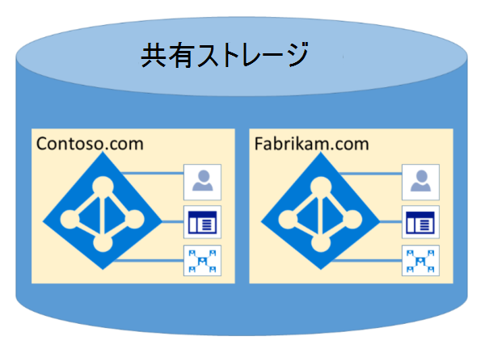

# Azure Active Directory での Microsoft 365 の分離とアクセス制御

Azure Active Directory (Azure AD) は、論理的なデータの分離を通じて、高度にセキュリティで保護された方法で複数のテナントをホストするように設計されています。 Azure AD へのアクセスは、承認層でゲートされます。 Azure AD は、テナントコンテナーをセキュリティ境界として使用することにより、ユーザーのコンテンツを保護し、共同テナントがコンテンツにアクセスしたり侵害したりできないようにします。 Azure AD の承認レイヤーによって、次の3つのチェックが実行されます。

- プリンシパルは Azure AD テナントへのアクセスを有効にしていますか?
- プリンシパルはこのテナント内のデータへのアクセスを有効にしますか?
- 要求されたデータアクセスの種類に対して、このテナントのプリンシパルの役割は承認されていますか。

アプリケーション、ユーザー、サーバー、またはサービスは、適切な認証とトークンまたは証明書を使用せずに、Azure AD にアクセスできません。 適切な資格情報を伴わない場合、要求は拒否されます。

実際には、Azure AD は独自の保護されたコンテナー内の各テナントをホストし、テナントが所有し管理するだけのコンテナーに対するポリシーとアクセス許可を持っています。
 

テナントコンテナーの概念は、ポータルから永続的な記憶域まで、すべての層のディレクトリサービスで深く ingrained されています。 複数の Azure AD テナントメタデータが同じ物理ディスクに格納されている場合でも、ディレクトリサービスによって定義されたコンテナー以外のコンテナー間には、テナント管理者によって定義された関係はありません。 最初に承認層を経由せずに、要求しているアプリケーションまたはサービスから Azure AD ストレージへの直接接続を行うことはできません。

次の例では、Contoso と Fabrikam の両方に独立した専用のコンテナーがありますが、それらのコンテナーはサーバーやストレージなどの同じ基礎インフラストラクチャの一部を共有していますが、それらは互いに分離され、相互に分離されており、承認とアクセス制御のレイヤーで区切られています。
 

さらに、Azure AD 内から実行できるアプリケーションコンポーネントはなく、1つのテナントが別のテナントの整合性を強制的に侵害したり、別のテナントの暗号化キーをアクセスしたり、サーバーから生データを読み取ったりすることはできません。

既定では、Azure AD は他のテナント内の id によって発行されたすべての操作を許可しません。 各テナントは、クレームベースのアクセス制御によって Azure AD 内で論理的に分離されています。 ディレクトリデータの読み取りおよび書き込みはテナントコンテナーを対象としており、内部アブストラクションレイヤーおよび役割ベースのアクセス制御 (RBAC) 層でゲートされます。これにより、テナントがセキュリティ境界として適用されます。 すべてのディレクトリデータアクセス要求は、これらのレイヤーによって処理され、Microsoft 365 のすべてのアクセス要求は上記のロジックによって許可されます。

Azure AD には、北アメリカ、米国政府機関、欧州連合、ドイツ、およびワールドワイドパーティションがあります。 テナントは単一のパーティション内に存在し、パーティションに複数のテナントを含めることができます。 パーティション情報はユーザーから抽象化されています。 特定のパーティション (その中のすべてのテナントを含む) は、複数のデータセンターにレプリケートされます。 テナントのパーティションは、テナントのプロパティ (たとえば、国コード) に基づいて選択されます。 各パーティション内の機密情報は、専用キーを使用して暗号化されます。 キーは、新しいパーティションが作成されるときに自動的に生成されます。

Azure AD システムの機能は、各ユーザーセッションに対する一意のインスタンスです。 さらに、Azure AD では、暗号化テクノロジを使用して、共有されたシステムリソースをネットワークレベルで分離し、不正な情報の転送を防止します。
