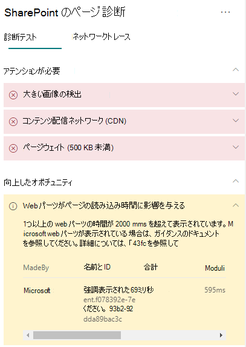

# SharePoint Online のモダン サイト ページで Web パーツのパフォーマンスを最適化する

SharePoint Online のモダン サイト ページには、ページの読み込み時間全体に影響する可能性のある Web パーツが含まれています。 この記事では、ページ内の Web パーツによるユーザーが感じる待機時間への影響を特定する方法と、一般的な問題を修復する方法について説明します。

>[!NOTE]
>Sharepoint Online のモダン ポータルでのパフォーマンスの詳細については、「[SharePoint のモダン エクスペリエンスにおけるパフォーマンス](https://docs.microsoft.com/sharepoint/modern-experience-performance)」を参照してください。

## SharePoint 用ページ診断ツールを使用して Web パーツを分析する

SharePoint 用ページ診断ツールは、新しい Microsoft Edge (https://www.microsoft.com/edge) と Chrome のブラウザー拡張機能であり、SharePoint Online の最新ポータルと従来の発行サイト ページの両方を分析します。 このツールでは、定義されている一連のパフォーマンス条件に対するページのパフォーマンスを示す分析済みの各ページのレポートが作成されます。 SharePoint 用ページ診断ツールのインストール方法と詳細については、「[SharePoint Online 用ページ診断ツールを使用する](page-diagnostics-for-spo.md)」を参照してください。

>[!NOTE]
>ページ診断ツールは SharePoint Online でのみ機能し、SharePoint システム ページでは使用できません。

SharePoint のサイト ページを SharePoint 用ページ診断ツールを使用して分析すると、ベースライン メトリックを超えている Web パーツに関する情報が [_診断テスト_] ウィンドウ内の [**Web parts are impacting page load time**] (Web パーツがページの読み込み時間に影響を与えています) という結果に表示されます。

考えられる結果は次のとおりです。

- **要注意** (赤): ビューポート (最初に読み込まれるページの画面表示部分) に表示される_ユーザー設定の_ Web パーツで、読み込み時間が **2** 秒を超えるもの。 ビューポートの外にある_ユーザー設定の_ Web パーツで、読み込み時間が **4** 秒を超えるもの。 合計読み込み時間がテスト結果に表示される際は、モジュールの読み込み、遅延読み込み、初期化、レンダリングに分けて表示されます。
- [**Improvement opportunities**] (改善の余地あり) (黄): このセクションには、ページの読み込み時間に影響を与えている可能性があるアイテムが表示されます。これらのアイテムは、レビューと監視を行う必要があります。 これには、"すぐに使用可能な" (OOTB) Microsoft Web パーツが含まれている場合があります。 このセクションに表示される Microsoft Web パーツの結果は Microsoft に自動的に報告されるため、**必要な操作はありません**。 調査のためのサポート チケットを記録する必要があるのは、パフォーマンスの著しい低下がページで発生しており、ページの**すべての Microsoft Web パーツ**が結果の [**Improvement opportunities**] (改善の余地あり) セクションに表示される場合のみです。 今後の SharePoint 用ページ診断ツールの更新プログラムでは、Microsoft Web パーツの特定の構成に基づいて、結果がさらに細分化されます。
- [**No action required**] (必要な操作はありません) (緑): データを返すのに **2** 秒以上かかっている Web パーツは 1 つもありません。

[**Web parts are impacting page load time**] (Web パーツがページの読み込み時間に影響を与えています) という結果が [**Attention required**] (注意が必要です) セクションまたは [**Improvement opportunities**] (改善の余地あり) セクションに表示された場合、結果をクリックすると読み込みが遅いページに関する詳細が表示されます。 今後の SharePoint 用ページ診断ツールの更新プログラムでは分析ルールが更新される可能性があるため、常に最新バージョンのツールを使用するようにしてください。

結果に含まれる情報は次のとおりです。

- [**Made by**] (作成) には、Web パーツがカスタムなのか、Microsoft OOTB なのかが表示されます。
- [**Name and ID**] (名前と ID) には、ページで Web パーツを見つけるのに役立つ識別情報が表示されます。
- [**Total**] (合計) には、Web パーツの読み込みにかかる合計時間数が表示されます。
- [**Module Load**] (モジュールの負荷) には、Web パーツ コンポーネントを取得して読み込むのにかかる時間が表示されます。
- [**Lazy Load**] (遅延読み込み) には、ページのメインのセクションに表示されない Web パーツの遅延読み込み時間が表示されます。
- [**Init**] (初期化) には、Web パーツの初期化にかかる時間が表示されます。
- [**Render**] (レンダリング) には、Web パーツが結果を取得して表示するのにかかる時間が表示されます。

この情報は、デザイナーと開発者が問題のトラブルシューティングを行えるように提供されています。 この情報は、設計開発チームに提供するようにします。

## Web パーツのパフォーマンスの問題を修復する

[**Web parts are impacting page load time**] (Web パーツがページの読み込み時間に影響を与えています) という結果に表示されるパフォーマンスの問題を特定して修復するには、このセクションのガイダンスに従ってください。

Web パーツのパフォーマンスが低い場合に考えられる原因のカテゴリには 3 つあります。 次の情報を使用して、お客様のシナリオに該当する問題を特定し、修復してください。

- Web パーツ スクリプトのサイズと依存関係
  - メインのシナリオをレンダリングする初期スクリプトの最適化を_表示モードに対してのみ_行います。
  - かたまりごとに分けるために、_import()_ ステートメントを使用して頻度が低いシナリオを移動し、モード コード (プロパティ ウィンドウなど) を編集します。
  - 機能していないコードをすべて完全に削除するために、_package.json_ の依存関係を確認します。 テスト/ビルド専用依存関係があれば、すべて devDependencies に移動します。
  - 静的リソースの最適なダウンロードを行うには、Office 365 CDN を使用する必要があります。 _js/css_ ファイルの配信元として、パブリックの CDN 配信元が推奨されています。 Office 365 CDN の使用に関する詳細については、「[SharePoint Online での Office 365 コンテンツ配信ネットワーク (CDN) の使用](use-microsoft-365-cdn-with-spo.md)」を参照してください。
  - SharePoint Framework (SPFx) に付属する _React_ や _Fabric imports_ などのフレームワークを再利用してください。 詳細については、「[SharePoint Framework の概要](https://docs.microsoft.com/sharepoint/dev/spfx/sharepoint-framework-overview)」を参照してください。
  - 最新バージョンの SharePoint Framework を使用するようにし、新しいバージョンがリリースされた場合にはアップグレードしてください。
- データの取得/キャッシュ
  - 表示するデータを取得するのに Web パーツが追加のサーバー呼び出しに依存している場合は、それらのサーバー API が高速で、(_localStorage_ や _IndexDB_ (大規模なセットの場合) などを使用する) クライアント側キャッシュが実装されていることを確認してください。
  - 重要なデータを表示するために複数の呼び出しが必要な場合は、サーバーへの呼び出しのバッチ処理または複数の要求を 1 つの呼び出しに統合する他の方法を検討してください。
  - または、データの一部の要素で低速の API が要求され、これらの要素が初期レンダリングには重要でない場合、これらを重要なデータのレンダリング後に実行される別の呼び出しに切り離します。
  - 複数のパーツが同じデータを使用している場合、共通データ層を使用して呼び出しの重複を防ぎます。
- レンダリング時間
  - 不必要な大きなアセットのダウンロードを防ぐために、画像やビデオなどのメディアのソースは、コンテナー、デバイス、およびネットワークの制限に合わせてサイズを設定する必要があります。 コンテンツの依存関係の詳細については、「[SharePoint Online での Office 365 コンテンツ配信ネットワーク (CDN) の使用](use-microsoft-365-cdn-with-spo.md)」を参照してください。
  - 再フロー、複雑な CSS ルール、複雑なアニメーションにつながる API 呼び出しを行わないようにします。 詳細については、「[Minimizing browser reflow
(ブラウザーの再フローを最小化する)](https://developers.google.com/speed/docs/insights/browser-reflow)」を参照してください。
  - 連結されている長時間実行タスクを使用しないようにします。 代わりに、長時間実行タスクは個別のキューに分割します。 詳細については、「[Optimize JavaScript Execution (JavaScript の実行を最適化する)](https://developers.google.com/web/fundamentals/performance/rendering/optimize-javascript-execution)」を参照してください。
  - フレームの飛びや途切れ (_ジャンク_とも呼ばれます) を防ぐために、メディアの非同期的なレンダリング用に、対応するスペースを予約します。
  - レンダリンで使用される機能が特定のブラウザーでサポートされていない場合は、ポリフィルを読み込むか、依存コードの実行を除外します。 その機能が重要ではない場合は、メモリ リークが発生しないようにイベント ハンドラーなどのリソースを解放します。

パフォーマンスの問題を修復するためにページを変更する前に、分析結果に表示されるページ読み込み時間をメモしてください。 修正後にツールをもう一度実行して新しい結果がベースライン基準内にあるかどうかを確認し、新しいページ読み込み時間をチェックして改善されたかどうかを確認します。

>[!NOTE]
>ページ読み込み時間は、ネットワーク負荷、時間帯、その他の一時的な状態など、さまざまな要素によって異なります。 結果を平均化するために、変更の前後に数回に渡ってページ読み込み時間をテストする必要があります。

## 関連項目

[SharePoint Online のパフォーマンスをチューニングする](tune-sharepoint-online-performance.md)

[Office 365 のパフォーマンスをチューニングする](tune-microsoft-365-performance.md)

[SharePoint のモダン エクスペリエンスにおけるパフォーマンス](https://docs.microsoft.com/sharepoint/modern-experience-performance)

[コンテンツ配信ネットワーク](content-delivery-networks.md)

[SharePoint Online での Office 365 コンテンツ配信ネットワーク (CDN) の使用](use-microsoft-365-cdn-with-spo.md)
