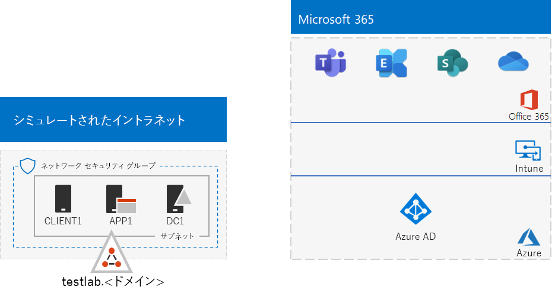

# <a name="password-hash-synchronization-for-your-microsoft-365-test-environment"></a>Microsoft 365 テスト環境のパスワード ハッシュ同期

*このテストラボ ガイドは、Microsoft 365 Enterprise および Office 365 Enterprise テスト環境に使用できます。*

多くの組織では、Azure AD Connect とパスワード ハッシュ同期を使用して、オンプレミスの Active Directory Domain Services (AD DS) フォレスト内のアカウント セットを、Microsoft 365 サブスクリプションの Azure AD テナント内のアカウント セットに同期します。 この記事では、Microsoft 365 のテスト環境にパスワード ハッシュ同期を追加する方法について説明します。最終的な構成は、次のとおりになります。
  

  
このテスト環境は、次に示す 2 つのフェーズで設定します。
  
1. Microsoft 365 のシミュレートされたエンタープライズ テスト環境を作成する。
2. APP1 に Azure AD Connect をインストールして構成する。
    
> [!TIP]
> Microsoft 365 Enterprise のテスト ラボ ガイド スタック内のすべての記事のビジュアル マップについては、「[Microsoft 365 Enterprise のテスト ラボ ガイド スタック](../media/m365-enterprise-test-lab-guides/Microsoft365EnterpriseTLGStack.pdf)」にアクセスします。
  
## <a name="phase-1-create-the-microsoft-365-simulated-enterprise-test-environment"></a>フェーズ 1: Microsoft 365 のシミュレートされたエンタープライズ テスト環境を作成する

Follow the instructions in [simulated enterprise base configuration for Microsoft 365](simulated-ent-base-configuration-microsoft-365-enterprise.md). Here is your resulting configuration.
  

  
この構成は、次の内容で成立します。 
  
- Microsoft 365 E5 または Office 365 E5 の試用版または有料サブスクリプション。
- インターネットに接続する組織の簡易型イントラネット。Azure 仮想ネットワーク内の仮想マシン DC1、APP1、CLIENT1 で構成されます。 DC1 は、testlab.\<your public domain name> AD DS ドメインのドメイン コントローラーです。

## <a name="phase-2-create-and-register-the-testlab-domain"></a>フェーズ 2: testlab ドメインを作成および登録する

このフェーズでは、パブリック DNS ドメインを追加して、そのドメインをサブスクリプションに追加します。

最初に、パブリック DNS 登録プロバイダーと協力して、現在のドメイン名に基づいて新しいパブリック DNS ドメイン名を作成し、サブスクリプションに追加します。 **testlab.**\<your public domain> という名前の使用をお勧めします。 たとえば、パブリック ドメイン名が **<span>contoso</span>.com** である場合は、パブリック ドメイン名 **<span>testlab</span>.contoso.com** を追加します。
  
次に、ドメイン登録プロセスを経て、**testlab.**\<your public domain> ドメインを Microsoft 365 または Office 365 の試用版または有料のサブスクリプションに追加します。 このときに、他の DNS レコードも **testlab.**\<your public domain> ドメインに追加します。 詳細については、「[Office 365 にドメインを追加する](https://docs.microsoft.com/office365/admin/setup/add-domain)」を参照してください。 

最終的な構成をここに示します。
  

  
この構成は、次の内容で成立します。

- DNS ドメイン testlab.\<your public domain name> が登録されている Microsoft 365 E5 または Office 365 E5 の試用版サブスクリプションまたは有料サブスクリプション。
- インターネットに接続する組織の簡易型イントラネット。Azure 仮想ネットワークのサブネット上に配置された仮想マシン DC1、APP1、および CLIENT1 で構成されます。

testlab.\<your public domain name> がどのようにして次のようになっているかについてご注意ください。

- パブリック DNS レコードによるサポート。
- Microsoft 365 サブスクリプションに登録済み。
- シミュレートされたイントラネット上の AD DS ドメイン。
     
## <a name="phase-3-install-azure-ad-connect-on-app1"></a>フェーズ 3: APP1 に Azure AD Connect をインストールする

このフェーズでは、Azure AD Connect を APP1 にインストールして構成します。その後で、動作を確認します。
  
まず、APP1 上に Azure AD Connect をインストールして構成します。

1. [Azure portal](https://portal.azure.com) から、全体管理者アカウントでサインインします。その後、TESTLAB\\User1 アカウントで APP1 に接続します。
    
2. APP1 のデスクトップから、管理者レベルの Windows PowerShell コマンド プロンプトを起動して、次に示すコマンドを実行して Internet Explorer セキュリティ強化を無効にします。
    
   ```powershell
   Set-ItemProperty -Path "HKLM:\SOFTWARE\Microsoft\Active Setup\Installed Components\{A509B1A7-37EF-4b3f-8CFC-4F3A74704073}" -Name "IsInstalled" -Value 0
   Set-ItemProperty -Path "HKLM:\SOFTWARE\Microsoft\Active Setup\Installed Components\{A509B1A8-37EF-4b3f-8CFC-4F3A74704073}" -Name "IsInstalled" -Value 0
   Stop-Process -Name Explorer -Force
   ```

3. タスク バーで **[Internet Explorer]** をクリックし、[https://aka.ms/aadconnect](https://aka.ms/aadconnect)に移動します。
    
4. [Microsoft Azure Active Directory Connect] ページで、**[ダウンロード]** をクリックして、**[実行]** をクリックします。
    
5. **[Azure AD Connect へようこそ]** ページで、**[同意する]** をクリックして、**[続行]** をクリックします。
    
6. **[簡単設定]** ページで、**[簡単設定を使う]** をクリックします。
    
7. **[Azure AD に接続]** ページで、**[ユーザー名]** に全体管理者のアカウント名、**[パスワード]** にそのパスワードを入力して、**[次へ]** をクリックします。
    
8. **[AD DS に接続]** ページで、**[ユーザー名]** に「**TESTLAB\\User1**」と入力し、**[パスワード]** にそのパスワードを入力して、**[次へ]** をクリックします。
    
9. **[構成の準備完了]** ページで、**[インストール]** をクリックします。
    
10. **[構成が完了しました]** ページで、**[終了]** をクリックします。
    
11. Internet Explorer で Microsoft 365 管理センター ([https://portal.microsoft.com](https://portal.microsoft.com)) に移動します。
    
12. 左側のナビゲーションで、**[ユーザー] > [アクティブなユーザー]** をクリックします。
    
    **User1** という名前のアカウントを記録します。 これは TESTLAB AD DS ドメインからのアカウントであり、ディレクトリ同期が機能していることを証明します。
    
13. **User1** アカウントをクリックして、**[ライセンスとアプリ]** をクリックします。
    
14. **[製品ライセンス]** で、必要に応じて場所を選択し、**Office 365 E5** ライセンスを無効にして、**Microsoft 365 E5** ライセンスを有効にします。 

15. ページの下側にある **[保存]** をクリックして、**[閉じる]** をクリックします。
    
次に、User1 アカウントのユーザー名である <strong>user1@testlab.</strong>\<your domain name> を使用してサブスクリプションにサインインする機能をテストします。

1. APP1 からサインアウトし、その後サインインし直しますが、そのときに別のアカウントを指定します。

2. ユーザー名とパスワードの入力を求めるダイアログが表示されたら、<strong>user1@testlab.</strong>\<your domain name> と User1 のパスワードを指定します。 User1 として正常にサインインできるはずです。 
 
User1 は、TESTLAB AD DS ドメインのドメイン管理者のアクセス許可を持っていますが、グローバル管理者ではないことをご注意ください。 そのため、**[管理者]** アイコンはオプションとして表示されません。 

最終的な構成をここに示します。


この構成は、次の内容で成立します。 
  
- DNS ドメイン TESTLAB.\<your domain name> が登録されている Microsoft 365 E5 または Office 365 E5 の試用版サブスクリプションまたは有料サブスクリプション。
- インターネットに接続する組織の簡易型イントラネット。Azure 仮想ネットワークのサブネット上に配置された仮想マシン DC1、APP1、および CLIENT1 で構成されます。 Azure AD Connect が APP1 上で実行され、TESTLAB AD DS ドメインが、Microsoft 365 サブスクリプションの Azure AD テナントに定期的に同期されます。
- TESTLAB AD DS ドメインの User1 アカウントは、Azure AD テナントと同期されています。

## <a name="next-step"></a>次の手順

テスト環境の追加の [ID](m365-enterprise-test-lab-guides.md#identity) 機能について調べます。

## <a name="see-also"></a>関連項目

[Microsoft 365 Enterprise のテスト ラボ ガイド](m365-enterprise-test-lab-guides.md)

[Microsoft 365 Enterprise を展開する](deploy-microsoft-365-enterprise.md)

[Microsoft 365 Enterprise のドキュメントとリソース](https://docs.microsoft.com/microsoft-365-enterprise/)


