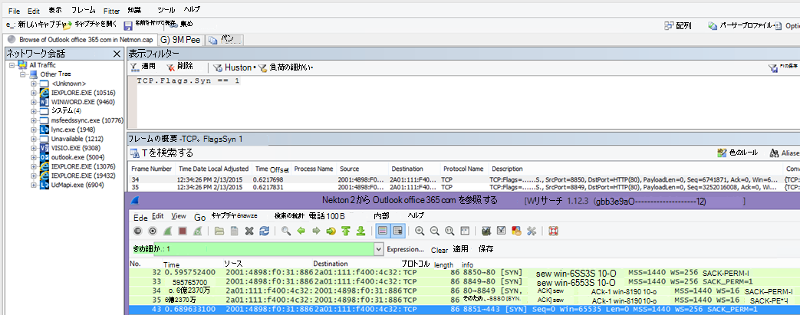
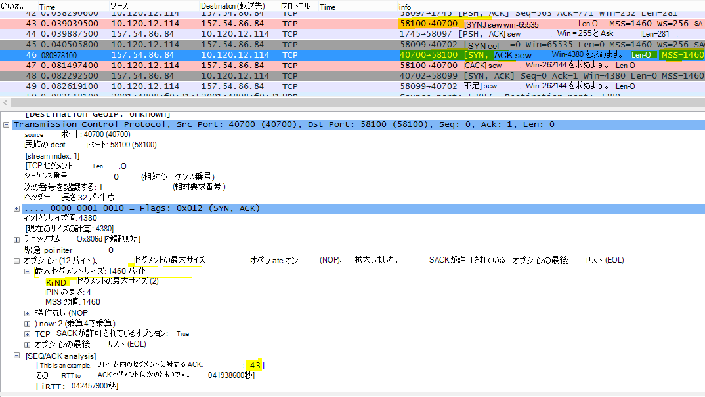

# <a name="performance-troubleshooting-plan-for-office-365"></a>Office 365 のパフォーマンス トラブルシューティング計画

SharePoint Online、OneDrive for Business、Exchange Online、または Skype for Business Online とクライアントコンピューターの間で、遅延、ハング、および低速のパフォーマンスを識別して修正するための手順を把握しておく必要がありますか。 サポートに連絡する前に、この記事は Office 365 のパフォーマンスの問題をトラブルシューティングしたり、最も一般的な問題のいくつかを修正したりするのに役立ちます。

この記事は実際には、パフォーマンスの問題に関する貴重なデータを収集するために使用できるサンプルのアクションプランです。 この記事では、いくつかの主要な問題についても説明します。

ネットワークのパフォーマンスを初めて使用する場合に、クライアントコンピューターと Office 365 の間のパフォーマンスを監視するための長期的な計画を作成する場合は、「 [Office 365 のパフォーマンスチューニングとトラブルシューティング-管理および IT 担当者](performance-tuning-using-baselines-and-history.md)」を参照してください。

## <a name="sample-performance-troubleshooting-action-plan"></a>サンプルのパフォーマンストラブルシューティングアクションプラン

このアクションプランには2つの部分が含まれています。準備フェーズとログフェーズ。 現時点でパフォーマンス上の問題が発生していて、データ収集を行う必要がある場合は、すぐにこのプランの使用を開始することができます。

### <a name="prepare-the-client-computer"></a>クライアントコンピューターを準備する

- パフォーマンスの問題を再現できるクライアントコンピューターを見つけます。 このコンピューターは、トラブルシューティングの際に使用されます。
- パフォーマンスの問題が発生する原因となる手順を記録して、テストするときに備えて準備します。
- 情報を収集および記録するためのツールをインストールします。
  - [Netmon 3.4](https://www.microsoft.com/download/details.aspx?id=4865)をインストールします (または、同等のネットワークトレースツールを使用します)。
  - [Httpwatch](https://www.httpwatch.com/download/)の無料の基本エディションをインストールします (または、同等のネットワークトレースツールを使用します)。
  - テスト中に実行する手順の記録を保持するために、画面記録機能を使用するか、Windows Vista 以降に付属する手順記録ツール (PSR.exe) を実行します。

### <a name="log-the-performance-issue"></a>パフォーマンスの問題をログに記録する

- 不要なインターネットブラウザーをすべて閉じます。
- 手順レコーダーまたは別のスクリーンレコーダーを開始します。
- Netmon キャプチャを開始します (またはネットワークトレースツール)。
- 「Ipconfig/flushdns」と入力して、コマンドラインからクライアントコンピューター上の DNS キャッシュをクリアします。
- 新しいブラウザーセッションを開始し、HTTPWatch を有効にします。
- オプション: Exchange Online をテストする場合は、Office 365 管理コンソールから Exchange クライアントパフォーマンスアナライザーツールを実行します。
- パフォーマンスの問題を引き起こす正確な手順を再現します。
- Netmon またはその他のツールのトレースを停止します。
- コマンドラインで、次のコマンドを入力し、ENTER キーを押して、Office 365 サブスクリプションへのトレースルートを実行します。

  ``` cmd
  tracert <subscriptionname>.onmicrosoft.com
  ```

- 手順記録ツールを停止し、ビデオを保存します。 キャプチャの日付と時刻を必ず指定してください。また、パフォーマンスが良好か悪いかを確認してください。
- トレースファイルを保存します。 この場合も、キャプチャの日付と時刻を必ず指定してください。また、パフォーマンスが良好であるか悪いかを示します。

この記事に記載されているツールの実行に精通していない場合は、これらの手順を次に提供するため、心配しないでください。 この種のネットワークキャプチャを実行することに慣れている場合は、 [ベースラインを収集する方法](performance-tuning-using-baselines-and-history.md#how-to-collect-baselines)(フィルター処理とログの読み取りについて説明します) に進むことができます。

### <a name="flush-the-dns-cache-first"></a>DNS キャッシュを最初にフラッシュする

それはなぜでしょうか。 DNS キャッシュをフラッシュすることによって、クリーンな状態でテストを開始しています。 キャッシュをクリアすることで、DNS リゾルバーの内容が最新のエントリにリセットされます。 フラッシュは HOSTs ファイルエントリを削除しないことに注意してください。 ホストファイルエントリを頻繁に使用する場合は、それらのエントリを別のディレクトリ内のファイルにコピーして、ホストファイルを空にする必要があります。

#### <a name="flush-your-dns-resolver-cache"></a>DNS リゾルバーキャッシュをフラッシュする

1. コマンドプロンプトを開きます ( **Start** \> **Run** \> **cmd**または**Windows key** cmd のどちらかを開始 \> **cmd**します)。
2. 次のコマンドを入力し、Enter キーを押します。

    ``` cmd
    ipconfig /flushdns
    ```

## <a name="netmon"></a>Netmon

Microsoft のネットワーク監視ツール ([Netmon](https://www.microsoft.com/download/details.aspx?id=4865)) は、ネットワーク上のコンピューター間を通過するパケット (トラフィック) を分析します。 Netmon を使用して Office 365 とのトラフィックをトレースすることによって、パケットヘッダーのキャプチャ、表示、および読み取り、介在するデバイスの特定、ネットワークハードウェアでの重要な設定の確認、ドロップされたパケットの検索、企業ネットワークおよび Office 365 上のコンピューター間のトラフィックのフローに従うことができます。 トラフィックの実際の本文は暗号化されるため、つまり、SSL/TLS を介してポート443で転送されるため、送信中のファイルを読み取ることはできません。 代わりに、パケットが取得するパスのフィルター処理されていないトレースを取得して、問題の動作を追跡するのに役立ちます。

現時点では、フィルターを適用しないようにしてください。 代わりに、手順を実行し、トレースを停止して保存を停止する前に問題をデモンストレーションします。

Netmon 3.4 をインストールした後、ツールを開き、次の手順を実行します。

### <a name="take-a-netmon-trace-and-reproduce-the-issue"></a>Netmon トレースを取得して問題を再現する

1. Netmon 3.4 を起動します。
**スタート**ページには、[**最近のキャプチャ**]、 **[ネットワークの選択**]、および「 **Microsoft ネットワークモニターの使用を開始する3.4」の3つのウィンドウがあります。通知**。 [ネットワークの選択] パネルには、キャプチャ可能な既定のネットワークの一覧も表示されます。 ネットワークカードが選択されていることを確認してください。

2. **スタート**ページの上部にある [**新しいキャプチャ**] をクリックします。 これにより、[**キャプチャ 1**] という名前の [**スタート**ページ] タブの横に新しいタブが追加されます。


3. 簡単なキャプチャを行うには、ツールバーの [ **スタート** ] をクリックします。

4. パフォーマンスの問題を示す手順を再現します。

5. [ **Stop** \> **ファイル** \> **名を付けて保存] を**クリックします。 タイムゾーンに日付と時刻を指定し、不良または良好なパフォーマンスを示しているかどうかを言及してください。

## <a name="httpwatch"></a>HTTPWatch

[Httpwatch](https://www.httpwatch.com/download/) は課金され、無料版が提供されます。 このテストに必要なすべての情報は、無料の Basic Edition に記載されています。 HTTPWatch は、ブラウザーウィンドウから、ネットワークトラフィックとページの読み込み時間を監視します。 HTTPWatch は、パフォーマンスをグラフィカルに説明する Internet Explorer のプラグインです。 この分析は、HTTPWatch Studio で保存および表示できます。

> [!NOTE]
> 別のブラウザー (Firefox、Google Chrome など) を使用する場合、または Internet Explorer に HTTPWatch をインストールできない場合は、新しいブラウザーウィンドウを開いて、キーボードで F12 キーを押します。 ブラウザーの下部に開発者ツールポップアップが表示されます。 Opera を使用している場合は、CTRL + SHIFT + I を押して Web インスペクターを表示し、[ **ネットワーク** ] タブをクリックして、以下の手順で示されているテストを完了します。 情報は少し異なりますが、読み込み時間は引き続きミリ秒単位で表示されます。 > HTTPWatch は、SharePoint Online ページの読み込み時間に関する問題にも非常に役立ちます。

### <a name="run-httpwatch-and-reproduce-the-issue"></a>HTTPWatch を実行し、問題を再現する

HTTPWatch はブラウザープラグインなので、このツールをブラウザーに公開することは、Internet Explorer のバージョンごとに多少異なります。 通常は、Internet Explorer ブラウザーのコマンドバーにある HTTPWatch を見つけることができます。 ブラウザーウィンドウに httpwatch プラグインが表示されない場合は、[**ヘルプ**] または internet explorer の以降のバージョンで、ブラウザーのバージョンを確認してください \> **About**。歯車記号と**internet explorer につい**ては、「」を参照してください。 **コマンド**バーを起動するには、Internet Explorer のメニューバーを右クリックし、[**コマンドバー**] をクリックします。

以前は、HTTPWatch はコマンドとエクスプローラーの両方のバーに関連付けられています。インストールすると、(再起動後も) アイコンがすぐに表示されない場合、またはアイコン **のツールバー**が表示されます。 ツールバーをカスタマイズしたり、オプションを追加したりすることができることを覚えておいてください。

![HTTPWatch アイコンが表示されている Internet Explorer の [コマンド] ツールバー。](../media/198590b0-d7b1-4bff-a6ad-e4ec3a1e83df.png)

1. Internet Explorer ブラウザーウィンドウで HTTPWatch を起動します。 ウィンドウの下部に、ブラウザーにドッキングされた状態で表示されます。 [ **レコード**] をクリックします。

2. パフォーマンスの問題に関係する正確な手順を再現します。 HTTPWatch の [ **停止** ] ボタンをクリックします。

3. HTTPWatch を**保存**するか、**電子メールで送信**します。 ファイルには、日付と時刻の情報が含まれていることを確認してください。また、監視に、パフォーマンスが良好であるか悪いかのデモンストレーションが含まれているかどうかを示します。

![Office 365 ホームページのページ読み込み用の [ネットワーク] タブを示す HTTPWatch。](../media/021a2c64-d581-49fd-adf4-4c364f589d75.PNG)

このスクリーンショットは、HTTPWatch の Professional バージョンからのものです。 コンピューターの基本バージョンで取得したトレースを Professional バージョンと共に開いて、そこに読み取ることができます。 このメソッドを使用して、トレースからその他の情報を入手できる場合があります。

## <a name="problem-steps-recorder"></a>問題ステップ記録ツール

手順記録ツールまたは PSR.exe を使用すると、発生した問題を記録できます。 非常に便利なツールであり、実行が非常に簡単です。

### <a name="run-problem-steps-recorder-psrexe-to-record-your-work"></a>作業を記録するために問題ステップ記録ツール (PSR.exe) を実行する

1. [**開始** \> の**実行**の種類を使用する \> ] **PSR.exe** \> **OK**] をクリックするか、[ **Windows キー**の種類PSR.exeをクリックし、 \> **PSR.exe** \> enter キーを押します。

2. [Small PSR.exe] ウィンドウが表示されたら、[ **開始** ] をクリックして、パフォーマンスの問題を再現する手順を再現します。 [ **コメントの追加**] をクリックすると、必要に応じてコメントを追加できます。

3. 手順を完了したら、[ **レコードの停止** ] をクリックします。 パフォーマンスの問題がページレンダリングの場合は、ページがレンダリングされるまで待機してから、録音を停止します。

4. [**保存**] をクリックします。


日付と時刻が記録されます。 これにより、PSR が Netmon トレースと HTTPWatch にリンクされ、精度のトラブルシューティングに役立てることができます。 PSR レコードの日付と時刻には、例として、URL のログインと参照と、管理サイトの部分的なレンダリングの間に1分間経過したことを示すことができます。

## <a name="read-your-traces"></a>トレースの読み取り

ネットワークとパフォーマンスのトラブルシューティングについて、他のユーザーが記事で知っておく必要のあるものをすべて教えることはできません。 パフォーマンスを良好なものにすると、ネットワークの動作や通常の動作に関する知識が得やすくなります。 ただし、主要な問題の一覧を切り上げることができます。また、ツールを使用して、最も一般的な問題を回避する方法を簡単に確認できます。

Office 365 サイトのネットワークトレースを読み取るスキルを習得する必要がある場合は、ページ読み込みのトレースを定期的に作成し、閲覧経験があるよりも教師の方が簡単です。 たとえば、チャンスがある場合は、Office 365 サービスを読み込んで、そのプロセスをトレースします。 DNS トラフィックのトレースをフィルター処理するか、参照したサービスの名前をフレームデータで検索します。 トレースをスキャンして、サービスの読み込み時に発生する手順を把握します。 これは、通常のページ読み込みがどのように表示されるか、またトラブルシューティングの場合には特にパフォーマンスに関して、良好なトレースを比較することで多くのことを説明するのに役立ちます。

Netmon では、表示フィルターフィールドに Microsoft Intellisense が使用されます。 Intellisense、またはインテリジェントコード補完は、期間内に入力したすべてのオプションがドロップダウン選択ボックスに表示されるようにするために使用されます。 たとえば、TCP ウィンドウスケーリングについて懸念している場合は、フィルター (など) をこの方法で見つけることができ  `.protocol.tcp.window < 100` ます。

![[表示フィルター] フィールドが intellisense を使用していることを示す Netmon のスクリーンショット。](../media/75a56c11-9a60-47ee-a100-aabdfb1ba10f.PNG)

Netmon トレースには、トラフィックが大量にある場合があります。 このような情報が読み取られない場合は、最初にトレースを開いたときに大きな負荷が発生する可能性があります。 最初に行うことは、トレースのバックグラウンドノイズからの信号とは別のものです。 Office 365 に対するテストを行い、これが表示するトラフィックです。 トレース間を移動するために使用している場合は、この一覧は必要ありません。

クライアントと Office 365 間のトラフィックは TLS 経由で転送されるため、トラフィックの本文は暗号化され、汎用の Netmon トレースでは読み取ることができなくなります。 パフォーマンス分析では、パケット内の情報の詳細を知る必要はありません。 ただし、パケットヘッダーとそれに含まれる情報には、非常に興味があります。

### <a name="tips-to-get-a-good-trace"></a>適切なトレースを得るためのヒント

- クライアントコンピューターの IPv4 または IPv6 アドレスの値を確認します。 これをコマンドプロンプトから取得するには、「 **IPConfig** 」と入力し、enter キーを押します。 このアドレスを知っていると、トレース内のトラフィックにクライアントコンピューターが直接含まれているかどうかをひとめで知ることができるようになります。 既知のプロキシがある場合は、それに対して ping を行い、その IP アドレスも取得します。

- DNS リゾルバーキャッシュをフラッシュし、可能な場合は、テストを実行しているブラウザー以外のすべてのブラウザーを閉じます。 たとえば、サポートがクライアントコンピューターのデスクトップを表示するためにブラウザーベースのツールを使用している場合は、この操作を行うことができない場合は、トレースにフィルターをかける準備をしてください。

- 通話中のトレースで、使用している Office 365 サービスを見つけます。 以前にトラフィックが発生したことがないかめったにわからない場合、これは、パフォーマンスの問題を他のネットワークノイズから分離するための便利な手順です。 これを行うには、いくつかの方法があります。 テストの直前に、 _ping_ または _psping_ を特定のサービスの URL (またはなど) に対して使用でき `ping outlook.office365.com` `psping -4 microsoft-my.sharepoint.com:443` ます。 また、Netmon トレースに ping や PsPing がある場合は、そのプロセス名を使用すると簡単に見つけることができます。 これで、検索を開始する場所がわかります。

問題が発生した時点で Netmon トレースのみを使用している場合は、この方法でもかまいません。 自分の向きを自分で理解するには、またはのようなフィルターを使用し `ContainsBin(FrameData, ASCII, "office")` `ContainsBin(FrameData, ASCII, "outlook")` ます。 フレーム番号は、トレースファイルから記録できます。 また、[ _フレームの概要_ ] ウィンドウを右端までスクロールして、[会話 ID] 列を検索することもできます。 この特定の会話の ID に対して指定された番号があります。これは、後で分離して記録して確認することもできます。 他のフィルターを適用する前に、必ずこのフィルターを削除してください。

> [!TIP]
> Netmon には、多くの便利な組み込みフィルターが用意されています。 [フィルターの_表示_] ウィンドウの上部にある [**フィルターの読み込み**] ボタンをクリックします。


トラフィックについて理解を深めると、必要な情報を見つけてください。 たとえば、使用している Office 365 サービス ("Outlook" など) への最初の参照が、トレースに含まれているパケットにあるかどうかを確認する方法について説明します。

Office 365 の Outlook Online の使用例として、トラフィックは次のように開始されます。

- 一致する QueryIDs を持つ outlook.office365.com の DNS 標準クエリと DNS 応答。 このターンアラウンドの時間オフセットと、世界中の Office 365 グローバル DNS が名前解決の要求を送信する場所について注意することが重要です。 世界中に半分ではなく、可能な限りローカルにするのが理想的です。

- 状態レポートが完全に移動された HTTP GET 要求 (301)

- X-RWS-VERSION トラフィックを含む、X-RWS-VERSION Connect 要求と接続応答。 (これは、リモート Winsock を使用して接続を確立します。)

- TCP SYN および TCP SYN/ACK の会話。 この会話の設定の多くは、パフォーマンスに影響します。

- 次に、tls ハンドシェイクと TLS 証明書の会話が行われる一連の TLS: TLS トラフィック。 (データが SSL/TLS 経由で暗号化されていることを思い出してください)。

トラフィックのすべての部分は重要であり、接続されていますが、トレースの小さな部分にはパフォーマンスのトラブルシューティングの観点から特に重要な情報が含まれています。そのため、これらの領域を中心に説明します。 また、Microsoft では、一般的な問題の上位10個のリストをコンパイルするために十分な数の Office 365 パフォーマンストラブルシューティングを行っているので、これらの問題について説明し、次にそれらのツールを使用する方法について取り上げます。

すべての準備が整っていない場合は、下の表でいくつかのツールを利用できます。 可能です。 リンクはインストールポイントに提供されます。 この一覧には、 [Netmon](https://www.microsoft.com/download/details.aspx?id=4865) や [Wireshark](https://www.wireshark.org/)などの一般的なネットワークトレースツールが含まれていますが、使い慣れたトレースツールを使用します。また、ネットワークトラフィックのフィルター処理に慣れています。 テストを行うときは、次の点に注意してください。

- *ブラウザーを閉じて、実行しているブラウザーが1つだけで*  あることをテストします。これにより、キャプチャしたトラフィック全体が減ります。 これにより、使用率の低いトレースが作成されます。
- *クライアントコンピューターで DNS リゾルバーキャッシュをフラッシュ*  する-これにより、クリーンなトレースのためにキャプチャの取得を開始したときに、クリーンな状態が得られます。

## <a name="common-issues"></a>一般的な問題

よくある問題と、ネットワークトレースでそれらを見つける方法について説明します。

### <a name="tcp-windows-scaling"></a>TCP ウィンドウスケーリング

SYN SYN/ACK にあります。 レガシまたはエージングハードウェアは、TCP windows スケーリングを利用できない場合があります。  適切な TCP windows スケーリング設定を使用しない場合、TCP ヘッダー内の既定の16ビットバッファーはミリ秒単位で入力されます。  元のデータが受信され、遅延が発生するまで、クライアントが受信確認を受信するまで、トラフィックは送信を続行できません。

#### <a name="tools"></a>ツール

- Netmon
- Wireshark

#### <a name="what-to-look-for"></a>検索対象

ネットワークトレースで SYN SYN/ACK トラフィックを探します。  Netmon で、次のようなフィルターを使用  `tcp.flags.syn == 1` します。 このフィルターは Wireshark でも同じです。



SYN ごとに、関連する受信確認 (SYN/ACK) の宛先ポート (DstPort) に一致する送信元ポート (SrcPort) 番号があることに注意してください。

ネットワーク接続によって使用される Windows のスケーリング値を確認するには、最初に SYN を展開してから、関連する SYN/ACK を展開します。


### <a name="tcp-idle-time-settings"></a>TCP アイドル時間の設定

従来は、ほとんどの境界ネットワークは一時的な接続に対して構成されており、アイドル状態の接続は一般に終了します。 アイドル状態の TCP セッションは、プロキシとファイアウォールによって 100 ~ 300 秒を超えることで終了できます。 これは、アイドル状態であるかどうかにかかわらず、長期間の接続を作成して使用するため、Outlook Online で問題が発生します。

プロキシまたはファイアウォールデバイスによって接続が終了した場合、クライアントには通知されず、Outlook Online を使用しようとすると、クライアントコンピューターは、新しい接続を作成する前に接続を revive するために、何度も試行することを意味します。 ページの読み込み時に、製品、プロンプト、またはパフォーマンスが低下することがあります。

#### <a name="tools"></a>ツール

- Netmon
- Wireshark

#### <a name="what-to-look-for"></a>検索対象

Netmon で、ラウンドトリップの [時間オフセット] フィールドを確認します。 ラウンドトリップとは、クライアントが要求をサーバーに送信し、応答を返す時間のことです。 クライアントと出口の間でチェックを行います (例を参照)。 クライアント-- \> プロキシ)、またはクライアントから office 365 (クライアント-- \> office 365)。 このことは、多くの種類のパケットで確認できます。

例として、Netmon のフィルターは、Wireshark のよう  `.Protocol.IPv4.Address == 10.102.14.112 AND .Protocol.IPv4.Address == 10.201.114.12` になり  `ip.addr == 10.102.14.112 &amp;&amp; ip.addr == 10.201.114.12` ます。

> [!TIP]
> トレース内の IP アドレスが DNS サーバーに属しているかどうかはわかりませんか? コマンドラインで検索してみてください。 [ **Start** \> **実行** \> を開始して**cmd**] をクリックするか、 **Windows キー**を押して \> **cmd**と入力します。 プロンプトで、と入力  `nslookup <the IP address from the network trace>` します。 テストするには、自分のコンピューターの IP アドレスに対して nslookup を使用します。 > Microsoft の IP 範囲の一覧を表示するには、「 [Office 365 の url と ip アドレスの範囲](https://technet.microsoft.com/library/hh373144.aspx)」を参照してください。

問題が発生した場合は、長い時間のオフセットが表示されます (この例では Outlook Online)、特に TLS の場合はアプリケーションデータの流れを示す TLS パケット (たとえば、Netmon では、アプリケーションのデータパケットを経由して検索できます  `.Protocol.TLS AND Description == "TLS:TLS Rec Layer-1 SSL Application Data"` )。 セッション全体の時間が滑らかに表示されます。 Outlook Online を更新するときに長い遅延が発生する場合は、リセットが大量に送信されることが原因として考えられます。

### <a name="latencyround-trip-time"></a>待機時間/往復時間

待機時間は、エージングデバイスのアップグレード、ネットワークへの多数のユーザーの追加、ネットワーク接続の他のタスクで消費される全体的な帯域幅の割合など、多くの要因に応じて頻繁に変化する測定です。

Office 365 用の帯域幅計算機は [、このネットワーク計画とパフォーマンスチューニングの office 365](network-planning-and-performance.md) ページから入手できます。

接続の速度、または ISP 接続の帯域幅を測定する必要があるかどうか。 このサイト (またはその他のサイト): [Speedtest オフィシャルサイト](https://www.speedtest.net/)であるか、または、好きな検索エンジンで語句 **速度テスト**のためにクエリを実行します。

#### <a name="tools"></a>ツール

- コマンド
- PsPing
- Netmon
- Wireshark

#### <a name="what-to-look-for"></a>検索対象

トレースの待機時間を追跡するために、Office 365 でクライアントコンピューターの IP アドレスと DNS サーバーの IP アドレスを記録しておくと、メリットが得られます。 これは、トレースフィルター処理を容易にすることを目的としています。 プロキシを介して接続する場合は、クライアントコンピューターの IP アドレス、プロキシ/出力 IP アドレス、および Office 365 DNS IP アドレスを使用して作業を容易にする必要があります。

Outlook.office365.com に送信された ping 要求は、要求を受信しているデータセンターの名前を通知します。これは、ping が接続できない場合でも、商標を連続した ICMP パケットを送信する  *ことが*  できます。 PsPing (ダウンロード用の無料ツール) および特定のポート (443) を使用している場合は、送信されるパケットの平均ラウンドトリップ時間が得られます。 これは、などの Office 365 サービスの他の Url に対して機能 `psping -4 yourSite.sharepoint.com:443` します。 実際には、いくつかの ping を指定して、平均に対してより大きなサンプルを取得することができ `psping -4 -n 20 yourSite-my.sharepoint.com:443` ます。

> [!NOTE]
> PsPing は、ICMP パケットを送信しません。 特定のポートを介して TCP パケットを使用して ping を実行することにより、知っていることがわかっているものをどれでも使用できるようになります。 Office 365 で SSL/TLS を使用する場合は、ポート: 443 を PsPing に接続してみてください。


ネットワークトレースの実行中に [実行時間の長い Office 365] ページを読み込んだ場合は、Netmon または Wireshark のトレースにフィルターを適用する必要があり `DNS` ます。 これは、探している IPs の1つです。

IP アドレスを取得するために Netmon をフィルター処理する手順は次のとおりです (DNS の待機時間を確認するため)。 この例では、outlook.office365.com を使用しますが、SharePoint Online テナントの URL (hithere.sharepoint.com など) を使用することもできます。

1. URL に ping を実行し、結果に、 `ping outlook.office365.com` ping 要求が送信された DNS サーバーの名前と IP アドレスを記録します。
2. ネットワークトレースページを開くか、パフォーマンスの問題を解決するアクションを実行するか、ping に遅延が大きい場合は、ネットワークトレースします。
3. Netmon および DNS 用のフィルターでトレースを開きます (このフィルターは Wireshark でも動作しますが、大文字と小文字は区別され `-- dns` ます)。 Ping の DNS サーバーの名前がわかっているので、次のように、Netmon の speedily をさらにフィルター処理することもできます。このように `DNS AND ContainsBin(FrameData, ASCII, "namnorthwest")` 、Wireshark DNS と frame に "namnorthwest" が含まれています。<br/>応答パケットを開き、Netmon **フレームの詳細** ウィンドウで、[ **DNS** ] をクリックして詳細情報を展開します。 DNS 情報には、Office 365 で要求が発生した DNS サーバーの IP アドレスが表示されます。 次の手順では、この IP アドレスが必要になります (PsPing ツール)。 フィルターを削除して、Netmon の dns 応答を右クリックし (**フレーム概要** \> **検索のスレッド** \> **DNS**)、dns クエリと応答を並べて表示します。
4. Netmon の場合は、DNS 要求と応答の間の [時間のオフセット] 列にも注意してください。 次の手順では、簡単にインストールおよび使用できる [psping](https://technet.microsoft.com/sysinternals/jj729731.aspx) ツールは、ICMP がファイアウォールでブロックされることが多いため、また、PsPing は短縮された遅延をミリ秒単位で追跡しているため、どちらも非常に便利です。 PsPing は、アドレスとポートへの TCP 接続を完了します (この場合はオープンポート 443)。
5. PsPing をインストールします。
6. コマンドプロンプト ( \> Run \> type cmd、または Windows キーの種類 cmd) を開き、psping を \> インストールしたディレクトリにディレクトリを変更して psping コマンドを実行します。 この例では、C のルートに ' Perf ' フォルダーを作成したことがわかります。この操作は、クイックアクセスに対して行うことができます。
7. 以前の Netmon トレースから Office 365 DNS サーバーの IP アドレス (ポート番号など) に対して PsPing を行うには、このコマンドを入力し `psping -n 20 132.245.24.82:445` ます。 これにより、20個の ping をサンプリングして、PsPing が停止した場合の待機時間を平均することができます。

プロキシサーバーを使用して Office 365 に移行する場合、手順は少し異なります。 プロキシサーバーに対して最初に PsPing を使用して、プロキシ/出力と復帰の平均待機時間をミリ秒単位で取得し、次に、プロキシで PsPing を実行するか、または直接インターネット接続を使用して、不足している値を取得します (一方は Office 365 および back)。

プロキシから PsPing を実行することを選択した場合、2ミリ秒の値があります。クライアントコンピューターからプロキシサーバーまたは出口ポイント、およびプロキシサーバーから Office 365。 完了しました。 適切な記録値。

インターネットに直接接続されている別のクライアントコンピューター (プロキシを使用しない) で PsPing を実行すると、2ミリ秒の値があります。クライアントコンピューターは、プロキシサーバーまたは出口ポイント、クライアントコンピューターは Office 365 になります。 この場合は、クライアントコンピューターの値を [クライアントコンピューター] から [Office 365] に設定し、クライアントコンピューターの RTT 番号をプロキシサーバーまたは出口に、プロキシサーバーまたは出力ポイントから Office 365 に差し引きます (この例を参照してください)。

ただし、直接接続されている影響を受ける場所にクライアントコンピューターがある場合や、プロキシをバイパスする場合は、最初に問題が再現されるかどうかを確認し、それ以降のテストに使用することをお勧めします。

待機時間は、Netmon トレースに表示されているように、特定のセッションに十分に余裕がある場合は、これらの追加の時間を増やすことができます。

![フレームの概要に Netmon の既定の [時間差] 列が追加された、Netmon の一般的な待ち時間。](../media/7ad17380-8527-4bc2-9b9b-6310cf19ba6b.PNG)

> [!NOTE]
> IP アドレスがここに示した ip と異なる場合があります。たとえば、ping では 157.56.0.0/16 または同様の範囲が返されることがあります。 Office 365 で使用される範囲の一覧については、「 [office 365 の url と IP アドレスの範囲](https://technet.microsoft.com/library/hh373144.aspx)」を参照してください。

たとえば、132.245 のように検索する場合は、すべてのノードを展開してください (この場合は上部にボタンが表示されます)。

### <a name="proxy-authentication"></a>プロキシ認証

これは、プロキシサーバーを使用している場合にのみ適用されます。 それ以外の場合は、次の手順を省略できます。 適切に動作している場合は、プロキシ認証が一貫してミリ秒単位で行われる必要があります。 ピーク時の使用期間中に断続的に悪いパフォーマンスが発生しないようにします (例:)。

プロキシ認証がオンになっている場合は、Office 365 への新しい TCP 接続を作成して情報を取得するたびに、認証プロセスをバックグラウンドの背後で通過する必要があります。 たとえば、予定表から Outlook Online のメールに切り替えると、認証が行われます。 また、SharePoint Online では、複数のサイトまたは場所からメディアまたはデータがページに表示されると、データをレンダリングするために必要なそれぞれの異なる TCP 接続に対して認証が行われます。

Outlook Online では、予定表とメールボックスを切り替える場合、または SharePoint Online でページ読み込みを遅くする場合に、読み込み時間が長くなることがあります。 ただし、ここには記載されていない他の現象があります。

プロキシ認証は、出口プロキシサーバーの設定です。 Office 365 でパフォーマンスの問題が発生している場合は、ネットワークチームに連絡する必要があります。

#### <a name="tools"></a>ツール

- Netmon
- Wireshark

#### <a name="what-to-look-for"></a>検索対象

プロキシ認証は、新しい TCP セッションをスピンアップする必要があるとき、通常はサーバーからのファイルや情報を要求するため、または情報を提供するために行われます。 たとえば、HTTP GET または HTTP POST 要求に対するプロキシ認証が表示されることがあります。 トレースの要求を認証するフレームを表示する場合は、Netmon および filter に ' NTLMSSP Summary ' 列を追加し  `.property.NTLMSSPSummary` ます。 認証にかかった時間を確認するには、[Time Delta] 列を追加します。

Netmon に列を追加するには、次のようにします。

1. [ **説明**] などの列を右クリックします。
2. [ **列の選択] を**クリックします。
3. リスト内で _NTLMSSP の概要_ と _時間デルタ_ を見つけ、[ **追加**] をクリックします。
4. [ _説明_ ] 列の前または後ろに新しい列を移動して、並べて表示できるようにします。
5. [**OK**] をクリックします。

列を追加しない場合でも、Netmon フィルターは機能します。 しかし、どの段階で認証を行うのかを確認できる場合は、トラブルシューティングがより簡単になります。

プロキシ認証のインスタンスを探す場合は、NTLM チャレンジがあるすべてのフレームを調査するか、認証メッセージが存在することを確認してください。 必要に応じて、特定のトラフィックを右クリックし、[会話 TCP] を探し \> ます。 これらの会話の時間差に注意してください。


Wireshark に示されているように、プロキシ認証で4秒遅延します。 前に表示されていた **フレーム列からの時間デルタ** は、フレームの詳細にある同じ名前のフィールドを右クリックし、[列として追加] を選択して作成されました。  <br/> ![Wireshark では、フレームの詳細で同じ名前のフィールドを右クリックして [列として追加] を選択することで、[前に表示されたフレームからの時間デルタ] 列を作成できます。](../media/f5b7bde4-8067-4ee0-bc7f-e9062ce1ba6f.PNG)

### <a name="dns-performance"></a>DNS パフォーマンス

名前解決は、クライアントの国にできるだけ近い場所で実行する場合に、最も適切に動作します。

DNS 名前解決が海外で行われている場合は、ページの読み込みに秒数を追加することができます。 100ミリ秒の下で名前解決が行われるのが理想的です。 そうでない場合は、さらに調査する必要があります。

> [!TIP]
> Office 365 でクライアント接続がどのように機能するかがわからない場合 [ここ](https://technet.microsoft.com/library/dn741250.aspx)では、「クライアント接続のリファレンス」ドキュメントを見てみましょう。

#### <a name="tools"></a>ツール

- Netmon
- Wireshark
- PsPing

#### <a name="what-to-look-for"></a>検索対象

DNS のパフォーマンスの分析は、通常、ネットワークトレースの別のジョブです。 ただし、可能性のある原因については、PsPing も役に立ちます。

DNS トラフィックは TCP および UDP 要求に基づいており、応答は特定の要求を特定の応答に一致させるために役立つ ID で明確にマークされます。 たとえば、SharePoint Online が web ページでネットワーク名または URL を使用している場合は、DNS トラフィックが表示されます。 原則として、このトラフィックのほとんどは、ゾーンを転送する場合を除き、UDP 経由で実行されます。

Netmon と Wireshark のどちらの場合も、DNS トラフィックを参照できる最も基本的なフィルターは単純 `dns` です。 フィルターを指定するときは、小文字を使用してください。 クライアントコンピューターで問題の再現を始める前に、DNS リゾルバーキャッシュをフラッシュするようにしてください。 たとえば、ホームページに対して SharePoint Online のページの読み込みが遅い場合は、すべてのブラウザーを閉じて、新しいブラウザーを開き、トレースを開始し、DNS リゾルバーキャッシュをフラッシュして、SharePoint Online サイトを参照する必要があります。 ページ全体が解決されたら、トレースを停止して保存する必要があります。


ここで時間のオフセットを確認します。 また、次の手順を実行して、[ **Time Delta** ] 列を Netmon に追加することもできます。

1. [ **説明**] などの列を右クリックします。
2. [ **列の選択] を**クリックします。
3. 一覧で [ _Time Delta_ ] を見つけ、[ **追加**] をクリックします。
4. [ _説明_ ] 列の前または後ろに新しい列を移動して、並べて表示できるようにします。
5. [**OK**] をクリックします。

目的のクエリが見つかった場合は、[frame details] パネルでそのクエリを右クリックし、[**会話**DNS の検索] を選択して、クエリを分離することを検討してください \> **DNS**。 [ネットワーク会話] パネルは、UDP トラフィックのログで、特定の会話に直接ジャンプすることに注意してください。

![DNS によってフィルター処理された Outlook Online のロードの Netmon トレース、および [会話を検索し、DNS を使用して結果を絞り込む] を使用します。](../media/763cf20e-7b48-4a37-9449-c9978cfe118b.PNG)

Wireshark では、DNS 時間の列を作成できます。 Wireshark および filter by `dns` 、または more helpfully でトレースを取得する (または、トレースを開く)  `dns.time` 。 任意の DNS クエリをクリックし、[詳細] が表示されているパネルで、詳細を展開し  `Domain Name System (response)` ます。 時間 (たとえば、) フィールドが表示し `[Time: 0.001111100 seconds]` ます。 この時間を右クリックし、[ **列として適用**] を選択します。 これにより、トレースをすばやく並べ替えることができる **時間** 列が表示されます。 [新規] 列をクリックして、値を降順で並べ替え、解決するのに最も時間がかかる DNS 呼び出しを確認します。

[Wireshark で (小文字の) dns.time でフィルター処理し、詳細からの時間を列にして昇順で並べ替えた、SharePoint Online の参照。](../media/1439dcc2-12ff-4ee2-9ef3-1484cf79c384.PNG)

DNS 解決時間の詳細な調査を行う場合は、TCP で使用される DNS ポート (例:) に対して PsPing を試してみてください  `psping <IP address of DNS server>:53` 。 パフォーマンスの問題が発生している場合もありますか。 その場合、解決策を実行しようとしている特定の DNS アプリケーションの問題よりも、より広範なネットワークの問題が発生する可能性が高くなります。 また、outlook.office365.com への ping を実行すると、Outlook Online の DNS 名解決が行われていることがわかります (たとえば、outlook-namnorthwest.office365.com)。

問題が DNS 固有であると考えられる場合は、IT 部門に連絡して、この問題をさらに詳しく調査するために、DNS 構成と DNS フォワーダーを参照する必要がある場合があります。

### <a name="proxy-scalability"></a>プロキシのスケーラビリティ

Office 365 の Outlook Online などのサービスは、複数の長期間接続をクライアントに許可します。 そのため、各ユーザーはより長い時間を必要とする接続を使用する可能性があります。

#### <a name="tools"></a>ツール

数学

#### <a name="what-to-look-for"></a>検索対象

これに固有のネットワークトレースまたはトラブルシューティングツールはありません。 代わりに、制限およびその他の変数によって帯域幅計算に基づいています。

### <a name="tcp-max-segment-size"></a>TCP セグメントの最大サイズ

SYN SYN/ACK にあります。  TCP パケットが可能な限り多くのデータを保持するように構成されていることを確認するために、実行したパフォーマンスネットワークトレースを確認してください。

目標は、データの送信についての MSS を1460バイトとして表示することです。 プロキシを使用している場合や、NAT を使用している場合は、このテストをクライアントからプロキシ/出力/NAT に実行し、プロキシ/出力/NAT から Office 365 に対して最適な結果を得られるようにしてください。 これらの TCP セッションは異なります。

#### <a name="tools"></a>ツール

Netmon

#### <a name="what-to-look-for"></a>検索対象

TCP 最大セグメントサイズ (MSS) は、ネットワークトレースの3ウェイハンドシェイクのもう1つのパラメーターです。つまり、SYN SYN/ACK パケットに必要なデータを見つけることができます。 MSS は実際には非常に簡単に表示されます。

任意のパフォーマンスネットワークトレースを開き、興味のある接続を見つけます。または、パフォーマンスの問題を示しています。

> [!NOTE]
> トレースを見ていて、会話に関連するトラフィックを検索する必要がある場合、クライアントの IP またはプロキシサーバーまたは出口の IP でフィルター処理するか、またはその両方を使用します。 直接送信する場合は、トレースの Office 365 の IP アドレスに対してテストしている URL に対して ping を実行し、フィルター処理する必要があります。

2番目のトレースを見ていますか? フィルターを使用して自分の向きを確認してみてください。 Netmon で、などの URL に基づいて検索を実行し、 `Containsbin(framedata, ascii, "sphybridExample")` フレーム番号をメモします。

Wireshark では、そのようなものを使用  `frame contains "sphybridExample"` します。 リモート Winsock (X-RWS-VERSION) トラフィック (Wireshark で [PSH, ACK] と表示されることがあります) が見つかった場合は、前に説明したように、X-RWS-VERSION の接続が関連する SYN SYN/Ack の前に表示されることに注意してください。

この時点で、フレーム番号を記録して、フィルターを削除し、Netmon の [ネットワーク会話] ウィンドウで [ **すべてのトラフィック** ] をクリックして、最も近い SYN を調べることができます。

重要な点として、トレースの時点で IP アドレス情報を受信していない場合は、トレースで URL を検索すると (の一部 `sphybridExample-my.sharepoint.com` )、によってフィルター処理する ip アドレスが提供されます。

参照したいトレースの接続を見つけます。 これを行うには、トレースをスキャンするか、IP アドレスでフィルター処理するか、Netmon の [ネットワーク会話] ウィンドウを使用して特定の会話 Id を選択します。 SYN パケットを見つけたら、[フレームの詳細] パネルの [TCP] (Netmon)、または [伝送制御プロトコル] (Wireshark) を展開します。 [TCP オプション] を展開し、MaxSegmentSize します。 関連する SYN-ACK フレームを見つけて、[TCP オプション] と [MaxSegmentSize] を展開します。 2つの値のうち小さい方が、セグメントの最大サイズになります。 この図では、「TCP トラブルシューティング」と呼ばれる Netmon の組み込み列を使用しています。


組み込みの列は、[ **Frame Details** ] パネルの上部にあります。 (標準表示に戻るには、[ **列** ] をもう一度クリックしてから、[ **タイムゾーン**] を選択します。)

![TCP トラブルシューティング オプション (フレームの概要の最上部) の [列] ドロップダウンの場所。](../media/64fd4baa-a872-4f07-b959-752d7d37fd62.PNG)

Wireshark のフィルター処理されたトレースを次に示します。 MSS 値 () に固有のフィルターがあり `tcp.options.mss` ます。 SYN、SYN/ACK、ACK ハンドシェイクのフレームは、この種の作業を簡単にするために、Wireshark と同等のフレームの詳細 (frame 47 ACK、46 SYN/ACK へのリンク、43 SYN へのリンク) にリンクされています。



選択した **謝辞** (このマトリックスの次のトピック) を確認する必要がある場合は、トレースを閉じないでください。

### <a name="selective-acknowledgment"></a>選択的確認応答

SYN SYN/ACK にあります。 SYN と SYN/ACK の両方で許可されたとして報告する必要があります。 選択的受信確認 (SACK) を使用すると、パケットまたはパケットが失われたときに、データをよりスムーズに再送信できます。 デバイスでは、この機能を無効にして、パフォーマンスの問題を引き起こすことができます。

プロキシを使用している場合や、NAT を使用している場合は、このテストをクライアントからプロキシ/出力/NAT に実行し、プロキシ/出力/NAT から Office 365 に対して最適な結果を得られるようにしてください。 これらの TCP セッションは異なります。

#### <a name="tools"></a>ツール

Netmon

#### <a name="what-to-look-for"></a>検索対象

セレクティブ肯定応答 (SACK) は、SYN SYN/ACK ハンドシェイクのもう1つのパラメーターです。 SYN SYN/ACK のトレースをフィルター処理することができます。

トレースをスキャンするか、IP アドレスでフィルター処理するか、または Netmon の [ネットワーク会話] ウィンドウを使用して会話 ID をクリックして、表示されているトレースで接続を見つけます。 SYN パケットが見つかったら、Netmon の [TCP] を展開するか、または Wireshark の伝送制御プロトコルを [フレームの詳細] セクションで展開します。 [TCP オプション] を展開し、[SACK] をクリックします。 関連する SYN-ACK フレームを見つけ、[TCP オプション] と [SACK] フィールドを展開します。 SYN と SYN/ACK の両方で特定の SACK が許可されるようにします。 次に、Netmon と Wireshark の両方に表示される SACK 値を示します。


### <a name="dns-geolocation"></a>DNS 地理位置情報

世界中の Office 365 で DNS 呼び出しの解決が試行される場所は、接続速度に影響します。

Outlook Online では、最初の DNS 参照が完了した後、その DNS の場所が最も近いデータセンターへの接続に使用されます。 Outlook Online CAS サーバーに接続します。これにより、バックボーンネットワークを使用してデータが格納されているデータセンター (dC) に接続します。 これは速くなります。

SharePoint Online にアクセスすると、海外で出張するユーザーは、その active データセンターに送られます。これは、場所が SPO テナントの基礎に基づいている dC (米国の場合は米国のユーザーがいる場合は米国の dC) になります。

Lync online には、一度に複数の dC にアクティブなノードがあります。 Lync online インスタンスに対する要求が送信されると、Microsoft の DNS は世界中の要求元の場所を特定し、Lync online がアクティブな地域の最も近い dC から IP アドレスを返します。

> [!TIP]
> クライアントが Office 365 に接続する方法について詳しく知る必要がありますか? [クライアント接続](https://technet.microsoft.com/library/dn741250.aspx)のリファレンスの記事 (およびその役に立つグラフィックス) を見てみましょう。

#### <a name="tools"></a>ツール

- コマンド
- PsPing

#### <a name="what-to-look-for"></a>検索対象

多くの場合、クライアントの DNS サーバーから Microsoft の DNS サーバーへの名前解決の要求は、Microsoft DNS が地域データセンターの IP アドレス (dC) を返す結果となることがあります。 これは何を意味するのでしょうか。 本社が Bangalore、インドに居住しているのに、米国では、ブラウザーが Outlook Online を要求している場合、Microsoft の DNS サーバーは米国の地域データセンターの IP アドレスをデータセンターに渡す必要があります。 Outlook からメールが必要な場合、データはデータセンター間の Microsoft の高速バックボーンネットワークを介して転送されます。

DNS は、名前解決がユーザーの場所の近くで可能な限り速く実行されると、最速に機能します。 ヨーロッパでは、ヨーロッパの Microsoft DNS にアクセスし、(理想的には) ヨーロッパのデータセンターを使用することをお勧めします。 ヨーロッパのクライアントから DNS への移行と、アメリカのデータセンターのパフォーマンスは低下します。

Outlook.office365.com に対して Ping ツールを実行して、世界中の DNS 要求がルーティングされている場所を特定します。 ヨーロッパの場合は、outlook-emeawest.office365.com のような応答が表示されます。 南北アメリカでは、outlook-namnorthwest.office365.com のようなものが期待されます。

クライアントコンピューターでコマンドプロンプトを開きます (Start \> Run \> cmd または Windows キー \> タイプ cmd を使用)。 「Ping outlook.office365.com」と入力し、ENTER キーを押します。 IPv4 経由で ping を実行するように指定する場合は、-4 を指定することを忘れないでください。 ICMP パケットから応答を取得できない場合がありますが、要求がルーティングされた DNS の名前が表示されるはずです。 この接続の待機時間数を確認するには、ping によって返されるサーバーの IP アドレスに PsPing を試行します。


### <a name="office-365-application-troubleshooting"></a>Office 365 アプリケーションのトラブルシューティング

#### <a name="tools"></a>ツール

- Netmon
- HTTPWatch
- ブラウザーの F12 コンソール

このネットワーク固有の記事では、アプリケーション固有のトラブルシューティングで使用されるツールについては説明しません。 しかし、[このページで](https://support.office.com/article/Network-planning-and-performance-tuning-for-Office-365-e5f1228c-da3c-4654-bf16-d163daee8848)使用*できる*リソースがわかります。

## <a name="related-topics"></a>関連項目

[Office 365 エンドポイントの管理](https://support.office.com/article/99cab9d4-ef59-4207-9f2b-3728eb46bf9a)

[Office 365 エンドポイントの FAQ](https://support.office.com/article/d4088321-1c89-4b96-9c99-54c75cae2e6d)
