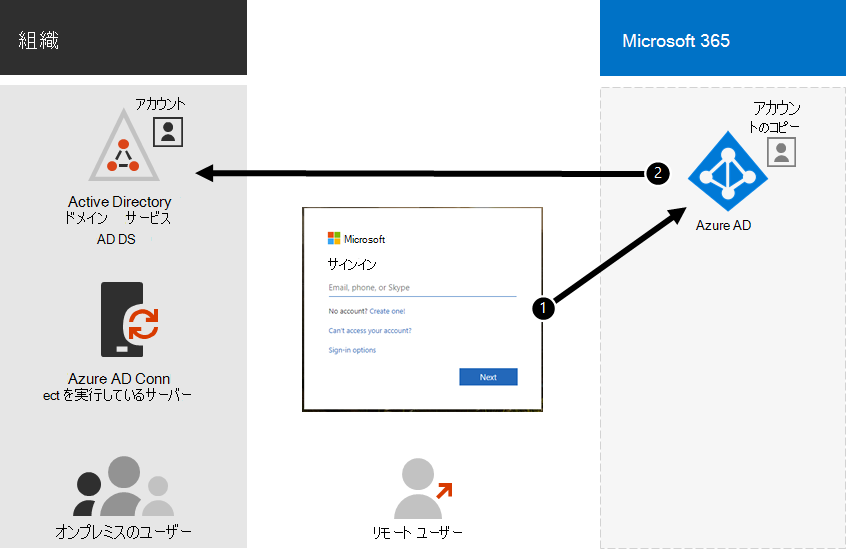

# Microsoft 365 のハイブリッド id とディレクトリ同期

*この記事は、Microsoft 365 Enterprise および Office 365 Enterprise の両方に適用されます。*

ビジネスニーズおよび技術的な要件に応じて、ハイブリッド id モデルおよびディレクトリ同期は、Microsoft 365 を採用しているエンタープライズのお客様にとって最も一般的な選択です。 ディレクトリ同期を使用すると、Active Directory ドメインサービス (AD DS) 内の id を管理でき、ユーザーアカウント、グループ、および連絡先へのすべての更新は、Microsoft 365 サブスクリプションの Azure Active Directory (Azure AD) テナントに同期されます。

>[!Note]
>AD DS ユーザーアカウントが初めて同期されると、Microsoft 365 ライセンスが自動的に割り当てられることはなく、電子メールなどの Microsoft 365 サービスにアクセスすることもできません。 最初に利用状況の場所を割り当てる必要があります。 次に、グループメンバーシップを使用して、個別または動的にライセンスをこれらのユーザーアカウントに割り当てます。
>

## ハイブリッド id の認証

ハイブリッド id モデルを使用する場合は、次の2種類の認証があります。

- 管理された認証

  Azure AD は、ローカルに保存されたハッシュバージョンのパスワードを使用して認証プロセスを処理するか、社内の AD DS によって認証されるように社内ソフトウェアエージェントに資格情報を送信します。

- フェデレーション認証

  Azure AD は、認証を要求しているクライアントコンピューターを別の id プロバイダーにリダイレクトします。

### 管理された認証

管理された認証には、次の2種類があります。

- パスワードハッシュの同期 (PHS)

  Azure AD は認証自体を実行します。

- パススルー認証 (PTA)

  Azure AD は、AD DS で認証を実行しています。

#### パスワードハッシュの同期 (PHS)

PHS では、AD DS のユーザーアカウントを Microsoft 365 と同期し、オンプレミスでユーザーを管理します。 ユーザーパスワードのハッシュは AD DS から Azure AD に同期されるため、ユーザーは社内とクラウドの両方で同じパスワードを使用できます。 これは、Azure AD で AD DS id の認証を有効にする最も簡単な方法です。 

パスワードが変更されるか、オンプレミスでリセットされると、新しいパスワードハッシュが Azure AD に同期されるため、ユーザーは常にクラウドリソースとオンプレミスのリソースに対して同じパスワードを使用できます。 ユーザーパスワードが Azure AD に送信されることや、クリアテキストで Azure AD に保存されることはありません。 Id 保護などの Azure AD の一部のプレミアム機能は、どの認証方法が選択されているかに関係なく、PHS を必要とします。
  
詳細について [は、「適切な認証方法を選択](https://docs.microsoft.com/azure/active-directory/hybrid/choose-ad-authn) する」を参照してください。
  
#### パススルー認証 (PTA)

PTA は、1つまたは複数のオンプレミスサーバー上で実行されているソフトウェアエージェントを使用して、AD DS に直接ユーザーを検証することにより、Azure AD 認証サービスの簡単なパスワード検証を提供します。 PTA を使用すると、AD DS のユーザーアカウントを Microsoft 365 と同期し、オンプレミスでユーザーを管理することができます。 

PTA を使用すると、ユーザーはオンプレミスのアカウントとパスワードを使用して、オンプレミスと Microsoft 365 の両方のリソースとアプリケーションの両方にサインインできるようになります。 この構成では、Azure AD にパスワードハッシュを保存せずに、ユーザーのパスワードをオンプレミスの AD DS に対して直接検証します。 

PTA は、組織に対して、オンプレミスのユーザーアカウントの状態、パスワードポリシー、およびログオン時間を即時に適用するセキュリティ要件を持つ組織のためにも使用されます。 
  
詳細について [は、「適切な認証方法を選択](https://docs.microsoft.com/azure/active-directory/hybrid/choose-ad-authn) する」を参照してください。
  
### フェデレーション認証

フェデレーション認証は、主に、より複雑な認証要件を持つ大規模なエンタープライズ組織に適しています。 AD DS id は Microsoft 365 と同期され、ユーザーアカウントは社内で管理されます。 フェデレーション認証では、ユーザーは社内とクラウドの両方で同じパスワードを使用しており、Microsoft 365 を使用するために再度サインインする必要はありません。 

フェデレーション認証は、スマートカードベースの認証、またはサードパーティの多要素認証などの追加の認証要件をサポートしており、一般に、組織が Azure AD でネイティブにサポートされていない認証要件を使用する場合に必要です。
 
詳細について [は、「適切な認証方法を選択](https://docs.microsoft.com/azure/active-directory/hybrid/choose-ad-authn) する」を参照してください。
  
#### サードパーティの認証および id プロバイダー

オンプレミスのディレクトリオブジェクトは、Microsoft 365 に同期することができ、クラウドリソースアクセスは主にサードパーティの id プロバイダー (IdP) によって管理されます。 組織でサードパーティのフェデレーションソリューションを使用している場合は、Microsoft 365 でそのソリューションを使用してサインオンを構成することができます。これにより、サードパーティ製のフェデレーションソリューションが Azure AD と互換性があることが提供されます。
  
詳細については、「 [AZURE AD フェデレーション互換性リスト](https://docs.microsoft.com/azure/active-directory/connect/active-directory-aadconnect-federation-compatibility) 」を参照してください。
  
## AD DS の準備

同期を使用して Microsoft 365 にシームレスに移行できるようにするには、Microsoft 365 ディレクトリ同期の展開を開始する前に、AD DS フォレストを準備する必要があります。
  
ディレクトリの準備では、次のタスクに焦点を当てる必要があります。

- 重複している **proxyAddress** 属性と **userPrincipalName** 属性を削除します。
- 空白および無効な **userprincipalname** 属性を有効な **userprincipalname** 属性で更新します。
- **GivenName**、姓 ( **Sn** )、 **sAMAccountName**、 **displayName**、 **mail**、 **proxyAddresses**、 **mailNickname**、および**userPrincipalName**の各属性の無効で問題のある文字を削除します。 属性の準備の詳細については、「 [Azure Active Directory 同期ツールによって同期される属性の一覧](https://go.microsoft.com/fwlink/p/?LinkId=396719)」を参照してください。

    > [!NOTE]
    > Azure AD Connect が同期するのと同じ属性です。 
  
## 複数フォレストの展開に関する考慮事項

複数のフォレストおよび SSO オプションの場合は、 [AZURE AD Connect のカスタムインストール](https://go.microsoft.com/fwlink/p/?LinkId=698430)を使用します。
  
組織に認証用に複数のフォレストがある場合 (ログオンフォレスト)、次のことを強くお勧めします。
  
- **フォレストを統合することを検討してください。** 一般に、複数のフォレストを維持するには、より多くのオーバーヘッドが必要になります。 個別のフォレストの必要性を判断するセキュリティ上の制約が組織にない限り、オンプレミスの環境を簡素化することを検討してください。
- **プライマリのログオンフォレストでのみ使用します。** Microsoft 365 の展開は、Microsoft 365 の初期の展開にプライマリのログオンフォレストでのみ行うことをお勧めします。 

複数フォレストの AD DS 展開を統合できない場合や、他のディレクトリサービスを使用して id を管理している場合は、Microsoft またはパートナーのヘルプと同期することができます。
  
詳細については、「 [AZURE AD Connect のトポロジ](https://docs.microsoft.com/azure/active-directory/hybrid/plan-connect-topologies) 」を参照してください。
  
## ディレクトリ同期に依存する機能
  
次の機能には、ディレクトリ同期が必要です。
  
- Azure AD のシームレスなシングルサインオン (SSO)
- Skype の共存
- Exchange ハイブリッド展開 (次のものが含まれる)
  - オンプレミスの Exchange 環境と Microsoft 365 間の完全に共有されたグローバルアドレス一覧 (GAL)。
  - 別のメールシステムから GAL 情報を同期します。
  - Microsoft 365 サービスオファーリングにユーザーを追加したり、ユーザーを削除したりする機能。 これには、次のものが必要です。
  - ディレクトリ同期のセットアップ中に、双ウェイの同期を構成する必要があります。 既定では、ディレクトリ同期ツールは、ディレクトリ情報をクラウドにのみ書き込みます。 双ウェイの同期を構成する場合は、制限された数のオブジェクト属性がクラウドからコピーされるように書き戻し機能を有効にしてから、ローカルの AD DS に書き戻します。 書き戻しは、Exchange ハイブリッドモードとも呼ばれます。 
  - オンプレミスの Exchange ハイブリッド展開
  - 他のユーザーのメールボックスをオンプレミスに保持したまま、一部のユーザーメールボックスを Microsoft 365 に移動する機能。
  - オンプレミスの信頼できる差出人と受信拒否リストは、Microsoft 365 に複製されます。
  - 基本的な委任および代理送信電子メール機能。
  - オンプレミスのスマートカードまたは多要素認証ソリューションが統合されている。
- 写真、サムネイル、会議室、セキュリティグループの同期

## 次の手順

ハイブリッド id を展開する準備ができたら、「 [ディレクトリ同期の準備](prepare-for-directory-synchronization.md)」を参照してください。
  
