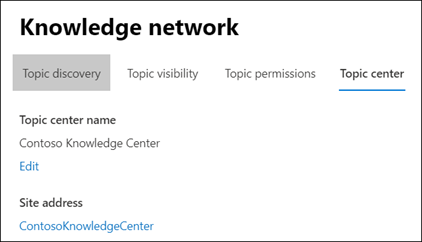
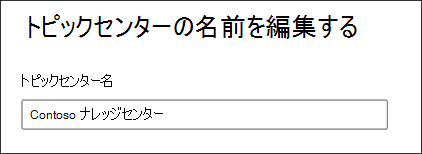

# ナレッジ管理ネットワークを管理する (プレビュー)Manage your knowledge management network (Preview)

> [!Note] 
> この記事の内容は、Project Cortex のプライベートプレビュー用です。The content in this article is for Project Cortex Private Preview. [詳細については、「Project Cortex](https://aka.ms/projectcortex)」を参照してください。[Find out more about Project Cortex](https://aka.ms/projectcortex).

[ナレッジ管理を設定](set-up-knowledge-network.md)した後、管理者が Microsoft 365 管理センターを使用して構成設定を調整できるようになります。After you [set up knowledge management](set-up-knowledge-network.md), at any time afterwards an admin can make adjustments to your configuration settings through the Microsoft 365 admin center.

たとえば、次のいずれかの設定を調整しなければならない場合があります。For example, you may need to adjust your settings for any of the following:
- 新しい SharePoint ソースを採鉱所のトピックに追加します。Add new SharePoint sources to mine topics.
- トピックにアクセスできるユーザーを変更します。Change which users will have access to topics.
- トピックセンターでタスクを実行するためのアクセス許可を持つユーザーを変更します。Change which users have permissions to do tasks on the topic center.
- トピックセンターの名前を変更するChange the name of your topic center

## RequirementsRequirements 
グローバル管理者または SharePoint 管理者のアクセス許可を持っている必要があります。これを行うには、Microsoft 365 管理センターにアクセスして、組織のナレッジタスクを管理する必要があります。You must have Global Admin or SharePoint admin permissions to be able to access the Microsoft 365 admin center and manage Organizational knowledge tasks.

## ナレッジ管理設定にアクセスするには、次のようにします。To access knowledge management settings:

1. Microsoft 365 管理センターで、[ **セットアップ**] を選択し、[ **組織ナレッジ** ] セクションを表示します。In the Microsoft 365 admin center, select **Setup**, and then view the **Organizational Knowledge** section.
2. [ **組織ナレッジ** ] セクションで、[ **ユーザーをナレッジに接続する**] をクリックします。In the **Organizational Knowledge** section, click **Connect people to knowledge**. 

      

3. [ **ユーザーをナレッジに接続** ] ページで、[ **管理** ] を選択して [ **ナレッジネットワーク設定** ] ウィンドウを開きます。On the **Connect people to knowledge** page, select **Manage** to open the **Knowledge network settings** pane. 

      

## ナレッジネットワークがトピックを見つける方法を変更するChange how the knowledge network can find topics

SharePoint トピックソースの選択肢を更新する場合は、[ **トピックの検索** ] タブを選択します。Select the **Topic discovery** tab if you want to update your choices for  for SharePoint topic sources. この設定を使用すると、トピックでクロールおよびマイニングされるテナント内の SharePoint サイトを選択できます。This setting let you select the SharePoint sites in your tenant that will be crawled and mined for topics.

1. [ **トピック探索** ] タブの [ **SharePoint トピックソースの選択**] で、[ **編集**] を選択します。On the **Topic discovery** tab, under **Select SharePoint topic sources**, select **Edit**.
2. [ **Sharepoint トピックソースの選択** ] ページで、検出時にトピックのソースとしてクロールする sharepoint サイトを選択します。On the **Select SharePoint topic sources** page, select which SharePoint sites will be crawled as sources for your topics during discovery. 次のようなシナリオが考えられます。This includes: 
    a. a. **すべてのサイト**: テナント内のすべての SharePoint サイト。**All sites**: All SharePoint sites in your tenant. これにより、現在および今後のサイトがキャプチャされます。This captures current and future sites. 
    b. b. **[すべて]: 選択したサイトを除き、** 除外するサイトの名前を入力します。**All, except selected sites**: Type the names of the sites you want to exclude.  また、探索対象から除外するサイトの一覧をアップロードすることもできます。You can also upload a list of sites you want to opt out from discovery. 今後作成されるサイトは、トピック検出のソースとして含まれます。Sites created in the future will be included as sources for topic discovery.  
    c. c. [**選択したサイトのみ**: 含めるサイトの名前を入力します。**Only selected sites**: Type the names of the sites you want to include. サイトのリストをアップロードすることもできます。You can also upload a list of sites. 今後作成されるサイトは、トピック検出のソースとしては含まれません。Sites created in the future will not be included as sources for topic discovery.  

      
   
    除外するサイトが複数ある場合 (選択した **サイトを除くすべて**を選択した場合)、または (選択した **サイトのみ**を選択した場合)、CSV ファイルをサイト名と url でアップロードすることを選択できます。If you have a number of sites that you want to exclude (if you select **All, except selected sites**) or include (if you selected **Only selected sites**), you can choose to upload a CSV file with the site names and URLs. CSV テンプレートファイルを使用する場合は、[ **サイトテンプレート .csv のダウンロード** ] を選択できます。You can select **Download site template .csv** if you want to use the CSV template file.

3. [**保存**] を選択します。Select **Save**.

##  組織内のトピックを表示できるユーザーを変更するChange who can see topics in your organization

組織内の誰が検索結果の検出されたトピックを表示できるかを更新する場合、または SharePoint ページなどのコンテンツでトピックを強調表示している場合は、[ **Topic discovery** ] タブを選択します。Select the **Topic discovery** tab if you want to update who in your organization can see discovered topics in search results and when topics are highlighted in content like SharePoint pages.

1. [ **Topic discovery** ] タブで、[ **ナレッジネットワーク内のトピックを参照できるユーザー**] で、[ **編集**] を選択します。On the **Topic discovery** tab, under **Who can see topics in the knowledge network**, select **Edit**.
2. [ **ナレッジネットワーク内のトピックを参照できるユーザー** ] で、強調表示されたトピック、トピックカード、トピックの回答、トピックページなど、トピックの詳細にアクセスできるユーザーを選択します。On the **Who can see topics in the knowledge network** page, you choose who will have access to topic details, such as highlighted topics, topic cards, topic answers in search, and topic pages. 次のものが選択できます。You can select: 
    a. a. **組織内のすべてのユーザー****Everyone in your organization** 
    b. b. **選択したユーザーまたはセキュリティグループのみ****Only selected people or security groups** 
    c. c. **だれも****No one** 

       
3. [**保存**] を選択します。Select **Save**.  
 
> [!Note] 
> この設定では、組織内のユーザーを選択できますが、ナレッジ管理ライセンスが割り当てられているユーザーのみがトピックを表示できます。While this setting allows you to select any user in your organization, only users who have knowledge management licenses assigned to them will be able to view topics.

## トピックセンターでタスクを実行する権限を持つユーザーを変更するChange who has permissions to do tasks on the topic center

[トピックセンター] ページで次の操作を実行する権限を持つユーザーを更新する場合は、[ **トピックの権限** ] タブを選択します。Select the **Topic permissions** tab if you want to update who has permissions to do the following in the topic center page:

- トピックを作成および編集できるユーザー: 検出時に見つからなかった新しいトピックを作成する、または既存のトピックページの詳細を編集する。Which users can create and edit topics: Create new topics that were not found during discovery or edit existing topic page details.
- どのユーザーがトピックを管理できるか: 検出されたトピックを確認または拒否します。Which users can manage topics: Confirm or reject discovered topics.

トピックを作成および編集する権限を持つユーザーを更新するには、次のようにします。To update who has permissions to create and edit topics:

1. [ **トピックの権限** ] タブの [ **トピックの作成と編集が可能なユーザー**] で、[ **編集**] を選択します。On the **Topic permissions** tab, under **Who can create and edit topics**, select **Edit**. 
2. [ **トピックの作成と編集が可能なユーザー** ] ページで、次の項目を選択できます。On the **Who can create and edit topics** page, you can select: 
    a. a. **組織内のすべてのユーザー****Everyone in your organization** 
    b. b. **選択したユーザーまたはセキュリティグループのみ****Only selected people or security groups** 

       

3. [**保存**] を選択します。Select **Save**. 

トピックを管理する権限を持つユーザーを更新するには、次のようにします。To update who has permissions to manage topics:

1. [ **トピックの権限** ] タブの [ **トピックを管理できるユーザー**] で、[ **編集**] を選択します。On the **Topic permissions** tab, under **Who can manage topics**, select **Edit**. 
2. [ **トピックの管理が可能なユーザー** ] ページで、次の項目を選択できます。On the **Who can manage topics** page, you can select: 
    a. a. **組織内のすべてのユーザー****Everyone in your organization** 
    b. b. **選択されたユーザーまたはセキュリティグループ****Selected people or security groups** 

       

3. [**保存**] を選択します。Select **Save**. 

##  トピックセンター名を更新するUpdate your topic center name

トピックセンターの名前を更新する場合は、[ **トピックセンター** ] タブを選択します。Select the **Topic center** tab if you want to update the name of your topic center. 

1. [ **トピックセンター** ] タブの [ **トピックセンター名**] で、[ **編集**] を選択します。On the **Topic center** tab, under **Topic center name**, select **Edit**.
2. [ **トピックセンター名の編集** ] ページの [ **トピックセンター名** ] ボックスに、トピックセンターの新しい名前を入力します。On the **Edit topic center name** page, in the **Topic center name** box, type the new name for your topic center.
3. **[保存]** を選びます。Select **Save**

       

## 関連項目See also

  

