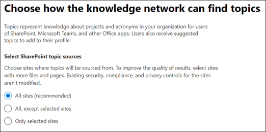
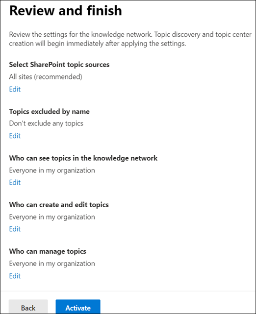
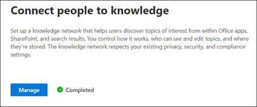

# ナレッジ管理をセットアップする (プレビュー)

> [!Note] 
> この記事の内容は、Project Cortex のプライベートプレビュー用です。 [詳細については、「Project Cortex](https://aka.ms/projectcortex)」を参照してください。

Microsoft 365 管理センターを使用して、 [ナレッジ管理](knowledge-management-overview.md)をセットアップして構成することができます。 

> [!Important]
> 環境でナレッジマネジメントをセットアップして構成するための最善の方法を計画することが重要です。 たとえば、次の点について考慮する必要があります。
- トピックを分析する SharePoint サイト。
- トピックを表示するユーザーを指定します。
- トピックセンターのトピックを管理するためのアクセス許可を付与するユーザー。
- トピックセンターでトピックを作成または編集するためのアクセス許可を付与するユーザー。
- トピックセンターに付ける名前を指定します。

> [!Note]
> トピックの表示、トピックの管理、およびトピックの作成と編集に必要なアクセス許可をユーザーに割り当てるには、セキュリティグループを作成すると便利です。

管理者は、Microsoft 365 管理センターのナレッジ管理設定を使用して、 [選択した設定をいつ](manage-knowledge-network.md) でも変更することができます。

## Requirements 
グローバル管理者または SharePoint 管理者のアクセス許可を持っている必要があります。これを行うには、Microsoft 365 管理センターにアクセスして、組織のナレッジタスクを設定する必要があります。

## ナレッジネットワークをセットアップする

ナレッジネットワークをセットアップするには、次の手順を実行します。

- トピック検出: 検出から除外するトピックソースとトピックを選択します。
- トピックの表示: [検索] および [トピックページ] で、トピックを強調表示できるユーザーを選択します。
- トピックのアクセス許可: トピックを作成、編集、および管理できるユーザーを選択します。
- トピックセンター: トピックセンターを作成します。
- レビュー: 設定を確認して適用します。

ナレッジネットワークをセットアップするには、次のようにします。

1. Microsoft 365 管理センター (admin.microsoft.com) で、[ **セットアップ**] を選択し、[ **組織ナレッジ** ] セクションを表示します。
2. [ **組織ナレッジ** ] セクションで、[ **ユーザーをナレッジに接続する**] をクリックします。 

      

3. [ **ユーザーをナレッジに接続** する] ページで、[ **開始** ] をクリックして、セットアッププロセスを案内します。 

      

4. [ **ナレッジネットワークでトピックを検索する方法を選択** してください] ページで、トピック検出を構成します。 **[Sharepoint トピックソースの選択**] セクションで、検出時にトピックのソースとしてクロールする sharepoint サイトを選択します。 次のようなシナリオが考えられます。 
    a. **すべてのサイト**: テナント内のすべての SharePoint サイト。 これにより、現在および今後のサイトがキャプチャされます。 
    b. **[すべて]: 選択したサイトを除き、** 除外するサイトの名前を入力します。  また、探索対象から除外するサイトの一覧をアップロードすることもできます。 今後作成されるサイトは、トピック検出のソースとして含まれます。  
    c.  [**選択したサイトのみ**: 含めるサイトの名前を入力します。 サイトのリストをアップロードすることもできます。 今後作成されるサイトは、トピック検出のソースとしては含まれません。  

      
   
5. [ **トピックを名前で除外** する] セクションで、検出された結果に含めるトピックの名前を含めることを選択できます。 この設定を使用して、機密性の高いトピックがナレッジネットワークの一部として含まれないようにします。 次のようなオプションがあります。 
    a. **トピックを除外しない**  
    b. **トピックを名前で除外**する: ナレッジネットワークの一部としてユーザーに表示されないトピックがある場合。 

      

    #### 名前によってトピックを除外する方法    

    トピックを除外する必要がある場合は、[ **名前でトピックを除外**する] を選択した後、[ **.Csv テンプレートをダウンロード**する] を選択します。 Excel を使用します。CSV テンプレートを使用して、検出結果から除外するトピックの一覧を追加します。

      

    CSV テンプレートで、除外するトピックについて次の情報を入力します。

    - [**名前**: 除外するトピックの名前を入力します。 これを行うには 2 つの方法があります。 
        - 完全一致: 完全に一致する名前または頭字語 (たとえば、 *Contoso* または *ATL*) を含めることができます。 
        - 部分一致: 特定の単語が含まれるすべてのトピックを除外することができます。  たとえば、 *arc*は、円弧の*円*、*プラズマの円弧溶接*、*教育*用の円弧など *、弧が単語で*あるすべてのトピックを除外します。テキストが*アーキテクチャ*などの単語の一部として含まれるトピックは除外されないことに注意してください。 
    - **拡張 (省略可能)**: 頭字語を除外する場合は、頭字語という単語を入力します。 
    - **MatchType-exact/partial**: 入力した名前が、 *完全* 一致または *一部* 一致の種類であるかどうかを入力します。 

    CSV テンプレートファイルが完成して保存されたら、[ **参照** ] を選択して、それを見つけて選択します。
    
    [**次へ**] を選択します。 

6. [ **トピックを見ることができるユーザー] および** それらのページが表示される場所については、トピックの表示を構成します。 [ナレッジネットワーク設定] の [ **トピックを参照できるユーザー** ] で、強調表示されているトピック、トピックカード、トピックの回答、トピックページなど、トピックの詳細にアクセスできるユーザーを選択します。 次のものが選択できます。 
    a. **組織内のすべてのユーザー** 
    b. **選択したユーザーまたはセキュリティグループのみ** 
    c.  **だれも** 

       

 > [!Note] 
 > この設定では、組織内のユーザーを選択できますが、ナレッジ管理ライセンスが割り当てられているユーザーのみがトピックを表示できます。 

7. [ **トピック管理のアクセス許可** ] ページで、トピックを作成、編集、または管理できるユーザーを選択します。 [ **トピックの作成と編集が可能なユーザー** ] セクションで、次の項目を選択できます。 
    a. **組織内のすべてのユーザー** 
    b. **選択したユーザーまたはセキュリティグループのみ** 
8. [ **トピックを管理できるユーザー** ] セクションで、次の項目を選択できます。 
    a. **組織内のすべてのユーザー** 
    b. **選択されたユーザーまたはセキュリティグループ** 

      

    [**次へ**] を選択します。 
9. [ **トピックセンターの作成** ] ページでトピックセンターサイトを作成し、トピックページを表示したり、トピックを管理したりすることができます。  [ **トピックセンター名** ] ボックスに、トピックセンターの名前を入力します。 必要に応じて、簡単な説明を [ **サイトの説明** ] ボックスに入力できます。  

[**次へ**] を選択します。 

      

10. [ **確認と完了** ] ページで、選択した設定を確認して、変更を行うことができます。 選択内容に問題がなければ、[ **アクティブ化**] を選択します。

       

11. [ **ナレッジネットワークがアクティブ化** されました] ページが表示され、選択したサイトの分析が開始され、ナレッジセンターサイトが作成されることを確認できます。 [**完了**] を選択します。 

       

12. **ユーザーをナレッジに接続**するページに戻ります。 このページでは、[ **管理** ] を選択して構成設定に変更を加えることができます。 

         

> [!Note]
> セットアップ後、管理者はこのページに戻って、 [選択したナレッジ管理設定を](manage-knowledge-network.md) いつでも変更できます。

## 関連項目

  

