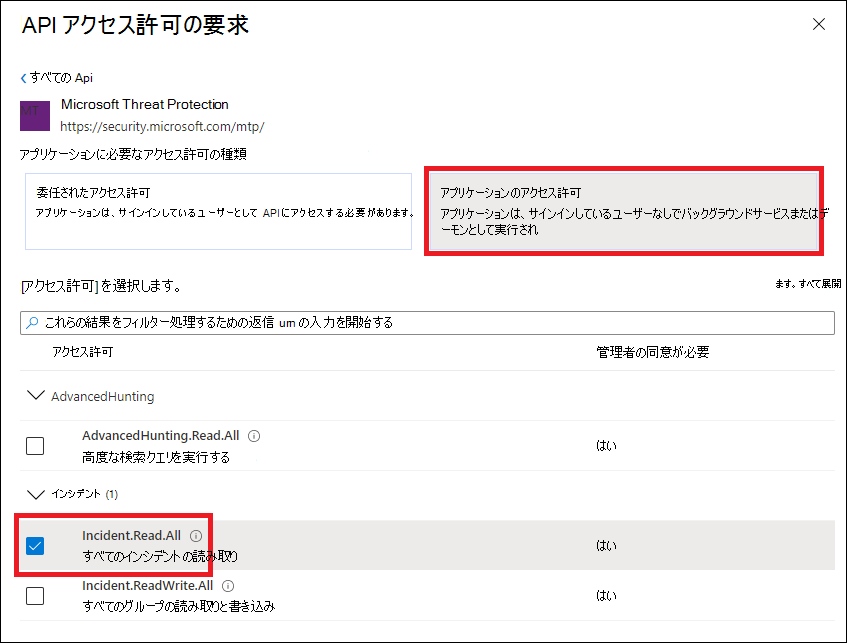
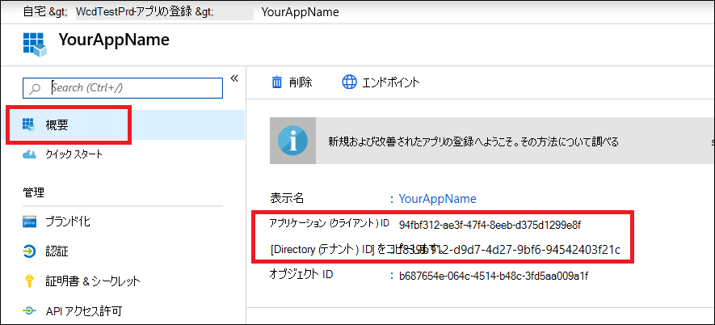

# <a name="hello-world-for-microsoft-365-defender-rest-api"></a><span data-ttu-id="69a25-104">Microsoft 365 Defender REST API の Hello World</span><span class="sxs-lookup"><span data-stu-id="69a25-104">Hello World for Microsoft 365 Defender REST API</span></span> 

[!INCLUDE [Microsoft 365 Defender rebranding](../includes/microsoft-defender.md)]


<span data-ttu-id="69a25-105">**適用対象:**</span><span class="sxs-lookup"><span data-stu-id="69a25-105">**Applies to:**</span></span>
- <span data-ttu-id="69a25-106">Microsoft 365 Defender</span><span class="sxs-lookup"><span data-stu-id="69a25-106">Microsoft 365 Defender</span></span>

>[!IMPORTANT] 
><span data-ttu-id="69a25-107">一部の情報は、市販される前に大幅に変更される可能性がある prereleased 製品に関連しています。</span><span class="sxs-lookup"><span data-stu-id="69a25-107">Some information relates to prereleased product which may be substantially modified before it's commercially released.</span></span> <span data-ttu-id="69a25-108">Microsoft makes no warranties, express or implied, with respect to the information provided here.</span><span class="sxs-lookup"><span data-stu-id="69a25-108">Microsoft makes no warranties, express or implied, with respect to the information provided here.</span></span>


## <a name="get-incidents-using-a-simple-powershell-script"></a><span data-ttu-id="69a25-109">簡単な PowerShell スクリプトを使用してインシデントを取得する</span><span class="sxs-lookup"><span data-stu-id="69a25-109">Get incidents using a simple PowerShell script</span></span>

### <a name="how-long-it-takes-to-go-through-this-example"></a><span data-ttu-id="69a25-110">この例では、どのくらいの時間がかかりますか?</span><span class="sxs-lookup"><span data-stu-id="69a25-110">How long it takes to go through this example?</span></span>
<span data-ttu-id="69a25-111">次の2つの手順では、5分で完了します。</span><span class="sxs-lookup"><span data-stu-id="69a25-111">It only takes 5 minutes done in two steps:</span></span>
- <span data-ttu-id="69a25-112">アプリケーションの登録</span><span class="sxs-lookup"><span data-stu-id="69a25-112">Application registration</span></span>
- <span data-ttu-id="69a25-113">使用例: 短い PowerShell スクリプトのコピー/貼り付けのみが必要です</span><span class="sxs-lookup"><span data-stu-id="69a25-113">Use examples: only requires copy/paste of a short PowerShell script</span></span>

### <a name="do-i-need-a-permission-to-connect"></a><span data-ttu-id="69a25-114">接続するためのアクセス許可が必要ですか。</span><span class="sxs-lookup"><span data-stu-id="69a25-114">Do I need a permission to connect?</span></span>
<span data-ttu-id="69a25-115">アプリケーション登録ステージでは、Azure Active Directory (Azure AD) テナントに **グローバル管理者** ロールが必要です。</span><span class="sxs-lookup"><span data-stu-id="69a25-115">For the Application registration stage, you must have a **Global administrator** role in your Azure Active Directory (Azure AD) tenant.</span></span>

### <a name="step-1---create-an-app-in-azure-active-directory"></a><span data-ttu-id="69a25-116">手順 1-Azure Active Directory でアプリを作成する</span><span class="sxs-lookup"><span data-stu-id="69a25-116">Step 1 - Create an App in Azure Active Directory</span></span>

1. <span data-ttu-id="69a25-117">**グローバル管理者** ユーザーと共に [Azure](https://portal.azure.com)にログオンします。</span><span class="sxs-lookup"><span data-stu-id="69a25-117">Log on to [Azure](https://portal.azure.com) with your **Global administrator** user.</span></span>

2. <span data-ttu-id="69a25-118">**Azure Active Directory**  >  **アプリ登録**  >  の **新しい登録** に移動します。</span><span class="sxs-lookup"><span data-stu-id="69a25-118">Navigate to **Azure Active Directory** > **App registrations** > **New registration**.</span></span> 

   

3. <span data-ttu-id="69a25-120">登録フォームで、アプリケーションの名前を選択し、[ **登録** ] を選択します。</span><span class="sxs-lookup"><span data-stu-id="69a25-120">In the registration form, choose a name for your application and then select **Register**.</span></span>

4. <span data-ttu-id="69a25-121">アプリケーションがエンドポイントの Microsoft Defender にアクセスして、それを **すべてのインシデントの読み取り** アクセス許可に割り当てることを許可します。</span><span class="sxs-lookup"><span data-stu-id="69a25-121">Allow your Application to access Microsoft Defender for Endpoint and assign it **Read all incidents** permission:</span></span>

   - <span data-ttu-id="69a25-122">アプリケーションページで、[ **API Permissions** ] [組織が使用する  >  **アクセス許可**  >  **api** の追加 > **microsoft 365 defender** ] と入力し、[ **microsoft 365 defender** ] を選択します。</span><span class="sxs-lookup"><span data-stu-id="69a25-122">On your application page, select **API Permissions** > **Add permission** > **APIs my organization uses** > type **Microsoft 365 Defender** and select on **Microsoft 365 Defender**.</span></span>

   >[!NOTE]
   ><span data-ttu-id="69a25-123">Microsoft 365 Defender は、元のリストには表示されません。</span><span class="sxs-lookup"><span data-stu-id="69a25-123">Microsoft 365 Defender does not appear in the original list.</span></span> <span data-ttu-id="69a25-124">テキストボックスに名前を記述して、表示されることを確認する必要があります。</span><span class="sxs-lookup"><span data-stu-id="69a25-124">You need to start writing its name in the text box to see it appear.</span></span>

   

   - <span data-ttu-id="69a25-126">[ **アプリケーションのアクセス許可** のインシデント] を選択します。  >  **すべて** > [ **アクセス許可の追加** ] を選択します。</span><span class="sxs-lookup"><span data-stu-id="69a25-126">Choose **Application permissions** > **Incident.Read.All** > Select on **Add permissions**</span></span>

   

   >[!IMPORTANT]
   ><span data-ttu-id="69a25-128">関連するアクセス許可を選択する必要があります。</span><span class="sxs-lookup"><span data-stu-id="69a25-128">You need to select the relevant permissions.</span></span> 

     <span data-ttu-id="69a25-129">例えば</span><span class="sxs-lookup"><span data-stu-id="69a25-129">For instance,</span></span>

     - <span data-ttu-id="69a25-130">必要なアクセス許可を確認するには、呼び出したい API の [ **Permissions** ] セクションを参照してください。</span><span class="sxs-lookup"><span data-stu-id="69a25-130">To determine which permission you need, please look at the **Permissions** section in the API you are interested to call.</span></span>

5. <span data-ttu-id="69a25-131">[ **管理者の同意を付与** する] を選択する</span><span class="sxs-lookup"><span data-stu-id="69a25-131">Select **Grant admin consent**</span></span>

    - >[!NOTE]
      > <span data-ttu-id="69a25-132">アクセス許可を追加するたびに、新しいアクセス許可を有効にするには、[ **Grant 同意** ] を選択する必要があります。</span><span class="sxs-lookup"><span data-stu-id="69a25-132">Every time you add permission you must select on **Grant consent** for the new permission to take effect.</span></span>

    

6. <span data-ttu-id="69a25-134">アプリケーションにシークレットを追加します。</span><span class="sxs-lookup"><span data-stu-id="69a25-134">Add a secret to the application.</span></span>

    - <span data-ttu-id="69a25-135">[ **証明書 & シークレット** ] を選択し、シークレットに説明を追加して、[ **追加** ] を選択します。</span><span class="sxs-lookup"><span data-stu-id="69a25-135">Select **Certificates & secrets** , add description to the secret and select **Add**.</span></span>

    >[!IMPORTANT]
    > <span data-ttu-id="69a25-136">[ **追加** ] を選択した後、 **生成されたシークレット値をコピー** します。</span><span class="sxs-lookup"><span data-stu-id="69a25-136">After selecting **Add** , **copy the generated secret value**.</span></span> <span data-ttu-id="69a25-137">退出後に取得することはできません。</span><span class="sxs-lookup"><span data-stu-id="69a25-137">You won't be able to retrieve after you leave!</span></span>

    

7. <span data-ttu-id="69a25-139">アプリケーション ID とテナント ID を書き留めておきます。</span><span class="sxs-lookup"><span data-stu-id="69a25-139">Write down your application ID and your tenant ID:</span></span>

   - <span data-ttu-id="69a25-140">アプリケーションページで、[ **概要** ] に移動し、次の内容をコピーします。</span><span class="sxs-lookup"><span data-stu-id="69a25-140">On your application page, go to **Overview** and copy the following:</span></span>

   


<span data-ttu-id="69a25-142">完成です！</span><span class="sxs-lookup"><span data-stu-id="69a25-142">Done!</span></span> <span data-ttu-id="69a25-143">アプリケーションが正常に登録されました。</span><span class="sxs-lookup"><span data-stu-id="69a25-143">You have successfully registered an application.</span></span>

### <a name="step-2---get-a-token-using-the-app-and-use-this-token-to-access-the-api"></a><span data-ttu-id="69a25-144">手順 2-アプリを使用してトークンを取得し、このトークンを使用して API にアクセスします。</span><span class="sxs-lookup"><span data-stu-id="69a25-144">Step 2 - Get a token using the App and use this token to access the API.</span></span>

-   <span data-ttu-id="69a25-145">次のスクリプトを PowerShell ISE またはテキストエディターにコピーし、" **Get-Token.ps1** " として保存します。</span><span class="sxs-lookup"><span data-stu-id="69a25-145">Copy the script below to PowerShell ISE or to a text editor, and save it as " **Get-Token.ps1** "</span></span>
-   <span data-ttu-id="69a25-146">このスクリプトを実行すると、トークンが生成され、" **Latest-token.txt** " という名前の作業フォルダーに保存されます。</span><span class="sxs-lookup"><span data-stu-id="69a25-146">Running this script will generate a token and will save it in the working folder under the name " **Latest-token.txt** ".</span></span>

```
# That code gets the App Context Token and save it to a file named "Latest-token.txt" under the current directory
# Paste below your Tenant ID, App ID and App Secret (App key).

$tenantId = '' ### Paste your tenant ID here
$appId = '' ### Paste your Application ID here
$appSecret = '' ### Paste your Application secret here

$resourceAppIdUri = 'https://api.security.microsoft.com'
$oAuthUri = "https://login.windows.net/$TenantId/oauth2/token"
$authBody = [Ordered] @{
    resource = "$resourceAppIdUri"
    client_id = "$appId"
    client_secret = "$appSecret"
    grant_type = 'client_credentials'
}
$authResponse = Invoke-RestMethod -Method Post -Uri $oAuthUri -Body $authBody -ErrorAction Stop
$token = $authResponse.access_token
Out-File -FilePath "./Latest-token.txt" -InputObject $token
return $token
```

-   <span data-ttu-id="69a25-147">正当性チェック:</span><span class="sxs-lookup"><span data-stu-id="69a25-147">Sanity Check:</span></span><br>
<span data-ttu-id="69a25-148">スクリプトを実行します。</span><span class="sxs-lookup"><span data-stu-id="69a25-148">Run the script.</span></span><br>
<span data-ttu-id="69a25-149">ブラウザーで、次のように移動します。 https://jwt.ms/</span><span class="sxs-lookup"><span data-stu-id="69a25-149">In your browser go to: https://jwt.ms/</span></span> <br>
<span data-ttu-id="69a25-150">トークン (Latest-token.txt ファイルの内容) をコピーします。</span><span class="sxs-lookup"><span data-stu-id="69a25-150">Copy the token (the content of the Latest-token.txt file).</span></span><br>
<span data-ttu-id="69a25-151">一番上のボックスに貼り付けます。</span><span class="sxs-lookup"><span data-stu-id="69a25-151">Paste in the top box.</span></span><br>
<span data-ttu-id="69a25-152">「役割」セクションを参照してください。</span><span class="sxs-lookup"><span data-stu-id="69a25-152">Look for the "roles" section.</span></span> <span data-ttu-id="69a25-153">役割を検索 ```Incidents.Read.All``` します。</span><span class="sxs-lookup"><span data-stu-id="69a25-153">Find the ```Incidents.Read.All``` role.</span></span><br>
<span data-ttu-id="69a25-154">次の例は ```Incidents.Read.All``` 、 ```Incidents.ReadWrite.All``` およびアクセス許可を持つアプリからのものです ```AdvancedHunting.Read.All``` 。</span><span class="sxs-lookup"><span data-stu-id="69a25-154">The below example is from an app that has ```Incidents.Read.All```, ```Incidents.ReadWrite.All``` and ```AdvancedHunting.Read.All``` permissions.</span></span>


### <a name="lets-get-the-incidents"></a><span data-ttu-id="69a25-156">インシデントを入手できます。</span><span class="sxs-lookup"><span data-stu-id="69a25-156">Lets get the Incidents!</span></span>

-   <span data-ttu-id="69a25-157">次のスクリプトでは **Get-Token.ps1** を使用して API にアクセスし、過去48時間以内に最終更新されたインシデントを取得します。</span><span class="sxs-lookup"><span data-stu-id="69a25-157">The script below will use **Get-Token.ps1** to access the API and will get the incidents last updated in past 48 hours.</span></span>
-   <span data-ttu-id="69a25-158">このスクリプトは、前のスクリプト **Get-Token.ps1** を保存したときと同じフォルダーに保存します。</span><span class="sxs-lookup"><span data-stu-id="69a25-158">Save this script in the same folder you saved the previous script **Get-Token.ps1**.</span></span> 
-   <span data-ttu-id="69a25-159">スクリプトと同じフォルダー内のデータを含む json ファイル。</span><span class="sxs-lookup"><span data-stu-id="69a25-159">The script a json file with the data in the same folder as the scripts.</span></span>

```
# Returns Incidents last updated in the past 48 hours.

$token = ./Get-Token.ps1       #run the script Get-Token.ps1  - make sure you are running this script from the same folder of Get-Token.ps1

# Get Incidents from the last 48 hours. Make sure you have incidents in that time frame.
$dateTime = (Get-Date).ToUniversalTime().AddHours(-48).ToString("o")

# The URL contains the type of query and the time filter we created above
$url = "https://api.security.microsoft.com/api/incidents?$filter=lastUpdateTime+ge+$dateTime"

# Set the WebRequest headers
$headers = @{ 
    'Content-Type' = 'application/json'
    'Accept' = 'application/json'
    'Authorization' = "Bearer $token"
}

# Send the webrequest and get the results. 
$response = Invoke-WebRequest -Method Get -Uri $url -Headers $headers -ErrorAction Stop

# Extract the incidents from the results. 
$incidents =  ($response | ConvertFrom-Json).value | ConvertTo-Json -Depth 99

# Get string with the execution time. We concatenate that string to the output file to avoid overwrite the file
$dateTimeForFileName = Get-Date -Format o | foreach {$_ -replace ":", "."}    

# Save the result as json
$outputJsonPath = "./Latest Incidents $dateTimeForFileName.json"     

Out-File -FilePath $outputJsonPath -InputObject $incidents 
```

<span data-ttu-id="69a25-160">すべて完了しました。</span><span class="sxs-lookup"><span data-stu-id="69a25-160">You're all done!</span></span> <span data-ttu-id="69a25-161">正常に完了したのは次のとおりです。</span><span class="sxs-lookup"><span data-stu-id="69a25-161">You have just successfully:</span></span>
-   <span data-ttu-id="69a25-162">作成および登録され、アプリケーション</span><span class="sxs-lookup"><span data-stu-id="69a25-162">Created and registered and application</span></span>
-   <span data-ttu-id="69a25-163">そのアプリケーションに対して通知を読み取るためのアクセス許可が付与されます。</span><span class="sxs-lookup"><span data-stu-id="69a25-163">Granted permission for that application to read alerts</span></span>
-   <span data-ttu-id="69a25-164">API の接続</span><span class="sxs-lookup"><span data-stu-id="69a25-164">Connected the API</span></span>
-   <span data-ttu-id="69a25-165">PowerShell スクリプトを使用して過去48時間以内に作成されたインシデントを返す</span><span class="sxs-lookup"><span data-stu-id="69a25-165">Used a PowerShell script to return incidents created in the past 48 hours</span></span>


## <a name="related-topic"></a><span data-ttu-id="69a25-166">関連トピック</span><span class="sxs-lookup"><span data-stu-id="69a25-166">Related topic</span></span>
- [<span data-ttu-id="69a25-167">Microsoft 365 Defender Api にアクセスする</span><span class="sxs-lookup"><span data-stu-id="69a25-167">Access the Microsoft 365 Defender APIs</span></span>](api-access.md)
- [<span data-ttu-id="69a25-168">アプリケーションコンテキストを使用して Microsoft 365 Defender にアクセスする</span><span class="sxs-lookup"><span data-stu-id="69a25-168">Access  Microsoft 365 Defender with application context</span></span>](api-create-app-web.md)
- [<span data-ttu-id="69a25-169">ユーザーコンテキストを使用して Microsoft 365 Defender にアクセスする</span><span class="sxs-lookup"><span data-stu-id="69a25-169">Access  Microsoft 365 Defender with user context</span></span>](api-create-app-user-context.md)
