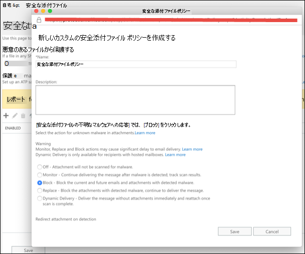
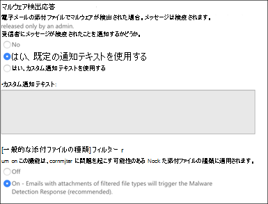

# 試用版ラボ環境用に Microsoft Threat Protection の柱を構成する

**適用対象:**
- Microsoft Threat Protection

Microsoft の脅威保護の試用ラボ環境を作成して展開することは、3つのフェーズのプロセスです。

 
<table border="0" width="100%" align="center">
  <tr style="text-align:center;">
    <td align="center" style="width:25%; border:0;" >
      <a href= "https://docs.microsoft.com/microsoft-365/security/mtp/prepare-mtpeval?view=o365-worldwide"> 
        
       フェーズ 1: 準備</a> 
    </td>
     <td align="center">
      <a href="https://docs.microsoft.com/microsoft-365/security/mtp/setup-mtpeval?view=o365-worldwide">
        
       フェーズ 2: セットアップ</a> 
    </td>
    <td align="center" bgcolor="#d5f5e3">
      <a href="https://docs.microsoft.com/microsoft-365/security/mtp/config-mtpeval?view=o365-worldwide">
        
       フェーズ 3: 構成 & オンボード</a> 
</td>

  </tr>
</table>

現在、構成段階になっています。

正常な展開には、準備が重要です。 この記事では、Microsoft Defender ATP を展開するための準備として考慮する必要があるポイントについて説明します。

## Microsoft Threat Protection の柱
Microsoft の脅威保護は、4つの柱から構成されます。 1つの柱がネットワーク組織のセキュリティに価値を提供していますが、4つの Microsoft 脅威保護の柱を有効にすることで、組織は最大の価値を得ることができます。

  

このセクションでは、以下を構成する方法について説明します。
-   Office 365 Advanced Threat Protection
-   Azure Advanced Threat Protection 
-   Microsoft Cloud App Security
-   Microsoft Defender Advanced Threat Protection

## Office 365 Advanced Threat Protection を構成する
>[!NOTE]
>Office 365 Advanced Threat Protection を既に有効にしている場合は、この手順をスキップします。 

これらの設定の一部を決定するのに役立つ、 *Office 365 Advanced Threat Protection 推奨構成アナライザー (ORCA)* という名前の PowerShell モジュールがあります。 テナントで管理者として実行すると、ORCAReport はスパム対策、フィッシング、その他のメッセージの検疫設定の評価を作成するのに役立ちます。 このモジュールはからダウンロードでき https://www.powershellgallery.com/packages/ORCA/ ます。 

1. [Office 365 セキュリティ & コンプライアンスセンター](https://protection.office.com/homepage)の  >  **脅威管理**  >  **ポリシー**に移動します。
  
 
2. [ **ATP のフィッシング対策**] をクリックし、[ポリシーの名前と説明を**作成**して入力] を選択します。 **[次へ]** をクリックします。
  

>[!NOTE]
>詳細な ATP のフィッシング対策ポリシーを編集します。 **Advanced フィッシングしきい値**を**2-アグレッシブ**に変更します。
 

3. [**条件の追加**] ドロップダウンメニューをクリックして、ドメインを受信者のドメインとして選択します。 **[次へ]** をクリックします。
  
 
4. 設定を確認します。 [**このポリシーを作成**する] をクリックして確認します。 
![Image of_Office 365 Security & コンプライアンスセンターのフィッシング対策ポリシーページで設定を確認し、[このポリシーの作成] ボタンをクリックします。](../../media/mtp-eval-35.png)  
 
5. [ **Atp の安全な添付ファイル**] を選択し、[ **SharePoint、OneDrive、MICROSOFT Teams で atp を有効にする**] オプションを選択します。  
  

6. [+] アイコンをクリックして、新しい安全な添付ファイルポリシーを作成し、ドメインに受信者ドメインとして適用します。 **[保存]** をクリックします。
  
 
7. 次に、 **ATP の安全なリンク**ポリシーを選択し、鉛筆アイコンをクリックして既定のポリシーを編集します。

8. **[ユーザーが安全なリンクをクリックしたときに追跡**しない] オプションが選択されていない状態で、残りのオプションがオンになっていることを確認します。 詳細については、「[安全なリンク設定](https://docs.microsoft.com/microsoft-365/security/office-365-security/recommended-settings-for-eop-and-office365-atp?view=o365-worldwide)」を参照してください。 **[保存]** をクリックします。 
![Image of_Office 365 Security & コンプライアンスセンター] ページで、ユーザーが [セーフ] が選択されていないときに、オプションが追跡されないことを示します。](../../media/mtp-eval-38.png)  

9. 次に、**マルウェア対策**ポリシーを選択し、既定値を選択して、鉛筆アイコンを選択します。

10. [**設定**] をクリックし、[はい] を選択して、**既定の通知テキストを使用**して**マルウェア検出応答**を有効にします。 **一般的な添付ファイルの種類のフィルター**を有効にします。 **[保存]** をクリックします。
   
  
11. [ [Office 365 Security & コンプライアンスセンター](https://protection.office.com/homepage)]  >  **Search**  >  [**監査ログの検索**] の順に移動し、監査をオンにします。  
![イメージ of_Office 365 セキュリティ & コンプライアンスセンター] ページで監査ログの検索を有効にする](../../media/mtp-eval-40.png)  

12. Microsoft Defender ATP に Office 365 ATP を統合します。 [Office 365 Security & コンプライアンスセンター](https://protection.office.com/homepage)の  >  **脅威管理**  >  **エクスプローラー**に移動し、画面の右上にある [ **wdatp 設定**] を選択します。 [Microsoft Defender ATP 接続] ダイアログボックスで、[ **WINDOWS ATP への接続**] をオンにします。
![Image of_Office 365 Security & コンプライアンスセンター] ページで Windows Defender ATP 接続をオンにすることができます。](../../media/mtp-eval-41.png)  

## Azure Advanced Threat Protection を構成する
>[!NOTE]
>Azure Advanced Threat Protection を既に有効にしている場合は、この手順をスキップします。

1. [Microsoft 365 セキュリティセンター](https://security.microsoft.com/info) > [**その他のリソース**] [  >  **Azure Advanced Threat Protection**] の順に移動します。
  

2. [**作成**] をクリックして、Azure Advanced Threat Protection ウィザードを開始します。 
 ![Image of_Azure Advanced Threat Protection ウィザードページで、[作成] ボタンをクリックする必要があります。](../../media/mtp-eval-43.png)  

3. [ **Active Directory フォレストに接続するためのユーザー名とパスワードを入力**する] を選択します。  
  

4. Active Directory のオンプレミスの資格情報を入力します。 これには、Active Directory への読み取りアクセス権を持つユーザーアカウントを指定できます。
  

5. 次に、[**センサーのセットアップをダウンロード**し、ファイルをドメインコントローラーに転送する] を選択します。 
![[イメージ of_Azure の詳細な脅威保護] ページで、ダウンロードセンサーのセットアップを選択できます。](../../media/mtp-eval-46.png)  

6. Azure ATP センサーのセットアップを実行して、ウィザードの次の作業を開始します。
 ![[イメージ of_Azure の詳細な脅威保護] ページで、[次へ] をクリックして Azure ATP センサーウィザードを実行します。](../../media/mtp-eval-47.png)  
 
7. センサー展開の種類で [**次へ**] をクリックします。
 ![[イメージ of_Azure の詳細な脅威保護] ページで、[次へ] をクリックして Azure ATP センサーウィザードを実行します。](../../media/mtp-eval-48.png)  
 
8. ウィザードで次のように入力する必要がある場合は、アクセスキーをコピーします。
  
 
9. ウィザードにアクセスキーをコピーし、[**インストール**] をクリックします。 
 ![Image of_Azure Advanced Threat Protection Azure ATP センサーウィザードページでアクセスキーを指定し、[インストール] ボタンをクリックします。](../../media/mtp-eval-50.png)  

10. ご使用のドメインコントローラーに Azure Advanced Threat Protection が正常に構成されました。
![Image of_Azure Advanced Threat Protection Azure ATP センサーウィザードインストールの完了 [完了] ボタンをクリックする必要があります。](../../media/mtp-eval-51.png)  
 
11. [ [Azure AZURE atp](https://go.microsoft.com/fwlink/?linkid=2040449)の設定] セクションで、[ **Windows Defender atp**] を選択し、切り替えをオンにします。 **[保存]** をクリックします。 
![Image of_the [Azure Azure ATP 設定] ページで、Windows Defender ATP のオン/オフを切り替える必要があります。](../../media/mtp-eval-52.png)  

>[!NOTE]
>Windows Defender ATP は、Microsoft Defender ATP として再ブランド化されています。 すべてのポータルにわたる Rebranding の変更は、一貫性を保つために、を展開しています。

## Microsoft Cloud App Security を構成する
>[!NOTE]
>Microsoft Cloud App Security を既に有効にしている場合は、この手順をスキップします。 

1. [Microsoft 365 Security Center](https://security.microsoft.com/info)  >  **More Resources**  >  **microsoft Cloud App Security**に移動します。
![Image of_Microsoft 365 セキュリティセンターページには、Microsoft Cloud App card を参照して、[開く] ボタンをクリックする必要があります。](../../media/mtp-eval-53.png)  

2. Azure ATP を統合するための情報プロンプトで、[ **AZURE atp データ統合の有効化**] を選択します。 
   

>[!NOTE]
>このプロンプトが表示されない場合は、Azure ATP データ統合が既に有効になっていることを意味します。 ただし、わからない場合は、IT 管理者に確認してください。 

3. [**設定**] に移動し、 **Azure ATP 統合**をオンに切り替えて、[**保存**] をクリックします。 
![[イメージ of_the の設定] ページで、[Azure ATP 統合] をオンにして、[保存] をクリックします。](../../media/mtp-eval-55.png)  
>[!NOTE]
>新しい Azure ATP インスタンスの場合、この統合トグルは自動的にオンになります。 次の手順に進む前に、Azure ATP 統合が有効になっていることを確認します。
 
4. [クラウド検出の設定] で、[ **Microsoft DEFENDER ATP 統合**] を選択し、統合を有効にします。 **[保存]** をクリックします。
![Image of_the Microsoft defender atp 統合の [承認されていないアプリをブロックする] チェックボックスがオンになっている Microsoft Defender ATP ページ。 [保存] をクリックします。](../../media/mtp-eval-56.png)  

5. [クラウド検出の設定] で、[**ユーザーエンリッチメント**] を選択して、Azure Active Directory との統合を有効にします。
![[エンリッチメントのユーザー識別子を Azure Active Directory ユーザー名で強化する] チェックボックスがオンになっているユーザーのイメージ](../../media/mtp-eval-57.png)  

## Microsoft Defender Advanced Threat Protection を構成する
>[!NOTE]
>Microsoft Defender Advanced Threat Protection を既に有効にしている場合は、この手順をスキップします。

1. [Microsoft 365 security center](https://security.microsoft.com/info)  >  **More Resources**  >  **microsoft Defender セキュリティセンター**に移動します。 [ **開く**] をクリックします。
 ![Microsoft 365 セキュリティセンターページの [イメージ of_Microsoft Defender セキュリティセンター] オプション](../../media/mtp-eval-58.png)  
 
2. Microsoft Defender Advanced Threat Protection ウィザードに従います。 **[次へ]** をクリックします。 
   

3. 推奨されるデータストレージの場所、データ保持ポリシー、組織のサイズ、およびプレビュー機能のオプトインに基づいて選択します。 
 ![[イメージ of_the] ページで、データストレージの国、アイテム保持ポリシー、組織のサイズを選択します。 選択が完了したら、[次へ] をクリックします。](../../media/mtp-eval-60.png)  
>[!NOTE]
>その後、データ保存場所など、一部の設定を変更することはできません。 
 

**[次へ]** をクリックします。 

4. [**続行**] をクリックすると、MICROSOFT Defender ATP テナントがプロビジョニングされます。
 ![画像 of_the ページの表示 [続行] ボタンをクリックすると、クラウドインスタンスが作成されます。](../../media/mtp-eval-61.png)  

5. グループポリシー、Microsoft エンドポイントマネージャー、または Microsoft Defender ATP へのローカルスクリプトを実行することにより、エンドポイントをオンボードにします。 簡略化のために、このガイドではローカルスクリプトを使用します。

6. [**パッケージのダウンロード**] をクリックし、オンボードスクリプトをエンドポイントにコピーします。  
 ![画像 of_page の [パッケージのダウンロード] ボタンをクリックしてオンボードスクリプトをエンドポイントまたはエンドポイントにコピーするように求めるメッセージが表示されます。](../../media/mtp-eval-62.png)  

7. エンドポイントで、オンボードスクリプトを管理者として実行し、[Y] を選択します。
   

8. おめでとうございます。第1のエンドポイントを利用しました。  
   

9. コピー-Microsoft Defender ATP ウィザードから検出テストを貼り付けます。
 ![Image of_the [コピー] をクリックして、コマンドプロンプトに貼り付ける必要のある検出テストスクリプトをコピーするための検出テスト手順を実行します。](../../media/mtp-eval-65.png)  

10. PowerShell スクリプトを昇格したコマンドプロンプトにコピーして実行します。 
   

11. [ウィザードから**Microsoft DEFENDER ATP の使用を開始する**] を選択します。
 ![[Microsoft Defender ATP の使用開始] をクリックする必要があるウィザードからのイメージ of_the 確認プロンプト](../../media/mtp-eval-67.png)  
 
12. [Microsoft Defender セキュリティセンター](https://securitycenter.windows.com/)を参照してください。 [**設定**] に移動し、[**拡張機能**] を選択します。 
 ![イメージ of_Microsoft Defender セキュリティセンターの設定] メニューで、高度な機能を選択する必要があります。](../../media/mtp-eval-68.png)  

13. **Azure Advanced Threat Protection**との統合を有効にします。  
   

14. **Office 365 の脅威インテリジェンス**との統合をオンにします。
   

15. **Microsoft Cloud App Security**との統合を有効にします。
   

16. 下にスクロールして [**保存の設定**] をクリックし、新しい統合を確認します。
 ![クリックする必要があるイメージ of_Save の設定] ボタン](../../media/mtp-eval-72.png)  

## Microsoft Threat Protection サービスを開始する
>[!NOTE]
>2020年6月1日以降、対象のすべてのテナントに対して Microsoft の脅威保護機能が自動的に有効になります。 詳細については、 [Microsoft Tech Community](https://techcommunity.microsoft.com/t5/security-privacy-and-compliance/microsoft-threat-protection-will-automatically-turn-on-for/ba-p/1345426)の次の記事を参照してください。 
 

[Microsoft 365 セキュリティセンター](https://security.microsoft.com/homepage)に移動します。 [**設定**] に移動し、[ **Microsoft Threat Protection**] を選択します。
 ![Microsoft 365 セキュリティセンターの [設定] ページの [イメージ of_Microsoft 脅威保護] オプションのスクリーンショット](../../media/mtp-eval-72b.png)  

より包括的なガイダンスについては、「 [Microsoft Threat Protection を有効](mtp-enable.md)にする」を参照してください。 

おめでとうございます! Microsoft の脅威保護試用版ラボ環境を作成したばかりです。 これで、攻撃をシミュレートし、製品間の機能を検出して通知を作成し、エンドポイントへの fileless 攻撃に自動的に対応する方法を確認できます。

## 次の手順
[テスト警告を生成](generate-test-alert.md)します。
