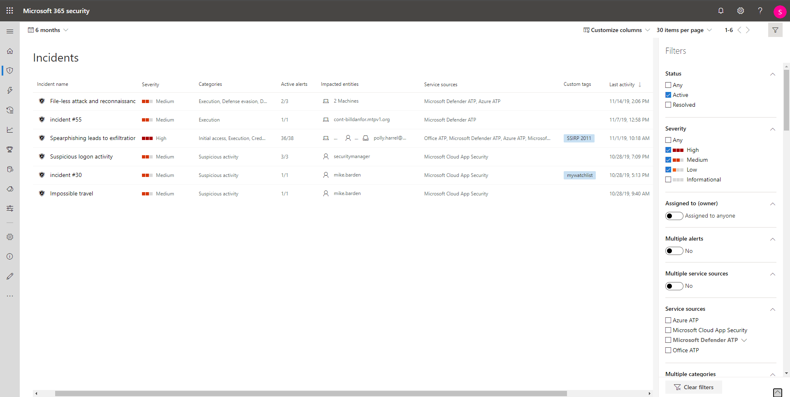

# Microsoft 365 Defender でインシデントの優先度を設定するPrioritize incidents in Microsoft 365 Defender

[!INCLUDE [Microsoft 365 Defender rebranding](../includes/microsoft-defender.md)]

**適用対象:****Applies to:**
- Microsoft 365 DefenderMicrosoft 365 Defender

Microsoft 365 Defender は、関連付け分析を適用し、さまざまな製品からのすべての関連アラートと調査を1つのインシデントに集約します。Microsoft 365 Defender applies correlation analytics and aggregates all related alerts and investigations from different products into one incident. また、microsoft 365 Defender は、Microsoft 365 Defender が不動産および製品スイート全体で使用するエンドツーエンドの可視性を与えられた悪意のあるアクティビティに対して、固有のアラートをトリガーします。Microsoft 365 Defender also triggers unique alerts on activities that can only be identified as malicious given the end-to-end visibility that Microsoft 365 Defender has across the entire estate and suite of products. これにより、Microsoft 365 Defender narrates によって、より広範な攻撃ストーリーが実現されます。これにより、セキュリティ運用アナリストは、組織全体にわたる複雑な脅威を理解し、扱うことができます。By doing so, Microsoft 365 Defender narrates the broader attack story, allowing a security operations analyst to understand and deal with complex threats across the organization.

**インシデント キュー** には、デバイス、ユーザー、メールボックス全体からフラグが付けられたインシデントのコレクションが表示されます。The **Incidents queue** shows a collection of incidents that were flagged from across devices, users, and mailboxes. これにより、インシデントを分類して優先順位を付け、情報に基づいたサイバーセキュリティ対応の決定を作成できます。It helps you sort through incidents to prioritize and create an informed cybersecurity response decision.

 

既定では、Microsoft 365 セキュリティセンターのキューには過去30日間に表示されたインシデントが表示されます。By default, the queue in the Microsoft 365 security center displays incidents seen in the last 30 days. 最新のインシデントは、リストの先頭に表示されるので、最初に確認できます。The most recent incident is at the top of the list so you can see it first.

インシデントキューは、インシデントまたは含まれているエンティティのさまざまな特性を表示できる、カスタマイズ可能な列を公開します。The incident queue exposes customizable columns that give you visibility into different characteristics of the incident or the contained entities. これにより、処理するインシデントの優先度設定に関する情報による判断を行うことができます。This helps you make an informed decision regarding prioritization of incidents to handle.

わかりやすくするために、自動インシデントの名前付けは、影響を受けるエンドポイント数、影響を受けたユーザー、検出ソース、カテゴリなどのアラート属性に基づいてインシデント名を生成します。For additional visibility at a glance, automatic incident naming generates incident names based on alert attributes such as the number of endpoints affected, users affected, detection sources, or categories. これにより、インシデントの範囲をすばやく理解することができます。This allows you to quickly understand the scope of the incident.

例: 複数の *ソースによって報告された複数のエンドポイントのマルチステージインシデント* 。For example: *Multi-stage incident on multiple endpoints reported by multiple sources.*

> [!NOTE]
> 自動インシデントの名前の公開前に存在していたインシデントは、名前が変更されません。Incidents that existed prior the rollout of automatic incident naming will not have their name changed.

また、インシデントキューは、複数のフィルターオプションを公開すると、使用している環境内の既存のすべてのインシデントをさまざまな方法で実行したり、特定のシナリオや脅威に集中することができます。The incident queue also exposes multiple filtering options, that when applied, enable you to perform a broad sweep of all existing incidents in your environment, or decide to focus on a specific scenario or threat. インシデント キューにフィルターを適用すると、すぐに注意が必要なインシデントを特定できます。Applying filters on the incident queue can help determine which incident requires immediate attention. 

## 利用可能なフィルターAvailable filters

### 割り当て先Assigned to
自分に割り当てられた通知または自動化によって処理された通知を表示するように選択できます。You can choose to show alerts that are assigned to you or those handled by automation.

### CategoriesCategories
表示される特定の戦術、手法、または攻撃コンポーネントに重点を置くカテゴリを選択します。Choose categories to focus on specific tactics, techniques, or attack components seen. 

### 分類Classification
関連するアラートの分類のセットに基づいてインシデントをフィルター処理します。Filter incidents based on the set classifications of the related alerts. 値には、true alerts、false alerts、未設定のいずれかが含まれます。The values include true alerts, false alerts, or not set.

### データの機密性Data sensitivity
一部の攻撃では、機密データや貴重なデータを排除することを目的としています。Some attacks focus on targeting to exfiltrate sensitive or valuable data. 機密データがインシデントに関与しているかどうかを確認するためにフィルター処理を適用することにより、機密情報が侵害されている可能性があるかどうかを迅速に判断し、それらのインシデントへの対処に優先順位を付けることができます。By applying a filter to see if sensitive data is involved in the incident, you can quickly determine if sensitive information has potentially been compromised and prioritize addressing those incidents.

>[!NOTE]
>Microsoft Information Protection が有効になっている場合にのみ適用されます。Only applicable if Microsoft Information Protection is turned on.

### デバイスグループDevice group
定義済みのデバイスグループでフィルター処理します。Filter by defined device groups.

### 調査の状態Investigation state
自動調査の状態によってインシデントをフィルター処理します。Filter incidents by the status of automated investigation. 

### 複数のカテゴリMultiple categories 
複数の分類項目にマップされているインシデントのみを表示するように選択すると、それにより損害が発生する可能性が高くなります。You can choose to see only incidents that have mapped to multiple categories  and can thus potentially cause more damage. 

### 複数のサービス ソースMultiple service sources 
フィルターを適用すると、さまざまなソースからのアラートを含むインシデントのみが表示されます (エンドポイントの Microsoft Defender、Microsoft Cloud App Security、Microsoft defender for Identity、microsoft Defender for Office 365)。Filter to only see incidents that contain alerts from different sources (Microsoft Defender for Endpoint, Microsoft Cloud App Security, Microsoft Defender for Identity, Microsoft Defender for Office 365).

### OS プラットフォームOS platform
インシデントキュービューをオペレーティングシステムごとに制限します。Limit the incident queue view by operating system.

### サービス ソースService sources
特定のソースを選択すると、選択したソースから 1 つ以上のアラートを含むインシデントに焦点を当てることができます。By choosing a specific source, you can focus on incidents that contain at least one alert from that chosen source. 

### 重要度Severity
インシデントの重要度は、資産に対する影響を示しています。The severity of an incident is indicative of the impact it can have on your assets. 重要度が高くなるほど、影響が大きくなり、通常は最も近い注意が必要になります。The higher the severity, the bigger the impact and typically requires the most immediate attention. 

### 状態Status
状態に基づいて表示されるインシデントのリストを制限して、アクティブなインシデントまたは解決されたインシデントを確認できます。You can choose to limit the list of incidents shown based on their status to see which ones are active or resolved.

>[!IMPORTANT]
>現在、分類、デバイスグループ、調査状態、OS プラットフォームの各フィルターは、パブリックプレビューでのみ使用できます。The Classification, Device group, Investigation state, and OS platform filters are currently only available in public preview.

## 次の手順Next steps
どのインシデントが最も重要かを判断したら、インシデントについてさらに調査を進めます。After you've determined which incident requires the highest priority, you can proceed to do further investigative work on an incident.
- [インシデントの調査Investigate incidents](investigate-incidents.md)

## 関連項目See also
- [インシデントの概要Incidents overview](incidents-overview.md)
- [インシデントの調査Investigate incidents](investigate-incidents.md)
- [インシデントの管理Manage incidents](manage-incidents.md)
