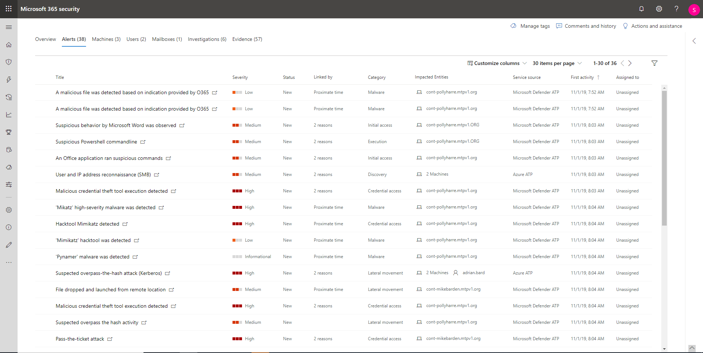

# Microsoft Threat Protection のインシデントを調査するInvestigate incidents in Microsoft Threat Protection

[!INCLUDE [Microsoft 365 Defender rebranding](../includes/microsoft-defender.md)]

**適用対象:****Applies to:**

- Microsoft Threat ProtectionMicrosoft Threat Protection

Microsoft Threat Protection は、すべてのデバイス、ユーザー、およびメールボックスを対象に、関連するすべてのアラート、資産、調査、エビデンスを集計して、あらゆる攻撃を総合的に把握できるようにします。Microsoft Threat Protection aggregates all related alerts, assets, investigations and evidence from across your devices, users, and mailboxes to give you a comprehensive look into the entire breadth of an attack.

効果的な修復計画を考案できるようにするために、ネットワークに影響するアラートを調査し、その意味を理解し、インシデントに関連する証拠を照合します。Investigate the alerts that affect your network, understand what they mean, and collate evidence associated with the incidents so that you can devise an effective remediation plan.

## インシデントの調査Investigate an incident

1. インシデント キューからインシデントを選択します。Select an incident from the incident queue.   これにより、サイドパネルが開き、状態、重要度、カテゴリ、影響を受けるエンティティなどの重要な情報のプレビューが表示されます。This opens a side panel and gives a preview of important information such as status, severity, categories, and the impacted entities.

    

2. [**インシデント ページを開く**] を選択します。Select **Open incident page**.   これにより、インシデント ページが開き、インシデントの詳細、コメントとアクション、タブ (概要、アラート、デバイス、ユーザー、調査、証拠) が表示されます。This opens the incident page where you'll find more information incident details, comments and actions, tabs (overview, alerts, devices, users, investigations, evidence).

3. インシデントに関連するアラート、デバイス、ユーザー、その他のエンティティを確認します。Review the alerts, devices, users, other entities involved in the incident.

## インシデントの概要Incident overview

概要ページでは、インシデントに関する主な情報がスナップショットで表示されます。The overview page gives you a snapshot glance into the top things to notice about the incident.

攻撃のカテゴリでは、キルチェーンに対する攻撃の状況を視覚的に、そして数値で確認できます。The attack categories give you visual and numeric view of how advanced the attack has progressed against the kill chain. 他の Microsoft セキュリティ製品と同様に、Microsoft Threat Protection は、[MITRE ATT&CK&trade;](https://attack.mitre.org/) フレームワークに準拠します。As with other Microsoft security products, Microsoft Threat Protection is aligned to the [MITRE ATT&CK&trade;](https://attack.mitre.org/) framework.

範囲セクションでは、このインシデントの一部である最も影響を受ける資産の一覧が表示されます。The scope section gives you a list of top impacted assets that are part of this incident. この資産に関する特定の情報 (リスク レベル、調査の優先順位、資産のタグ付けなど) がある場合は、その情報もこのセクションに表示されます。If there is specific information regarding this asset, such as risk level, investigation priority as well as any tagging on the assets this will also surface in this section.

アラートのタイムラインでは、アラートの発生順に時系列でプレビューすることができ、これらのアラートがインシデントに関連付けられた理由も表示されます。The alerts timeline provides a sneak peek into the chronological order in which the alerts occurred, as well as the reasons that these alerts linked to this incident.

最後に、証拠セクションでは、どれぐらいの数の成果物がインシデントに含まれるかや修復状況の概要が示されます。そのため、対応が必要かどうかをすぐに特定できます。And last - the evidence section provides a summary of how many different artifacts were included in the incident and their remediation status, so you can immediately identify if any action is needed on your end.

この概要は、注意が必要なインシデントの特徴の洞察を提供することで、インシデントの初回トリアージに役立ちます。This overview can assist in the initial triage of the incident by providing insight to the top characteristics of the incident that you should be aware of.

## アラートAlerts

インシデントに関連するすべてのアラートを表示することができます。重要度、アラートに関係したエンティティ、アラートのソース (Azure ATP、Microsoft Defender ATP、Office 365 ATP)、およびそれらのアラートが相互にリンクされた理由などの情報も確認できます。You can view all the alerts related to the incident and other information about them such as severity, entities that were involved in the alert, the source of the alerts (Azure ATP, Microsoft Defender ATP , Office  365 ATP) and the reason they were linked together.

既定では、アラートは発生順に並べ替えられています。これにより、発生した攻撃を時系列で確認できます。By default, the alerts are ordered chronologically, to allow you to first view how the attack played out over time. 各アラートをクリックすると、関連するアラート ページが表示され、そのアラートについて詳細な調査を行うことができます。Clicking on each alert will lead you to the relevant alert page where you can conduct an in depth investigation of that alert.

## デバイスDevices

[デバイス] タブには、インシデントに関連するアラートが表示されているすべてのデバイスが一覧表示されます。The devices tab lists all the devices where alerts related to the incident are seen.

攻撃が行われたコンピューターの名前をクリックすると、そのコンピューターのページが表示されます。調査を簡単にするために、トリガーされたアラートや関連イベントが表示されます。Clicking the name of the machine where the attack was conducted navigates you to its Machine page where you can see alerts that were triggered on it and related events provided to ease investigation.

![インシデントの [コンピューター] タブの画像](../../media/incident-machines.png)

[タイムライン] タブを選択すると、コンピューターのタイムラインをスクロールして、コンピューター上で監視されているすべてのイベントおよび動作、発生したアラートを日付順に表示できます。Selecting the Timeline tab enables you to scroll through the machine timeline and view all events and behaviors observed on the machine in chronological order, interspersed with the alerts raised.

## ユーザーUsers

特定のインシデントに関連すると識別されたユーザーを表示します。See users that have been identified to be part of, or related to a given incident.

ユーザー名をクリックすると、ユーザーの Cloud App Security ページに移動します。ここで詳細な調査を行うことができます。Clicking the username navigates you to the user's Cloud App Security page where further investigation can be conducted.

![インシデントの [ユーザー] タブの画像](../../media/incident-users.png)

## メールボックスMailboxes

インシデントに関連すると識別されたメールボックスを調査します。Investigate mailboxes that's been identified to be part of, or related to an incident. メール関連アラートを選択し Office 365 Advanced Threat Protection を開くと、修復アクションを実行でき、さらに調査を行うことができます。To do further investigative work, selecting the mail related alert will open Office 365 Advanced Threat Protection where you can take remediation actions.

![インシデントの [メールボックス] タブの画像](../../media/incident-mailboxes.png)

## 調査Investigations

[ **調査** ] を選択すると、このインシデントで通知によってトリガーされたすべての自動調査が表示されます。Select **Investigations** to see all the automated investigations triggered by alerts in this incident. 調査は、Microsoft Defender ATP および Office 365 Advanced Threat Protection での自動調査の実行をどのように構成したかによって、修復アクションを実行するか、またはアナリストからのアクションの承認を待ちます。The investigations will perform remediation actions or wait for analyst approval of actions, depending on how you configured your automated investigations to run in Microsoft Defender ATP and Office 365 Advanced Threat Protection.

![インシデントの [調査] タブの画像](../../media/incident-investigations.png)

調査を選択して [調査の詳細] ページに移動すると、調査と修復状況に関する詳細情報が表示されます。Select an investigation to navigate to the Investigation details page to get full information on the investigation and remediation status. 調査の一部として承認待ちのアクションがある場合は、[保留中のアクション] タブに表示されます。インシデント修復の一環としてアクションを行います。If there are any actions pending for approval as part of the investigation they will appear in the Pending actions tab. Take action as part of incident remediation.

## 証拠Evidence

Microsoft Threat Protection は、アラート内のすべてのインシデントのサポートされているイベントおよび不審なエンティティを自動的に調査し、自動応答や重要なファイル、プロセス、サービス、メールなどに関する情報を提供します。Microsoft Threat Protection automatically investigates all the incidents' supported events and suspicious entities in the alerts, providing you with auto-response and information about the important files, processes, services, emails, and more. これにより、インシデントの潜在的な脅威をすばやく検出してブロックできます。This helps quickly detect and block potential threats in the incident.

![インシデントの [証拠] タブの画像](../../media/incident-evidence.png)

分析された各エンティティには、判定 (悪質、不審、クリーン)、および修復状況が示されます。Each of the analyzed entities will be marked with a verdict (Malicious, Suspicious, Clean) as well as a remediation status. これにより、インシデント全体の修復状況、および修復の次の手順について理解するのをサポートします。This assists you in understanding the remediation status of the entire incident and what are the next steps that can be taken to further remediate.

## 関連項目Related topics

- [インシデントの概要Incidents overview](incidents-overview.md)
- [インシデントの優先度設定Prioritize incidents](incident-queue.md)
- [インシデントの管理Manage incidents](manage-incidents.md)

