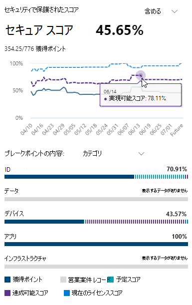

# Microsoft セキュリティスコアを使用してセキュリティの姿勢を評価する

Microsoft セキュア スコアは組織のセキュリティ体制を測定する数値であり、数値が高いほどより多くの改善のための処置が実行されたことを示しています。 この点については https://security.microsoft.com/securescore 、「 [Microsoft 365 セキュリティセンター](overview-security-center.md)」を参照してください。

必要な情報を迅速に把握できるように、Microsoft の改善のための処置は次のグループに分類されています。

* ID (Azure AD アカウントと役割)
* データ (Microsoft Information Protection)
* デバイス (Microsoft Defender ATP、[構成スコア](https://docs.microsoft.com/windows/security/threat-protection/microsoft-defender-atp/configuration-score)と呼ばれる)
* アプリ (Office 365 や Microsoft Cloud App Security を含む、メール アプリとクラウド アプリ)
* インフラストラクチャ (現在のところ、改善のための処置はありません)

>[!NOTE]
>Microsoft Secure Score の最近のリリースでは、Microsoft セキュリティスコアを Id のセキュリティで保護されたスコアと Graph API とは一時的に互換性がない、向上したスコアリングモデルがリリースされました。 [詳細の表示](microsoft-secure-score-whats-new.md)

[Microsoft セキュア スコアの概要] ページでは、これらのグループ間でポイントがどのように分割され、どのポイントが利用可能であるかを確認できます。 また、[概要] ページでは、合計スコアの全表示ビュー、ベンチマーク比較によるセキュア スコア履歴の傾向、スコアを上げるために優先して実装できる改善のための処置を確認することができます。

## 現在のスコアを確認する

現在のスコアを確認するには、Microsoft の [セキュリティスコアの概要] ページに移動して、**セキュリティで保護さ**れたスコアを示すタイルを探します。 スコアは、パーセンテージとして表示され、総ポイント数のうちで得られたポイントの数を示します。

また、スコアの横にある [**追加**] ボタンを選択すると、スコアのさまざまなビューを選択できます。 これらの異なるスコア表示は、スコアタイルおよび点の内訳グラフのグラフに表示されます。

次のスコアは、全体的なスコアの表示に追加して、全体的なスコアをより正確に把握することができます。

- **予定スコア**: 計画されたアクションが完了したときに予想されるスコアを表示する
- **現在のライセンススコア**: 現在の Microsoft ライセンスで達成できるスコアを表示する
- **実現**可能なスコア: Microsoft のライセンスと現在のリスクの受け入れによって得られるスコアを表示します。

考えられるすべてのスコアビューを含めた場合は、次のように表示されます。

## スコアを上げるための対策

[**向上**したアクション] タブには、発生する可能性のある攻撃対象の範囲とその状態 (サードパーティによって解決され、代替の軽減によって解決されたもの) とその状態が表示されます。 すべての改善のための処置の検索、フィルター処理、グループ化を行うことができます。  

### ランク付け

ランク付けは、残りのポイント数、実装の難しさ、ユーザーへの影響、複雑さに基づいています。 最高ランクの改善のための処置では、難易度、ユーザーへの影響度、複雑度は低く、高ポイントを取ることができます。

### 向上アクションの詳細を表示する

特定の改善アクションを選択すると、完全なページポップアップが表示されます。  

 *図 2: 改善アクションのポップアップの例*

この操作を完了するには、いくつかの選択肢があります。

* [**管理**] を選択して、構成画面に移動し、変更を行います。 その後、そのアクションに価値があるポイントを取得して、フライアウトに表示されるようにします。通常、更新には約24時間かかります。

* [**共有**] を選択して、[改善] アクションへの直接リンクをコピーするか、電子メール、microsoft Teams、microsoft Planner、または ServiceNow などのリンクを共有するプラットフォームを選択します。 ServiceNow を選択すると、変更チケットを作成できるようになります。このチケットは、ServiceNow と Microsoft 365 セキュリティセンターのホームに表示されます。 詳細については、「 [Microsoft 365 セキュリティセンターと ServiceNow 統合](tickets-security-center.md)」を参照してください。

### 改善アクションの状態を選択する

[改善] アクションに固有の状態を選択し、メモを記録します。 選択できる statues は次のとおりです。

* [**宛先アドレス**] —改善アクションが必要であることを認識し、将来のある時点での対処を計画します。 この状態は、部分的に検出されたが完全に完了していない操作にも適用されます。
* **計画**済み: 改善アクションを完了するための具体的な計画があります。
* **承認**されたリスク: セキュリティは常にユーザビリティにバランスをとる必要がありますが、お客様の環境ですべての推奨事項が動作するわけではありません。 その場合は、リスクを受け入れるか、またはリスクを軽減するかを選択して、改善アクションが実行されないようにすることができます。 ポイントはありませんが、改善アクションの一覧には表示されなくなります。 このアクションは履歴で表示したり、いつでも元に戻したりできます。
* **サード**パーティによって解決され、**代替の軽減**によって解決されました。向上アクションは、サードパーティ製のアプリケーションまたはソフトウェア、または内部ツールによって既にアドレス指定されています。 この操作によって得られる価値を得ることができるようになります。そのため、スコアは全体的なセキュリティ姿勢をより適切に反映できます。 サードパーティまたは内部ツールがコントロールをカバーしなくなった場合は、別の状態を選択することができます。 改善アクションがこれらの状態のどちらかとしてマークされている場合、Microsoft は、実装の完全性を確認することを忘れないでください。

#### 脅威 & 脆弱性管理の改善アクション

"Device" カテゴリの向上アクションについては、[状態] を選択することはできません。 代わりに、 [Microsoft Defender セキュリティセンター](https://docs.microsoft.com/windows/security/threat-protection/microsoft-defender-atp/use)で、関連付けられている[脅威 & 脆弱性管理 (tvm) セキュリティに関する推奨事項](https://docs.microsoft.com/windows/security/threat-protection/microsoft-defender-atp/tvm-security-recommendation)に従ってアクションを実行することになります。 選択する例外と、作成する根拠は、そのポータルに固有のものであり、Microsoft Secure Score ポータルには含まれません。

#### 完了した改善アクション

改善アクションのすべての可能なポイントが達成されたら、改善アクションの状態は "完了" になります。 完了した改善アクションは Microsoft データによって確認され、状態を変更することはできません。

### 情報を評価し、ユーザーへの影響を確認する

[**概要**] セクションには、カテゴリ、保護できる攻撃、および製品がわかります。

**ユーザーへの影響**は、改善アクションが実行された場合にユーザーが**受ける**影響を示しています。

### 向上アクションを実装する

[**実装**] セクションには、すべての前提条件、[改善] アクションを完了するための次のステップ、向上アクションの現在の実装状況、および詳細なリンクが表示されます。

前提条件は、取得する必要があるライセンス、または改善アクションが解決される前に完了する必要があるアクションです。 改善アクションを完了し、それらのライセンスが必要なユーザーに適用されるように、ライセンスに十分な座席があることを確認してください。  

## ご意見をお聞かせください。

問題がある場合は、[Security, Privacy & Compliance](https://techcommunity.microsoft.com/t5/Security-Privacy-Compliance/bd-p/security_privacy) コミュニティに投稿してお知らせください。 コミュニティを監視しているので、問題に対応します。

## 関連リソース

- [Microsoft セキュリティスコアの概要](microsoft-secure-score.md)
- [Microsoft のセキュリティで保護されたスコア履歴を追跡し、目標を達成する](microsoft-secure-score-history-metrics-trends.md)
- [今後の予定](microsoft-secure-score-whats-coming.md)
- [新機能](microsoft-secure-score-whats-new.md)